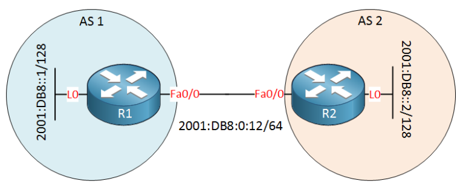
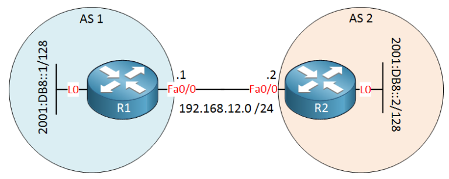
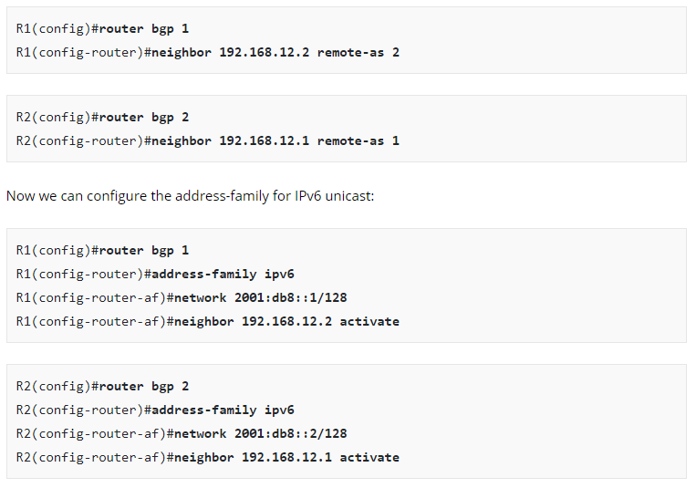
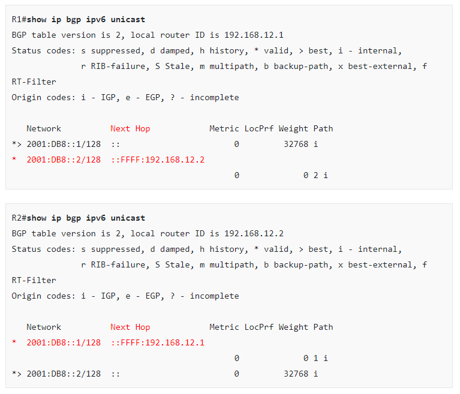

BGP/MP-BGP

The normal version of **BGP **(Border Gateway Protocol) only supported IPv4 unicast prefixes. Nowadays we use **MP-BGP** (Multiprotocol BGP) which supports different addresses:

- IPv4 unicast
- IPv4 multicast
- IPv6 unicast
- IPv6 multicast

MP-BGP is also used for MPLS VPN where we use MP-BGP to exchange the VPN labels. For each different “address” type, MP-BGP uses a different address family.

To allow these new addresses, MBGP has some new features that the old BGP doesn’t have:

- **Address Family Identifier (AFI):** specifies the address family.
- **Subsequent Address Family Identifier (SAFI):** Has additional information for some address families.
- **Multiprotocol Unreachable Network Layer Reachability Information (MP_UNREACH_NLRI):** This is an attribute used to transport networks that are unreachable.
- **BGP Capabilities Advertisement:** This is used by a BGP router to announce to the other BGP router what capabilities it supports. MP-BGP and BGP-4 are compatible, the BGP-4 router can ignore the messages that it doesn’t understand.

Since MP-BGP supports IPv4 and IPv6 we have a couple of options. MP-BGP routers can become neighbors using IPv4 addresses and exchange IPv6 prefixes or the other way around. Let’s take a look at some configuration examples…

* * *

##

## Configuration

### MP-BGP with IPv6 adjacency & IPv6 prefixes

Let’s start with a simple example where we use IPv6 for the neighbor adjacency and exchange some IPv6 prefixes. Here’s the topology I will use:

Here’s the configuration of R1:

R1(config)#router bgp 1
R1(config-router)#neighbor 2001:db8:0:12::2 remote-as 2
R1(config-router)#address-family ipv4
R1(config-router-af)#no neighbor 2001:db8:0:12::2 activate
R1(config-router-af)#exit
R1(config-router)#address-family ipv6
R1(config-router-af)#neighbor 2001:db8:0:12::2 activate
R1(config-router-af)#network 2001:db8::1/128

In the configuration above we first specify the remote neighbor. The address-family command is used to change the IPv4 or IPv6 settings. I disable the IPv4 address-family and enabled IPv6. Last but not least, we advertised the prefix on the loopback interface. The configuration of R2 looks similar:

R2(config)#router bgp 2
R2(config-router)#neighbor 2001:db8:0:12::1 remote-as 1
R2(config-router)#address-family ipv4
R2(config-router-af)#no neighbor 2001:db8:0:12::1 activate
R2(config-router-af)#exit
R2(config-router)#address-family ipv6
R2(config-router-af)#neighbor 2001:db8:0:12::1 activate
R2(config-router-af)#network 2001:db8::2/128

After awhile the neighbor adjacency will appear:

R1#
%BGP-5-ADJCHANGE: neighbor 2001:DB8:0:123::2 Up

Now let’s check the routing tables:

R1#show ipv6 route bgp
IPv6 Routing Table - default - 7 entries
Codes: C - Connected, L - Local, S - Static, U - Per-user Static route
      B - BGP, HA - Home Agent, MR - Mobile Router, R - RIP
      I1 - ISIS L1, I2 - ISIS L2, IA - ISIS interarea, IS - ISIS summary
      D - EIGRP, EX - EIGRP external, NM - NEMO, ND - Neighbor Discovery
      l - LISP
      O - OSPF Intra, OI - OSPF Inter, OE1 - OSPF ext 1, OE2 - OSPF ext 2
      ON1 - OSPF NSSA ext 1, ON2 - OSPF NSSA ext 2
B  2001:DB8::2/128 [20/0]
    via FE80::217:5AFF:FEED:7AF0, FastEthernet0/0

R2#show ipv6 route bgp
IPv6 Routing Table - default - 7 entries
Codes: C - Connected, L - Local, S - Static, U - Per-user Static route
      B - BGP, HA - Home Agent, MR - Mobile Router, R - RIP
      I1 - ISIS L1, I2 - ISIS L2, IA - ISIS interarea, IS - ISIS summary
      D - EIGRP, EX - EIGRP external, NM - NEMO, ND - Neighbor Discovery
      l - LISP
      O - OSPF Intra, OI - OSPF Inter, OE1 - OSPF ext 1, OE2 - OSPF ext 2
      ON1 - OSPF NSSA ext 1, ON2 - OSPF NSSA ext 2
B  2001:DB8::1/128 [20/0]
    via FE80::21D:A1FF:FE8B:36D0, FastEthernet0/0

* * *

let’s look at a more complex example, the routers will become neighbors through IPv4 but will exchange IPv6 prefixes. I’ll use the same topology but with an IPv4 subnet in between:

Here’s the configuration:

Once we enter the address-family IPv6 configuration there are two things we have to configure. The prefix has to be advertised and we need to specify the neighbor. The prefixes on the loopback interface should now be advertised. Let’s check it out:

