Cloud Architecture (Virtualization)

**KVM **-> Keyboard Video Mouse
**UCS (Unified Computing System) **-> Hardware server from Cisco
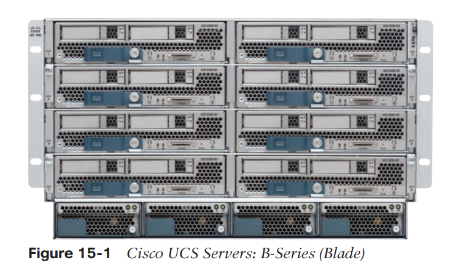

To make server virtualization work, each physical server (called a host in the server virtualization world) uses a hypervisor. The hypervisor manages and allocates the host hardware (CPU, RAM, etc.) to each VM based on the settings for the VM.

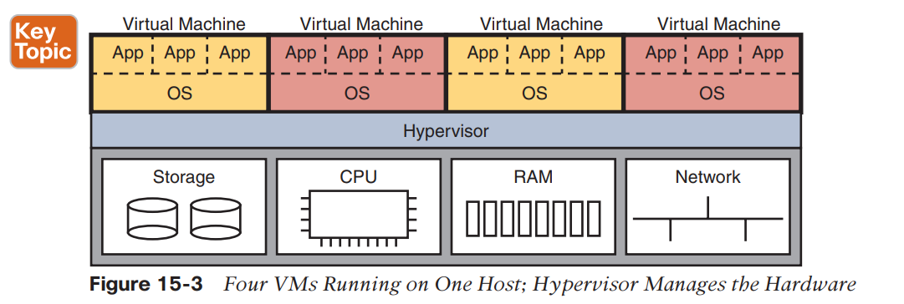

To connect the marketplace to the big ideas discussed thus far, the following list includes a few of the vendors and product family names associated with virtualized data centers:

■ VMware vCenter
■ Microsoft HyperV
■ Citrix XenServer
■ Red Hat KVM

Server must combine the ideas of the physical NICs with the vNICs used by the VMs into some kind of a network.

The host uses vNic and vSwitch for the networking.
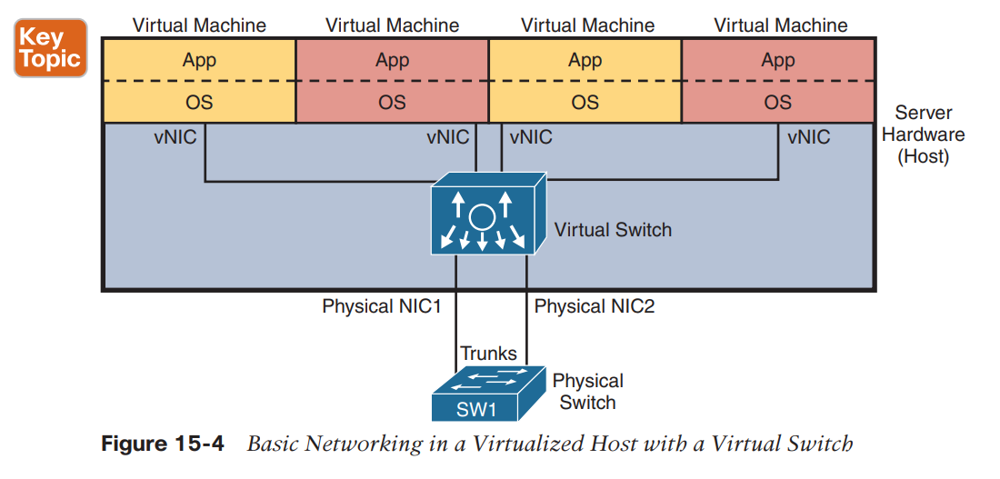

The vSwitch can be supplied by the hypervisor vendor or by Cisco. For instance, Cisco offers the Nexus 1000VE virtual switch.

**vSwitch:**
**
**

One big motivation to use a vSwitch from Cisco is to use the same networking features, with the same configuration, as in the rest of the network. In particular:

**
**

■ Ports connected to VMs: The vSwitch can configure a port so that the VM will be in its own VLAN, or share the same VLAN with other VMs, or even use VLAN trunking to the VM itself.

■ Ports connected to physical NICs: The vSwitch uses the physical NICs in the server hardware so that the switch is adjacent to the external physical LAN switch. The vSwitch can (and likely does) use VLAN trunking.

■ Automated configuration: The configuration can be easily done from within the same virtualization software that controls the VMs. That programmability allows the virtualization software to move VMs between hosts (servers) and reprogram the vSwitches so that the VM has the same networking capabilities no matter where the VM is running.

**Data center scheme**
**
**
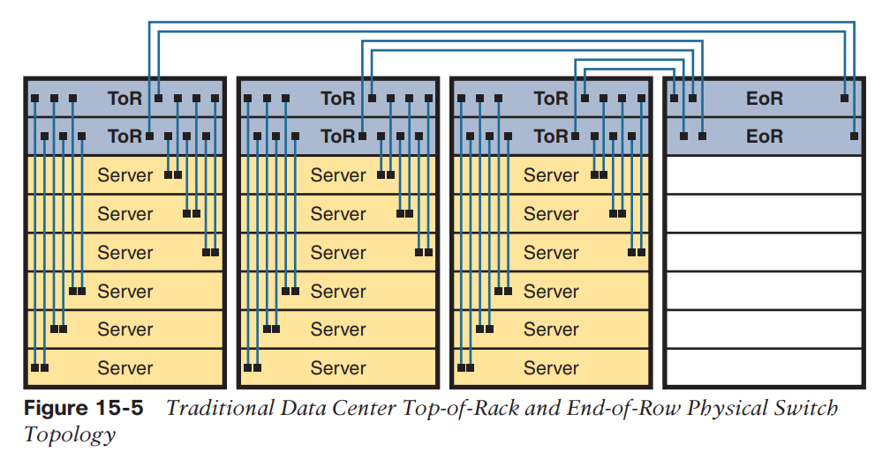

Often, each host is cabled to two different switches in the top of the rack—called Top of Rack (ToR) switches—to provide redundant paths into the LAN. Each ToR switch acts as an access layer switch from a design perspective. Each ToR switch is then cabled to an End of Row (EoR) switch, which acts as a distribution switch and also connects to the rest of the network.

■ The OS is decoupled from the hardware on which it runs, so that the OS, as a VM, can run on any server in a data center that has enough resources to run the VM.

■ The virtualization software can automatically start and move the VM between servers in the data center.

■ Data center networking includes virtual switches and virtual NICs within each host (server).

■ Data center networking can be programmed by the virtualization software, allowing new VMs to be configured, started, moved as needed, and stopped, with the networking details configured automatically.

**Cloud Computing Services **
**
**
Cloud computing is an approach to offering IT services.

One characteristic of a cloud service: it must allow self-service provisioning by the consumer of the service. That is, the consumer or customer of the service must be able to request the service and receive that service without the delay of waiting for a human to have time to work on it, consider the request, do the work, and so on.

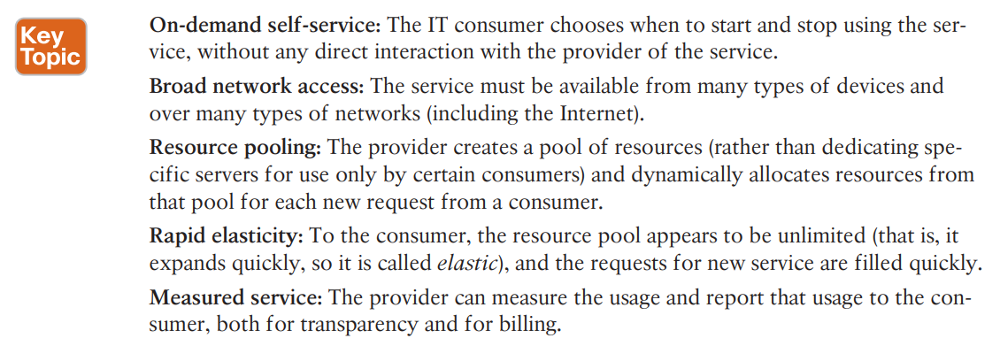

**NOTE**

The world of cloud computing has long used the terms private cloud and public cloud. In more recent years, you may also find references that instead use a different pair of terms for the same ideas, with on-premise meaning private cloud, and cloud meaning public cloud. Note that the one CCNA 200-301 exam topic that mentions cloud happens to use the newer pair of terms.

**Private cloud (on-premise)**
**
**

Summarizing, with private cloud, you change your methods and tools to offer some of the same services. Private cloud is “private” in that one company owns the tools that create the cloud and employs the people who use the services.

As some examples, consider what happens when an application developer at a company needs VMs to use when developing an application. With private cloud, the developer can request those VMs and those VMs automatically start and are available within minutes.

To make that happen, many cloud computing services use a cloud services catalog. That catalog exists for the user as a web application that lists anything that can be requested via the company’s cloud infrastructure.

**Public cloud (cloud)**
**
**

With a private cloud, the cloud provider and the cloud consumer are part of the same company. With public cloud, the reverse is true: a public cloud provider offers services, selling those services to consumers in other companies.

The workflow in public cloud happens somewhat like private cloud when you start from the point of a consumer asking for some service (like a new VM).

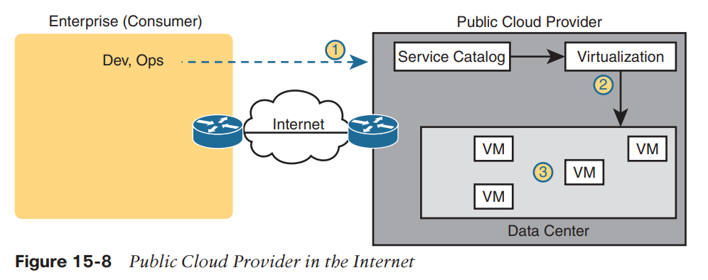

Cloud providers offer different networking options as well, including virtual private network (VPN) and private wide-area network (WAN) connections between consumers and the cloud.

**Infrastructure as a Service **
**
**

Infrastructure as a Service (**IaaS**) may be the easiest of the cloud computing services to understand for most people.

You specify the amount of hardware performance/capacity to allocate to the VM. You can even pick an OS to use.

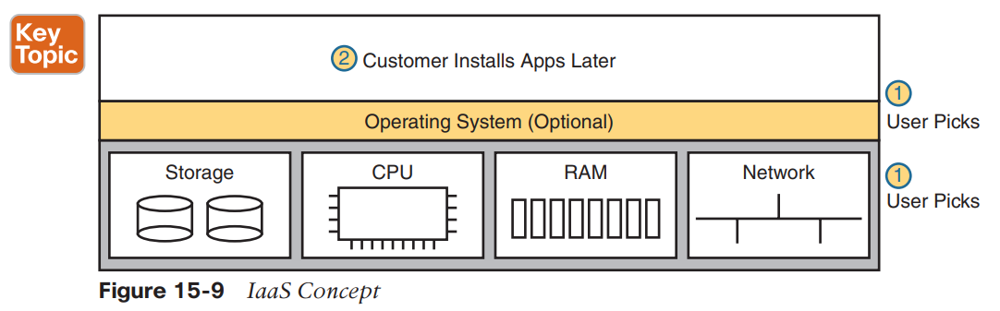

**Software as a Service **
**
**

With Software as a Service (**SaaS**), the consumer receives a service with working software.

File storage services like Apple iCloud, Google Drive, Dropbox, and Box are all SaaS offerings. Most online email offerings can be considered SaaS services today.

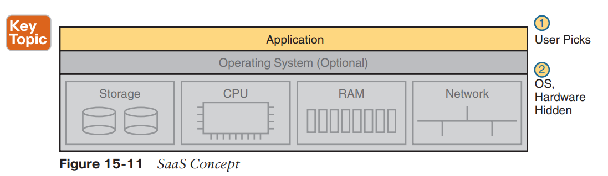

**(Development) Platform as a Service **
**
**

Platform as a Service (**PaaS**) is a development platform, prebuilt as a service.

The key difference between PaaS and IaaS is that PaaS includes many more software tools beyond the basic OS.

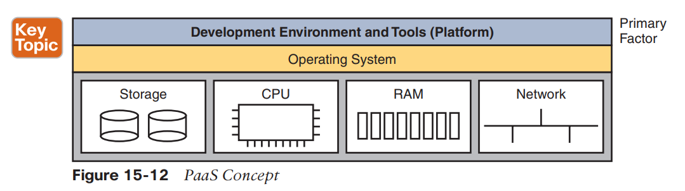

**Accessing Public Cloud Services Using the Internet **
**
**

Now imagine that the IT staff starts moving some of those applications out to a public cloud service. How do the users of the application (inside the enterprise) get to the user interface of the application (which runs at the public cloud provider’s data center)? The Internet, of course. Both the enterprise and the cloud provider connect to the Internet, so using the Internet is the easy and convenient choice.

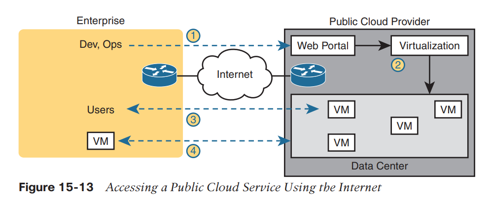
**
**
**
**

While that was just one example, the following list summarizes some good reasons to use the Internet as the WAN connection to a public cloud service:

**Agility**: An enterprise can get started using public cloud without having to wait to order a private WAN connection to the cloud provider because cloud providers support Internet connectivity. **Migration**: An enterprise can switch its workload from one cloud provider to another more easily because cloud providers all connect to the Internet.

**Distributed users**: The enterprise’s users are distributed and connect to the Internet with their devices (as in the sales SaaS app example).

Those negatives for using the Internet for public cloud access are:

**Security**: The Internet is less secure than private WAN connections in that a “man in the middle” can attempt to read the contents of data that passes to/from the public cloud.

**Capacity**: Moving an internal application to the public cloud increases network traffic, so the question of whether the enterprise’s Internet links can handle the additional load needs to be considered. **Quality of Service (QoS)**: The Internet does not provide QoS, whereas private WANs can. Using the Internet may result in a worse user experience than desired because of higher delay (latency), jitter, and packet loss.

**No WAN SLA**: ISPs typically will not provide a service-level agreement (SLA) for WAN performance and availability to all destinations of a network. WAN service providers are much more likely to offer performance and availability SLAs.

**
**
**Private WAN and Internet VPN Access to Public Cloud **

The NIST definition for cloud computing lists broad network access as one of the five main criteria. In the case of public cloud, that often means supporting a variety of WAN connections, including the most common enterprise WAN technologies. Basically, an enterprise can connect to a public cloud provider with WAN technologies.

For the sake of discussion, Figure 15-14 breaks it down into two broad categories.

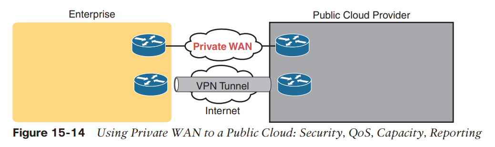
**
**
**VPN access to public Cloud**

To create a VPN tunnel between the enterprise and the cloud provider, you can use the same VPN features discussed earlier in Chapter 14, “WAN Architecture.” The cloud provider can offer a VPN service.

Or the enterprise can use its own router inside the cloud provider’s network— a virtual router, running as a VM—and configure VPN services on that router.

Cisco makes the Cloud Services Router (CSR) to do exactly that: to be a router, but a router that runs as a VM in a cloud service, controlled by the cloud consumer, to do various functions that routers do, including terminating VPNs.

**Private WAN access to public Cloud**

To make a private Multi-protocol Label Switching (MPLS) VPN or Ethernet WAN connection, the enterprise needs to work with the cloud provider and the WAN provider. Because cloud providers connect to many customers with private WAN connections, they often have published set instructions to follow.

In the most basic form, with MPLS, the enterprise and the cloud provider connect to the same MPLS provider, with the MPLS provider connecting the enterprise and cloud sites. The same basic process happens with Ethernet WAN services, with one or more Ethernet Virtual Connections (EVCs) created between the public WAN and the enterprise.

**Intercloud Exchanges **

Enterprises can and do migrate their workload from one cloud provider to another, choosing a new company for a variety of reasons, including looking for a less expensive cloud provider.

The main negative with using a private WAN for the cloud is that it adds another barrier to migrating to a new public cloud provider. One solution is Intercloud Exchanges.

Generically, the term intercloud exchange has come to be known as a company that creates a private network as a service. First, an intercloud exchange connects to multiple cloud providers on one side. On the other side, the intercloud connects to cloud consumers. Figure 15-15 shows the idea.

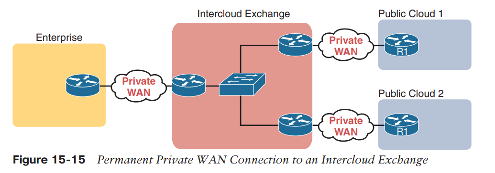

Once connected, the cloud consumer can be configured to communicate with one public cloud provider today, to specific cloud provider sites. Later, if the consumer wants to migrate to use another cloud provider, the consumer keeps the same private WAN links to the intercloud exchange and asks the provider to reconfigure to set up new private WAN connections to the new cloud provider.

As for pros and cons, with an intercloud exchange, you get the same benefits as when connecting with a private WAN connection to a public cloud, but with the additional pro of easier migration to a new cloud provider. The main con is that using an intercloud exchange introduces another company into the mix.

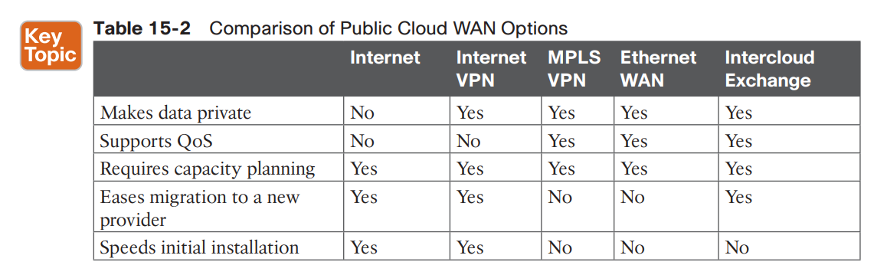

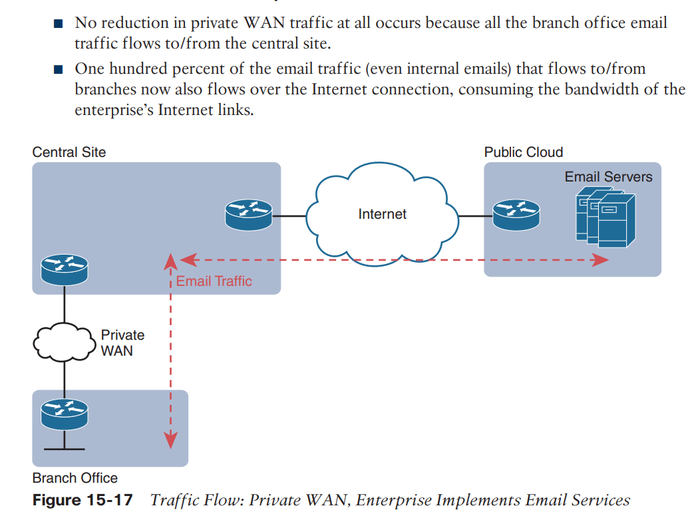

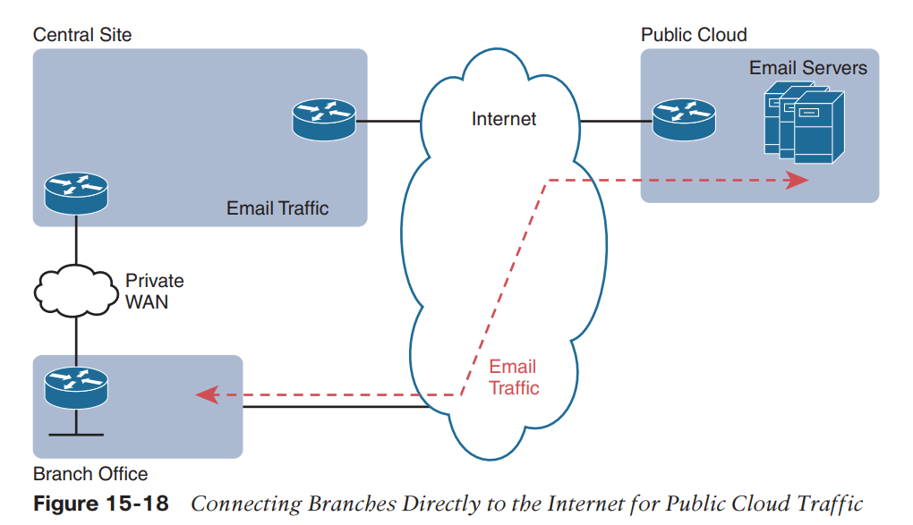

The design in Figure 15-18 has several advantages. The traffic flows much more directly. It does not waste the WAN bandwidth for the central site. And broadband Internet connections are relatively inexpensive today compared to private WAN connections.