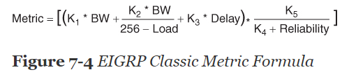

EIGRP

**EIGRP FUNDAMENTALS**

EIGRP overcomes the deficiencies of other distance vector routing protocols like RIP with features such as unequal-cost load balancing, support for networks 255 hops away, and rapid convergence features. EIGRP uses a diffusing update algorithm (DUAL) to identify network paths and enable fast convergence using precalculated loop-free backup paths. Most distance vector routing protocols use hop count as the metric for routing decisions. However, using hop count for path selection does not take into account link speed and total delay. EIGRP adds to the route selection algorithm logic that uses factors outside hop count.

* * *

**Autonomous Systems**

A router can run **multiple **EIGRP **processes**. Each process operates under the context of an **autonomous system**, which represents a common routing domain. Routers within the same domain use the same metric calculation formula and exchange routes only with members of the same autonomous system. An EIGRP autonomous system should not be confused with a Border Gateway Protocol (BGP) autonomous system.

* * *

**EIGRP Terminology**
**
**

|     |     |
| --- | --- |
| **Term ** | **Definition** |
| **Successor route** | The route with the lowest path metric to reach a destination. The successor route for R1 to reach 10.4.4.0/24 on R4 is R1→R3→R4. |
| **Successor ** | The first next-hop router for the successor route. The successor for 10.4.4.0/24 is R3. |
| **Feasible distance (FD)** | The metric value for the lowest-metric path to reach a destination. The feasible distance is calculated locally using the formula shown in the “Path Metric Calculation” section, later in this chapter. The FD calculated by R1 for the 10.4.4.0/24 network is 3328 (that is, 256+256+2816). |
| **Reported distance (RD)** | The distance reported by a router to reach a prefix. The reported distance value is the feasible distance for the advertising router. R3 advertises the 10.4.4.0/24 prefix with an RD of 3072. R4 advertises the 10.4.4.0/24 to R1 and R2 with an RD of 2816. |
| **Feasibility condition** | A condition under which, for a route to be considered a backup route, the reported distance received for that route must be less than the feasible distance calculated locally. This logic guarantees a loop-free path. |
| **Feasible successor** | A route that satisfies the feasibility condition and is maintained as a backup route. The feasibility condition ensures that the backup route is loop free. The route R1→R4 is the feasible successor because the RD 2816 is lower than the FD 3328 for the R1→R3→R4 path. |

**Topology Table**
**
**

EIGRP’s topology table is a vital component to DUAL and contains information to identify loop-free backup routes. The topology table contains all the network prefixes advertised within an EIGRP autonomous system. Each entry in the table contains the following:

- Network prefix
- EIGRP neighbors that have advertised that prefix
- Metrics from each neighbor (for example, reported distance, hop count)
- Values used for calculating the metric (for example, load, reliability, total delay, minimum bandwidth)

The successor (upstream router) advertises the successor route with an RD of 3072. The second path entry has a metric of 5376 and has an RD of 2816. Because 2816 is less than 3072, the second entry passes the feasibility condition, which means the second entry is classified as the feasible successor for the prefix.

* * *

**EIGRP Neighbors**

EIGRP neighbors exchange the entire routing table when forming an adjacency, and they advertise only incremental updates as topology changes occur within a network. The neighbor adjacency table is vital for tracking neighbor status and the updates sent to each neighbor.

EIGRP uses five different packet types to communicate with other routers, as shown in Table 7-3. EIGRP uses its own IP number (88)

* * *

**PATH METRIC CALCULATION**

Metric calculation is a critical component for any routing protocol. EIGRP uses multiple factors to calculate the metric for a path. Metric calculation uses bandwidth and delay by default, but it can include interface load and reliability, too. The formula shown in Figure 7-4 illustrates the EIGRP classic metric formula.

EIGRP uses K values to define which factors the formula uses and the associated impact of a factor when calculating the metric.

BW represents the slowest link in the path scaled to a 10 Gbps link (107). Link speed is collected from the configured interface bandwidth on an interface. Delay is the total measure of delay in the path, measured in tens of microseconds (μs).

The EIGRP formula is based on the IGRP metric formula, except the output is multiplied by 256 to change the metric from 24 bits to 32 bits.

By default, K1 and K3 have the value 1, and K2, K4, and K5 are set to 0. Figure 7-6 places default K values into the formula and then shows a streamlined version of the formula.

The EIGRP update packet includes path attributes associated with each prefix. The EIGRP path attributes can include hop count, cumulative delay, minimum bandwidth link speed, and RD. The attributes are updated each hop along the way, allowing each router to independently identify the shortest path.

Figure 7-7 displays the information in the EIGRP update packets for the 10.1.1.0/24 prefix propagating through the autonomous system. Notice that the hop count increments, minimum bandwidth decreases, total delay increases, and RD changes with each router in the AS.

