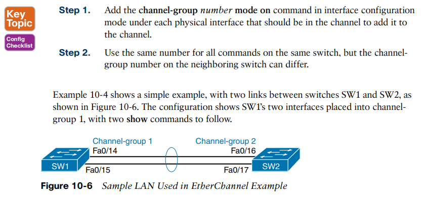
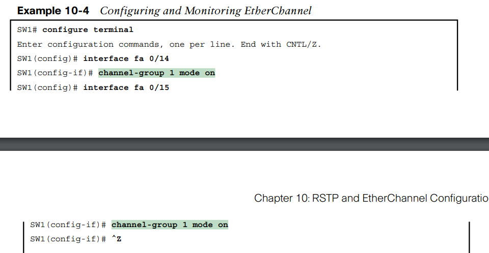
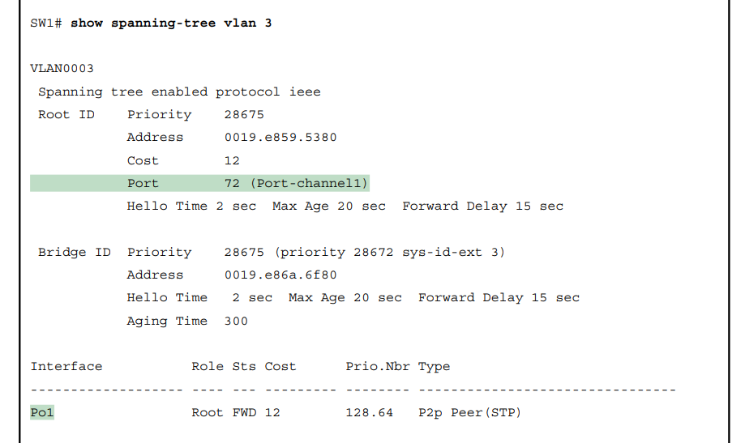
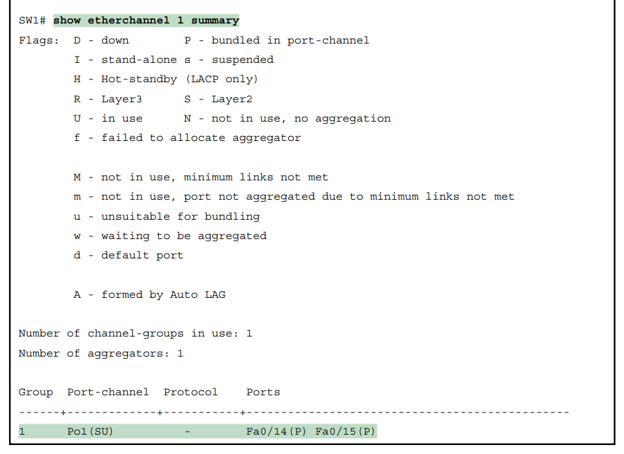
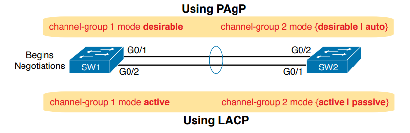
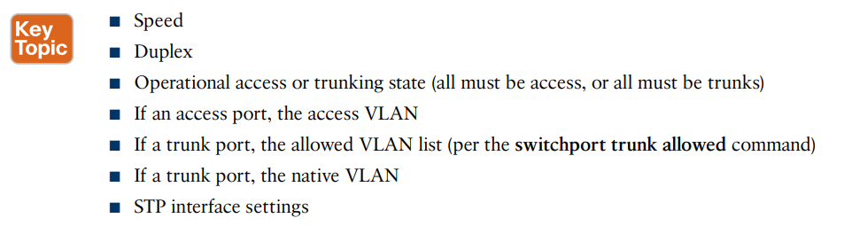
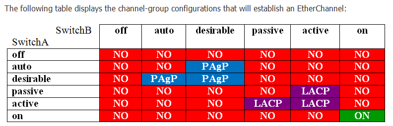
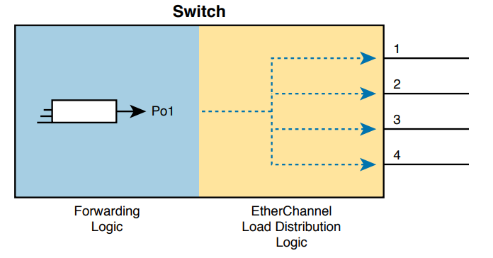
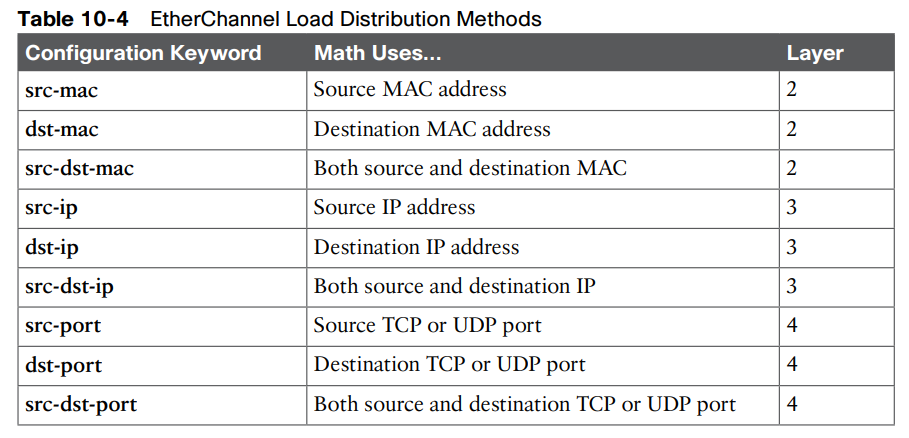
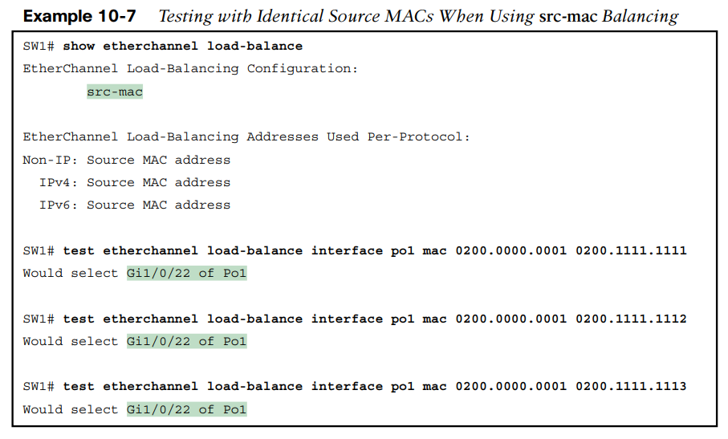

EtherChannel (Layer 2)

**Configuring a Manual Layer 2 EtherChannel**

To configure a Layer 2 EtherChannel so that all the ports always attempt to be part of the channel, simply add the correct channel-group configuration command to each physical interface, on each switch, all with the on keyword, and all with the same number.

**Dynamic EtherChannels**

Cisco switches also support two different configuration options that then use a dynamic protocol to negotiate whether a particular link becomes part of an **EtherChannel **or not.

Basically, the configuration enables a protocol for a particular channel-group number.

Most Cisco Catalyst switches support the Cisco-proprietary Port Aggregation Protocol (**PAgP**) and the IEEE standard Link Aggregation Control Protocol (**LACP**), based on **IEEE **standard **802.3ad.**

One difference of note is that LACP does support more links in a channel—16—as compared to **PaGP’s **maximum of 8.

The desirable and auto keywords enable **PAgP**, and the active and passive keywords enable **LACP**.

At least one side has to begin the negotiations. In other words, with **PAgP**, at least one of the two sides must use **desirable**, and with **LACP**, at least one of the two sides must use **active**.

* * *

* * *

**EtherChannel Load Distribution**

When using Layer 2 EtherChannels, a switch’s MAC learning process associates MAC addresses with the PortChannel interfaces and not the underlying physical ports.

EtherChannel load distribution makes the choice for each frame based on various numeric values found in the Layer 2, 3, and 4 headers.

The process uses one configurable setting as input: the load distribution method as defined with the **port-channel load-balance method** global command.

**The various load distribution algorithms do share some common goals: **

■ To cause all messages in a single application flow to use the same link in the channel, rather than being sent over different links. Doing so means that the switch will not inadvertently reorder the messages sent in that application flow by sending one message over a busy link that has a queue of waiting messages, while immediately sending the next message out an unused link.

■ To integrate the load distribution algorithm work into the hardware forwarding ASIC so that load distribution works just as quickly as the work to forward any other frame. ■ To use all the active links in the EtherChannel, adjusting to the addition and removal of active links over time.

■ Within the constraints of the other goals, balance the traffic across those active links.

