FTP / TFTP

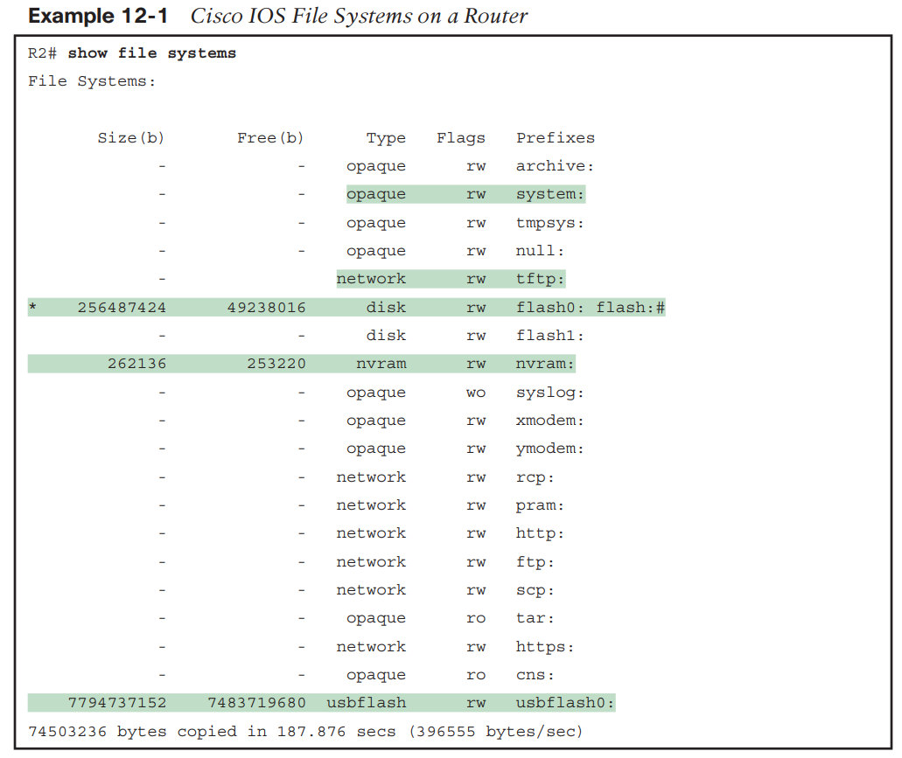

The example lists 20 different IOS file systems in this case, but the router does not have 20 different physical storage devices. Instead, IOS uses these file systems for other purposes as well, with these types :

■ Opaque: To represent logical internal file systems for the convenience of internal functions and commands

■ Network: To represent external file systems found on different types of servers for the convenience of reference in different IOS commands

■ Disk: For flash
■ Usbflash: For USB flash

■ NVRAM: A special type for NVRAM memory, the default location of the startup-config file

■ show running-config command: Refers to file system:running-config
■ show startup-config command: Refers to file nvram:startup-config
■ show flash command: Refers to default flash IFS (usually flash0:)

**Upgrading IOS Image**

One of the first steps to upgrade a router’s IOS to a new version is to obtain the new IOS image and put it in the right location.

The best practice is to store each device’s IOS file in flash that will remain with the device permanently.

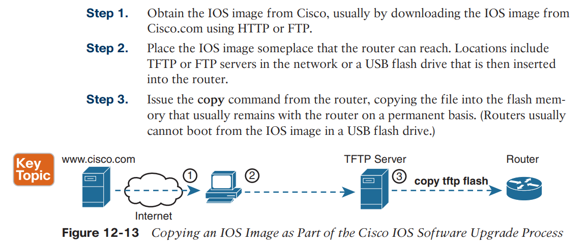

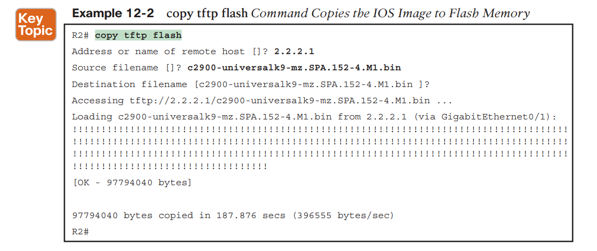

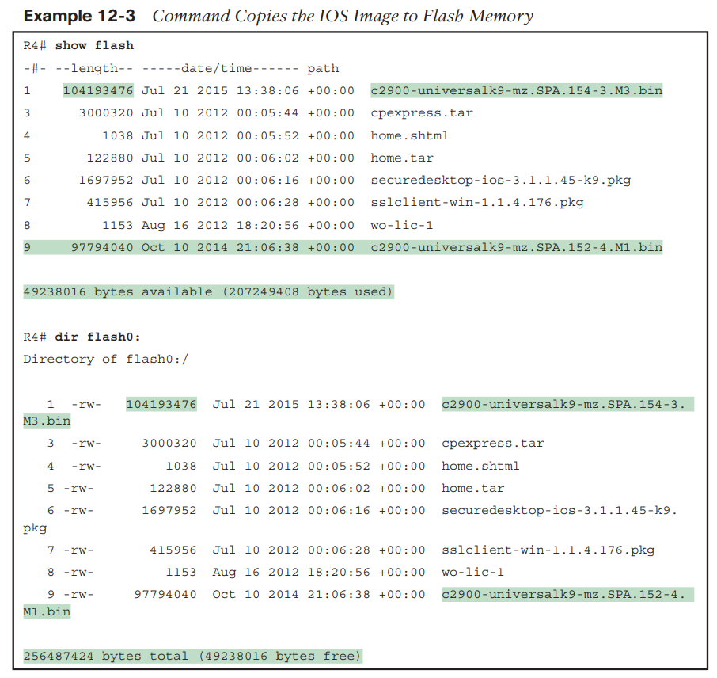

**Verifying IOS Code Integrity with MD5 **
**
**
Cisco provides a means to check the integrity of the IOS file.
The verify /md5 command generates the MD5 hash on your router.

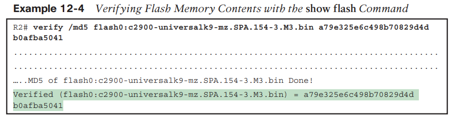

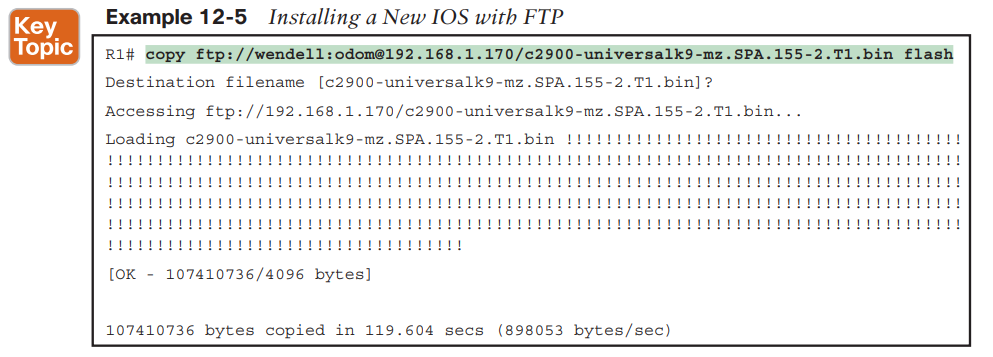

**FTP Protocols Basics**

FTP uses TCP as its transport protocol, relying on TCP to provide an error-free in-order deliver of data so that the FTP application knows that each file transfer creates an exact copy of the file with no omissions. FTP uses well-known TCP port 21 and in some cases also well-known port 20.

FTP uses a client/server model for file transfer.

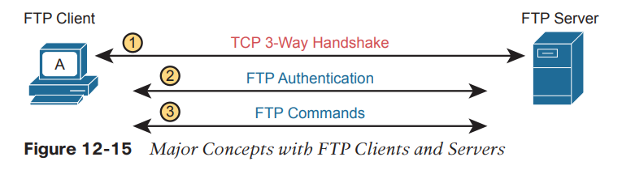

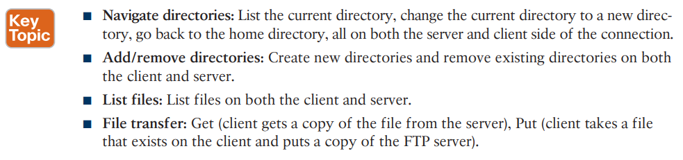

**FTP Active and Passive Modes **

FTP can operate in either active or passive mode. The choice of mode may impact whether the TCP client can or cannot connect to the server and perform normal functions.

* * *

*In active mode, the client establishes the command channel but the server is responsible for establishing the data channel. This can actually be a problem if, for example, the client machine is protected by firewalls and will not allow unauthorised session requests from external parties.*

*In passive mode, the client establishes both channels. We already know it establishes the command channel in active mode and it does the same here.*

*However, it then requests the server (on the command channel) to start listening on a port (at the servers discretion) rather than trying to establish a connection back to the client.*

*As part of this, the server also returns to the client the port number it has selected to listen on, so that the client knows how to connect to it.*

*Once the client knows that, it can then successfully create the data channel and continue.*

* * *

First, note that FTP uses two types of TCP connections:
■ Control Connection: Used to exchange FTP commands

■ Data Connection: Used for sending and receiving data, both for file transfers and for output to display to a user

**Active mode** works well with both the FTP client and server sitting inside the same enterprise network.

However, if the FTP client sits in an enterprise network, and the FTP server resides somewhere in the Internet, an active mode connection typically fails. Due to firewall restrictions.

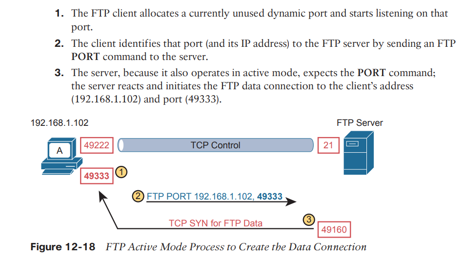

**Passive mode** helps solve the firewall restrictions by having the FTP client initiate the FTP data connection to the server.

However, passive mode does not simply cause the FTP client to connect to a well-known port on the server; it requires more exchanges of port numbers to use between the server and client.

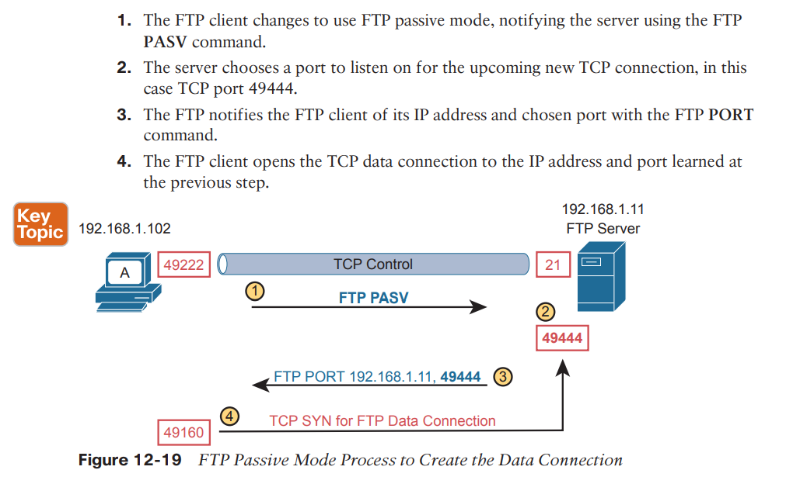

**FTP over TLS (FTP Secure) FTP**

Over the years, several RFCs defined security improvements for FTP. Those new features include using digital certificates for authentication as well as using Transport Layer Security (TLS) to encrypt all data (including usernames/passwords). Fast forward to today and many of those features converge into what most FTP clients and servers support as FTP over TLS or as FTP Secure (FTPS).

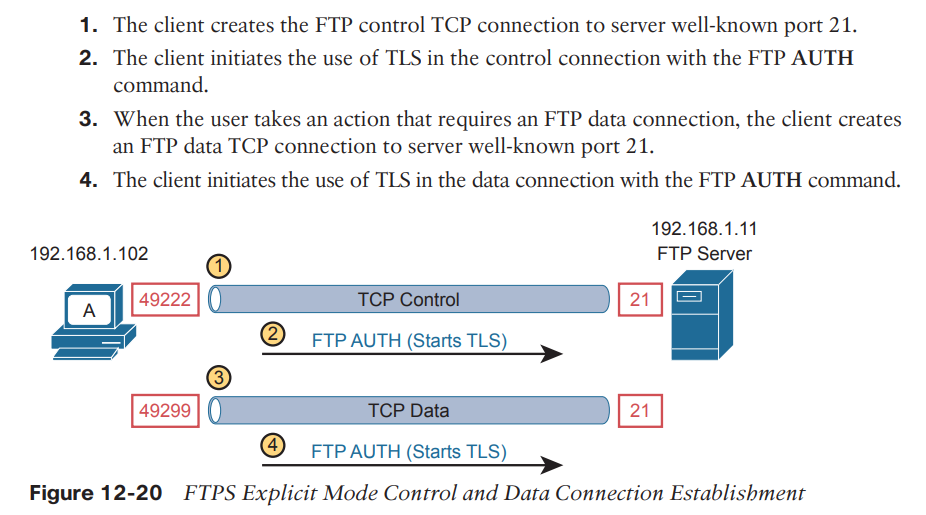

**TFTP Protocol Basics**

For the basics, Trivial File Transfer Protocol uses UDP well-known port 69. Because it uses UDP, TFTP adds a feature to check each file for transmission errors by using a checksum process on each file after the transfer completes.

The word trivial in the name refers to its relatively small number of features, meant to be an advantage by making the tool lightweight.

TFTP can Get and Put files, but it includes no commands to change directories, create/remove directories, or even to list files on the server. TFTP does not support even simple clear-text authentication. In effect, if a TFTP server is running, it should accept requests from any TFTP client.