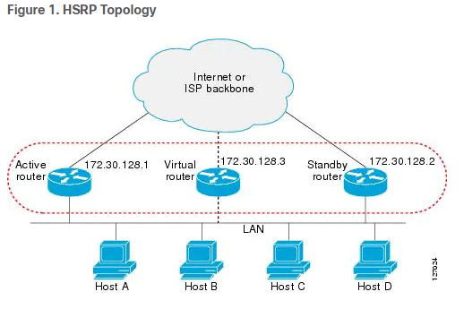
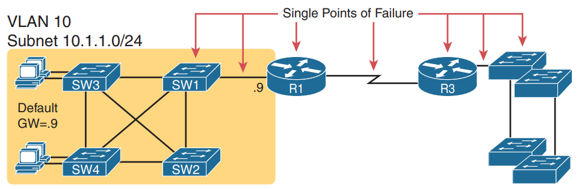
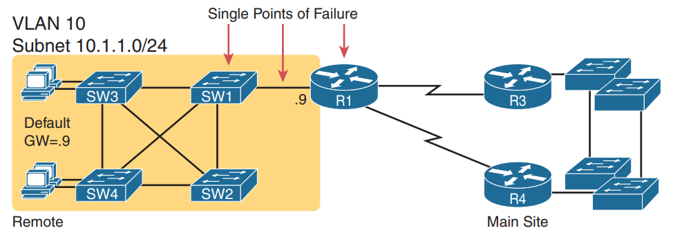
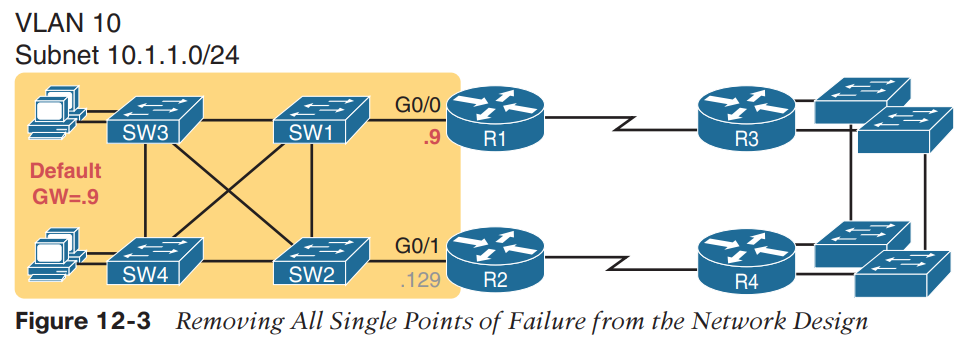
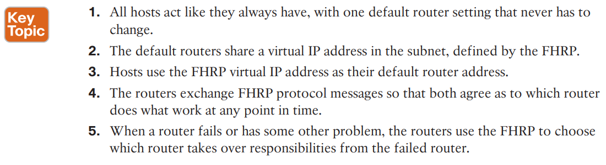
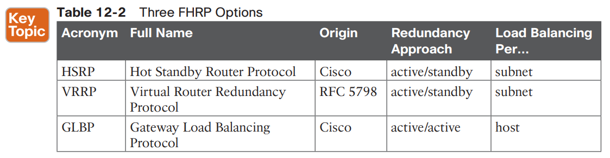
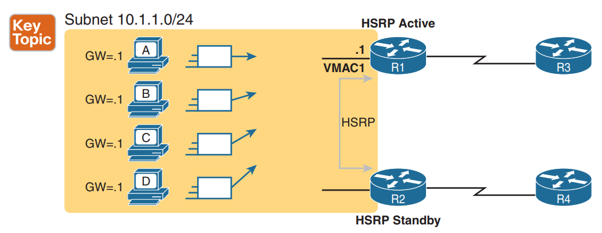
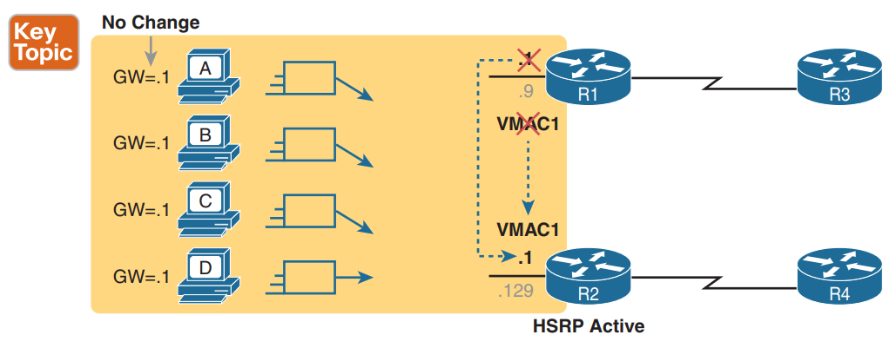
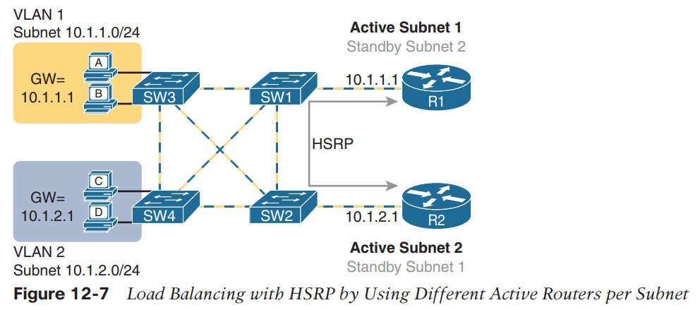

First Hop Redundancy Protocol (FHRP)

**Summary**
**
**
**Refs: **

https://www.cisco.com/c/en/us/td/docs/ios-xml/ios/ipapp_fhrp/configuration/xe-3s/fhp-xe-3s-book/fhp-hsrp.html

https://networkustad.com/2019/11/02/hot-standby-router-protocol-hsrp/

Most IP hosts have an IP address of a single device configured as the default gateway. When HSRP is used, the HSRP virtual IP address is configured as the host’s default gateway instead of the IP address of the device.

HSRP is useful for hosts that do not support a discovery protocol (such as ICMP Router Discovery Protocol [IRDP]) and cannot switch to a new device when their selected device reloads or loses power. Because existing TCP sessions can survive the failover, this protocol also provides a more transparent recovery for hosts that dynamically choose a next hop for routing IP traffic.

When HSRP is configured on a network segment, it provides a virtual MAC address and an IP address that is shared among a group of devices running HSRP. The address of this HSRP group is referred to as the virtual IP address. One of these devices is selected by the protocol to be the active device. The active device receives and routes packets destined for the MAC address of the group. For n devices running HSRP, n+ 1 IP and MAC addresses are assigned.

HSRP detects when the designated active device fails, at which point a selected standby device assumes control of the MAC and IP addresses of the Hot Standby group. A new standby device is also selected at that time.

HSRP uses a priority mechanism to determine which HSRP configured device is to be the default active device. To configure a device as the active device, you assign it a priority that is higher than the priority of all the other HSRP-configured devices. **The default priority is 100**, so if you configure just one device to have a higher priority, that device will be the default active device.

Devices that are running HSRP send and receive multicast UDP-based hello messages to detect device failure and to designate active and standby devices. When the active device fails to send a hello message within a configurable period of time, the standby device with the highest priority becomes the active device. The transition of packet forwarding functions between devices is completely transparent to all hosts on the network.

You can configure multiple Hot Standby groups on an interface, thereby making fuller use of redundant devices and load sharing.

The figure below shows a network configured for HSRP. By sharing a virtual MAC address and IP address, two or more devices can act as a single virtual router. The virtual device does not physically exist but represents the common default gateway for devices that are configured to provide backup to each other. You do not need to configure the hosts on the LAN with the IP address of the active device. Instead, you configure them with the IP address (virtual IP address) of the virtual device as their default gateway. If the active device fails to send a hello message within the configurable period of time, the standby device takes over and responds to the virtual addresses and becomes the active device, assuming the active device duties.

* * *

**HSRP V1 vs V2**

HSRP version 2 is designed to address the following restrictions in HSRP version 1:

- In HSRP version 1, millisecond timer values are not advertised or learned. HSRP version 2 advertises and learns millisecond timer values. This change ensures stability of the HSRP groups in all cases.
- In HSRP version 1, group numbers are restricted to the range from 0 to 255. HSRP version 2 expands the group number range from 0 to 4095.
- HSRP version 2 provides improved management and troubleshooting. With HSRP version 1, you cannot use HSRP active hello messages to identify which physical device sent the message because the source MAC address is the HSRP virtual MAC address. The HSRP version 2 packet format includes a 6-byte identifier field that is used to uniquely identify the sender of the message. Typically, this field is populated with the interface MAC address.
- The multicast address **224.0.0.2** is used to send HSRP hello messages. This address can conflict with Cisco Group Management Protocol (**CGMP**) leave processing.

**Version 1 is the default version of HSRP.**

HSRP version 2 uses the new IP multicast address **224.0.0.102** to send hello packets instead of the multicast address of 224.0.0.2, used by HSRP version 1. This new multicast address allows CGMP leave processing to be enabled at the same time as HSRP.

HSRP version 2 permits an expanded group number range, 0 to 4095, and consequently uses a new MAC address range 0000.0C9F.F000 to 0000.0C9F.FFFF. The increased group number range does not imply that an interface can, or should, support that many HSRP groups. The expanded group number range was changed to allow the group number to match the VLAN number on subinterfaces.

When the HSRP version is changed, each group will reinitialize because it now has a new virtual MAC address.

HSRP version 2 has a different packet format than HSRP version 1. The packet format uses a type-length-value (TLV) format. HSRP version 2 packets received by an HSRP version 1 device will have the type field mapped to the version field by HSRP version 1 and subsequently ignored.

* * *

standby 10 ip 10.1.1.3 (on both router's interfaces)

**ipconfig **should show the virtual int (10.1.1.3)
**tracert -d** should show the real ip of the interface
**arp -a** should show the real mac address of the router

* * *

**The need of redundancy in networks**

Many real enterprise networks follow designs like Figure 12-2 (below), with one router at each remote site, two WAN links connecting back to the main site, and redundant routers at the main site.

A risk remains, but it is a calculated risk.

**NOTE **

Medium to large enterprise networks work hard at striking a balance of high-availability features versus the available budget dollars. Cisco.com has many design documents that discuss trade-offs in high-availability design. If interested in learning more, search Cisco.com for “high availability campus network design.”

So, some design options for default router settings include the following:

■ All hosts in the subnet use R1 (10.1.1.9) as their default router, and they statically reconfigure their default router setting to R2’s 10.1.1.129 if R1 fails.

■ All hosts in the subnet use R2 (10.1.1.129) as their default router, and they statically reconfigure their default router setting to R1’s 10.1.1.9 if R2 fails.

■ Half the hosts use R1, and half use R2, as their default router, and if either router fails, that half of the users statically reconfigure their default router setting.

All of these options have a problem: the users have to take action.

FHRPs make this design work better. The two routers appear to be a single default router.

* * *

**HSRP Concepts**
**
**
HSRP allows two (or more) routers to cooperate.
Only one router actively supports the end-user traffic.(Active router)
The other routers, with an HSRP standby state. (passive routers)

The HSRP active router implements a virtual IP address and matching virtual MAC address.

All the cooperating HSRP routers know these virtual addresses, but only the HSRP active router uses these addresses at any one point in time.

The two routers send HSRP messages to each other to negotiate and decide which router should currently be active and which should be standby.

Then the two routers continue to send messages to each other so that the standby router knows when the active router fails so that it can take over as the new active router.

When the failover occurs, the LAN switches, hidden in the last few figures, formerly sent frames destined for VMAC1 to router R1. Now the switches must know to send the frames to the new active router, R2. To make the switches change their MAC address table entries for VMAC1, R2 sends an Ethernet frame with VMAC1 as the source MAC address. The switches, as normal, learn the source MAC address (VMAC1), but with new ports that point toward R2.

HSRP does support load balancing by preferring different routers to be the active router in different subnets.

* * *

**HSRP Version 1**

Group number can go from 0 to 255.

HSRP Mac Address version 2 always begin with **0000.0C07.ACxx. **The last **two **digits are reserved for the **group number** in hex.

**HSRP Version 2**

Group number can go from 0 to 4096.

HSRP Mac Address version 2 always begin with **0000.0C9F.0xxx. **The last **three **digits are reserved for the **group number** in hex.

**VRRP**

VRRP's Mac address always begin with **00-00-5E-00-01. **The last **two** digits go for the Virtual Router ID.

* * *

**VRRP vs HSRP**
**
**

Besides VRRP not being proprietary, there are a few minor differences between the protocols as well:

- With HSRP, each interface must have an IP address that is separate from the HSRP group address. VRRP lets you share the Master's interface IP address.
- On Cisco devices, VRRP is configured to preempt by default, whereas HSRP is not configured to preempt by default.
- On Cisco devices, HSRP sends hellos every 3 seconds and has a dead timer of 10 seconds. VRRP sends advertisements every 1 second and has a dead timer of roughly three times the advertisement interval.
- VRRP can be configured to learn the timer configuration from the Master.