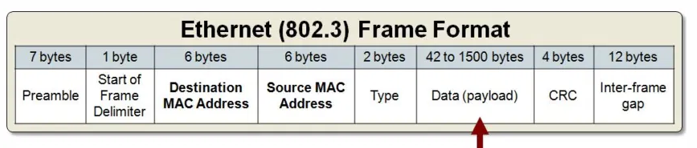
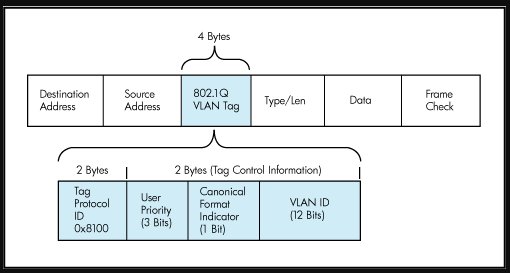
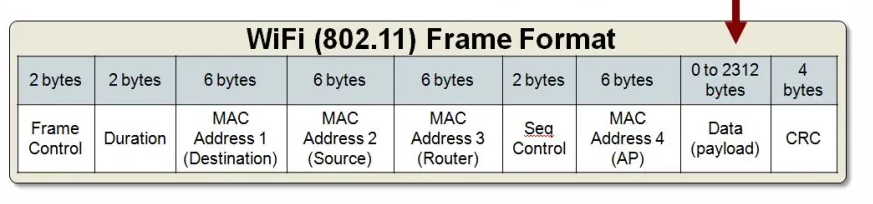
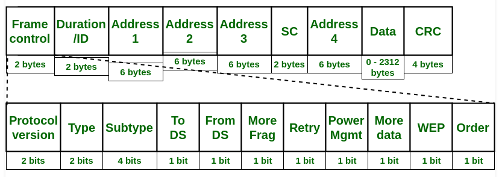
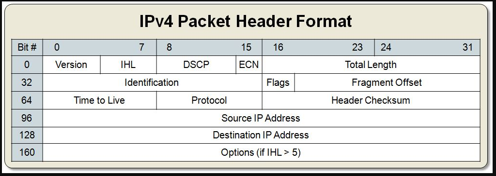
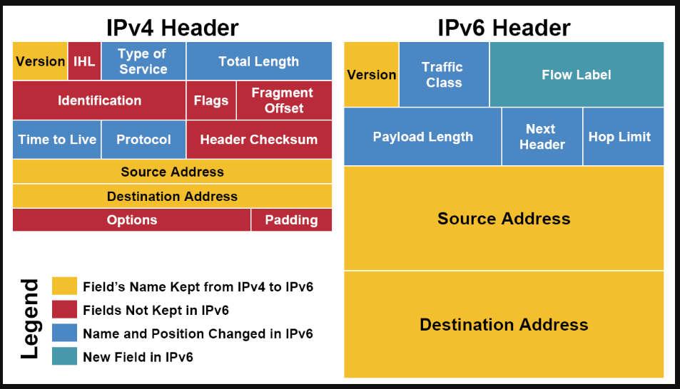
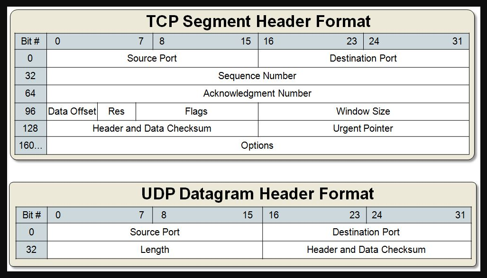

Headers

**Ethernet Header**

The **maximum** frame size depends on the interface **MTU** (Maximum Transmission Unit); the default value is **1500 bytes**.

The **minimum **frame size for IPv4 is **64 bytes**, where the Ethernet header takes up 18 bytes, the IPv4 header 20 bytes, and the UDP header 8 bytes.

* * *

**The preamble field**

The preamble field is 7 bytes long. It contains a string of 7 bytes. Each byte alternatively stores 1 and 0 to make the pattern **'10101010'**. Preamble bytes help the receiving device to identify the beginning of an Ethernet frame. When a device receives 7 continuous bytes of the same pattern (10101010), it assumes that the incoming data is an Ethernet frame and it locks the incoming bit-stream.

* * *

**The SFD field**

The SFD (Start Frame Delimiter) field is 1 byte long. It contains a string of 1 byte. This byte also stores the same pattern, except the last bit. In the last bit, it stores **1** instead of the **0**. The following image shows both fields with their related bytes respectively.

The SFD byte indicates the receiving device that the next byte is the destination MAC address of the Ethernet frame.

* * *

**Type**

This field is 2 bytes long. This field stores information about the protocol of the upper layer (network layer).

The Data Link layer of the source computer prepares, packs and loads the Ethernet frame in the media. The Data link layer of the destination computer picks the Ethernet frame from the media. After picking the Ethernet frame, the Data link layer of the destination computer unpacks, processes, and hands over that Ethernet frame to the upper layer for further processing.

If multiple protocols are running in the upper (network) layer of the destination computer, the data link layer will fail to hand over the received frame to the upper layer as it does not know to which protocol it should give the received frame.

*To learn more about how layers exchange and process data, you can check this tutorial.*

*[Data Encapsulation and De-encapsulation Explained](https://www.computernetworkingnotes.com/ccna-study-guide/data-encapsulation-and-de-encapsulation-explained.html)*

The type field solves this issue. This field allows the sender computer to insert the information of the upper layer protocol. Through this information, the data link layer of the destination computer can easily determine the upper layer protocol to which it should hand over the received frame.

Modern LAN implementations mostly use the IP protocol in the network layer. There are two variants of the IP protocol; IPv4 and IPv6. If the type field has value IP or ox800, the frame is carrying the data of the IPv4 protocol. If the type field has value IPv6 or 0x86dd, the frame is carrying the data of the IPv6 protocol.

The following image shows an example of the type field for both IP variants.

* * *

**FCS/CRC**

This field is 4 bytes long. This field stores a 4 bytes value that is used to check whether the received frame is intact or not. The sender device takes all fields of the frame except the FCS field, and runs them through an algorithm, known as the CRC (Cyclic Redundancy Check). The CRC algorithm generates a 4-byte result, which is placed in this FCS field.

When the destination device receives a frame, it takes the same fields and runs them through the same algorithm. If the result matches with the value stored in the FCS field, the frame is considered good and is processed further. If both values do not match, the frame is considered bad and is dropped

* * *

**Inter-Frame Gap**

Interpacket gap is idle time between packets. After a packet has been sent, transmitters are required to transmit a minimum of 96 bits (12 octets) of idle line state before transmitting the next packet.

* * *

**802.1q Header**

**
**
**
**

* * *

**802.11 Header**

**
**

**
**

**Frame Control(FC) –**

It is 2 bytes long field which defines type of frame and some control information. Various fields present in FC are:

1. **Version:**

It is a 2 bit long field which indicates the current protocol version which is fixed to be 0 for now.

2. **Type:**

It is a 2 bit long field which determines the function of frame i.e management(00), control(01) or data(10). The value 11 is reserved.

3. **Subtype:**

It is a 4 bit long field which indicates sub-type of the frame like 0000 for association request, 1000 for beacon.

4. **To DS:**

It is a 1 bit long field which when set indicates that destination frame is for DS(distribution system).

5. **From DS:**

It is a 1 bit long field which when set indicates frame coming from DS.
6. **More frag (More fragments):**

It is 1 bit long field which when set to 1 means frame is followed by other fragments.

7. **Retry:**

It is 1 bit long field, if the current frame is a retransmission of an earlier frame, this bit is set to 1.

8. **Power Mgmt (Power management):**

It is 1 bit long field which indicates the mode of a station after successful transmission of a frame. Set to 1 the field indicates that the station goes into power-save mode. If the field is set to 0, the station stays active.

9. **More data:**

It is 1 bit long field which is used to indicates a receiver that a sender has more data to send than the current frame. This can be used by an access point to indicate to a station in power-save mode that more packets are buffered or it can be used by a station to indicate to an access point after being polled that more polling is necessary as the station has more data ready to transmit.

10. **WEP:**

It is 1 bit long field which indicates that the standard security mechanism of 802.11 is applied.

11. **Order:**

It is 1 bit long field, if this bit is set to 1 the received frames must be processed in strict order.

**
**

**
**

- **Duration/ID –**

It is 4 bytes long field which contains the value indicating the period of time in which the medium is occupied(in µs).

-

- **Address 1 to 4 –**

These are 6 bytes long fields which contain standard IEEE 802 MAC addresses (48 bit each). The meaning of each address depends on the DS bits in the frame control field.

-

- **SC (Sequence control) –**

It is 16 bits long field which consists of 2 sub-fields, i.e., Sequence number (12 bits) and Fragment number (4 bits). Since acknowledgement mechanism frames may be duplicated hence, a sequence number is used to filter duplicate frames.

-

- **Data –**

It is a variable length field which contain information specific to individual frames which is transferred transparently from a sender to the receiver(s).

-

- **CRC (Cyclic redundancy check) –**

It is 4 bytes long field which contains a 32 bit CRC error detection sequence to ensure error free frame.

**
**

* * *

**
**
**
**
**
**
**IP Header**
**
**

**
**
**
**
**
**

- **Version**: the first field tells us which IP version we are using, only IPv4 uses this header so you will always find decimal value 4 here.
- **Header Length**: this 4 bit field tells us the length of the IP header in 32 bit increments. The minimum length of an IP header is 20 bytes so with 32 bit increments, you would see value of 5 here. The maximum value we can create with 4 bits is 15 so with 32 bit increments, that would be a header length of 60 bytes. This field is also called the **Internet Header Length (IHL)**.
- **Type of Service**: this is used for QoS (Quality of Service). There are 8 bits that we can use to mark the packet which we can use to give the packet a certain treatment. You can read more about this field in my [IP precedence and DSCP tutorial](https://networklessons.com/quality-of-service/ip-precedence-dscp-values/).
- **Total Length**: this 16-bit field indicates the entire size of the IP packet (header and data) in bytes. The minimum size is 20 bytes (if you have no data) and the maximum size is 65.535 bytes, that’s the highest value you can create with 16 bits.
- **Identification**: If the IP packet is fragmented then each fragmented packet will use the same 16 bit identification number to identify to which IP packet they belong to.
- **IP Flags**: These 3 bits are used for fragmentation:
    - The first bit is always set to 0.
    - The second bit is called the **DF (Don’t Fragment) bit** and indicates that this packet should not be fragmented.
    - The third bit is called the **MF (More Fragments)** bit and is set on all fragmented packets except the last one.
- **Fragment Offset**: this 13 bit field specifies the position of the fragment in the original fragmented IP packet.
- **Time to Live**: Every time an IP packet passes through a router, the time to live field is decremented by 1. Once it hits 0 the router will drop the packet and sends an ICMP time exceeded message to the sender. The time to live field has 8 bits and is used to prevent packets from looping around forever (if you have a routing loop).
- **Protocol**: this 8 bit field tells us which protocol is encapsulated in the IP packet, for example TCP has value 6 and UDP has value 17.
- **Header Checksum**: this 16 bit field is used to store a checksum of the header. The receiver can use the checksum to check if there are any errors in the header.
- **Source Address**: here you will find the 32 bit source IP address.
- **Destination Address**: and here’s the 32 bit destination IP address.
- **IP Option**: this field is not used often, is optional and has a variable length based on the options that were used. When you use this field, the value in the header length field will increase. An example of a possible option is “source route” where the sender requests for a certain routing path.

**
**
**
**
**
**

**
**

* * *

**TCP Header**
**
**

**
**
**
**

* * *

**OSPF HEADER**

