How to Configure NTP in Cisco Router

# How to Configure NTP in Cisco Router

This tutorial explains how to configure NTP Server and NTP Client in Cisco Router step by step with practical example. Learn basic concepts of NTP such as what NTP is, how NTP works, NTP stratum levels, meaning of synchronized and un-synchronized NTP clock in detail.

## Basic concepts of NTP

By default networking devices have their own mechanism or clock to read and use the time. Unless devices are not connected with each other, there is no problem. But if devices are connected with each other with different time settings, applications or services which depend on time for functionality will not work or deliver unexpected results.

Let’s understand it with a simple example.

A user got “*Certificate is not valid*” message while he tried to access bank’s website so he called the support person. Support person figured out that time setting was incorrect in user’s computer. Once setting was configured correctly, user was able to connect with bank’s website.

Can you guess what went wrong in this example?
 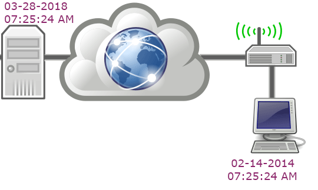

Well… In order to mitigate security risks (such as phishing attack), usually financial sites issue a digital certificate. Browsers use this certificate to the check the identity of the website. This certificate remains valid only for certain time period. Web browser uses local system’s time to authenticate the certificate. If browser finds any unusual difference between both times, it doesn’t validate the certificate and issues a warning message to user. This is what exactly happened in this example.

Let’s take another example. Sales section of a company opens at 7.00 AM and close at 7.00 PM. Company wants to allow users to access its server only in business hours. So it configured a time based firewall in router which connects users with server. In this router clock is running 12 hours ahead from the server’s clock.

Will this setup work?
 

Nope, users will never be able to login in server in working hours. Router uses its own clock to authenticate the access. With this setup, router allows users to login between 7.00 PM to 7.00 AM instead of 7.00 AM to 7.00 PM.

Above examples explain how time synchronization plays a crucial role in networking. NTP is a dedicated protocol for time synchronization. It allows us to use a centralized time for all our networking devices. NTP stands for Network Time Protocol.

## NTP mode in Cisco Router

A Cisco router can be configured in three modes: -

- NTP Server only

- NTP Server /Client

- NTP Client only

### NTP Server Mode

In this mode, Router reads time from NTP Source. Unless we manually define the NTP source, router uses its own clock as NTP source. As per requirement, we can configure router’s clock or can use an external clock as NTP source. Once NTP Source is configured, NTP Server router advertises this time in network. In this mode, router only advertises NTP updates. It doesn’t accept any NTP update for other NTP server.

### NTP Server/Client Mode

In this mode, router receives updates from NTP server and advertises them from its own interfaces. This way router plays both roles. As NTP Client it receives NTP updates and as NTP Server it advertises NTP updates.

In this mode, as a NTP Server, instead of using its own NTP Source, router uses received NTP updates from other NTP server to advertise the NTP updates. This feature allows us to use a single centralized NTP source at NTP Server.

### NTP Client Mode

In this mode, router only receives NTP updates. It does not advertise received updates. It uses them to sync its own clock.

## LAB Setup for NTP configuration

To understand NTP configuration in detail with practical example, let’s create a simple topology in GNS3 as illustrate in following figure

To learn how to install GNS3 step by step with examples, see this tutorial

[Learn how to install and configure GNS3 for CCNA lab](https://www.computernetworkingnotes.com/ccna-study-guide/how-to-install-gns3-step-by-step-explained.html)

 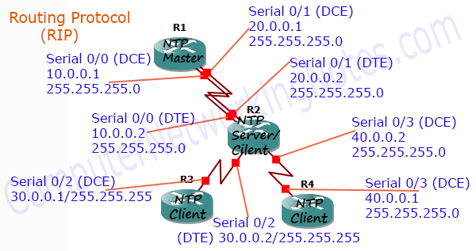
Configure following IP addresses

|     |     |     |     |
| --- | --- | --- | --- |
| Router | Interface | IP address | Connected With |
| R1  | Serial 0/0 (DCE) | 10.0.0.1/24 | Serial 0/0 (R2) |
| R1  | Serial 0/1 (DCE) | 20.0.0.1/24 | Serial 0/1 (R2) |
| R2  | Serial 0/0 (DTE) | 10.0.0.2/24 | Serial 0/0 (R1) |
| R2  | Serial 0/1 (DTE) | 20.0.0.2/24 | Serial 0/1 (R1) |
| R2  | Serial 0/2 (DCE) | 30.0.0.2/24 | Serial 0/2 (R3) |
| R2  | Serial 0/3 (DCE) | 40.0.0.2/24 | Serial 0/3 (R4) |
| R3  | Serial 0/2 (DTE) | 30.0.0.1/24 | Serial 0/2 (R2) |
| R4  | Serial 0/3 (DTE) | 40.0.0.1/24 | Serial 0/3 (R2) |

Configure RIP routing protocol in all routers.

To learn how to assign essential IP configuration in interfaces and configure basic RIP routing in Cisco routers, check this tutorial.

[RIP protocol configuration guide](https://www.computernetworkingnotes.com/ccna-study-guide/rip-protocol-configuration-guide-with-examples.html)

*It explains how to configure RIP routing protocol in Cisco router step by step.*

Can I use packet tracer for this practice?

Sadly, necessary commands to configure NTP server are not available in Packet Tracer. We have to use the real Cisco router or simulator software which uses real Cisco IOS for simulation such as GNS3 or Cisco virtual lab. This tutorial uses GNS3.

For this tutorial I assume that above essential IP addresses are configured properly in network and RIP routing protocol is running.

If you don’t want to configure this configuration manually, download this pre-configured topology and load it in GNS3.

[NTP practice Lab without IOS](https://www.computernetworkingnotes.org/download/cisco/ccna-study-guide/gnslab/ntp-practice-lab-without-ios.gns3project)

By default GNS3 does not install Cisco ISO. In this tutorial I used Cisco 2600 router. If this router is not available in your GNS3, download this pre-configured topology. In contains necessary IOS file and configuration.

[NTP practice Lab with IOS](https://www.computernetworkingnotes.org/download/cisco/ccna-study-guide/gnslab/ntp-practice-lab-with-ios.gns3project)

##### Importing NTP practice LAB in GNS3

Click **File** menu and click **Import portable project**
 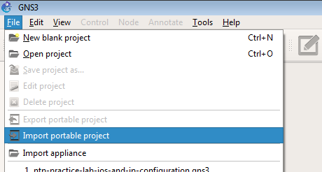
Select the appropriate downloaded LAB file
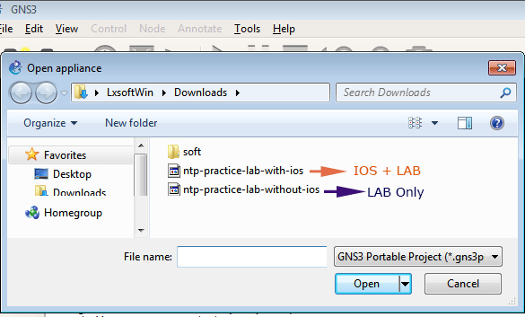

To extract and use this lab, wizard will create a new project. Choose the descriptive name for the project and select the folder location where you want to save this project and click **save** button

Once practice lab is imported, click **start** button to start the LAB.
 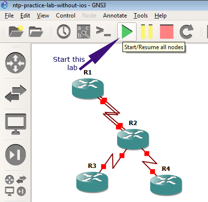

NTP stratum plays key role in NTP configuration. So before we learn how to configure NTP, let’s quickly understand what stratum is and how it is used in NTP.

## NTP Stratum

NTP devices read time from NTP source. Stratum defines the reliability and accuracy of NTP source. It uses a scale of stratum 0 to stratum 15 for NTP sources. In this scale, stratum 0 is the most reliable and stratum 15 is the worst reliable source of time.

Stratum-0 devices use the atomic clock and provide the most accurate time. To use this time, devices need lot of CPU power and memories. Usually these types of devices are used in critical sectors such as Defense, Research, Space and Weather department.

Since syncing clock with stratum-0 devices consumes lot of CPU power and memories, regular computers and networking devices never sync their clocks with these devices. This also applies on Cisco routers. We cannot configure regular Cisco router to use this time.

Public Time Servers stand next in this scale and are generally referred as stratum-1 devices. These servers sync their clock with stratum-0 devices and provide an optimized time for regular devices. To use this optimized time, devices do not need any additional CPU power or memories. Any regular device can use this time. We can configure any Cisco router to use this time.

In real life, usually companies deploy a dedicate NTP (time) server which gets its time from stratum 1 server and later this NTP server is used as centralized source of time in entire network.

In exam we are not allowed to connect with internet. Since internet is not available, we cannot use the public NTP server. Luckily NTP allows us to use any valid source of time. We can use router’s internal clock as NTP source for the practice and as well as in exam (if it is asked).

Regardless which time source you use, configuration steps are same. You can use same commands and steps to configure NTP in real life environment.

## Configure NTP Server

To deploy a router as NTP server, following steps are required.

- Adjust router clock

- Configure Loop back interface

- Add loopback interface’s network in routing table

- Configure NTP Server

- Configure active interfaces to act as NTP Server only

### Adjust router clock

In order to use router’s internal clock as NTP source, we have to match it with current time.

Access command prompt of router R1 through console line
 
Let’s view the current time with **show clock** command before updating it
R1#show clock
*00:15:05.392 UTC Fri Mar 1 2002

Output of this command provides information about time, time zone and date. As we can see in above output, all these settings are configured incorrectly and need to be set correctly. To adjust these settings following commands are used

|     |     |     |
| --- | --- | --- |
| Command | Mode | Description |
| R1(config)#clock timezone [Keyword] [value] | Global configuration mode | To set the time zone |
| R1(config)#clock summer-time [Keyword] [value] | Global configuration mode | To set the day light saving time |
| R1#set clock [h:m:s] [DD MM yyyy] | Privilege Exec mode | To set the date and time |

Run following commands to adjust these settings correctly
R1#configure terminal
R1(config)#clock timezone EST -5
R1(config)#clock summer-time EDT recurring
R1(config)#exit
R1#clock set 18:45:26 5 April 2018
R1#show clock
First command takes us in global configuration mode.

By default router uses universal time zone. Second command allows us to localize the time zone. Let’s understand this command in detail.

**clock timezone: -**
This is the main command.
**EST [*Keyword*]: -**

This parameter allows us to set a descriptive name for our time zone. Router does not care what name we choose here, it accepts any value and displays that as our time zone. Since router uses this parameter to display the name of time zone, we should always choose the meaningful value here such as keyword which represents our time zone for example EST (US Eastern Standard Time), IST (Indian Standard Time), CST (Central Standard Time), etc.

**-5 [*Value*]: -**

This parameter is what router uses to calculate the time from UTC (Universal Time Coordinated) time. The **“-5”** value in this field, tells router that our time zone is 5 hour behind from UTC time.

Third command allows us to adjust the “**day light saving time**”. In this command: -

**clock summer-time: -**
This is the main command.
**EDT [*Keyword*]: -**

This parameter allows us to set a descriptive name for **“day light saving time”**. Just like previous command, router does not care what name we choose here, it will display the chosen value as the name of **“day light saving time”**. We should choose the name which reflects **“day light saving time”** in our time zone such as **EDT (*Eastern Daylight Time*)**.

**recurring [*Value*]: -** Router uses this parameter to take the appropriate action when **“day light saving time”** occurred. The recurring value tells the router to spring forward an hour and fall back an hour automatically each year.

DST (Daylight Saving Time) is a concept to utilize the natural daylight in better way. In this concept, clocks are forwarded one hour from standard time during the spring and are set one hour back again in autumn. More information about this concept is available here

*https://en.wikipedia.org/wiki/Daylight_saving_time*

This command is optional. If your company does not use this concept, just skip this command.

Fourth command is used to exit from global configuration mode.
Fifth command allows us to set the date and time. In this command: -
**set clock: -**
This is the main command.
**18:45:26 [Time in *HH:MM:SS*]: -**
This parameter sets time is 24 hours format (*hours: Minute: Second*).
**5 April 2018 [Date in *DD:MM:YYYY*]: -**
This parameter sets date.
Sixth command verifies that date, time and time zone are updated correctly.
Following figure shows above commands step by step.
 

### Configure Loopback interface

Although NTP allows us to use any interface for NTP Server reference, but we should always use loopback interface for this purpose. A physical interface can be down due to several reasons, but loopback interface once up, remains up until we manually shut it down. Let’s create a loopback interface in R1

|     |     |
| --- | --- |
| Command | Description |
| R1#configure terminal | To enter in global configuration mode |
| R1(config)#interface loopback 0 | To create a loopback interface |
| R1(config)#ip address 100.0.0.1 255.255.255.0 | To assign IP address to this interface |
| R1(config)#no shutdown | To bring this interface up |
| R1(config)#exit | To exit from this interface |

### Add loopback interface’s network in routing

Unless we add loopback interface’s network address in routing table, other devices will not be able to able to connect with it. In our lab, we used RIP routing protocol. To add loopback interface’s network address in routing table, use following commands: -

R1#router rip
R1(config-router)#network 100.0.0.0
R1(config-router)#exit

### Configure NTP Server

NTP server configuration is straightforward. It takes only two commands to deploy a router as NTP Server.

Router(config)#ntp master [stratum level]
Router(config)#ntp source [Interface / hostname or IP address of NTP Source]

In first command stratum level is optional. If we do not specify it, router will use default value. Default stratum level of router’s internal clock is **7**.

In second command, we have to specify the NTP source. We can use any valid NTP source here.

- To use a public NTP server, type its IP address here. In order to use public NTP server,router must be connected with Internet and UDP port 123 must be allowed in firewall.

- To use another NTP server from internal network, type the IP address of that server.

- To use internal clock of this router, use any configured IP address in any interface of this router.

Since in our lab we are using R1’s internal clock as NTP source, we can use the IP address of serial 0/0 interface or can use the IP address of serial 0/1 interface or can use the IP address of loopback interface. The only benefit of using loopback interface’s IP address over physical interface’s IP address is that loopback interface remains always on.

 

### Configure interfaces to act as NTP Server only

By default, router works in NTP Server/client mode. In NTP Server/client mode, router advertises and listen NTP broadcast from all active interfaces. If we want to deploy this router as NTP Server only, we have to configure all active interfaces in a way that they only broadcast the NTP message. Luckily this process is also very simple. It requires only following command in each active interface.

Router(config-if)ntp broadcast

We have two active interfaces in router R1. Let’s configure them to only broadcast the NTP messages.

 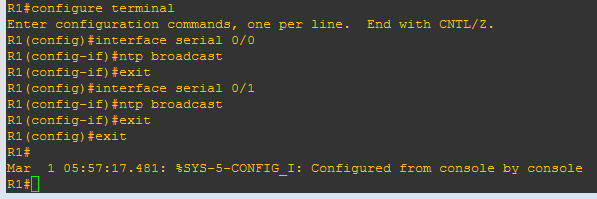
Now save running configuration
R1#copy running-config startup-config

That’s all settings we need in NTP Server only router.

## Configure NTP Server/Client

By default, routers work in this mode. So no additional configuration is required to deploy a router in this mode. But wait… there is a twist in tail.

*By default in this mode, router uses its own clock as NTP source.*

So if we want to build a hierarchy where this router receives time from other NTP server, we must have to change the NTP source in this router.

Following command is used to change the NTP source
Router(config)#ntp server [NTP Source IP Address]

In our lab, we are using R1 as main NTP server. In order to deploy router R2 as NTP Server/Client router where it reads time from R1, we have to use following command in R2

R2(config)#ntp server 100.0.0.1
Configure the NTP server IP address and save the configuration
 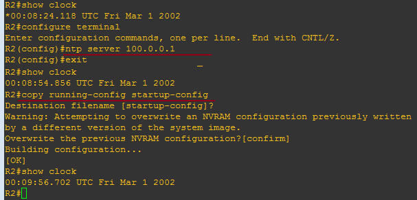

If you don’t see the updated time just after the above process, just relax and wait. It does not update immediately. Usually updating process takes 2 to 3 minutes. But once clock is synchronized with server, time will be updated automatically.

 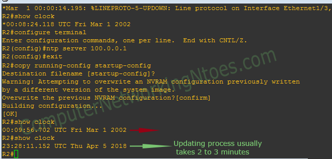

## Configure NTP Client only

To configure a router as NTP client only, we need two commands.
Router(config)#ntp server [NTP Server IP address]
Router(config-if)#ntp broadcast client

As explained earlier, first command insists router to use NTP server time instead of its own local time and second command configures active interface to listen NTP broadcast message only.

Let’s configure R3 and R4 as NTP clients only. Earlier I explained, we can use any configured IP address from NTP server router to get the NTP updates. To understand it more clearly, this time we will use R2’s serial interface’s IP address to connect with NTP server.

Following figure shows step by step commands to configure R3 as NTP client only
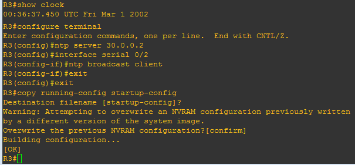
Following figure shows step by step commands to configure R4 as NTP client only

### Testing and troubleshooting NTP setup

For testing and troubleshooting, NTP offers two show commands; ntp status and ntp associations. Let’s understand these two commands in detail.

#### show ntp status command

This command lists a lot of information. For CCNA we only need to pay attention on first line. First line contains three column; clock status, stratum level and ntp source. Let’s understand these columns in detail.

**Clock status: -**

This column shows whether the clock is synchronized or not. If you have just configured the router and **show clock** command is not displaying the updated time, check this column. Updated time will be displayed only when clock is synchronized.

**Stratum level: -**

This column shows after synchronization where this router’s time stands in reliability scale. If router is not connected with any NTP server or clock is not synchronized with any NTP source, this column will always show value **16**. If router is synchronized with any NTP source, this column will display the stratum level of this router in NTP hierarchy. Usually it remains one level down from NTP source unless it is modified manually.

###### Key points

- Stratum 0 represents atomic clock and not used in Cisco router

- Stratum 1-15 are valid levels and used in Cisco router. 1 is the most reliable and 15 is the worst (but still valid) NTP source.

- Stratum 16 represents a situation where router is either not connected with any NTP source or not synchronized with any NTP server yet.

- By default, after synchronization, router keeps its time one level down from NTP source or server. It allows us to build a proper hierarchy.

- Default stratum level of router’s internal clock is 7.

**NTP source: -**

This column shows the source or reference of NTP source from where this time is synchronized.

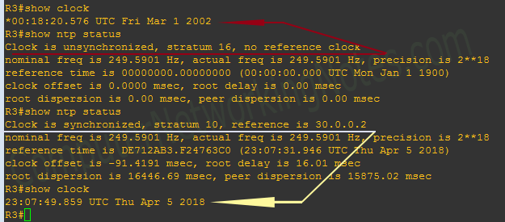

#### show ntp associations

Just like **show ntp status** command, this command also provides a lot of information. From this information again we only need to focus on first three columns; address, ref clock and st. Let’s understand these columns in detail

**address:-**

This is the address of NTP server from where this router received NTP updates. This column may contains two additional symbols; ***** and **~**. The ***** show NTP mode in which NTP server is working and **~** shows how NTP is getting time from NTP source.

**ref clock: -**
This is the NTP source from where NTP server received the time.
**st.:-**
This is the stratum level of NTP source.
Following figure shows the output of this command from all routers
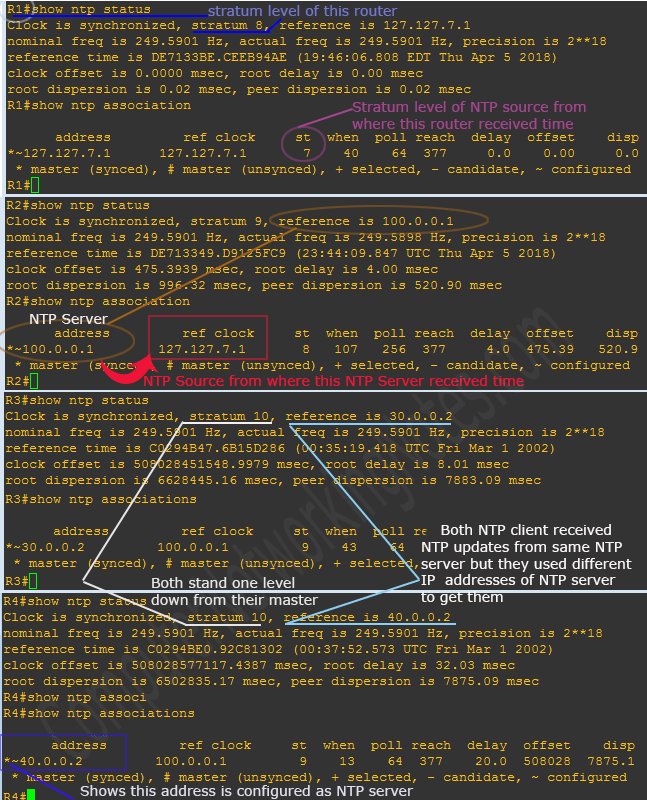

##### Practice for you

In this lab, we connected R1 and R2 with two serial links. Remove any one link. Run **show ntp status** and **show ntp association** commands again in all routers to view the difference.

Can you figure out why nothing changed in output?

If you don’t know the answer, relax and study this tutorial again. Answer of this question is already explained in tutorial. All you need to do is just pay a little bit extra attention while rereading this tutorial.

If you know the answer, congratulations you have learned NTP concepts and configuration.

That’s all for this tutorial. If have any query, suggestion or feedback regarding this tutorial, let me know. If you like tutorial, let others know by sharing it.

       

    By [ComputerNetworkingNotes](https://www.computernetworkingnotes.com/site/about.html)     Updated on 2019-01-20 06:42:28 IST

Advertisements

     [ComputerNetworkingNotes](https://www.computernetworkingnotes.com/)      [CCNA Study Guide](https://www.computernetworkingnotes.com/ccna-study-guide/)     How to Configure NTP in Cisco Router

[  How to Install GNS3 Step by Step Explained](https://www.computernetworkingnotes.com/ccna-study-guide/how-to-install-gns3-step-by-step-explained.html)

[Download Packet Tracer 7.3.0 and all Previous Versions](https://www.computernetworkingnotes.com/ccna-study-guide/download-packet-tracer-for-windows-and-linux.html)