IPv6 - Implementing and Routing

**Connected and Local IPv6 Routes**
**
**

The following list summarizes the rules about how routers create routes based on the configuration of an interface IPv6 unicast address, for easier review and study:

**1.** Routers create IPv6 routes based on each unicast IPv6 address on an interface, as configured with the ipv6 address command, as follows:

**A. **The router creates a route for the subnet (a connected route).

**B.** The router creates a host route (/128 prefix length) for the router IPv6 address (a local route).

**2.** Routers do not create routes based on the link-local addresses associated with the interface.

**3.** Routers remove the connected and local routes for an interface if the interface fails, and they re-add these routes when the interface is again in a working (up/up) state.

The concept of connected and local IPv6 routes works much like IPv4 routes.

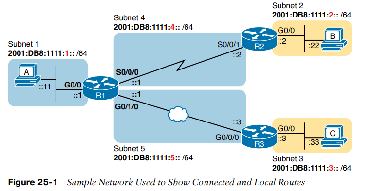

* * *

**Static IPv6 Routes**
**
**

While routers automatically add connected and local routes based on the interface configuration, static routes require direct configuration with the **ipv6 route** command.

The **ipv6 route **command follows the same general logic as does IPv4’s ip route command.

A static route on R1, for this subnet, will begin with **ipv6 route 2001:DB8:1111:2::/64**, followed by either the outgoing interface (**S0/0/0**) or the next-hop IPv6 address, or both.

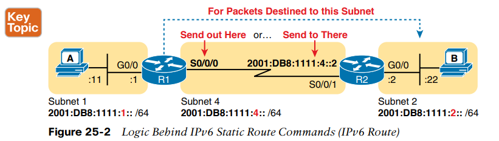

* * *

**Static Routes Using the Outgoing Interface**
**
**
When the command references an interface, the interface is a local interface.

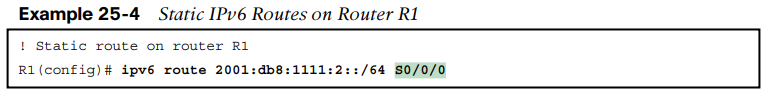

* * *

**Static Routes Using Next-Hop IPv6 Address **
**
**

With a point-to-point WAN link, the ipv6 route command can use the outgoing interface style of configuration Static IPv6 routes that refer to a next-hop address have two options: the unicast address on the neighboring router (global unicast or unique local) or the link-local address of that same neighboring router.

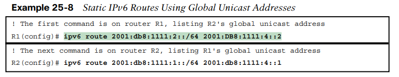

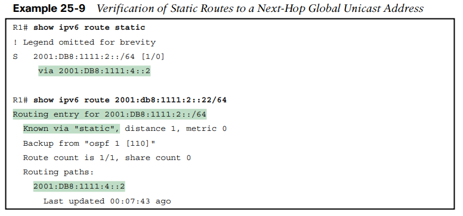

**Example Static Route with a Link-Local Next-Hop Address **
**
**

First, the **ipv6 route** command refers to a next-hop address, namely a link-local address. However, the command must also refer to the router’s local **outgoing interface**.

Because the link-local address does not, by itself, tell the local router which outgoing interface to use.

**
**
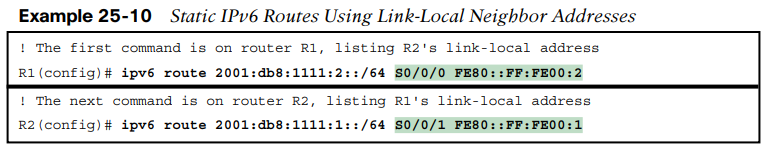
**
**
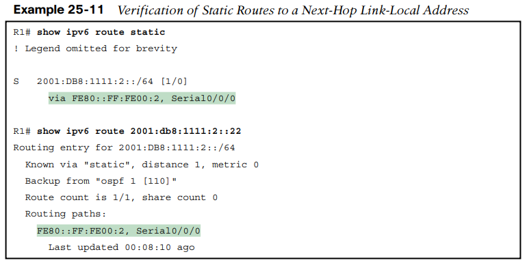
**
**

* * *

**Static Routes over Ethernet Links**
**
**

To configure a static route that uses an Ethernet interface, the ipv6 route command’s forwarding parameters should **always include a next-hop IPv6 address.** IOS allows you to configure the ipv6 route command using only the outgoing-interface parameter, without listing a next-hop address. The router will accept the command; however, if that outgoing interface happens to be an Ethernet interface, the router cannot successfully forward IPv6 packets using the route.

**
**

To configure the ipv6 route correctly when directing packets out an Ethernet interface, the configuration should use one of these styles:

■ Refer to the next-hop global unicast address (or unique local address) only

■ Refer to both the outgoing interface and next-hop global unicast address (or unique local address)

■ Refer to both the outgoing interface and next-hop link-local address
**
**

**
**

* * *

**
**
**
**
**Static Default Routes **

IPv6 supports a default route concept, similar to IPv4.

The default route tells the router what to do with an IPv6 packet when the packet matches no other IPv6 route.

The logic is pretty basic:

■ With no default route, the router discards the IPv6 packet.

■ With a default route, the router forwards the IPv6 packet based on the default route.

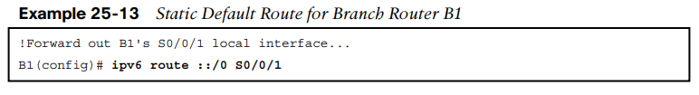

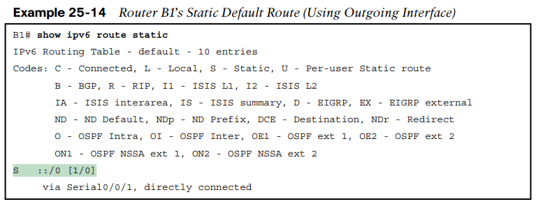

**
**

* * *

**
**
**
**
**Static IPv6 Host Routes**
**
**

Both IPv4 and IPv6 allow the definition of static host routes—that is, a route to a single host IP address.

With IPv4, those routes use a /32 mask, which identifies a single IPv4 address in the ip route command; with IPv6, a /128 mask identifies that single host in the ipv6 route command.

**
**
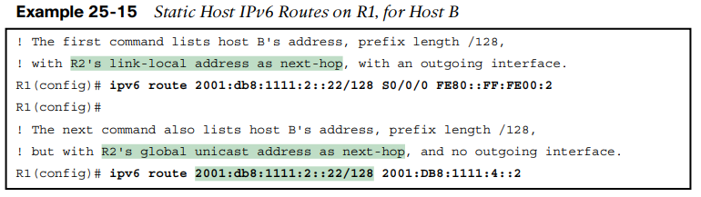
**
**

* * *

**
**
**
**
**Floating Static Routes**
**
**

To implement an IPv6 floating static route, just override the default administrative distance on the static route, making the value larger than the default administrative distance of the routing protocol.

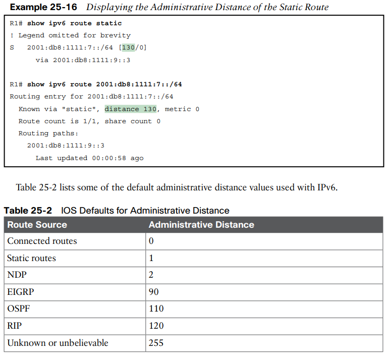

* * *