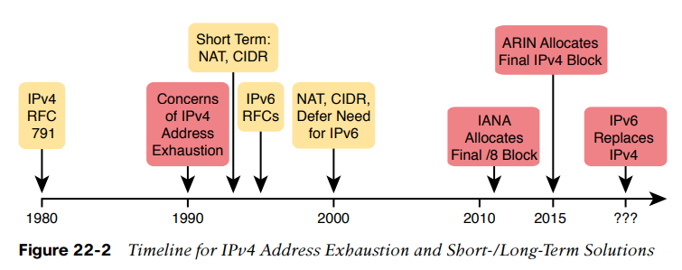
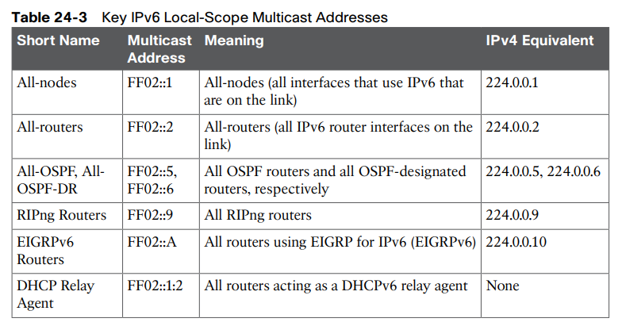

IPv6 - Theory

* * *

**History**
IP version 6 (IPv6) serves as the replacement protocol for IP version 4 (IPv4).

The incredible growth of the Internet over a fairly long time created a big problem for public IPv4 addresses: the world was running out of addresses

At that point in 2011, each of the five **RIRs **still had public addresses to allocate or assign. However, that same year, **APNIC** (Asia Pacific) became the first **RIR** to exhaust its available IPv4 address allocation. In late 2015, **ARIN** (North America) announced that it had exhausted its supply. When we were revising this chapter in 2019, **IANA** considered all RIRs except **AFRINIC **to have exhausted their supply of IPv4 addresses, with **AFRINIC** expected to run out of IPv4 address during the year 2019. These events are significant in that the day has finally come in which new companies can attempt to connect to the Internet, but they can no longer simply use IPv4, ignoring IPv6. Their only option will be IPv6 because **IPv4 has no public addresses left.**

The IETF came up with several short-term solutions to make IPv4 addresses last longer, and one long-term solution: IPv6. However, several other tools like Network Address Translation (NAT) and classless interdomain routing (**CIDR**) helped extend IPv4’s life another couple of decades.

However, because IPv6 impacts so many other functions in a TCP/IP network, many more RFCs must define details of IPv6. Some other RFCs define how to migrate from IPv4 to IPv6. Others define new versions of familiar protocols or replace old protocols with new ones. For example:

**Older OSPF Version 2 Upgraded to OSPF Version 3:** The older Open Shortest Path First (OSPF) version 2 works for IPv4, but not for IPv6, so a newer version, **OSPF version 3**, was created to support IPv6. (Note: OSPFv3 was later upgraded to support advertising both IPv4 and IPv6 routes.)

**ICMP Upgraded to ICMP Version 6:** Internet Control Message Protocol (**ICMP**) worked well with IPv4 but needed to be changed to support IPv6. The new name is** ICMPv6. **

**ARP Replaced by Neighbor Discovery Protocol: **For IPv4, Address Resolution Protocol (**ARP**) discovers the MAC address used by neighbors. IPv6 replaces ARP with a more general Neighbor Discovery Protocol (**NDP**).

* * *

**IPV6 Routing**
**
**

As with many functions of IPv6, IPv6 routing looks just like IPv4 routing from a general perspective, with the differences being clear only once you look at the specifics. Keeping the discussion general for now, IPv6 uses these ideas the same way as IPv4:

■ To be able to build and send IPv6 packets out an interface, end-user devices need an IPv6 address on that interface.

■ End-user hosts need to know the IPv6 address of a default router, to which the host sends IPv6 packets if the host is in a different subnet.

■ IPv6 routers de-encapsulate and re-encapsulate each IPv6 packet when routing the packet.

■ IPv6 routers make routing decisions by comparing the IPv6 packet’s destination address to the router’s IPv6 routing table; the matched route lists directions of where to send the IPv6 packet next.

When a router like R1 de-encapsulates the packet from the data-link frame, it must also decide what type of packet sits inside the frame. To do so, the router must look at a protocol type field in the data-link header, which identifies the type of packet inside the data-link frame.

To route an IPv6 packet, a router must use its IPv6 routing table instead of the IPv4 routing table.

Finally, in most enterprise networks, the routers will route both IPv4 and IPv6 packets at the same time.

None of the IPv4 routing protocols could be used to advertise IPv6 routes originally. They all required some kind of update to add messages, protocols, and rules to support IPv6.

In addition, these routing protocols also follow the same interior gateway protocol (**IGP**) and exterior gateway protocol (**EGP**) conventions as their IPv4 cousins.

* * *

**IPV6 Addressing Formats**

To make it more readable, IPv6 uses a format with eight sets of four hex digits, with each set of four digits separated by a colon.

For example:

**2340:1111:AAAA:0001:1234:5678:9ABC:1234**

**Abbreviating IPv6 Addresses **
**
**

Two basic rules let you, or any computer, shorten or abbreviate an IPv6 address:

1.     Inside each quartet of four hex digits, remove the leading 0s (0s on the left side of the quartet) in the three positions on the left. (Note: at this step, a quartet of 0000 will leave a single 0.)

2.     Find any string of two or more consecutive quartets of all hex 0s, and replace that set of quartets with a double colon (::). The :: means “two or more quartets of all 0s.” However, you can use ::         only

**Example**
**
**

**FE00:0000:0000:0001:0000:0000:0000:0056 **become **FE00:0:0:1:0:0:0:56 **by applying the first rule, then become **FE00:0:0:1::56 **by applying the second rule.

**IPV6 Prefix**

Each IPv6 prefix, or subnet if you prefer, has a number that represents the group. Per the IPv6 RFCs, the number itself is also called the prefix, but many people just call it a subnet number or subnet ID, using the same terms as IPv4.

* * *

**Global Unicast Addressing Concepts**

In the history of IPv4 addressing, the world started out with a plan that gave every single host a globally unique public IPv4 address. However, as discussed in several places already, the IPv4 address space had too few addresses. So, in the 1990s, companies started using addresses from the private IPv4 address range, as defined in **RFC 1918.**

IPv6 allows two similar options of public and private unicast addressing, beginning with global unicast addresses as the public IPv6 address space. Similar to public IPv4 addresses, IPv6 global unicast addresses rely on an administrative process that assigns each company a unique IPv6 address block. Each company then subnets this IPv6 address block and only uses addresses from within that block. The result: that company uses addresses that are unique across the globe as well.

The second IPv6 option uses unique local IPv6 addresses, which work more like the IPv4 private addresses. Companies that do not plan to connect to the Internet and companies that plan to use IPv6 NAT can use these private unique local addresses. The process also works similarly to IPv4: The engineer can read the details in an RFC, pick some numbers, and start assigning IPv6 addresses without having to register with IANA or any other authority.

**Global unicast:** Addresses that work like public IPv4 addresses. The organization that needs IPv6 addresses asks for a registered IPv6 address block, which is assigned as a global routing prefix. After that, only that organization uses the addresses inside that block of addresses—that is, the addresses that begin with the assigned prefix.

**Unique local:** Works somewhat like private IPv4 addresses, with the possibility that multiple organizations use the exact same addresses, and with no requirement for registering with any numbering authority.

**The IPv6 Global Routing Prefix **

A reserved block of IPv6 addresses—a set of addresses that only one company can use— is called a global routing prefix.

The term global routing prefix might not make you think of a block of IPv6 addresses at first. The term actually refers to the idea that Internet routers can have one route that refers to all the addresses inside the address block.

Both the IPv6 and IPv4 address assignment processes rely on the same organizations: **IANA** (along with **ICANN**), the Regional Internet Registries (**RIR**), and **ISPs.**

**Address Ranges for Global Unicast Addresses **

Originally, IANA reserved all IPv6 addresses that begin with hex 2 or 3 as global unicast addresses. (This address range can be written succinctly as prefix 2000::/3.)

IANA does not assign prefixes from all over the address range.

**IPV6 Subnetting Using Global Unicast Addresses**

Subnetting IPv6 addresses works generally like IPv4, but with mostly simpler math (hoorah!).

Because of the absolutely large number of addresses available, most everyone uses the easiest possible IPv6 prefix length: **/64.**

IPv6 uses a similar concept than IPV4, with the details in Figure 23-6. The structure shows three major parts, beginning with the global routing prefix, which is the initial value that must be the same in all IPv6 addresses inside the enterprise. The address ends with the interface ID, which acts like the IPv4 host field. The subnet field sits between the two other fields, used as a way to number and identify subnets, much like the subnet field in IPv4 addresses.

First, just think about the general idea with IPv6, comparing Figure 23-6 to Figure 23-5. The IPv6 global routing prefix (the prefix/length assigned by the RIR or ISP) acts like the IPv4 network part of the address structure. The IPv6 subnet part acts like the IPv4 subnet part. And the right side of the IPv6, formally called the interface ID (short for interface identifier), acts like the IPv4 host field.

When a company applies to an ISP, RIR, or any other organization that can assign a global routing prefix, that assignment includes both the prefix and the prefix length. After a company receives a global routing prefix and that prefix length, the length of the prefix typically does not change over time and is basically locked. (Note that the prefix length of the global routing prefix is often between **/32 and /48**, or possibly as long as** /56.**

To find all the subnet IDs, you simply need to find all the unique values that will fit inside the subnet part of the IPv6 address, basically following these rules:

■ All subnet IDs begin with the global routing prefix.
■ Use a different value in the subnet field to identify each different subnet.
■ All subnet IDs have all 0s in the interface ID.

* * *

**Unique Local Unicast Addresses**

Unique local unicast addresses act as private IPv6 addresses. These addresses have many similarities with global unicast addresses, particularly in how to subnet.

The biggest difference lies in the literal number (unique local addresses begin with hex FD) and with the administrative process: the unique local prefixes are not registered with any numbering authority and can be used by multiple organizations.

Given freedom to choose, most people would pick an easy-to-remember, short-to-type prefix, like FD00:1:1::/48. And in a lab or other small network used for testing, making up an easy-to-use number is reasonable. However, for use in real corporate networks, you should not just make up any global ID you like; you should try **to follow the unique local address rules** that strive to help make your addresses unique in the universe—even without registering a prefix with an **ISP **or **RIR**.

**RFC 4193** defines unique local addresses, and that RFC stresses the importance of choosing your global ID in a way to make it statistically unlikely to be used by other companies. What is the result of unique global IDs at every company? Making all these unique local addresses unique across the globe. So, if you do plan on using unique local addresses in a real network, plan on using the random number generator logic listed in **RFC 4193 to create your prefix.**

* * *

**Implementing Unicast IPv6 Addresses on Routers **

One way to add IPv6 support to an established IPv4-based enterprise internetwork is to implement a dual-stack strategy. To do so, the routers can be configured to route IPv6 packets, with IPv6 addresses on their interfaces, with a similar model to how routers support IPv4.

Cisco routers give us two options for static configuration of IPv6 addresses. In one case, you configure the full 128-bit address, while in the other, you configure a 64-bit prefix and let the router derive the second half of the address (the interface ID).

**Configuring the Full 128-Bit Address **
**
**

To statically configure the full 128-bit unicast address—either global unicast or unique local—the router needs an ipv6 address address/prefix-length interface subcommand on each interface.

* * *

**Enabling IPv6 Routing **

To activate IPV6 routing on router
-> ipv6 address on each interfaces
-> **ipv6 unicast-routing **in global configuration mode.

IPv6 uses many show commands that mimic the syntax of IPv4 show commands. For example:

■ The **show ipv6 interface brief **command gives you interface IPv6 address info, but not prefix length info, similar to the IPv4 show ip interface brief command.

■ The **show ipv6 interface **command gives the details of IPv6 interface settings, much like the show ip interface command does for IPv4.

Beyond the IPv6 addresses on the interfaces, the router also adds IPv6 connected routes to the IPv6 routing table off each interface. Just as with IPv4, the router keeps these connected routes in the IPv6 routing table only when the interface is in a working (up/up) state. But if the interface has an IPv6 unicast address configured, and the interface is working, the router adds the connected routes. Example 24-4 shows the connected IPv6 on Router R1 from Figure 24-3.

* * *

**Dynamic Unicast Address Configuration**

Routers can be configured to use dynamically learned IPv6 addresses. These can be useful for routers connecting to the Internet through some types of Internet access technologies, like DSL and cable modems. Cisco routers support two ways for the router interface to dynamically learn an IPv6 address to use:

■ **Stateful **DHCP
■ **Stateless **Address Auto configuration (**SLAAC**)

Both methods use the familiar ipv6 address command.

**Statefull DHCPv6 **
Works exactly like a DHCPv4 network.

**Stateless DHCPv6 (Slaac)**

Use **NDP **(Neighbors discovery protocol) to gather information on the network. We can have information from the routers. Like the dns servers, the gateway etc...

* * *

**Special Addresses Used by Routers**
**
**

IPv6 configuration on a router begins with the simple steps discussed in the first part of this chapter. After you configure the ipv6 unicast-routing global configuration command, to enable the function of IPv6 routing, the addition of a unicast IPv6 address on an interface causes the router to do the following:

■ Gives the interface a unicast IPv6 address
■ Enables the routing of IPv6 packets in/out that interface
■ Defines the IPv6 prefix (subnet) that exists off that interface

■ Tells the router to add a connected IPv6 route for that prefix, to the IPv6 routing table, when that interface is up/up

NOTE In fact, if you pause and look at the list again, the same ideas happen for IPv4 when you configure an IPv4 address on a router interface.

While all the IPv6 features in this list work much like similar features in IPv4, IPv6 also has a **number of additional functions not seen in IPv4**. Often, these additional functions use other IPv6 addresses, many of which are multicast addresses.

* * *

**Link-Local Addresses **

IPv6 uses link-local addresses as a special kind of unicast IPv6 address. These addresses are not used for normal IPv6 packet flows that contain data for applications. Instead, these addresses are used by some overhead protocols and for routing.

Always start with **FE80** -> FE80::/10
Equivalent to **APIPA **(169....).

These addresses are only available on the network segment and they can't be routed on other segments.

IOS creates a link-local address for any interface that has configured at least one other unicast address using the ipv6 address command (global unicast or unique local).

***
***

***
***

**ipv6 enable**: Enables IPv6 processing and adds a link-local address, but adds no other unicast IPv6 addresses

In short, creating a WAN link with no global unicast (or unique local) addresses works. As a result, you would not even need to assign an IPv6 subnet to each WAN link. Then to configure the WAN interfaces, use the ipv6 enable command, enabling IPv6 and giving each interface a generated link-local IPv6 address.

***
***
***
***

* * *

**IPV6 Multicast Addresses**

IPv6 uses multicast IPv6 addresses for several purposes.

While useful, the IPv4 approach of IPv4 broadcast and LAN broadcast requires every host in the VLAN to process the broadcast frame, even if only one other device needed to think about the message. Also, each host has to process the frame, then packet, read the type of message, and so on, before ignoring the task. For example, an IPv4 ARP Request—an IPv4 and LAN broadcast—requires a host to process the Ethernet, IP, and ARP details of the message before deciding whether to reply or not.

IPv6, instead of using Layer 3 and Layer 2 broadcasts, instead uses Layer 3 multicast addresses, which in turn cause Ethernet frames to use Ethernet multicast addresses. As a result:

■ All the hosts that should receive the message receive the message, which is necessary for the protocols to work. However…

■ …Hosts that do not need to process the message can make that choice with much less processing as compared to IPv4.

Well known multicast addresses:

- FF02::1 All **nodes **in the link-local scope
- FF02::2 All **routers **in the link-local scope
- FF02::5 All **OSPF**  **routers**
- FF02::6 All **OSPF DR**
- FF02::9 **RIP**
- FF02::A **EIGRP**

**Multicast Address Scopes**

IPv6 RFC 4291 defines IPv6 addressing including the ideas of IPv6 address scope.

For instance, the link-local address on an interface—a unicast IPv6 address—but with a link-local scope. The scope definition called “link-local” dictates that packets sent to a link-local unicast address should remain on the link and not be forwarded by any router.

Finally, the term link-local has a couple of common uses in IPv6 and can be confusing as a result. The following descriptions should clarify the different uses of the term:

**Link-local address:** An IPv6 address that begins FE80. This serves as a unicast address for an interface to which devices apply a link-local scope. Devices often create their own link local addresses using EUI-64 rules. A more complete term for comparison would be link local unicast address.

**Link-local multicast address: **An IPv6 address that begins with FF02. This serves as a reserved multicast address to which devices apply a link-local scope.

**Link-local scope:** A reference to the scope itself, rather than an address. This scope defines that routers should not forward packets sent to an address in this scope.

* * *

**Solicited-Node Multicast Addresses **

IPv6 Neighbor Discovery Protocol (NDP) replaces IPv4 ARP.

NDP improves the MAC-discovery process by sending IPv6 multicast packets that can be processed by the correct host but discarded with less processing by the rest of the hosts in the subnet. The process uses the solicited-node multicast address associated with the unicast IPv6 address.

Figure 24-12 shows how to determine the solicited node multicast address associated with a unicast address. Start with the predefined **/104 prefix (26 hex digits)** shown in Figure 24-12. In other words, all the solicited-node multicast addresses begin with the abbreviated** FF02::1:FF**. In the last 24 bits (6 hex digits), copy the last 6 hex digits of the unicast address into the solicited-node address.

Note that a host or router calculates a matching solicited node multicast address for every unicast address on an interface.

* * *

**Miscellaneous IPv6 Addresses**

First, all IPv6 hosts can use two additional special addresses:

■ The unknown (unspecified) IPv6 address, ::, or all 0s
■ The loopback IPv6 address, ::1, or 127 binary 0s with a single 1

The IPv6 loopback address gives each IPv6 host a way to test its own protocol stack. Just like the IPv4 127.0.0.1 loopback address, packets sent to ::1 do not leave the host but are instead simply delivered down the stack to IPv6 and back up the stack to the application on the local host.

* * *

**Anycast Addresses**

**Anycast** communication -> One to nearest

**Step 1.**     Two routers configure the exact same IPv6 address, designated as an anycast address, to support some service.

**Step 2.**     In the future, when any router receives a packet for that anycast address, the other routers simply route the packet to the nearest router that supports the address.

To make this anycast process work, the routers implementing the anycast address must be configured and then advertise a route for the anycast address. The addresses do not come from a special reserved range of addresses; instead, they are from the unicast address range. Often, the address is configured with a /128 prefix so that the routers advertise a host route for that one anycast address. At that point, the routing protocol advertises the route just like any other IPv6 route; the other routers cannot tell the difference.

* * *

**NDP Neighbor Discovery Protocol**
**
**

Similar to ICMP but with more functionalities. ARP mechanism is integrated directly into it. Routers play a big role in NDP mechanisms.

- **Neighbor MAC Discovery:** An IPv6 LAN-based host will need to learn the MAC address of other hosts in the same subnet. NDP replaces IPv4’s ARP, providing messages that replace the ARP Request and Reply messages.
- **Router Discovery:** Hosts learn the IPv6 addresses of the available IPv6 routers in the same subnet.
- **SLAAC: **When using Stateless Address Auto Configuration (SLAAC), the host uses NDP messages to learn the subnet (prefix) used on the link plus the prefix length.
- **DAD: **Before using an IPv6 address, hosts use NDP to perform a Duplicate Address Detection (DAD) process, to ensure no other host uses the same IPv6 address before attempting to use it.

**NS and NA**

The process of sending the NS and NA messages follows the same general process with IPv4 ARP: the NS message asks for information, and the NA supplies the information, as summarized in this list:

**Neighbor Solicitation (NS):** This message asks the host with a particular IPv6 address (the target address) to reply with an NA message that lists its MAC address. The NS message is sent to the solicited-node multicast address associated with the target address, so the message is processed only by hosts whose last six hex digits match the address that is being queried.

**Neighbor Advertisement (NA):** This message lists the sender’s IPv6 and MAC addresses. It can be sent in reply to an NS message, and if so, the packet is sent to the IPv6 unicast address of the host that sent the original NS message. A host can also send an unsolicited NA, announcing its IPv6 and MAC addresses, in which case the message is sent to the all IPv6-hosts local-scope multicast address FF02::1.

*Show ipv6 neighbors*

**RS and RA**

IPv6 uses the same concept of a default gateway, but it improves the method for hosts to learn the identity of possible default gateways using NDP. NDP defines two messages that allow any host to discover all routers in the subnet:

**Router Solicitation (RS):** This message is sent to the “all-IPv6-routers” local-scope multicast address of FF02::2 so that the message asks all routers, on the local link only, to identify themselves.

**Router Advertisement (RA):** This message, sent by the router, lists many facts, including the link-local IPv6 address of the router. When sent in response to an RS message, it flows back to either the unicast address of the host that sent the RS or to the all-IPv6-hosts address FF02::1. Routers also send RA messages without being asked, sent to the all-IPv6- hosts local-scope multicast address of FF02::1.

* * *

**Summary**

* * *

**On the fly**
**
**
**Loopback addresses**
Equivalent to 127.0.0.1 -> ::1.

**Unspecified addresses**
Every bits to 0 -> ::

Used for a client's source address when sending a neighbor solicitation message.

Used for a client's source address when sending a router solicitation message.

**IPV6 Solicited-Node Multicast**
Always start with **FF02::1:FF/104**
**
**

- Replace the broadcast address on the network.
- Ends with the last 24 bits of the corresponding IPv6 address
- Also used for Duplicate Address Detection (**DAD**)

**EUI-64 Extended Unique Identifier**
Use for generate the host portion of a link local address.

Based on the MAC address of the host.

- Mac address: 0015.2BE4.9B60
- Split the MAC in two parts: 0015.2B and E4.9B60
- Insert FFFE in between the two parts -> 0015.2BFF.FEE4.9B60
- Convert the two first hex decimal number into decimals -> 0000 0000
- Flip the seventh bits -> 0000 0010
- Convert it back to hex -> 02
- Add the link local prefix to the host portion -> FE80
- The final address is -> FE80::0215.2BFF.FEE4.9B60

**!!!** We can assign multiple ipv6 addresses to a single interface.

**Shortened addresses**
2000:0000:0000:1234:0000:0000:000B -> 2000:0:0:1234::B

When configuring a static route on a router.

If the next hop address is a link local address of the neighbor router. Then we need to specified the outgoing interface in the command because the router is not able to tell which interface to use. Otherwise we need to use the global unicast address.

-> ipv6 route 2001:db8:1111:2::/64 s0/0/0 FE80::FF:FE00:2

If the network is an Ethernet segment. The ipv6 route command should always refer to the next hop address otherwise the route won't work properly.

Default route in ipv6 -> ipv6 route ::/0 s0/0/1

Floating static route is static route that we configure with an higher administrative distance. This way, the router can still choose a route dynamically learned via ospf or eigrp and use the static route as backup line.

-> ipv6 route 2001:db8:1111:7::/64 2001:db8:1111:9::3 ***130***