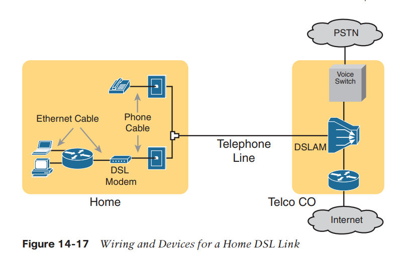
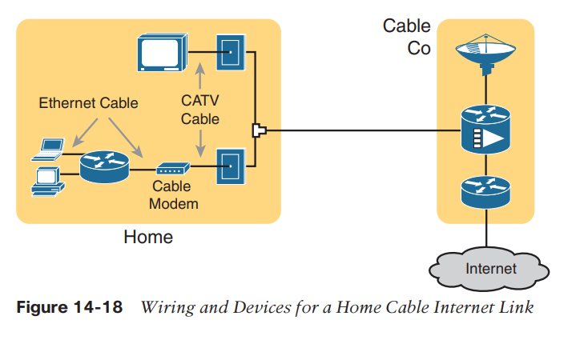

Internet connections

**Digital Subscriber Line (DSL)**
**
**

**Cable Internet**

**Wireless WAN (3G, 4G, LTE, 5G)**
**
**

Mobile phones use radio waves to communicate through a nearby mobile phone tower.

**Wireless Internet:** This general term refers to Internet services from a mobile phone or from any device that uses the same technology.

**3G/4G Wireless:** Short for third generation and fourth generation, these terms refer to the major changes over time to the mobile phone companies’ wireless networks.

**LTE:** Long-Term Evolution is a newer and faster technology considered to be part of fourth generation (4G) technology.

**5G Wireless: **This is the fifth major generation of wireless phone technology.