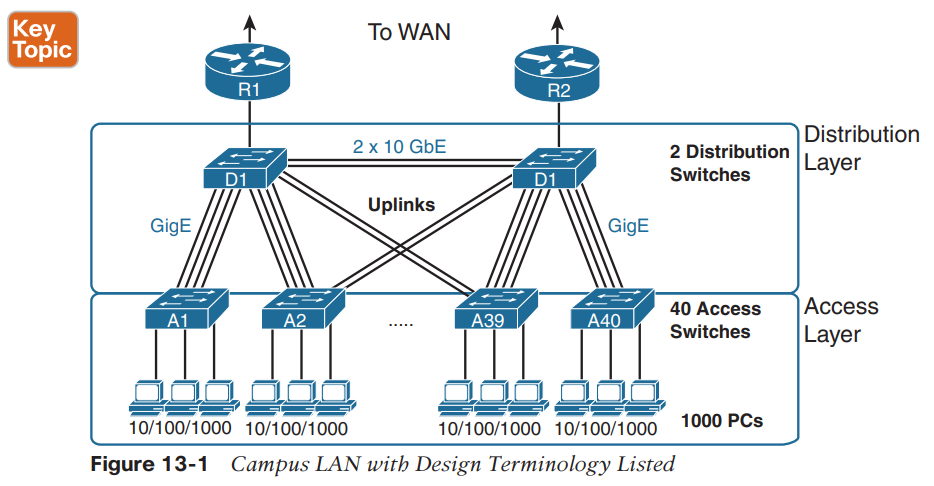
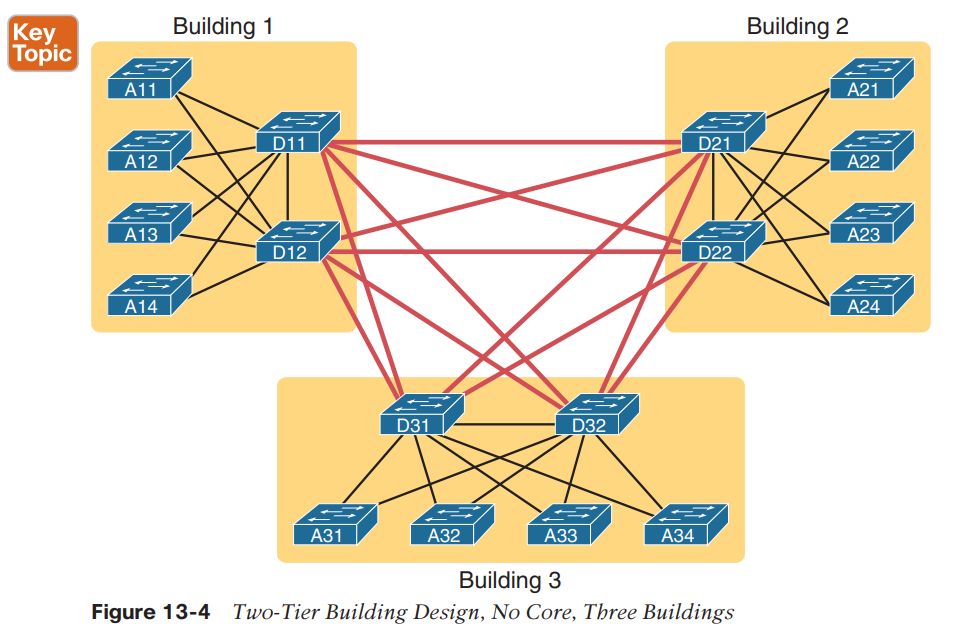
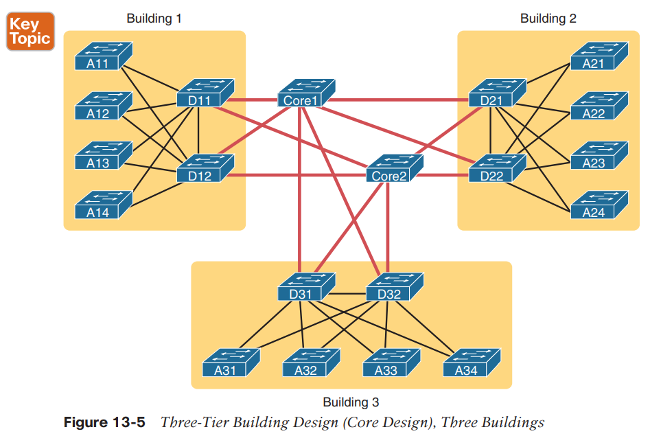

Lan Topologies

**Campus:** The term campus LAN refers to the LAN created to support the devices in a building or in multiple buildings in somewhat close proximity to one another.

Cisco uses three terms to describe the role of each switch in a campus design: **access, distribution, and core.**

Access switches connect directly to end users.

Distribution switches provide a path through which the access switches can forward traffic to each other.

By design, each of the access switches connects to at least one distribution switch, typically to two distribution switches for redundancy.

Most designs use at least two uplinks to two different distribution switches (as shown in Figure 13-1) for redundancy.

By design, none of the access layer switches connect to each other.

**Star**: A design in which one central device connects to several others, so that if you drew the links out in all directions, the design would look like a star with light shining in all directions.

**Full mesh**: For any set of network nodes, a design that connects a link between each pair of nodes.

**Partial mesh**: For any set of network nodes, a design that connects a link between some pairs of nodes, but not all. In other words, a mesh that is not a full mesh.

**Hybrid**: A design that combines topology design concepts into a larger (typically more complex) design.

**The Two-Tier Campus Design **

The distribution layer creates a partial mesh.

**Three-Tier Campus Design (Core) **

It also goes by two common names: a two-tier design (for obvious reasons) and a collapsed core.

The design in Figure 13-4 works well, and many companies use this design.

However, a design with a third tier (a core tier) saves on switch ports and on cables in larger designs.

The following list summarizes the terms that describe the roles of campus switches:

■ **Access**: Provides a connection point (access) for end-user devices. Does not forward frames between two other access switches under normal circumstances.

■ **Distribution**: Provides an aggregation point for access switches, providing connectivity to the rest of the devices in the LAN, forwarding frames between switches,

but not connecting directly to end-user devices.

■ **Core**: Aggregates distribution switches in very large campus LANs, providing very high forwarding rates for the larger volume of traffic due to the size of the network.

The combinations of an access switch and its access links is often called a star topology.