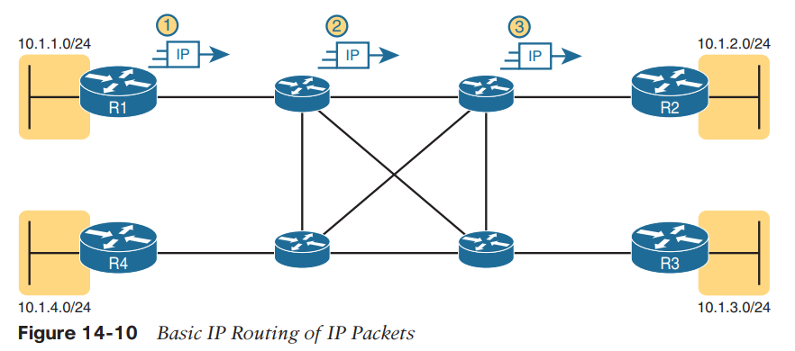
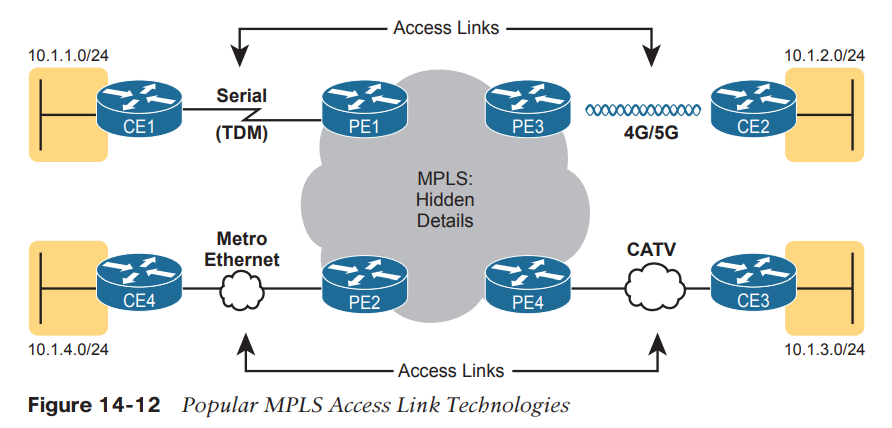
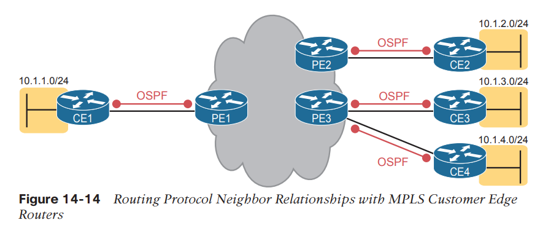
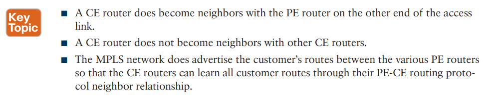
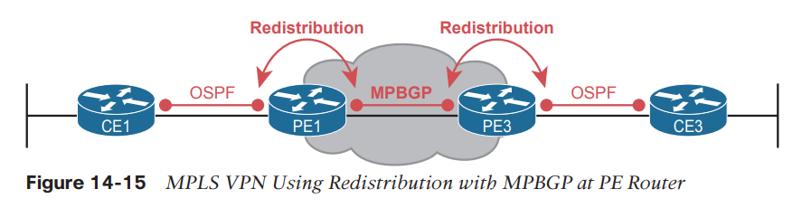
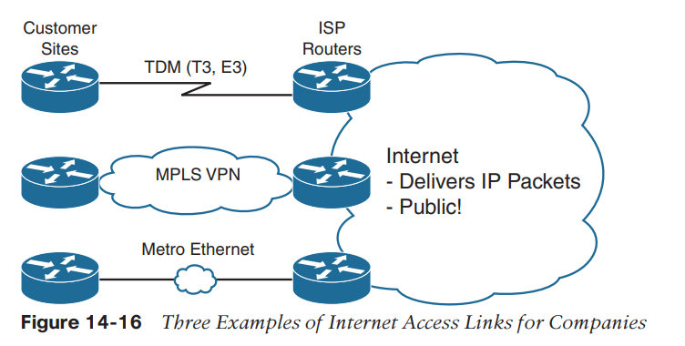

MPLS (Multi Protocol Label Switching)

MPLS creates a WAN service that routes IP packets between customer sites.

The customer can then connect to the MPLS network, with a link from each site, with the SP routing IP packets from one customer site to the other.

The middle four routers could represent the SP’s MPLS network, with the numbered routers on the edges being routers owned by one company.

However, an SP cannot just build a large IP network and connect all its customers to that same IP network because of some issues that arise to support multiple customers at the same time.

To overcome this and other issues, the SP builds its IP network to also use Multiprotocol Label Switching (MPLS), in particular MPLS VPNs. MPLS VPNs allow the SP to build one large MPLS network, which also creates a private IP-based WAN for each of its customers.

The devices in an MPLS network use label switching and not IP forwarding decisions.

**SP’s MPLS VPN network **
**
**

■ Will use a routing protocol to build routing protocol neighbor relationships with customer routers

■ Will learn customer subnets/routes with those routing protocols

■ Will advertise a customer’s routes with a routing protocol so that all routers that customer connects to the MPLS VPN can learn all routes as advertised through the MPLS VPN network

■ Will make decisions about MPLS VPN forwarding, including what MPLS labels to add and remove, based on the customer’s IP address space and customer IP routes

MPLS provides a Layer 3 service in that it promises to forward Layer 3 packets (IPv4 and IPv6). To support that service, MPLS SPs typically use routers at the edge of the MPLS networks because routers provide the function of forwarding Layer 3 packets.

**Customer edge (CE) **is typically a router, and it sits at a customer site

**Provider edge (PE) **sit at the edge of the SP’s network, on the other end of the access link.

The fact that MPLS acts as a Layer 3 service, discarding incoming data-link headers, means that any data-link protocol could in theory be used on MPLS access links. In reality, MPLS does support many types of access links, as shown in Figure 14-12.

**Layer 3 with MPLS VPN**
**
**
As a Layer 3 service, MPLS must be aware of the customer IP addressing.

The SP will even use routing protocols and advertise those customer routes across the WAN.

To advertise the customer routes between the PE routers, the PE routers use another routing protocol along with a process called route redistribution.

MPBGP can advertise routes from multiple customers while keeping the routes logically separated.

