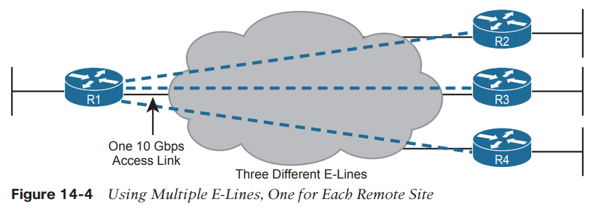

Metro Ethernet (MetroE)

The main concept makes a Metro Ethernet service act like a big LAN switch.

MetroE provides a Layer 2 service by forwarding Layer 2 Ethernet frames. To do that, the SP often uses Ethernet switches at the edge of its network. Those switches are configured to do more than what you learn about Ethernet LAN switches for CCNA, but a LAN switch’s most fundamental job is to forward an Ethernet frame, so it makes sense for MetroE to use an Ethernet switch at the edge of the SP’s MetroE network.

From an enterprise perspective, to use a Metro Ethernet service, each site needs to connect to the service with (at least) one Ethernet link. There is no need to connect each enterprise router to each other enterprise router directly with a physical link.

From the SP perspective, the SP needs to build a network to create the Metro Ethernet service.

To keep costs lower the SP puts a device (typically an Ethernet switch) physically near to as many customer sites as possible, in an SP facility called a point of presence (PoP).

The physical link between the customer and the SP is called an **access link** or, when using Ethernet specifically, an **Ethernet access link.**

Everything that happens on that link falls within the definition of the **user network interface**, or **UNI**.

**MEF **(**www.mef.net**) defines the standards for Metro Ethernet, including the specifications for different kinds of MetroE services.

**The Ethernet Line Service**, or E-Line, is the simplest of the Metro Ethernet services. The customer connects two sites with access links. Then the **MetroE** service allows the two customer devices to send Ethernet frames to each other.

■ The routers would use physical Ethernet interfaces.
■ The routers would configure IP addresses in the same subnet as each other.
■ Their routing protocols would become neighbors and exchange routes.

By definition, an **E-Line service** (as shown in Figure 14-4) creates a point-to-point **EVC(Ethernet Virtual Connection)**, meaning that the service allows two endpoints to communicate.

**Ethernet LAN Service (Full Mesh) **

One E-LAN service allows all devices connected to that service to send Ethernet frames directly to every other device, just as if the Ethernet WAN service were one big Ethernet switch.

An E-LAN service connects the sites in a full mesh.

**
**
**Layer 3 design with E-Line Service**

Every E-Line uses a point-to-point topology. As a result, the two routers on the ends of an E-Line need to be in the same subnet.

**Layer 3 design with E-LAN Services**

All edges routers share the same subnet.

