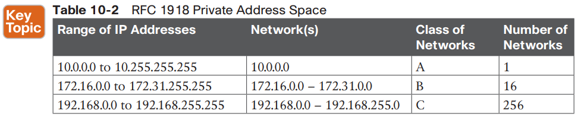
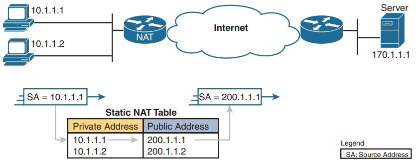
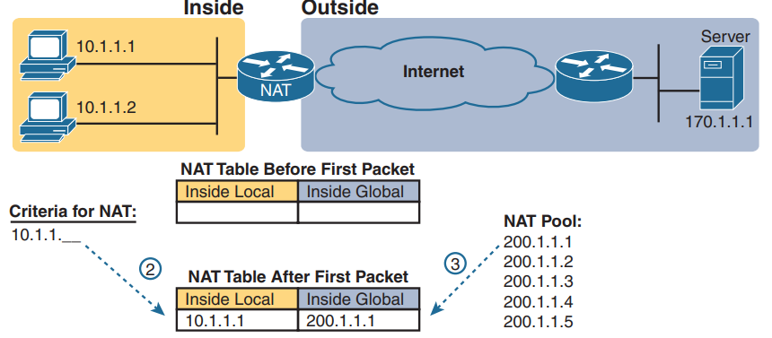
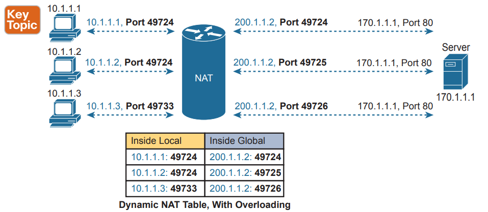

# NAT
## CIDR
First, CIDR defines a way to assign public IP addresses, worldwide, to allow route aggregation or route summarization. These route summaries greatly reduce the size of routing tables in Internet routers.

The second major CIDR feature allows RIRs and ISPs to reduce waste by assigning a subset of a classful network to a single customer. For example, imagine that ISP1’s customer A needs only 10 IP addresses and that customer C needs 25 IP addresses. ISP1 does something like this:

■ Assign customer A CIDR block 198.8.3.16/28, with 14 assignable addresses (198.8.3.17 to 198.8.3.30).

■ Assign customer B CIDR block 198.8.3.32/27, with 30 assignable addresses (198.8.3.33 to 198.8.3.62).

## Private addressing

## Network address translation concepts
### Static NAT

With static NAT, the NAT router simply configures a one-to-one mapping between the private address and the registered address that is used on its behalf.

Supporting a second IP host with static NAT requires a second static one-to-one mapping using a second IP address in the public address range.

Using NAT terminology, the enterprise network that uses private addresses, and therefore needs NAT, is the “inside” part of the network. The Internet side of the NAT function is the “outside” part of the network.

Cisco calls the private IP address used in the `inside network` the inside local address and the address used to represent the host to the rest of the Internet the `inside global address`.

- Use the ip nat inside command in interface configuration mode to configure interfaces to be in the `inside part` of the NAT design.

		ip nat inside

- Use the `ip nat outside` command in interface configuration mode to configure interfaces to be in the outside part of the NAT design.

		ip nat oustside

- Use the `ip nat inside source static inside-local inside-global` command in global configuration mode to configure the static mappings.

		ip nat inside source static inside-local inside-global

		Show ip nat statistics

### Dynamic NAT

The mapping of an inside local address to an inside global address happens dynamically.
Dynamic NAT sets up a pool of possible inside global addresses and defines matching criteria to determine which inside local IP addresses should be translated with NAT.

The dynamic entry stays in the table as long as traffic flows occasionally. You can configure a timeout value that defines how long the router should wait, having not translated any packets with that address, before removing the dynamic entry. You can also manually clear the dynamic entries from the table using the `clear ip nat translation` command.

	clear ip nat translation

Essentially, the inside global pool of addresses needs to be as large as the maximum number of concurrent hosts that need to use the Internet at the same time unless you use `PAT`.

- Use the `ip nat inside` command in interface configuration mode to configure interfaces to be in the inside part of the NAT design (just like with static NAT).

		ip nat inside

- Use the `ip nat outside` command in interface configuration mode to configure interfaces to be in the outside part of the NAT design (just like with static NAT).

		ip nat outside

- Configure an ACL that matches the packets entering inside interfaces for which NAT should be performed.
- Use the `ip nat pool name first-address last-address netmask subnet-mask` command in global configuration mode to configure the pool of public registered IP addresses.

		ip nat pool name first-address last-address netmask subnet-mask

- Use the `ip nat inside source list acl-number pool pool-name` command in global configuration mode to enable dynamic NAT.

		ip nat inside source list acl-number pool pool-name

 > Note the command references the ACL (step 3) and pool (step 4) per previous steps.

		 show ip nat translations

### Overloading NAT with Port Address Translation
https://www.networkstraining.com/configuring-nat-on-cisco-routers/
https://www.manageengine.com/network-configuration-manager/configlets/configuring-pat-cisco.html

Overloading allows NAT to scale to support many clients with only a few public IP addresses.

NAT takes advantage of the fact that, from a transport layer perspective, the server doesn’t care whether it has one connection each to three different hosts or three connections to a single host IP address. NAT overload (PAT) translates not only the address, but the port number when necessary, making what looks like many TCP or UDP flows from different hosts look like the same number of flows from one host.

- As with dynamic and static NAT, configure the `ip nat inside interface` subcommand to identify inside interfaces.

		ip nat inside interface

- As with dynamic and static NAT, configure the `ip nat outside interface` subcommand to identify outside interfaces.

		ip nat outside interface

- As with dynamic NAT, configure an ACL that matches the packets entering inside interfaces.

		access-list 1 permit 192.168.1.0 0.0.0.255

- Configure the `ip nat inside source list acl-number interface type/number overload` global configuration command, referring to the ACL created in step 3 and to the interface whose IP address will be used for translations.

		ip nat inside source list acl-number interface (outside int) type/number overload

		show running-config

