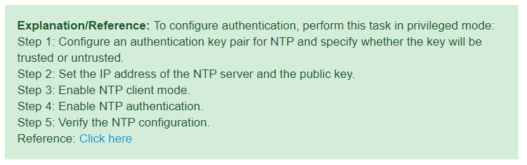

NTP

Uses UDP port 123
Uses a stratum number to measure the believability of a time source.

Stratum (0 -> 15) 2 learn from 1 etc...

Manual mode (To mimic a time server from the internet)

**On the master**
clock set 12:00:00 August 30 2020 (not necessary on a client)

conf t
clock timezone UTC 0
ntp master 3
end

**On the client**
conf t
ntp server 1.1.1.1
clock timezone EST-5
clock summer-time EDT recurring

***Show clock***
***Show ntp status***
***Show ntp associations***
***Debug ntp packets***

* * *

**NTP Authentication**
**
**
