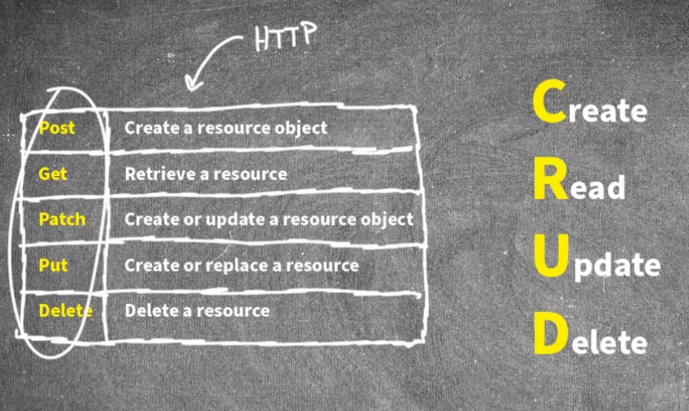

Network Automation (CBT Nuggets)

Python + Jinja

Jinja generates template that are use by Python configure devices.

Zero-touch provisioning -> Devices pre-configure before shipping to sites.

Postman

Rest - Representation State Transfer
Rest API Rules:

- **Client/server**
- **Stateless** REST does not record and use information about one API exchange for the purpose of how subsequent API exchanges are processed. For comparison, the TCP protocol uses a stateful approach, whereas UDP uses stateless operation.
- **Cacheable **REST APIs require that any resource requested via an API call have a clear method by which to mark the resource as cacheable or not. The goals remain the same: improve performance by retrieving resources less often (cacheable). Note that cacheable resources are marked with a timeframe so that the client knows when to ask for a new copy of the resource again.
- **Uniform interface**
- **Layered**
- **Code on demand**

A tool like Postman is a client that query the api on a server.
A server can be a router, a controller etc...

Hostname can be cacheable but not the interface's state.

**CRUD**
**
**

**
**

**Data serialization language**

**XML**
**JSON**
**YAML **-> Python