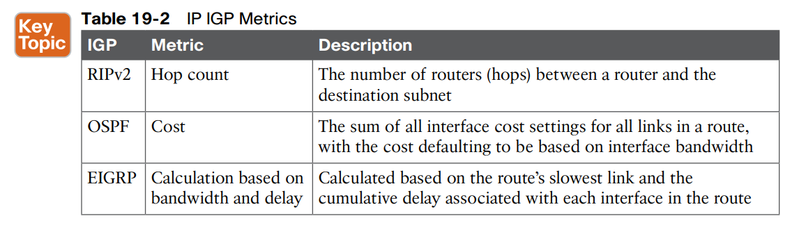
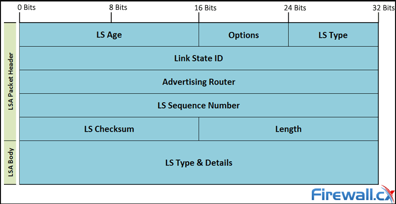
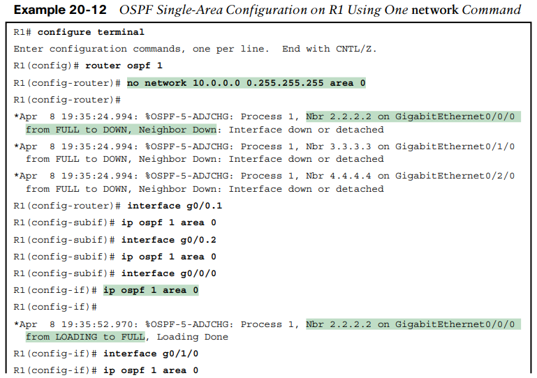

OSPF - Open Shortest Path First

* * *

**Summary**
**
**

**Link-state protocols **build IP routes with a couple of major steps. First, the routers together build a lot of information about the network: routers, links, IP addresses, status information, and so on. Then the routers flood the information, so all routers know the same information. At that point, each router can calculate routes to all subnets, but from each router’s own perspective.

* * *

**Classless vs classful**

Classless routing protocols support variablelength subnet masks (**VLSM**) as well as manual route **summarization **by sending routing protocol messages that include the subnet masks in the message. The older RIPv1 and IGRP routing protocols—both **classful **routing protocols—do not. Also, note that the older routing protocols (RIPv1, IGRP) sent routing protocol messages as IP broadcast addresses, while the newer routing protocols in the table all use IP multicast destination addresses. The use of **multicasts **makes the protocol more efficient and causes less overhead and fewer issues with the devices in the subnet that are not running the routing protocol.

* * *

**IGP Metrics**
**
**

Routing protocols choose the best route to reach a subnet by choosing the route with the lowest **metric**.

* * *

**Routing Protocols Administrative Distances**

When IOS must choose between routes learned using different routing protocols, IOS uses a concept called administrative distance. Administrative distance is a number that denotes how believable an entire routing protocol is on a single router. The lower the number, the better, or more believable, the routing protocol.

* * *

**Neighboring Behavior**
**
**

OSPF neighbors are routers that both use **OSPF **and both sit on the same data link. Two routers can become **OSPF **neighbors if connected to the same VLAN, or same serial link, or same Ethernet WAN link.

The routers send **OSPF **Hello messages, introducing themselves to the potential neighbor.

Assuming the two potential neighbors have compatible **OSPF **parameters, the two form an **OSPF **neighbor relationship.

The **Hellos **in turn list each router’s **router ID (RID)**, which serves as each router’s unique name or identifier for **OSPF**.

**
**

■ The Hello message follows the IP packet header, with IP protocol type **89**.

■ Hello packets are sent to multicast IP address** 224.0.0.5**, a multicast IP address intended for all OSPF-speaking routers.

■ OSPF routers listen for packets sent to IP multicast address **224.0.0.5**, in part hoping to receive **Hello packets** and learn about new neighbors.

With an area mismatch error, the show **ip ospf neighbor **command will not list the neighbor. Because you see nothing in the OSPF neighbor table, to troubleshoot this problem, you need to find the area configuration on each interface on potentially neighboring routers.

**To do so: **

■ Check the output of **show running-config** to look for
■ ip ospf process-id area area-number interface subcommands
■ network commands in OSPF configuration mode
■ Use the** show ip ospf** interface [brief] command to list the area number

**Duplicate RIDs problem -> **Use the **Show ip ospf** command.

**Hello and Dead timer Mismatches -> **Use the **show ip ospf interface *number***

**Mismatched MTU Settings**
**
**

The MTU size defines a per-interface setting used by the router for its Layer 3 forwarding logic, defining the largest network layer packet that the router will forward out each interface.

Routers often use a default MTU size of 1500 bytes, with the ability to set the value as well.

The ***ip mtu*** size interface subcommand defines the IPv4 MTU setting, and the ***ipv6 mtu*** size command sets the equivalent for IPv6 packets.

In an odd twist, two OSPFv2 routers can actually become OSPF neighbors, be listed in the output of the **show ip ospf neighbor **command, and reach 2-way state, even if they happen to use different IPv4 MTU settings on their interfaces. However, they fail to exchange their **LSDBs**.

**-> show run conf**
**-> show interfaces**
**
**

**Mismatched OSPF Network Types**
**
**

Interestingly, if you misconfigure network type settings such that one router uses broadcast, and the other uses point-to-point, the following occurs:

The reason for not adding the routes has to do with the details of LSAs and how the use of a DR (or not) changes those LSAs. Basically, the two routers expect different details in the LSAs, and the SPF algorithm notices those differences and cannot trust the LSAs because of those differences.

* * *

**Fully Exchanging with Neighbors**

***LSA ****- Link State Advertisement*
***LSU ****- Link State Update*
**
**

The **LSU **packet holds data structures called linkstate advertisements (**LSA**). The **LSAs **are not packets, but rather data structures that sit inside the **LSDB **and describe the topology.

**
**

Once two routers on a link reach the **2-way state**, they can immediately move on to the process of database exchange.

First, they tell each other a list of LSAs in their respective databases—not all the details of the LSAs, just a list. (Think of these lists as checklists.) Then each router can check which LSAs it already has and then ask the other router for only the LSAs that are not known yet.

When finished, the routers reach a **full state**, meaning they have fully exchanged the contents of their **LSDBs**.

* * *

**Maintaining relationship**
**
**

**Neighbors still have to do some small ongoing tasks to maintain the neighbor relationship.**

■ Maintain neighbor state by sending Hello messages based on the **Hello Interval **and listening for Hellos before the **Dead Interval** expires

■ Flood any changed **LSAs **to each neighbor
■ Reflood unchanged **LSAs **as their lifetime expires (default 30 minutes)

**Designated Routers**
**
**

OSPF behaves differently on some types of interfaces based on a per-interface setting called the **OSPF network type**. On Ethernet links, OSPF defaults to use a network type of broadcast, which causes OSPF to elect one of the routers on the same subnet to act as the **designated router**  **(DR)**.

The database exchange process on an Ethernet link does not happen between every pair of routers on the same VLAN/subnet. Instead, it happens between the DR and each of the other routers, with the DR making sure that all the other routers get a copy of each LSA.

The use of a **DR/BDR**, along with the use of multicast IP addresses, makes the exchange of OSPF **LSDBs **more efficient on networks that allow more than two routers on the same link.

The DR can send a packet to all OSPF routers in the subnet by using multicast IP address **224.0.0.5.**

Similarly, any OSPF router needing to send a message to the DR and also to the BDR (so it remains ready to take over for the DR) can send those messages to the **“All SPF DRs” multicast address 224.0.0.6.**

DR and BDR both do full database exchange with all the other OSPF routers in the LAN, they reach a full state with all neighbors.

Routers that are neither a DR nor a BDR— called **DROthers **by OSPF—never reach a full state because they do not exchange LSDBs directly with each other.

First, all OSPF routers on the same link that reach the 2-way state—that is, they send Hello messages and the parameters match—are called neighbors. The subset of neighbors for which the neighbor relationship continues on and reaches the full state are called adjacent neighbors. Additionally, OSPFv2 RFC 2328 emphasizes the connection between the full state and the term adjacent neighbor by using the synonyms of fully adjacent and fully adjacent neighbor.

First, routers monitor each neighbor relationship using Hello messages and two related timers: the Hello Interval and the Dead Interval. Routers send Hellos every Hello Interval to each neighbor. Each router expects to receive a Hello from each neighbor based on the Hello Interval, so if a neighbor is silent for the length of the Dead Interval (by default, four times as long as the Hello Interval), the loss of Hellos means that the neighbor has failed.

■ The routers exchange the LSAs inside LSU packets.

■ When finished, the routers reach a full state, meaning they have fully exchanged the contents of their LSDBs.

In some cases, you may want to influence the DR/BDR election with two configurable settings, listed here in order of precedence:

**OSPF RIDs** are 32-bit numbers.

* * *

**Neighboring States**

## **Introduction**

When OSPF adjacency is formed, a router goes through several state changes before it becomes fully adjacent with its neighbor. Those states are defined in the OSPF [RFC 2328](http://www.faqs.org/rfcs/rfc2328.html), section 10.1. The states are Down, Attempt, Init, 2-Way, Exstart, Exchange, Loading, and Full. This document describes each state in detail.

**
**

### **Conventions**

For more information on document conventions, refer to [Cisco Technical Tips Conventions](https://www.cisco.com/en/US/tech/tk801/tk36/technologies_tech_note09186a0080121ac5.shtml).

## **Down**

This is the first OSPF neighbor state. It means that no information (hellos) has been received from this neighbor, but hello packets can still be sent to the neighbor in this state.

During the fully adjacent neighbor state, if a router doesn't receive hello packet from a neighbor within the RouterDeadInterval time (RouterDeadInterval = 4*HelloInterval by default) or if the manually configured neighbor is being removed from the configuration, then the neighbor state changes from Full to Down.

## **Attempt**

This state is only valid for manually configured neighbors in an **[NBMA](https://www.cisco.com/en/US/tech/tk365/technologies_white_paper09186a0080094e9e.shtml)**[ ](https://www.cisco.com/en/US/tech/tk365/technologies_white_paper09186a0080094e9e.shtml)environment. In Attempt state, the router sends unicast hello packets every poll interval to the neighbor, from which hellos have not been received within the dead interval.

## **Init**

This state specifies that the router has received a hello packet from its neighbor, but the receiving router's ID was not included in the hello packet. When a router receives a hello packet from a neighbor, it should list the sender's router ID in its hello packet as an acknowledgment that it received a valid hello packet.

## **2-Way**

This state designates that bi-directional communication has been established between two routers. Bi-directional means that each router has seen the other's hello packet. This state is attained when the router receiving the hello packet sees its own Router ID within the received hello packet's neighbor field. At this state, a router decides whether to become adjacent with this neighbor. On broadcast media and non-broadcast multiaccess networks, a router becomes [full](https://www.cisco.com/c/en/us/support/docs/ip/open-shortest-path-first-ospf/13685-13.html#full) only with the designated router (DR) and the backup designated router (BDR); it stays in the 2-way state with all other neighbors. On Point-to-point and Point-to-multipoint networks, a router becomes full with all connected routers.

At the end of this stage, the DR and BDR for broadcast and non-broadcast multiacess networks are elected. For more information on the DR election process, refer to [DR Election](https://www.cisco.com/en/US/tech/tk365/technologies_white_paper09186a0080094e9e.shtml#t21).

**Note: **Receiving a Database Descriptor (DBD) packet from a neighbor in the init state will also a cause a transition to 2-way state.

## **Exstart**

Once the DR and BDR are elected, the actual process of exchanging link state information can start between the routers and their DR and BDR.

In this state, the routers and their DR and BDR establish a master-slave relationship and choose the initial sequence number for adjacency formation. The router with the higher router ID becomes the master and starts the exchange, and as such, is the only router that can increment the sequence number. Note that one would logically conclude that the DR/BDR with the highest router ID will become the master during this process of master-slave relation. Remember that the DR/BDR election might be purely by virtue of a higher priority configured on the router instead of highest router ID. Thus, it is possible that a DR plays the role of slave. And also note that master/slave election is on a per-neighbor basis.

## **Exchange**

In the exchange state, OSPF routers exchange database descriptor (DBD) packets. Database descriptors contain link-state advertisement (LSA) headers only and describe the contents of the entire link-state database. Each DBD packet has a sequence number which can be incremented only by master which is explicitly acknowledged by slave. Routers also send link-state request packets and link-state update packets (which contain the entire LSA) in this state. The contents of the DBD received are compared to the information contained in the routers link-state database to check if new or more current link-state information is available with the neighbor.

## **Loading**

In this state, the actual exchange of link state information occurs. Based on the information provided by the DBDs, routers send link-state request packets. The neighbor then provides the requested link-state information in link-state update packets. During the adjacency, if a router receives an outdated or missing LSA, it requests that LSA by sending a link-state request packet. All link-state update packets are acknowledged.

## **Full**

In this state, routers are fully adjacent with each other. All the router and network LSAs are exchanged and the routers' databases are fully synchronized.

Full is the normal state for an OSPF router. If a router is stuck in another state, it is an indication that there are problems in forming adjacencies. The only exception to this is the 2-way state, which is normal in a broadcast network. Routers achieve the FULL state with their DR and BDR in NBMA/broadcast media and FULL state with every neighbor in the remaining media such as point-to-point and point-to-multipoint.

**Note: **The DR and BDR that achieve FULL state with every router on the segment will display FULL/DROTHER when you enter the **show ip ospf neighbor** command on either a DR or BDR. This simply means that the neighbor is not a DR or BDR, but since the router on which the command was entered is either a DR or BDR, this shows the neighbor as FULL/DROTHER.

* * *

**Calculating the best route**
**
**

OSPF LSAs contain useful information, but they do not contain the specific information that a router needs to add to its IPv4 routing table. In other words, a router cannot just copy information from the LSDB into a route in the IPv4 routing table. The LSAs individually are more like pieces of a jigsaw puzzle. So, to know what routes to add to the routing table, each router must do some SPF math to choose the best routes from that router’s perspective. The router then adds each route to its routing table: a route with a subnet number and mask, an outgoing interface, and a next-hop router IP address.

**Interfaces costs**
On the interface -> **ip ospf cost 10**

**auto-cost reference-bandwith 100000** (to match 1go, Otherwise the cost for everything above Fast Ethernet will be 1)

* * *

**Area**
**
**
Larger OSPFv2 networks suffer with a single-area design.

Additional problems with a single area design include the following:

■ A larger topology database requires more memory on each router.

■ The SPF algorithm requires processing power that grows exponentially compared to the size of the topology database.

■ A single interface status change anywhere in the internetwork (up to down, or down to up) forces every router to run SPF again!

**
**

The solution is to take the one large LSDB and break it into several smaller LSDBs by using OSPF areas

Using multiple areas improves OSPF operations in many ways for larger networks.

The following list summarizes some of the key points arguing for the use of multiple areas in larger OSPF networks:

■ Routers require fewer CPU cycles to process the smaller per-area LSDB with the SPF algorithm, reducing CPU overhead and improving convergence time.

■ The smaller per-area LSDB requires less memory.

■ Changes in the network (for example, links failing and recovering) require SPF calculations only on routers in the area where the link changed state, reducing the number of routers that must rerun SPF.

■ Less information must be advertised between areas, reducing the bandwidth required to send LSAs.

**
**
**
**

* * *

**
**
**
**
**LSAs type**
**
**

**
**

OSPF needs very detailed topology information inside each area. The routers inside area X need to know all the details about the topology inside area X. And the mechanism to give routers all these details is for the routers to create and flood router (Type 1) and network (Type 2) LSAs about the routers and links in the area

Whereas router LSAs define most of the intra-area topology, network LSAs define the rest. As it turns out, when OSPF elects a DR on some subnet and that DR has at least one neighbor, OSPF treats that subnet as another node in its mathematical model of the network. To represent that network, the DR creates and floods a network (Type 2) LSA for that network (subnet).

**
**

Finally, note that in this single-area design example no summary (Type 3) LSAs exist at all. These LSAs represent subnets in other areas, and there are no other areas. Given that the CCNA 200-301 exam topics refer specifically to single-area OSPF designs, this section stops at showing the details of the intra-area LSAs (Types 1 and 2).

* * *

**Default route and OSPF**
**
**

The most classic case for using a routing protocol to advertise a default route has to do with an enterprise’s connection to the Internet. As a strategy, the enterprise engineer uses these design goals:

■ All routers learn specific (non default) routes for subnets inside the company; a default route is not needed when forwarding packets to these destinations.

■ One router connects to the Internet, and it has a default route that points toward the Internet.

■ All routers should dynamically learn a default route, used for all traffic going to the Internet, so that all packets destined to locations in the Internet go to the one router connected to the Internet.

***default-information originate***
*
*
*NOTE *

*Interestingly, the ****default-information originate always**** router subcommand tells the router to always advertise the default route, no matter whether the router’s default route is working or not.*

*
*

**OSPF Passive interfaces**
**
**

The result of enabling OSPF on an interface but then making it passive is that OSPF still advertises about the connected subnet, but OSPF also does not form neighbor relationships over the interface.

**
**

■ OSPF continues to advertise about the subnet that is connected to the interface.

■ OSPF no longer sends OSPF Hellos on the interface.
■ OSPF no longer processes any received Hellos on the interface.

***passive-interface type number***
OR
***passive-interface default ***
***no passive-interface type number***
***
***

**OSPF Load Balancing **
**
**

When a router uses SPF to calculate the metric for each of several routes to reach one subnet, one route may have the lowest metric, so OSPF puts that route in the routing table.

However, when the metrics tie for multiple routes to the same subnet, the router can put multiple equal-cost routes in the routing table (the default is four different routes) based on the setting of the maximum-paths number router subcommand. For example, if an internetwork has six possible paths between some parts of the network, and the engineer wants all routes to be used, the routers can be configured with the **maximum-paths 6** subcommand under **router ospf**.

The more challenging concept relates to how the routers use those multiple routes. A router could load balance the packets on a per-packet basis. For example, if the router has three equal-cost OSPF routes for the same subnet in the routing table, the router could send the one packet over the first route, the next packet over the second route, the next packet over the third route, and then start over with the first route for the next packet. Note that perpacket load balancing is generally a poor choice because it causes the most overhead work on the router. Alternatively, using the default (and better) method, the load balancing could be on a per-destination IP address basis.

Note that the default setting of **maximum-paths** varies by router platform.

* * *

**Verifying OSPF Operation (Commands)**

***Shop ip ospf neighbors***
***
***

***
***

Once OSPF convergence has completed, a router should list each neighbor. On links that use a designated router (DR), the state will also list the role of the neighboring router after the / (**DR, BDR, or DROTHER**. As a result, the normal working states will be:

***Show ip ospf database -> LSDB infos***
***
***

With a single-area design, all the routers will have the same LSDB contents once all neighbors are up and all LSAs have been exchanged. So, the show ip ospf database command in Example 20-5 should list the same exact information, no matter on which of the four routers it is issued.

***
***

The LSDB should list one “Router Link State”** (Type 1 Router LSA)** for each of the routers in the same area.

Also, with all default settings in this design, the routers will create a total of four Type 2 Network LSAs as shown, one each for the subnets that have a DR and contain at least two routers in that subnet.

You may need to circle back and check the configuration. To do so, you can use these steps:

■ If you have enable mode access, use the** show running-config **command to examine the configuration.

■ If you have only user mode access, use the **show ip protocols** command to re-create the OSPF configuration.

■ Use the **show ip ospf interface [brief]** command to determine whether the router enabled OSPF on the correct interfaces or not based on the configuration.

***Show ip protocols (Enable mode not required)***
***
***

***Show ip ospf interface brief***

To check the list of interfaces chosen by IOS, use the show ip ospf interface brief command, which lists all interfaces that have been enabled for OSPF processing. Verifying the interfaces can be a useful step if you have issues with OSPF neighbors because OSPF must first be enabled on an interface before a router will attempt to discover neighbors on that interface.

* * *

**Router ID**
**
**

**
**

**
**

Each router chooses its OSPF RID when OSPF is initialized, which happens when the router boots or when a CLI user stops and restarts the OSPF process (with the **clear ip ospf process** command). So, if OSPF comes up, and later the configuration changes in a way that would impact the OSPF RID, OSPF does not change the RID immediately. Instead, IOS waits until the next time the OSPF process is restarted.

**
**
**
**

* * *

**
**
**
**
**Using OSPFv2 Interface Subcommands**
**
**

The newer interface-style OSPF configuration still enables OSPF on interfaces, but it does so directly with the ip ospf interface subcommand instead of using the network command in router configuration mode. Basically, instead of matching interfaces with indirect logic using network commands, you directly enable OSPFv2 on interfaces by configuring an interface subcommand on each interface.

The **show ip protocols** command relists most of the routing protocol configuration, so it does list some different details if you use interface configuration versus the network command. With the newer-style configuration, the output lists the phrase **“Interfaces Configured Explicitly,”** with the list of interfaces configured with the new ip ospf process-id area area-id commands, as highlighted in Example 20-13.

**
**

Another small piece of different output exists in the show ip ospf interface [interface] command. The command lists details about OSPF settings for the interface(s) on which OSPF is enabled. The output also makes a subtle reference to whether that interface was enabled for OSPF with the old or new configuration style. Example 20-14 also begins with output based on interface configuration on Router R1, followed by the output that would exist if R1 still used the old-style network command.

**
**

Other than these small differences in a few show commands, the rest of the commands show nothing different depending on the style of configuration. For instance, the show ip ospf interface brief command does not change depending on the configuration style, nor do the show ip ospf database, show ip ospf neighbor, or show ip route commands.

* * *

**Additional OSPFv2 Features **

This final major section of the chapter discusses some very popular but optional OSPFv2 configuration features, as listed here in their order of appearance:

■ **Passive interfaces **
**
**

Sometimes, a router does not need to form neighbor relationships with neighbors on an interface. Often, no other routers exist on a particular link, so the router has no need to keep sending those repetitive OSPF Hello messages.

To configure an interface as passive, two options exist. First, you can add the following command to the configuration of the OSPF process, in router configuration mode:

***passive-interface type number ***

Alternately, the configuration can change the default setting so that all interfaces are passive by default and then add a no passive-interface command for all interfaces that need to not be passive:

***passive-interface default ***
***no passive-interface type number***

Interestingly, OSPF makes it a bit of a challenge to use show commands to find whether or not an interface is passive. The **show running-config** command **lists the configuration directly**, but if you cannot get into enable mode to use this command, note these two facts:

The **show ip ospf interface brief **command lists all interfaces on which OSPF is enabled, including passive interfaces.

The **show ip ospf interface **command lists a single line that mentions that the interface is passive.

**■ Default routes**

**■ Metrics **
**
**
Cisco routers allow three different ways to change the OSPF interface cost:

■ Directly, using the interface subcommand **ip ospf cost x.**

■ Using the default calculation per interface, and changing the **interface bandwidth setting**, which changes the calculated value.

■ Using the default calculation per interface, and changing the **OSPF reference bandwidth **setting, which changes the calculated value.

The **show ip ospf interface brief **command that follows details the cost of each interface.

Routers use a per-interface bandwidth setting to describe the speed of the interface.

Note that the interface bandwidth setting does not influence the actual transmission speed. Instead, the interface bandwidth acts as a configurable setting to represent the speed of the interface, with the option to configure the bandwidth to match the actual transmission speed…or not. To support this logic, IOS sets a default interface bandwidth value that matches the physical transmission speed when possible, but also allows the configuration of the interface bandwidth using ***bandwidth speed ***interface subcommand.

OSPF (as well as other IOS features) uses the interface bandwidth to make decisions, with OSPF using the interface bandwidth in its calculation of the default OSPF cost for each interface.

IOS puts the interface’s bandwidth in the denominator and an OSPF setting called the reference bandwidth in the numerator:

**Reference_bandwidth / Interface_bandwidth**
**
**

Cisco chose the IOS default reference bandwidth setting decades ago in an era with much slower links. As a result, any interface with an interface bandwidth of 100 Mbps or faster ties with a calculated OSPF cost of 1 when using the default reference bandwidth. So, when relying on the default OSPF cost calculation, it helps to configure the reference bandwidth to another value.

You can still use OSPF’s default cost calculation (and many do) just by changing the reference bandwidth with the auto-cost reference-bandwidth speed OSPF mode subcommand.

For instance, in an enterprise whose fastest links are 10 Gbps (10,000 Mbps), you could set all routers to use **auto-cost reference-bandwidth 10000**, meaning **10,000 Mbps or 10 Gbps**. In that case, by default, a 10-Gbps link would have an OSPF cost of 1, while a 1-Gbps link would have a cost of 10, and a 100-MBps link a cost of 100.

**■ Load balancing**

When a router uses SPF to calculate the metric for each of several routes to reach one subnet, one route may have the lowest metric, so OSPF puts that route in the routing table. However, when the metrics tie for multiple routes to the same subnet, the router can put multiple equal-cost routes in the routing table (the default is four different routes) based on the setting of the ***maximum-paths number ***router subcommand. For example, if an internetwork has six possible paths between some parts of the network, and the engineer wants all routes to be used, the routers can be configured with the ***maximum-paths 6*** subcommand under **router ospf**.

The more challenging concept relates to how the routers use those multiple routes. A router could load balance the packets on a per-packet basis. For example, if the router has three equal-cost OSPF routes for the same subnet in the routing table, the router could send the one packet over the first route, the next packet over the second route, the next packet over the third route, and then start over with the first route for the next packet. Note that perpacket load balancing is generally a poor choice because it causes the most overhead work on the router. Alternatively, using the default (and better) method, the load balancing could be on a per-destination IP address basis.

Note that the default setting of **maximum-paths **varies by router platform.
**
**
**
**

* * *

**
**
**
**
**Network Type**
**
**

**
**

**Broadcast Type**
**
**

**
**

The idea that R1 has three neighbors off its G0/0 interface, with two being fully adjacent, is reflected on the far right of the output of the **show ip ospf interface brief** command output in Example 21-3. It shows “2/3,” meaning two neighbors in the full state off port G0/0, with three total neighbors on that interface. Also, note that this command’s “State” column differs from the **show ip ospf neighbor **commands, in that the **show ip ospf interface brief **command lists the local router’s role on the interface (as shown in Figure 21-2), with R1’s G0/1 acting as DR and R1’s G0/0 acting as a DROther router.

**
**

**
**

**
**

In some cases, you may want to influence the DR/BDR election with two configurable settings, listed here in order of precedence:

**
**
**Point-To-Point Type**
**
**

The other OSPF network type mentioned in the CCNA 200-301 exam topics, point-to-point, works well for data links that by their nature have just two routers on the link.

Consider the OSPF point-to-point network type: it exists for serial links and other links that use a point-to-point topology. These links often do not support data-link broadcasts. Additionally, with only two devices on the link, using a DR/BDR is not a help, and it actually adds a little extra convergence time. Using a network type of point-to-point tells the router to not use a DR/BDR on the link.

**
**

**
**

**
**
**ip ospf network nonbroadcast **

The **non broadcast** network type is enable by default on **X.25** and **Frame Relay **networks.

**
**

* * *

**
**
**
**
**Troubleshooting OSPF**

**Shutting Down the OSPF Process**
**
**

Similar to administratively disabling and enabling an interface, IOS also allows the OSPFv2 routing protocol process to be disabled and enabled with the shutdown and no shutdown router mode subcommands, respectively.

When a routing protocol process is shut down, IOS does the following:

■ Brings down all neighbor relationships and clears the OSPF neighbor table
■ Clears the LSDB
■ Clears the IP routing table of any OSPF-learned routes

At the same time, shutting down OSPF does retain some important details about OSPF, in particular:

■ IOS retains all OSPF configuration.

■ IOS still lists all OSPF-enabled interfaces in the OSPF interface list (show ip ospf interface) but in a DOWN state.

**
**

**
**

* * *

**
**
**
**
**
**
**
**
***Show ip ospf***
***Show ip ospf int gig0/0***
***
***
***
***
**OSPFv1 **
***router ospf 1***
***network 10.1.1.1 0.0.0.0 area 0***
***network 20.2.2.2 0.0.0.0 area 0***

**OSPFv2**
In interface sub-command
***ip ospf 1 area 0***