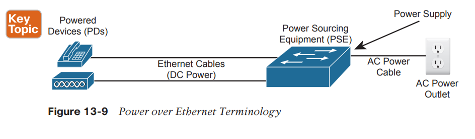
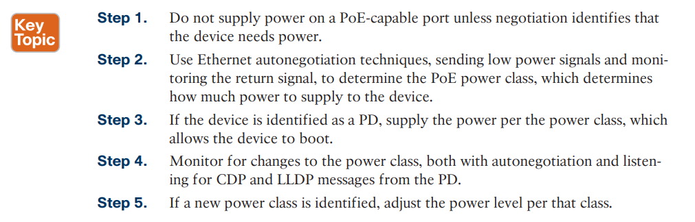
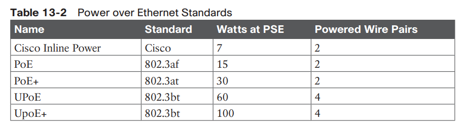
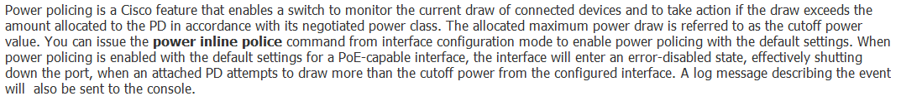
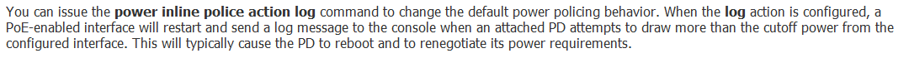
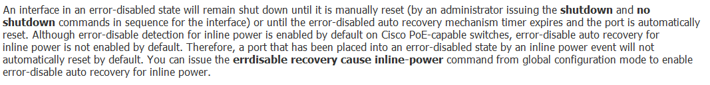

# PoE

## PSE: Power sourcing equipment
## PD: Power device

■ Powered Devices: Determine the types of devices and specific models, along with their power requirements.

■ Power Requirements: Plan the numbers of different types of PDs to connect into each wiring closet to build a power budget. That power budget can then be processed to determine the amount of PoE power to make available through each switch.

■ Switch Ports: Some switches support PoE standards on all ports, some on no ports, some on a subset of ports. Research the various switch models so that you purchase enough PoE-capable ports for the switches planned for each wiring closet.

■ Switch Power Supplies: Without PoE, when purchasing a switch, you choose a power supply so that it delivers enough power to power the switch itself. With PoE, the switch acts as a distributor of electrical power, so the switch power supply must deliver many more watts than it needs to run the switch itself. You will need to create a power budget per switch, based on the number of connected PDs, and purchase power supplies to match those requirements.

■ PoE Standards versus Actual: Consider the number of PoE switch ports needed, the standards they support, the standards supported by the PDs, and how much power they consume. For instance, a PD and a switch port may both support PoE+, which supports up to 30 watts supplied by the PSE . However, that powered device may need at most 9 watts to operate, so your power budget needs to reserve less power than the maximum for those devices.

  

## Useful Commands

## Power Inline Police

## power inline police action log

## errdisable recovery cause inline-power

