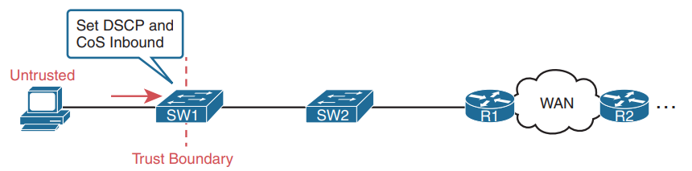

# QoS
## NOTE
End-to-End QoS Network Design is written by some of the same people who created the Cisco Enterprise QoS Solution Reference Network Design Guide (available at Cisco.com). If you are looking for a book to dig into more depth on QoS, this book is an excellent reference for Cisco QoS.

***

Quality of service is a way to manage unfairness.

There are 3 main category of `QoS`.

- IntServ
	- `RSVP`(resource reservation protocol)  
		`RSVP` reserve bandwith at the begining of a session.
	- Strict
- DiffServ
	- Differentiate the type of packet and put these different packet types into different traffic classes.
	- Not more than 11 classes of traffic.
	- Less Strict
- FIFO (First In First Out)
	- Not Strict

`QoS:` Managing Bandwidth, Delay, Jitter, and Loss Cisco offers a wide range of QoS tools on both routers and switches.

All these type of `QoS` give you the means to manage four characteristics of network traffic:

- Bandwidth
- Delay
- Jitter
- Loss

- An engineer might configure a queuing tool to reserve 10 percent of the bandwidth for voice traffic, 50 percent for mission-critical data applications, and leave the rest of the bandwidth for all other types of traffic.
- Delay can be described as one-way delay or round-trip delay. One-way delay refers to the time between sending one packet and that same packet arriving at the destination host. Round-trip delay counts the one-way delay plus the time for the receiver of the first packet to send back a packet.
- Jitter refers to the variation in one-way delay between consecutive packets sent by the same application.
- Loss refers to the number of lost messages, usually as a percentage of packets sent. Several QoS tools manage queuing systems to help control and avoid loss.

## Types of Traffic
With QoS, a network engineer sets about to prefer one type of traffic over another in regard to bandwidth, delay, jitter, and loss.
We can use `QoS` to prioritize a certain Vlan or an application.

`Cisco’s Enterprise QoS Solution` Reference Network Design Guide, which itself quotes other sources in addition to relying on Cisco’s long experience in implementing QoS, suggests the following guidelines for interactive voice:

| Param           | Value          |
| -               | -              |
| Delay (one-way) | 150 ms or less |
| Jitter          | 30 ms or less  |
| Loss            | 1% or less     |

In comparison, interactive voice requires more attention than interactive data applications for QoS features.
A single voice call does generally take less bandwidth than a typical data application, but that bandwidth requirement is consistent.

Video has a much more varied set of QoS requirements. Generally, think of video like voice, but with a much higher bandwidth requirement than voice (per flow) and similar requirements for low delay, jitter, and loss.

| Param      | value                                            |
| -          | -                                                |
| Bandwidth  | 384 Kbps to 20+ Mbps                             |
| Delay (one | way)                  200–400 ms (One way delay) |
| Jitter     | 30–50 ms                                         |
| Loss       | 0.1%–1%                                          |

# QoS Mechanisms
## Classification and marking
`Classification and Marking` is about the marking of packets and the definition of trust boundaries.
QoS tool that classifies packets based on their header contents, and then marks the message by changing some bits in specific header fields.

### L2 marking / CoS
`Cos `(Class of Service) 802.1q field is use to mark packets at L2. (3bits)
`Cos` is only available on trunk links.

The `COS` field exists in the 802.1Q header and it is a 3 bits value. So, we have 8 possible decimal value for that field.
- Value 6 and 7 are reserved for the network, so we can choose a value between 0 and 5.

The people creating a QoS plan for an enterprise have to choose where to place the trust boundary for the network.

Interestingly, when the access layer includes an IP Phone, the phone is typically the trust boundary, instead of the access layer switch. IP Phones can set the CoS and DSCP fields of the messages created by the phone, as well as those forwarded from the PC. By default, IP Phone have a COS value of 5.

### L3 marking with the Tos field (1 byte) 
Originally, the ToS field was the IPP field with only 3 bits

As `CoS`, the `IPP` field reserved the last 2 values (6,7) for the network.
DSCP (6bits) - The last 2 bits of the byte are used for ECN (Explicit congestion Notification)(out of ccna topics)
Because we have 6 bits available for the DSCP marking, we can use 64 different decimal values. The `ietf` pre-selected 21 of these value and gave them names (PHB / Per hop behaviour). We can their numbers or their names.

**DiffServ Suggested Marking Values**  
DiffServ hoped to create a consistent use of DSCP values in all networks.

**Expedited Forwarding (EF)**  
DiffServ defines the `Expedited Forwarding (EF)`. Suggested for use for packets that need low latency (delay), low jitter, and low loss.

Most often QoS plans use `EF` to mark voice payload packets.

***

**Class Selector (CS)**  
Originally, the `ToS` byte was defined with a 3-bit IP Precedence (IPP) field. When DiffServ redefined the ToS byte, it made sense to create eight DSCP values for backward compatibility with IPP values. The `Class Selector (CS)` DSCP values are those settings.

Basically, the DSCP values have the same first 3 bits as the IPP field, and with binary 0s for the last 3 bits.

Cisco helped to develop RFC 4954, an RFC that defines several conventions for how to use the DSCP field.

Without getting into the depth of any one plan, the plans all specify some variation for how all devices should mark data as follows:

- DSCP EF: Voice payload
- AF4x: Interactive video (for example, videoconferencing)
- AF3x: Streaming video
- AF2x: High priority (low latency) data
- CS0: Standard data

For example, that plan might state the following:

- Classify all voice payload traffic that is used for business purposes as IP DSCP EF and CoS 5.
- Classify all video conferencing and other interactive video for business purposes as IP DSCP AF41 and CoS 4.
- Classify all business-critical data application traffic as IP DSCP AF21 and CoS 2.

IPv4 defines a Type of Service (ToS) byte in the IPv4 header, as shown in Figure 11-6. The original RFC defined a 3-bit IP Precedence (IPP) field for QoS marking. That field gave us eight separate values—binary 000, 001, 010, and so on, through 111—which when converted to decimal are decimals 0 through 7.

***

**Assured Forwarding (AF)**  
The Assured Forwarding (AF) DiffServ RFC (2597) defines a set of 12 DSCP values meant to be used in concert with each other.
With four queues, and three drop priority classes per queue, you need 12 different DSCP markings, one for each combination of queue and drop priority

For example, if you marked packets with all 12 values, those with AF11, AF12, and AF13 would all go into one queue; those with AF21, AF22, and AF23 would go into another queue; and so on.

First three bits for the class and the 3 other bits for priority. The priority is use in the congestion avoidance mechanism.

***

### Cisco Network Based Application Recognition (NBAR)
Port classification can be limited...

NBAR2 matches packets for classification in a large variety of ways that are very useful for QoS.
NBAR2 looks far beyond what an ACL can examine in a message. Many applications cannot be identified based on well-known port alone. NBAR solves those problems.
NBAR provides easy built-in matching different apps, plus more than 1000 different subcategories of applications using application signatures.

## Queuing
`Queuing` describes the scheduling of packets to give one type of packet priority over another. It uses the marking that has been done earlier to put the packets in the right queue.
The term queuing refers to the QoS toolset for managing the queues that hold packets while they wait their turn to exit an interface.
The queuing system needs a scheduler as well, to decide which message to take next when the interface becomes available.

The scheduler can be the most interesting part because it can perform prioritization.

## Congestion avoidance
`Congestion Avoidance` addresses how to manage the packet loss that occurs when network devices (queues) get too busy.
Reduce overall packet loss by preemptively discarding some packets used in TCP connections.

Congestion avoidance tools attempt to avoid the congestion, primarily through using TCP’s own windowing mechanisms.
Congestion avoidance tools monitor the average queue depth over time, triggering more severe actions the deeper the queue.

The strategy is simple: discard some now in hopes that the device discards far fewer in the long term.

When the queue depth is low, below the minimum threshold values, the congestion avoidance tool does nothing. When the queue depth is between the minimum and maximum thresholds, the congestion avoidance tool discards a percentage of the packets—usually a small percentage, like 5, 10, or 20 percent. If the queue depth passes the maximum threshold, the tool drops all packets, in an action called full drop.

### Weighted Random Early Detection (WRED)
A congestion avoidance mechanism that can start dropping random packets when a queue depth exceeds a threshold. Thresholds can be different for different priority markings.

## Shaping and Policing
`Shaping and Policing` explains these two tools together because they are often used on opposite ends of a link.
Both policing and shaping monitor the bit rate of the combined messages that flow through a device. Once enabled, the policer or shaper notes each packet that passes and measures the number of bits per second over time. Both attempt to keep the bit rate at or below the configured speed, but by using two different actions: policers discard packets, and shapers hold packets in queues to delay the packets.

### Policer

The right side of the figure shows a graph of what happens to the traffic when a policer discards any messages that would have otherwise pushed the rate over the configured policing rate. In effect, the policer chops off the top of the graph at the policing rate.

Policing makes sense only in certain cases, and as a general tool, it can be best used at the edge between two networks.

### Shaper
The shaper slows messages down by queuing the messages.

Shaping before sending data to an SP that is policing—is one of the typical uses of a shaper.

> A shaper’s time interval refers to its internal logic and how a shaper averages, over time, sending at a particular rate. A shaper basically sends as fast as it can and then waits; sends and waits; sends and waits.

Even if that voice or video packet is in a priority shaping queue, the packet will wait 800 ms before the shaper schedules the next packet—far too long compared to the 150-ms one-way delay goal for voice.

Use shorter time intervals:

	Tc = 1 second (1000 ms): Send at 1 Gbps for 200 ms, rest for 800 ms
	Tc = .1 second (100 ms): Send at 1 Gbps for 20 ms, rest for 80 ms
	Tc = .01 second (10 ms): Send at 1 Gbps for 2 ms, rest for 8 ms

## Link Efficiency
The main link efficiency mechanisms deployed today are compression- and fragmentation-based. There are several types of compression: link compression, layer 2 payload compression, RTP header compression, and TCP header compression. Fragmentation is usually combined with interleaving. Compression makes link utilization more efficient, and it is a QoS technique that actually makes more bandwidth available. `Fragmentation aims at reducing the expected delay of packets by reducing the maximum packet size over a circuit or connection.` Compression is a technique used in many of the link efficiency mechanisms. Compression reduces the size of data to be transferred; therefore, it increases throughput and reduces overall delay. Many compression algorithms have been developed over time. An example for a compression algorithm is Lempel-Ziv (LZ) used by Stacker compression. Most compression algorithms take advantage of and remove the repeated patterns and redundancy in data. One main difference between compression algorithms is the type of data the algorithm has been optimized for. For example, MPEG has been developed for and works well for compressing video, whereas the Huffman algorithm compresses text-based data well.

Cisco IOS QoS software offers three link efficiency mechanisms that work in conjunction with queueing and traffic shaping to improve efficiency and predictability of the application services levels:

### Link Fragmentation and Interleaving (LFI)
### Compressed Real-Time Protocol (CRTP)
### Distributed Compressed Real-Time Protocol (dCRTP).

### Differentiated Services Code Point (DSCP) field, a 6-bit field in the IP header meant for QoS marking.

## QoS Tools
Like ACLs, QoS tools are enabled on an interface. Also like ACLs, QoS tools are enabled for a direction.
QoS tools perform classification (matching of header fields) to decide which packets to take certain QoS actions against.

Routers use queuing tools to place some packets in one output queue, other packets in another, and so on, when the outgoing interface happens to be busy.

Then, when the outgoing interface becomes available to send another message, the queuing tool’s scheduler algorithm can pick the next message from any one of the queues, prioritizing traffic based on the rules configured by the network engineer.

The work to match packets can even degrade device performance of some devices. So, while you could have every device use complex packet matching, doing so is a poor strategy.

A better strategy suggests doing complex matching early in the life of a packet and then marking the packet. Marking means that the QoS tool changes one or more header fields, setting a value in the header.

All these fields are matchable for QoS classification.

# QoS Scheduling and Prioritization
## Round-Robin Scheduling (Prioritization)
One scheduling algorithm used by Cisco routers and switches uses round-robin logic.
In its most basic form, round robin cycles through the queues in order, taking turns with each queue.

Round-robin scheduling also includes the concept of weighting (generally called weighted round robin). Basically, the scheduler takes a different number of packets (or bytes) from each queue, giving more preference to one queue over another.

`Class-Based Weighted Fair Queuing (CBWFQ)` guarantee a minimum amount of bandwidth to each class.

`Weighted Fair Queuing` is a legacy mechanism recommended for the "class-default" traffic class.

WFQ doesn't allow any one application to dominate the use of the network bandwidth.

By default class-default uses FIFO, we need to activate the CBWFQ manually.

It's working great but with CBWFQ we don't prioritize one queue over another...

So at some point, the network can be saturated.

## LLQ (Low Latency Queuing)
Round-robin scheduler does not provide low enough delay, jitter, or loss.

> LLQ tells the scheduler to treat one or more queues as special priority queues.

What happens if the speed of the interface is X bits per second, but more than X bits per second come into the voice queue? The scheduler never services the other queues (called queue starvation).

You could reserve 20 percent of the link’s bandwidth for the voice queue and make it a priority queue.

If more than 20 percent of the link’s worth of bits shows up in that queue, the router will discard the excess.

There are QoS tools to help you to fix that, called Call Admission Control (CAC) tools.

We can have only one priority queue.
If there is congestion on the network, the priority will have mini

# Voice Vlan and QoS
By default, IP Phones send their traffic with a CoS priority value of 5. If the computer which is attached to it send traffic with a higher priority, it could cause a problem. So IP Phone override the priority to 0. That could also be a problem. To avoid that behavior, we should issue the switchport priority extend trust command.

The switchport priority extend cos value  command allow to override the data packet's priority with a defined value.

https://www.cisco.com/c/en/us/td/docs/switches/lan/catalyst3560/software/release/12-2_52_se/configuration/guide/3560scg/swvoip.html#wp1033848
