Rest API (Ansibleundefined Puppetundefined Chef)

Applications use application programming interfaces (APIs) to communicate.

APIs allow programs running on different computers to work cooperatively, exchanging data to achieve some goal.

Several types of APIs exist, each with a different set of conventions to meet a different set of needs.

REST APIs follow a set of foundational rules about what makes a REST API and what does not.

■ Client/server architecture
■ Stateless operation
■ Clear statement of cacheable/uncacheable
■ Uniform interface
■ Layered
■ Code-on-demand

**Client/Server Architecture**

First, an application developer creates a REST API, and that application, when executing, acts as a REST server. Any other application can make a REST API call (the REST client) by executing some code that causes a request to flow from the client to the server.

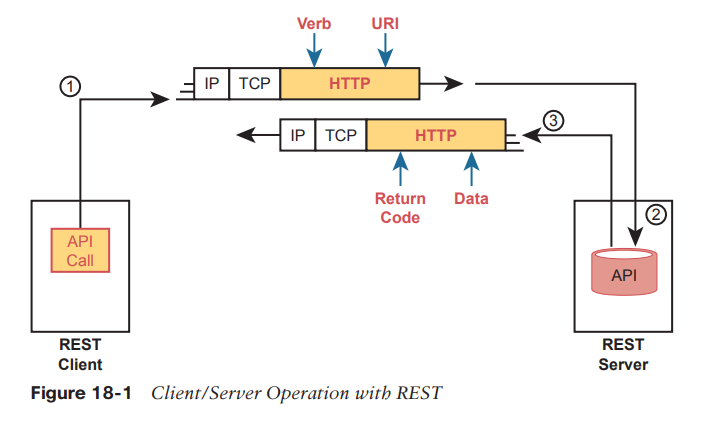

**
**
**Stateless Operation**

The stateless attribute of REST APIs means that REST does not record and use information about one API exchange.

In other words, each API request and reply does not use any other past history considered when processing the request.

For comparison, the TCP protocol uses a stateful approach, whereas UDP uses stateless operation. A TCP connection requires the endpoints to initialize variables on each end, with those variables updating over time, and with those variables being used for subsequent TCP messages. For instance, TCP uses sequence numbers and acknowledgment numbers to manage the flow of data in a TCP connection.

**Cacheable (or Not)**

REST APIs require that any resource requested via an API call have a clear method by which to mark the resource as cacheable or not. The goals remain the same: improve performance by retrieving resources less often (cacheable). Note that cacheable resources are marked with a timeframe so that the client knows when to ask for a new copy of the resource again.

**List vs Dictionary**
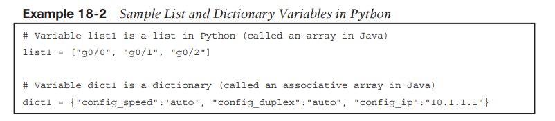

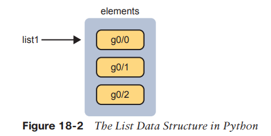

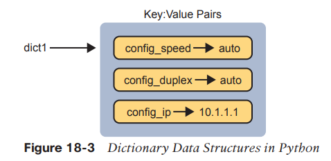

**Rest APIs and HTTP**

Many APIs need to be available to programs that run on other computers, so the API must define the type of networking protocols supported by the API—and many REST-based APIs use the HTTP protocol.

HTTP uses the same principles as REST: it operates with a client/server model; it uses a stateless operational model; and it includes headers that clearly mark objects as cacheable or not cacheable.

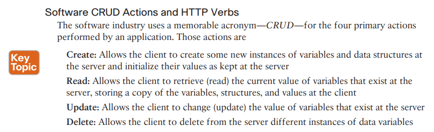

You might want to create something new, like a new security policy. From a programming perspective, the security policy exists as a related set of configuration settings on the DNA controller, internally represented by variables. To do that, a REST client application would use a create action, using the DNA Center RESTful API, that created variables on the DNA Controller via the DNA Center REST API. The concept of creating new configuration at the controller is performed via the API using a create action per the CRUD generic acronym.

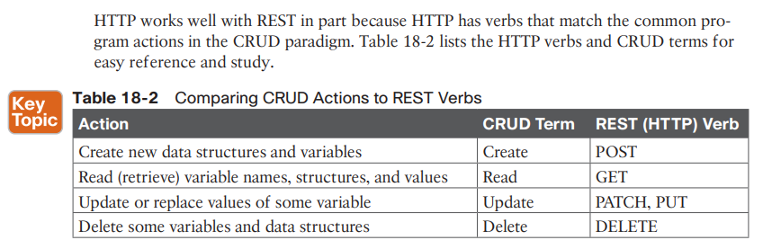

**URIs with HTTP to get resources**
REST uses URIs to identify what resource the HTTP request acts on.

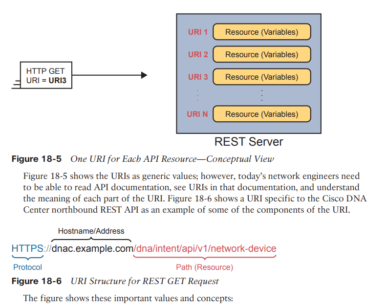

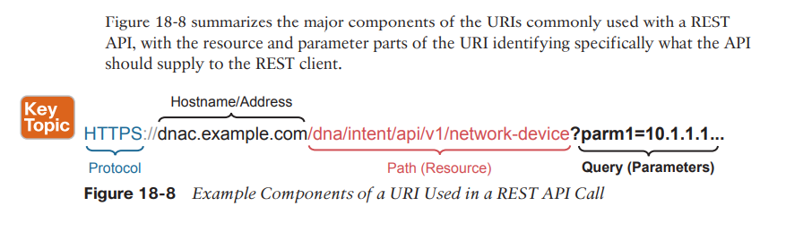

**** Download PostMan ***
***
***
***
***

* * *

**Data Serialization Language**

Each data serialization language provides methods of using text to describe variables, with a goal of being able to send that text over a network or to store that text in a file.

Data serialization languages give us a way to represent variables with text rather than in the internal representation used by any particular programming language.

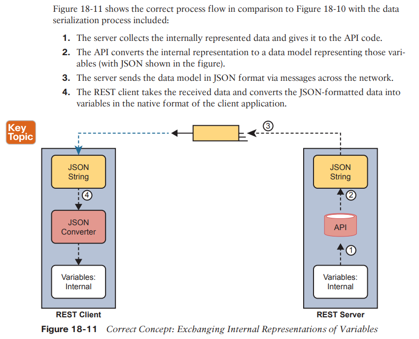

**JSON **

JavaScript Object Notation attempts to strike a balance between human and machine readability. Armed with a few JSON rules, most humans can read JSON data, move past simply guessing at what it means, and confidently interpret the data structures defined by the JSON data. At the same time, JSON data makes it easy for programs to convert JSON text into variables, making it very useful for data exchange between applications using APIs.

**XML**

Back in the 1990s, when web browsers and the World Wide Web (WWW) were first created, web pages primarily used Hypertext Markup Language (HTML) to define web pages. As a markup language, HTML defined how to add the text or a web page to a file and then add “markup”—additional text to denote formatting details for the text that should be displayed. For instance, the markup included codes for headings, font types, sizes, colors, hyperlinks, and so on.

The eXtensible Markup Language (XML) came later to make some improvements for earlier markup languages.

Comparing XML to JSON, both attempt to be human readable, but with XML being a little more challenging to read for the average person.

**YAML**

YAML does not attempt to define markup details (while XML does). Instead, YAML focuses on the data model (structure) details.

Ansible, one of the topics in Chapter 19, “Understanding Ansible, Puppet, and Chef,” makes extensive use of YAML files.

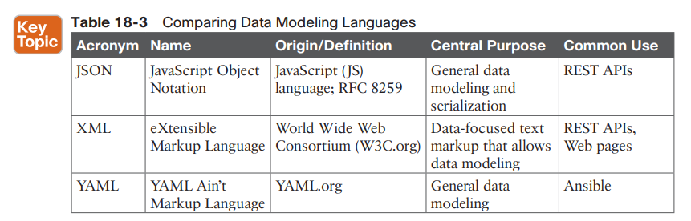

* * *

**Configuration Drift**

Two employees can make changes to some configuration without noticing each other. With time, it can be cumbersome to keep track of all these changes.

**
**
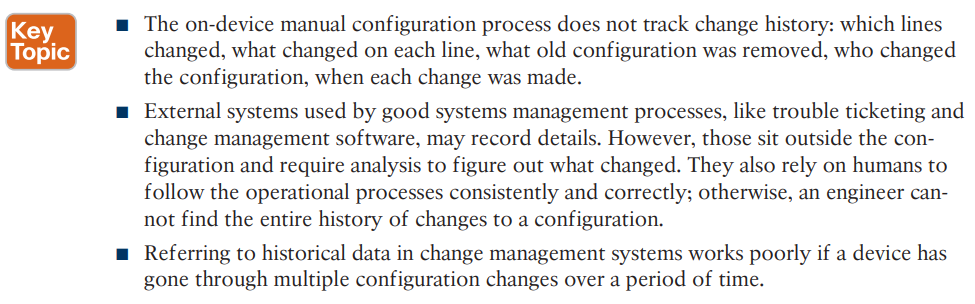
**
**
**
**

**Configuration drift becomes a much bigger problem if using only traditional manual configuration tools. For instance: **

■ The on-device manual configuration process does not track change history: which lines changed, what changed on each line, what old configuration was removed, who changed the configuration, when each change was made.

■ External systems used by good systems management processes, like trouble ticketing and change management software, may record details. However, those sit outside the configuration and require analysis to figure out what changed. They also rely on humans to follow the operational processes consistently and correctly; otherwise, an engineer cannot find the entire history of changes to a configuration.

■ Referring to historical data in change management systems works poor.

As a first step toward better configuration management, many medium to large enterprises store configurations in a central location.

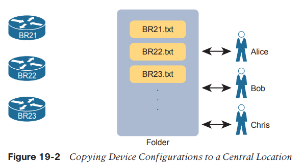

Which configuration file is the single source of truth in this model? The configuration files still exist on each device, but now they also exist on a centralized server, and engineers could change the on-device configuration as well as the text files on the server.

In practice, companies take both approaches. In some cases, companies continue to use the on-device configuration files as the source of truth, with the centralized configuration files treated as backup copies in case the device fails and must be replaced.

However, other enterprises make the transition to treat the files on the server as the single source of truth about each device’s configuration.

When using the centralized file as the source of truth, the engineers can take advantage of many configuration management.

**Configuration Monitoring and Enforcement **

With a version control system and a convention of storing the configuration files in a central location, a network team can do a much better job of tracking changes and answering the who, what, and when of knowing what changed in every device’s configuration.

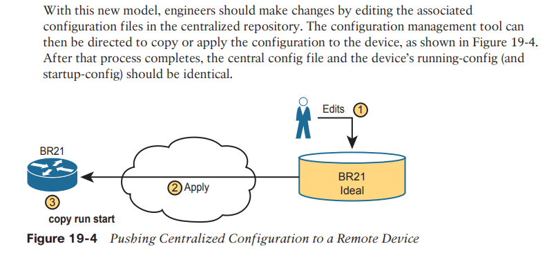

Using the model shown in Figure 19-4 still has dangers. For instance, the network engineers should make changes by using the configuration management tools, but they still have the ability to log in to each device and make manual changes on each device.

**Configuration Provisioning **

Configuration provisioning refers to how to provision or deploy changes to the configuration once made by changing files in the configuration management system. As one of the primary functions of a configuration management tool, you would likely see features like these :

■ The core function to implement configuration changes in one device after someone has edited the device’s centralized configuration file

■ The ability to choose which subset of devices to configure: all devices, types with a given attribute (such as those of a particular role), or just one device, based on attributes and logic

■ The ability to determine if each change was accepted or rejected, and to use logic to react differently in each case depending on the result

■ For each change, the ability to revert to the original configuration if even one configuration command is rejected on a device

■ The ability to validate the change now (without actually making the change) to determine whether the change will work or not when attempted

■ The ability to check the configuration after the process completes to confirm that the configuration management tool’s intended configuration does match the device’s configuration

■ The ability to use logic to choose whether to save the running-config to startup-config or not

■ The ability to represent configuration files as templates and variables so that devices with similar roles can use the same template but with different values

■ The ability to store the logic steps in a file, scheduled to execute, so that the changes can be implemented by the automation tool without the engineer being present

**Configuration Templates and Variables**

Configuration management tools can separate the components of a configuration into the parts in common to all devices in that role (the template) versus the parts unique to any one device (the variables). Engineers can then edit the standard template file for a device role as a separate file than each device’s variable file.

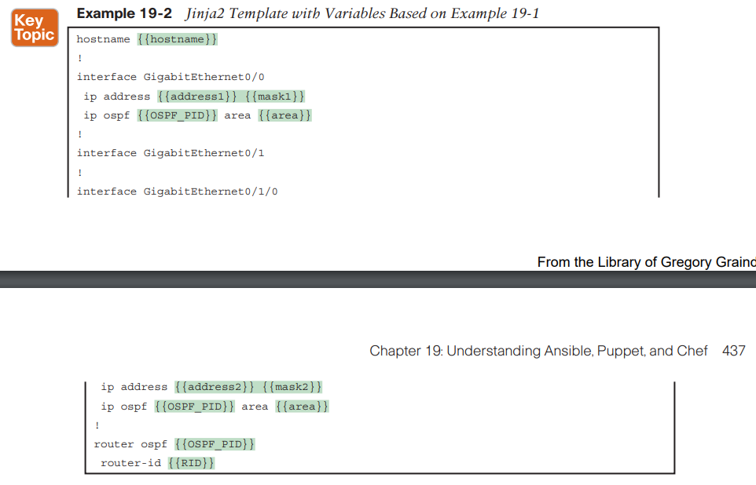

It might seem like extra work to separate configurations into a template and variables, but using templates has some big advantages. In particular:

■ Templates increase the focus on having a standard configuration for each device role, helping to avoid snowflakes (uniquely configured devices).

■ New devices with an existing role can be deployed easily by simply copying an existing per-device variable file and changing the values.

■ Templates allow for easier troubleshooting because troubleshooting issues with one standard template should find and fix issues with all devices that use the same template.

■ Tracking the file versions for the template versus the variables files allows for easier troubleshooting as well. Issues with a device can be investigated to find changes in the device’s settings separately from the standard configuration template.

**Ansible, Puppet and Chef Basics**
These are free management tools.

Ansible, Puppet, and Chef are software packages. You can purchase each tool, with variations on which package.

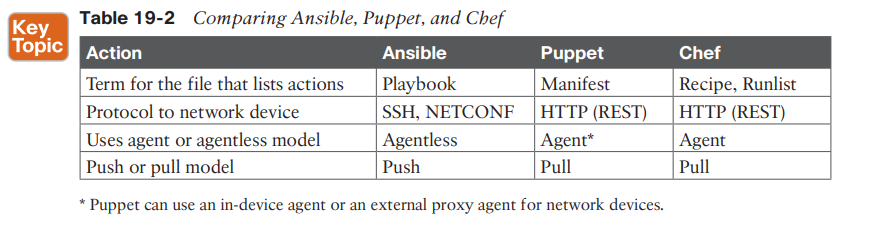

**Ansible**
Once it is installed, you create several text files, such as the following:

■ **Playbooks**: These files provide actions and logic about what Ansible should do.

■ **Inventory**: These files provide device hostnames along with information about each device, like device roles, so Ansible can perform functions for subsets of the inventory

■ **Templates**: Using Jinja2 language, the templates represent a device’s configuration but with variables (see Example 19-2).

■ **Variables**: Using YAML, a file can list variables that Ansible will substitute into templates (see Example 19-3).

As far as how Ansible works for managing network devices, it uses an agentless architecture. That means Ansible does not rely on any code (agent) running on the network device. Instead, Ansible relies on features typical in network devices, namely SSH and/or NETCONF, to make changes and extract information. When using SSH, the Ansible control node actually makes changes to the device like any other SSH user would do, but doing the work with Ansible code, rather than with a human.

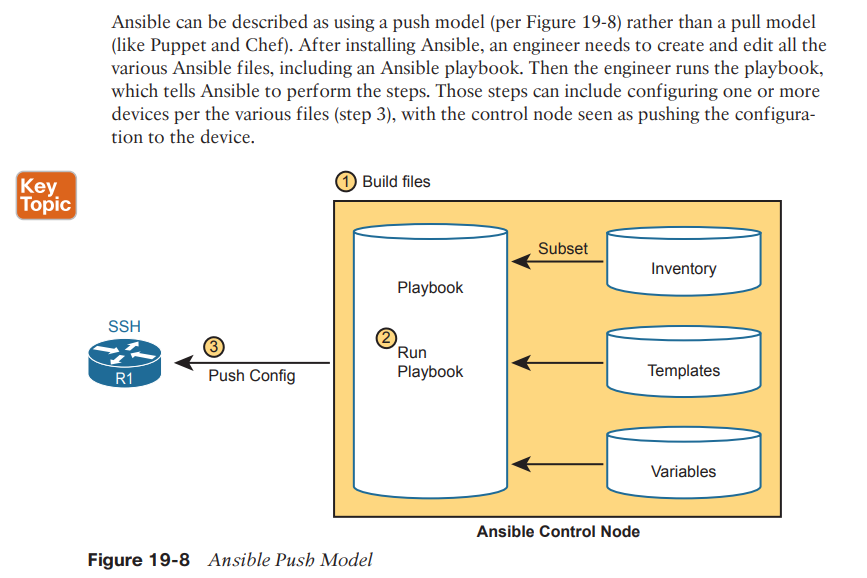

As with all the tools, Ansible can do both configuration provisioning (configuring devices after changes are made in the files) and configuration monitoring (checking to find out whether the device config matches the ideal configuration on the control node). However, Ansible’s architecture more naturally fits with configuration provisioning, as seen in the figure. To do configuration monitoring, Ansible uses logic modules that detect and list configuration differences, after which the playbook defines what action to take (reconfigure or notify).

**Puppet**

You can install it on your own Linux host, but for production purposes, you will normally install it on a Linux server called a Puppet master.

Once installed, Puppet also uses several important text files with different components, such as the following:

■ **Manifest:** This is a human-readable text file on the Puppet master, using a language defined by Puppet, used to define the desired configuration state of a device.

■ **Module, Class, Resource: **These terms refer to components of the manifest, with the largest component (module) being composed of smaller classes, which are in turn composed of resources.

■ **Templates:** Using a Puppet domain-specific language, these files allow Puppet to generate manifests (and modules, classes and resources) by substituting variables into the template.

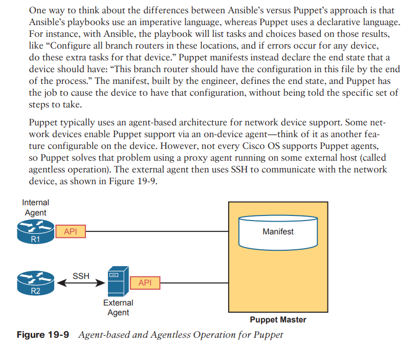

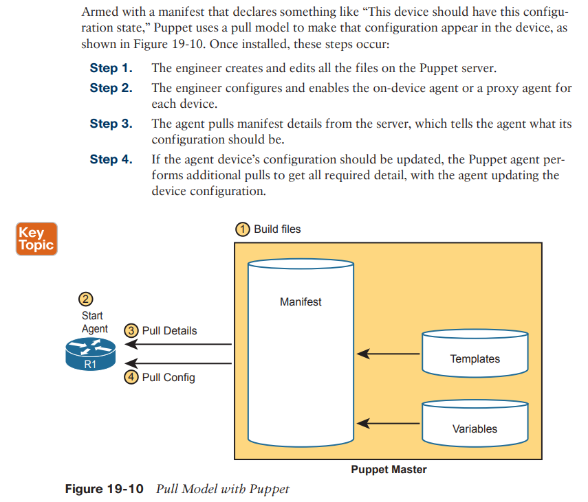

**
**
**Chef**

As with Puppet, in production you probably run Chef as a server (called server-client mode), with multiple Chef workstations used by the engineering staff to build Chef files that are stored on the Chef server. However, you can also run Chef in standalone mode (called Chef Zero), which is helpful when you’re just getting started and learning in the lab.

Once Chef is installed, you create several text files with different components, like the following:

■ **Resource**: The configuration objects whose state is managed by Chef; for instance, a set of configuration commands for a network device—analogous to the ingredients in a recipe in a cookbook

■ **Recipe**: The Chef logic applied to resources to determine when, how, and whether to act against the resources—analogous to a recipe in a cookbook

■ **Cookbooks**: A set of recipes about the same kinds of work, grouped together for easier management and sharing

■ **Runlist**: An ordered list of recipes that should be run against a given device

Chef uses an architecture similar to Puppet. For network devices, each managed device (called a Chef node or Chef client) runs an agent. The agent performs configuration monitoring in that the client pulls recipes and resources from the Chef server and then adjusts its configuration to stay in sync with the details in those recipes and runlists. Note however that Chef requires on-device Chef client code, and many Cisco devices do not support a Chef client, so you will likely see more use of Ansible and Puppet for Cisco device configuration management .