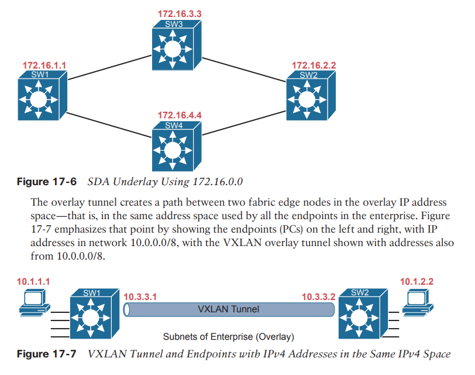

SDA (Software Defined Access)

Enterprises use **SDA **as a better way to build and operate a campus network.

**Cisco Software-Defined Access** (**SDA**) creates an entirely new way to build campus LANs as compared with the traditional methods of networking.

SDA uses the software-defined architectural model, with a controller and various APIs. It still uses a physical network with switches and routers, cables, and various endpoints. At the center sits the **Digital Network Architecture** (**DNA**) Center controller.

**Overlay: **The mechanisms to create VXLAN tunnels between SDA switches, which are then used to transport traffic from one fabric endpoint to another over the fabric.

**Underlay: **The network of devices and connections (cables and wireless) to provide IP connectivity to all nodes in the fabric, with a goal to support the dynamic discovery of all SDA devices and endpoints as a part of the process to create overlay VXLAN tunnels.

**Fabric:** The combination of overlay and underlay, which together provide all features to deliver data across the network with the desired features and attributes.

The underlay supports some new concepts with a tunneling method called VXLAN. Traffic sent by the endpoint devices flows through VXLAN tunnels in the overlay—a completely different process than traditional LAN switching and IP routing.

The overlay drawing at the top of the figure shows only two switches—called fabric edge nodes, because they happen to be at the edges of the SDA fabric—with a tunnel labeled VXLAN connecting the two. Both concepts (underlay and overlay) together create the SDA fabric.

* * *

**The SDA Underlay **

With SDA, the underlay exists to provide connectivity between the nodes in the SDA environment for the purpose of supporting VXLAN tunnels in the overlay network.

Companies can use their existing campus network and add new configuration to create an underlay network or they can purchase some new switches and build the SDA network.

**Using Existing Gear for the SDA Underlay**

SDA can be added into an existing campus LAN, but doing so has some risks and restrictions. First and foremost, you have to be careful not to disrupt the current network while adding the new SDA features to the network.

**The issues include **

■ Because of the possibility of harming the existing production configuration, DNA Center should not be used to configure the underlay if the devices are currently used in production. (DNA Center will be used to configure the underlay with deployments that use all new hardware.)

■ The existing hardware must be from the SDA compatibility list, with different models supported depending on their different SDA roles (see a link at www.cisco.com/go/sda).

■ The device software levels must meet the requirements, based on their roles, as detailed in that same compatibility list.

The SDA underlay configuration requires you to think about and choose the different SDA roles filled by each device. If you look for the hardware compatibility list linked from ***www.cisco.com/go/sda***, you will see different lists of supported hardware and software depending on the roles. These roles include

**Fabric edge node:** A switch that connects to endpoint devices (similar to traditional access switches)

**Fabric border node: **A switch that connects to devices outside SDA’s control, for example, switches that connect to the WAN routers or to an ACI data center

**Fabric control node: **A switch that performs special control plane functions for the underlay (LISP), requiring more CPU and memory

**Using New Gear for the SDA Underlay**

When buying new hardware for the SDA fabric—that is, a greenfield design—you remove many of the challenges that exist when deploying SDA on existing gear.

When planning a greenfield SDA design, plan to use SDA-compatible hardware, but also think about these traditional LAN design points:

■ The number of ports needed in switches in each wiring closet
■ The port speeds required
■ The benefit of a switch stack in each wiring closet
■ The cable length and types of cabling already installed
■ The need for power (PoE/PoE+)
■ The power available in each new switch versus the PoE power requirements
■ Link capacity (speed and number of links) for links between switches

As far as the topology, traditional campus design does tell us how to connect devices, but SDA does not have to follow those traditional rules.

In comparison, a greenfield SDA fabric uses a **routed access layer design**.

A **routed access layer design** simply means that all the LAN switches are **Layer 3 switches**, with routing enabled, so all the links between switches operate as Layer 3 links.

With a greenfield **SDA** deployment—that is, all new gear that you can allow to be configured by **DNA Center**—**DNA Center** will configure the devices’ underlay configuration to use a **routed access layer.**

**
**

* * *

**The SDA Overlay**

When you first think of the SDA overlay , think of this kind of sequence. First, an endpoint sends a frame that will be delivered across the SDA network. The first SDA node to receive the frame encapsulates the frame in a new message—using a tunneling specification called VXLAN—and forwards the frame into the fabric. Once the ingress node has encapsulated the original frame in VXLAN, the other SDA nodes forward the frame based on the VXLAN tunnel details. The last SDA node removes the VXLAN details, leaving the original frame, and forwards the original frame on toward the destination endpoint.

All that work happens in each switch’s **ASIC.**
**
**

**VXLAN Tunnels in the Overlay (Data Plane) **
**
**

**SDA encapsulates incoming data link frames in a tunneling technology for delivery across the SDA network, with these goals in mind: **

■ The VXLAN tunneling (the encapsulation and de-encapsulation) must be performed by the ASIC on each switch so that there is no performance penalty. (That is one reason for the SDA hardware compatibility list: the switches must have ASICs that can perform the work.)

■ The VXLAN encapsulation must supply header fields that SDA needs for its features, so the tunneling protocol should be flexible and extensible, while still being supported by the switch **ASICs**.

■ The tunneling encapsulation needs to encapsulate the entire data link frame instead of encapsulating the IP packet. That allows SDA to support **Layer 2** forwarding features as well as **Layer 3** forwarding features.

To support the VXLAN encapsulation, the underlay uses a **separate IP address space** as compared with the rest of the enterprise, including the endpoint devices that send data over the SDA network.

**LISP for Overlay Discovery and Location (Control Plane) **

Nodes in the SDA network do not do these traditional same control plane actions to support endpoint traffic. (Looking for mac address in Mac table/Looking for path in routing table)

**Instead, they do these things:**

■ Fabric edge nodes—SDA nodes that connect to the edge of the SDA fabric—learn the location of possible endpoints using traditional means, based on their MAC address, individual IP address, and by subnet, identifying each endpoint with an endpoint identifier (**EID**).

■ The fabric edge nodes register the fact that the node can reach a given endpoint (EID) into a database called the** LISP map server**.

■ The **LISP**  **map server** keeps the list of endpoint identifiers (EIDs) and matching **routing locators (RLOCs)** (which identify the fabric edge node that can reach the EID).

■ In the future, when the fabric data plane needs to forward a message, it will look for and find the destination in the LISP map server’s database.

When new incoming frames arrive, the** ingress tunnel router (ITR)**—the SDA node that receives the new frame from outside the SDA fabric—needs some help from the control plane.

Because SDA always forwards frames in the fabric over some VXLAN tunnel , what tunnel should the ITR use when forwarding the frame?

*The steps begin at step 3, as a continuation of Figure 17-8*

**3.** An Ethernet frame to a new destination arrives at ingress edge node SW1 (upper left), and the switch does not know where to forward the frame.

**4.** The ingress node sends a message to the LISP map server asking if the LISP server knows how to reach IP address 10.1.3.1.

**5.** The LISP map server looks in its database and finds the entry it built back at step 1 in the previous figure, listing SW3’s RLOC of 172.16.3.3.

**6.** The LISP map server contacts SW3—the node listed as the RLOC—to confirm that the entry is correct.

**7.** SW3 completes the process of informing the ingress node (SW1) that 10.1.3.1 can be reached through SW3.

To complete the story, now that ingress node SW1 knows that it can forward packets sent to endpoint 10.1.3.1 to the edge node with RLOC 172.16.3.3 (that is, SW3), SW1 encapsulates the original Ethernet frame as shown in Figure 17-9, with the original destination IP address of 10.1.3.1. It adds the IP, UDP, and VXLAN headers shown so it can deliver the message over the SDA network, with that outer IP header listing a destination IP address of the RLOC IP address, so that the message will arrive through the SDA fabric at SW3, as shown in Figure 17-10.

* * *

**DNA Center and SDA Operation **
**
**
**Cisco DNA Center** (www.cisco.com/go/dnacenter) has two notable roles:
■ As the controller in a network that uses Cisco SDA

■ As a network management platform for traditional (non-SDA) network devices, with an expectation that one day DNA Center may become Cisco’s primary enterprise network management platform

**SDA and DNA Center** go together, work closely together, and any serious use of SDA requires the use of DNA Center.

**Cisco DNA Center **exists as a software application that Cisco delivers pre-installed on a Cisco DNA Center appliance.

**Cisco DNA Center **includes a robust northbound **REST**  **API **along with a series of **southbound APIs**. For most of us, the **northbound API** matters most, because as the user of SDA networks, you interact with SDA using Cisco DNA Center’s northbound REST API or the GUI interface.

**Cisco DNA Center** supports several southbound APIs so that the controller can communicate with the devices it manages. You can think of these as two categories:

■ Protocols to support traditional networking devices/software versions: Telnet, SSH, SNMP

■ Protocols to support more recent networking devices/software versions: NETCONF, RESTCONF

**Cisco DNA Center and Scalable Groups**

SDA creates many interesting new and powerful features beyond how traditional campus networks work.

**Problems with traditional ip based security:**

You never know if an ACE was useful for one requirement or for many. If a requirement was removed, and you were even told which old project caused the original requirement so that you could look at your notes, you would not know if removing the ACEs would harm other requirements.

Most of the time, ACL management suffers with these kinds of issues :

■ ACEs cannot be removed from ACLs because of the risk of causing failures to the logic for some other past requirement.

■ New changes become more and more challenging due to the length of the ACLs.

■ Troubleshooting ACLs as a system—determining whether a packet would be delivered from end-to-end—becomes an even greater challenge.

**SDA Security Based on User Groups **

Imagine you could instead enforce security without even thinking about IP address ranges and ACLs. SDA does just that, with simple configuration, and the capability to add and remove the security policies at will.

The SDA policy model solves the configuration and operational challenges with traditional ACLs. In fact, all those real issues with managing IP ACLs on each device are no longer issues with SDA’s group-based security model.

For instance:

■ The engineer can consider each new security requirement separately, without analysis of an existing (possibly lengthy) ACL.

■ Each new requirement can be considered without searching for all the ACLs in the likely paths between endpoints and analyzing each and every ACL .

■ DNA Center (and related software) keeps the policies separate, with space to keep notes about the reason for the policy.

■ Each policy can be removed without fear of impacting the logic of the other policies.

SDA and Cisco DNA achieve this particular feature by tying security to groups of users, called **scalable groups**, with each group assigned a **scalable group tag** (**SGT**). Then the engineer configures a grid that identifies which **SGTs** can send packets to which other **SGTs**.

The ingress SDA node starts a process by sending messages to DNA Center. DNA Center then works with security tools in the network, like **Cisco’s Identity Services Engine **(**ISE**), to identify the users and then match them to their respective SGTs. DNA Center then checks the logic similar to Table 17-2. If DNA Center sees a permit action between the source/destination pair of **SGTs**, **DNA Center** directs the edge nodes to create the VXLAN tunnel , as shown in Figure 17-15. If the security policies state that the two SGTs should not be allowed to communicate, DNA Center does not direct the fabric to create the tunnel, and the packets do not flow.

* * *

**DNA Center as a Network Management Platform **

**Cisco Prime Infrastructure (PI) (Example of Network Management Platform)**

For many years, Cisco Prime Infrastructure has been Cisco’s primary network management product for the enterprise.

It includes the following features:

■ Single-pane-of-glass: Provides one GUI from which to launch all PI functions and features

■ Discovery, inventory, and topology: Discovers network devices, builds an inventory, and arranges them in a topology map

■ Entire enterprise: Provides support for traditional enterprise LAN, WAN, and data center management functions

■ Methods and protocols: Uses SNMP, SSH, and Telnet, as well as CDP and LLDP, to discover and learn information about the devices in the network

■ Lifecycle management: Supports different tasks to install a new device (day 0), configure it to be working in production (day 1), and perform ongoing monitoring and make changes (day n)

■ Application visibility: Simplifies QoS configuration deployment to each device

■ Converged wired and wireless: Enables you to manage both the wired and wireless LAN from the same management platform

■ Software Image Management (SWIM): Manages software images on network devices and automates updates

■ Plug-and-Play: Performs initial installation tasks for new network devices after you physically install the new device, connect a network cable, and power on

PI itself runs as an application on a server platform with GUI access via a web browser.

**DNA Center Similarities to Traditional Management (Example -> Cisco Prime Infrastructure)**

If you read the user’s guide for DNA Center and look through all the features, you will find all the features just listed here as traditional management features.

Both can discover network devices and create a network topology map.

**DNA Center Differences with Traditional Management (Example -> Cisco Prime Infrastructure)**

The largest difference: Cisco DNA Center supports SDA, whereas other management apps do not.

In terms of intent and strategy, Cisco focuses their development of Cisco DNA Center features toward simplifying the work done by enterprises, with resulting reduced costs and much faster deployment of changes. Cisco DNA Center features help make initial installation easier, simplify the work to implement features that traditionally have challenging configuration, and use tools to help you notice issues more quickly. Some of the features unique to Cisco DNA Center include:

■ EasyQoS: Deploys QoS, one of the most complicated features to configure manually, with just a few simple choices from Cisco DNA Center

■ Encrypted traffic analysis: Enables Cisco DNA to use algorithms to recognize security threats even in encrypted traffic

■ Device 360 and Client 360: Gives a comprehensive (360-degree) view of the health of the device

■ Network time travel: Shows past client performance in a timeline for comparison to current behavior

■ Path trace: Discovers the actual path packets would take from source to destination based on current forwarding tables

All of Cisco Digital Network Architecture sets about to help customers reach some big goals: reduced costs, reduced risks, better security and compliance, faster deployment of services through automation and simplified processes, and the list goes on. Cisco DNA Center plays an important role, with all the functions available through its robust northbound API, and with its intent-based networking approach for SDA. **Cisco DNA Center represents the future of network management for Cisco enterprises.**

**
**