SDN (Software Defined Networking)

**The Data, Control, and Management Planes **

**The Data Plane (Forwarding plane)**

The term data plane refers to the tasks that a networking device does to forward a message.

In other words, anything to do with receiving data, processing it, and forwarding that same data.

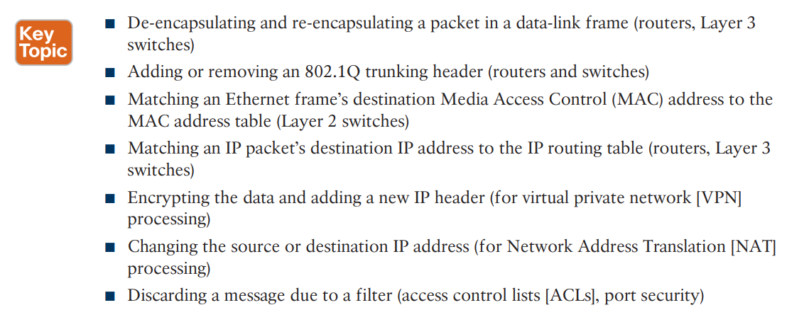

**The Control Plane **

The term control plane refers to any action that controls the data plane. Most of these actions have to do with creating the tables used by the data plane, tables like the IP routing table, an IP Address Resolution Protocol (ARP) table, a switch MAC address table, and so on.

Without the protocols and activities of the control plane, the data plane of traditional networking devices would not function well.

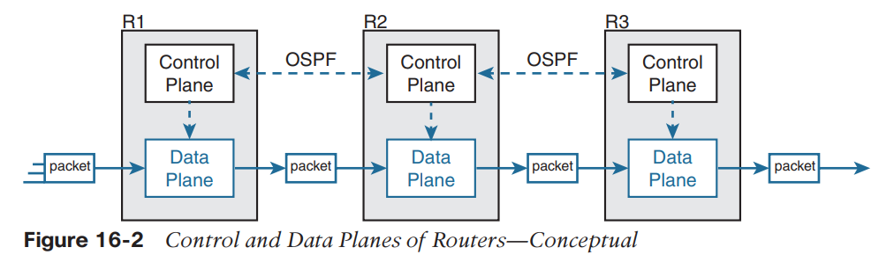

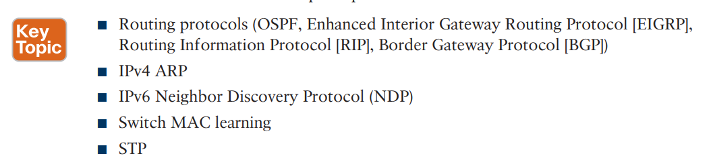

**The Management Plane **

The management plane performs overhead work as well, but that work does not directly impact the data plane. Instead, the management plane includes protocols that allow network engineers to manage the devices.

Telnet and Secure Shell (SSH) are two of the most obvious management plane protocols.

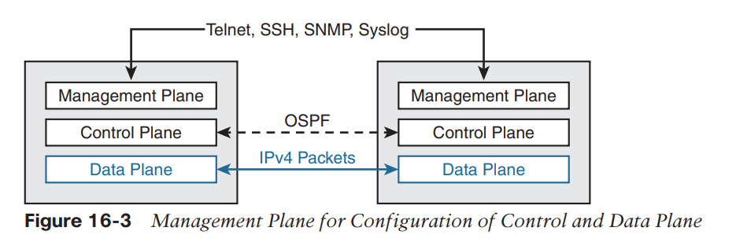

From their first introduction into the marketplace in the mid-1990s, **LAN switches** needed a faster data plane than a generalized **CPU** could process in software. As a result, hardware switches have always had specialized hardware to perform data plane processing.

First, the switching logic occurs not in the CPU with software, but in an application-specific integrated circuit (**ASIC**). An **ASIC **is a chip built for specific purposes, such as for message processing in a networking device.

Second, the **ASIC **needs to perform table lookup in the **MAC **address table, so for fast table lookup, the switch uses a specialized type of memory to store the equivalent of the **MAC **address table: ternary content-addressable memory (**TCAM**).

The ASIC can feed the fields to be matched, like a MAC address value, into the TCAM, and the TCAM returns the matching table entry, without a need to run a search algorithm.

Most of the control and management plane functions run in IOS. The data plane function (and the control plane function of MAC learning) happens in the ASIC.

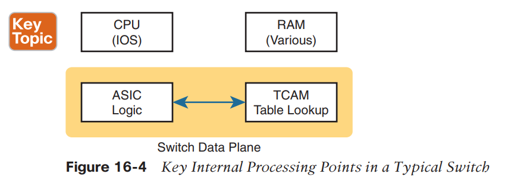

**Controllers and Centralized Control **
Most traditional control plane processes use a distributed architecture.
For example, each router runs its own OSPF routing protocol process.

A controller, or SDN controller, centralizes the control of the networking devices. The degree of control, and the type of control, varies widely.

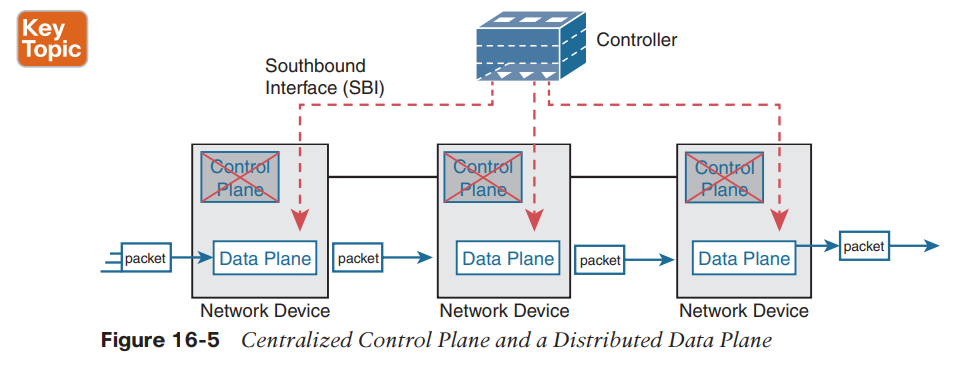

**The Southbound Interface**

It is an interface between a program (the controller) and a program (on the networking device) that lets the two programs communicate.

There is an interface between the controller and those devices, and given its location at the bottom part of drawings, the interface came to be known as the southbound interface, or **SBI**.

An **SBI **often includes a protocol, so that the controller and devices can communicate, but it often includes an **application programming interface** (**API**).

While a protocol exists as a document, often from a standards body, an API often exists as usable code—functions, variables, and data structures—that can be used by one program to communicate and copy structured data between the programs across a network.

■ OpenFlow (from the ONF; www.opennetworking.org)

■ OpFlex (from Cisco; used with ACI) *Chapter 16: Introduction to Controller-Based Networking*

■ CLI (Telnet/SSH) and SNMP (used with Cisco APIC-EM)

■ CLI (Telnet/SSH) and SNMP, and NETCONF (used with Cisco Software-Defined Access)

**The Northbound Interface**

A controller’s northbound interface (**NBI**) opens the controller so its data and functions can be used by other programs, enabling network programmability, with much quicker development. Programs can pull information from the controller, using the controller’s APIs. The **NBIs **also enable programs to use the controller’s capabilities to program flows into the devices using the controller’s **SBIs**.

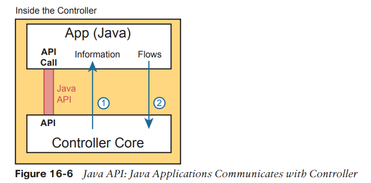

This particular controller happens to be written in **Java **and has a Java-based native API. Anyone—the same vendor as the controller vendor, another company, or even you—can write an app that runs on this same operating system that uses the controller’s **Java API**. By using that API to exchange data with the controller, the application can learn information about the network. The application can also program flows in the network—that is, ask the controller to add the specific match/action logic (**flows**) into the forwarding tables of the networking devices.

**REST **(Representational State Transfer) describes a type of API that allows applications to sit on different hosts, using **HTTP **messages to transfer data over the **API**.

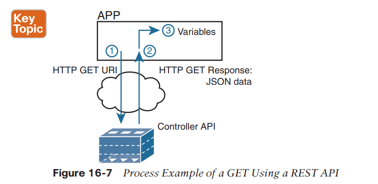

**Examples of Network Programmability and SDN **

■ OpenDaylight Controller
■ Cisco Application Centric Infrastructure (ACI)
■ Cisco APIC Enterprise Module (APIC-EM)

One common form of **SDN **comes from the **Open Networking Foundation (ONF) **and is billed as Open SDN.

**OpenFlow **defines the concept of a controller along with an IP-based **SBI **between the controller and the network devices.

An **OpenFlow **switch can act as a Layer 2 switch, a Layer 3 switch, or in different ways and with great flexibility beyond the traditional model of a Layer 2/3 switch.

**OpenDayLight Controller**

OpenDaylight took many of the same open-source principles used with Linux, with the idea that if enough vendors worked together on a common open-source controller, then all would benefit.

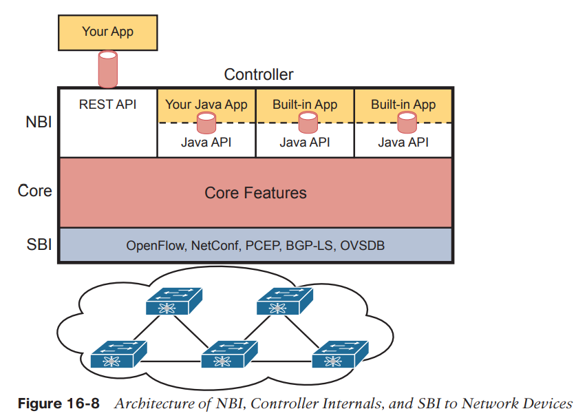

A vendor can then take ODL, use the parts that make sense for that vendor, add to it, and create a commercial ODL controller.

**The Cisco Open SDN Controller (OSC) **

At one point back in the 2010s, Cisco offered a commercial version of the OpenDaylight controller called the Cisco Open SDN Controller (OSC).

Cisco no longer produces and sells the Cisco OSC.

**ACI Physical Design: Spine and Leaf**

With ACI, the physical network has a number of spine switches and a number of leaf switches.

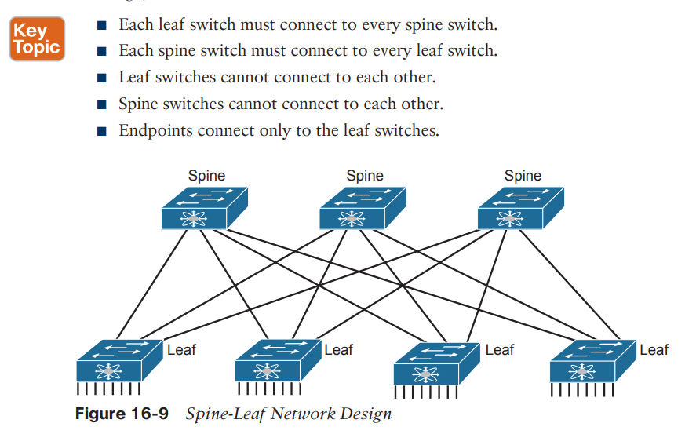

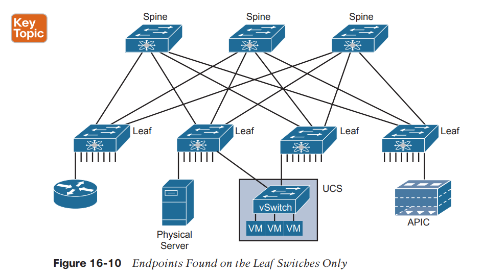

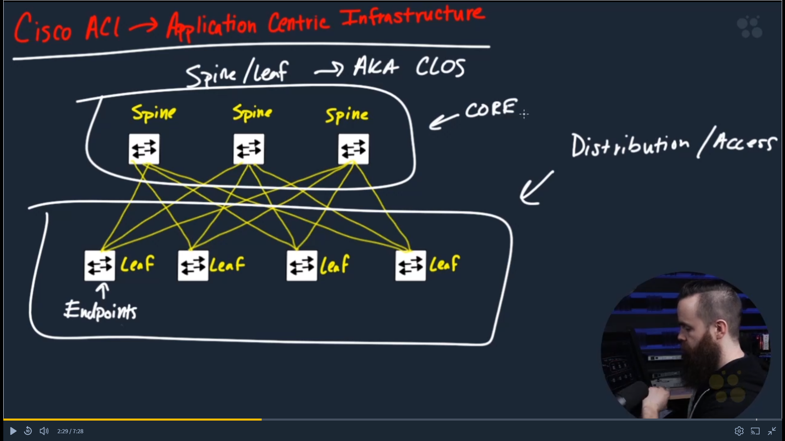

**Application centric view**
**
**
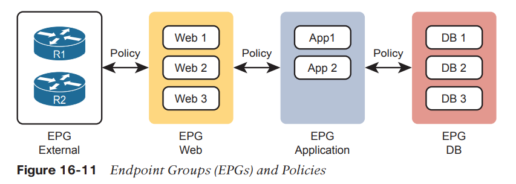

To make it all work, **ACI **uses a centralized controller called the **Application Policy Infrastructure Controller (APIC)**.

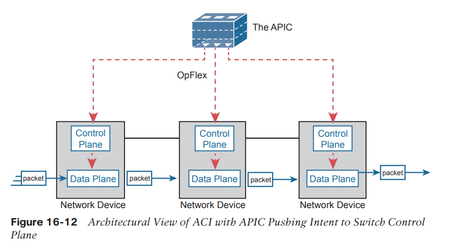

The APIC, of course, has a convenient GUI, but the power comes in software control—that is, network programmability.

But all these players access the ACI system by interfacing to the APIC as depicted in Figure 16-13; the network engineer no longer needs to connect to each individual switch and configure CLI commands.

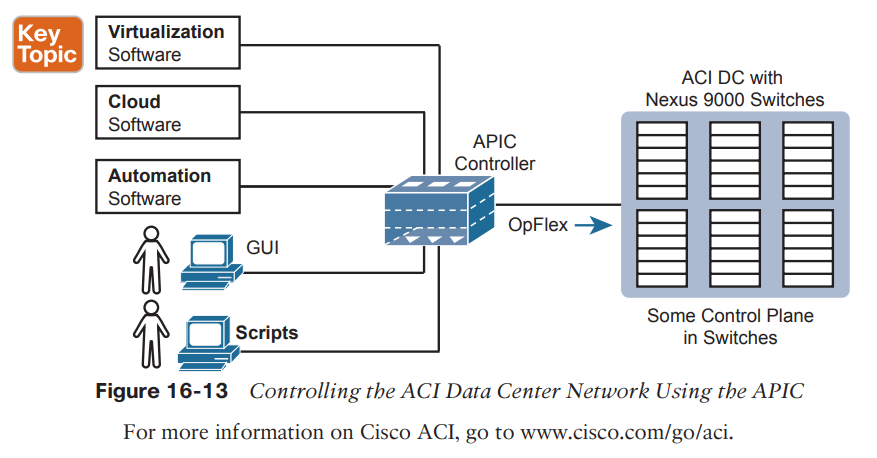

**Statefull SDN**
Only the controller has access to the control plane for each devices.

**Stateless SDN**
Each devices has it's own plane controller. (APIC)

**APIC-EM Basics**
APIC is for data centers and APIC-EM is for campus enterprises.

Cisco looked for ways to add the benefits of network programmability with a centralized controller while keeping the same traditional switches and routers in place.

Cisco APIC-EM does just that: offer enterprise SDN using the same switches and routers already installed in networks.

Cisco and its partners can bring new and interesting management applications to market. It includes these applications, as depicted in Figure 16-14:

■ Topology map: The application discovers and displays the topology of the network.

■ Path Trace: The user supplies a source and destination device, and the application shows the path through the network, along with details about the forwarding decision at each step.

■ Plug and Play: This application provides Day 0 installation support so that you can unbox a new device and make it IP reachable through automation in the controller.

■ Easy QoS: With a few simple decisions at the controller, you can configure complex QoS features at each device.

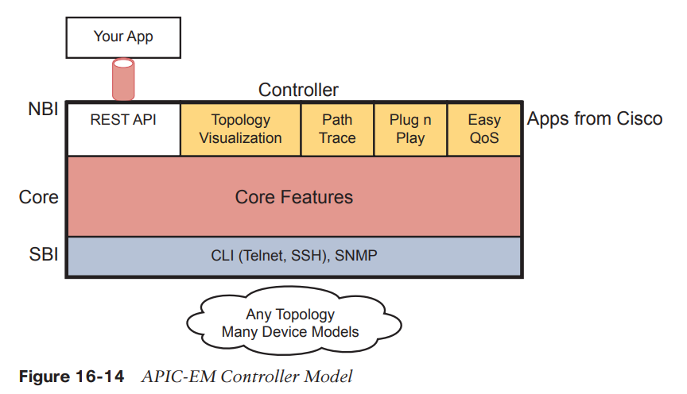

APIC-EM does not directly program the data or control planes, but it does interact with the management plane via Telnet, SSH, and/or SNMP; consequently, it can indirectly impact the data and control planes. The APIC-EM controller does not program flows into tables or ask the control plane in the devices to change how it operates. But it can interrogate and learn the configuration state and operational state of each device, and it can reconfigure each device, therefore changing how the distributed control and data plane operates.

Cisco announced the end of marketing for the APIC-EM product.

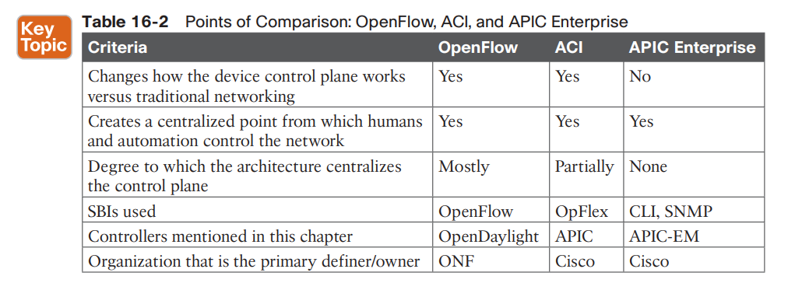

*If you want to learn more about the Cisco solutions, consider using both Cisco DevNet (the Cisco Developer Network) and dCloud (Demo cloud). Cisco provides its DevNet site (https://developer.cisco.com) for anyone interested in network programming, and the Demo Cloud site (https://dcloud.cisco.com) for anyone to experience or demo Cisco products. At the time this book went to press, DevNet had many APIC-EM labs, while both sites had a variety of ACI-based labs.*

**Those exam topics include **
**
**
**6.1: Explain how automation impacts network management **
**6.2: Compare traditional networks with controller-based networking **

**6.4: Compare traditional campus device management with Cisco DNA Center enabled device management**

**
**

Configuration management refers to any feature that changes device configuration, with automated configuration management doing so with software (program) control.

For instance, Cisco’s ACI uses the APIC controller. You do not configure the devices directly, but the APIC pushes configuration down to the ACI switches that it builds based on its interpretation of the policies configured by the engineer.

Operational network management includes monitoring, gathering operational data, reporting, and alerting humans to possible issues.

Today people might use that term or these other synonyms to describe some of the newer networking options that happen to use controllers:

■ Software Defined Networking
■ Software Defined Architecture
■ Programmable Networks
■ Controller-Based Networks

**How Automation Impacts Network Management **

First, centralized controllers formalize and define data models for the configuration and operational data about networks.

To build a controller-based network with APIs, all the data about the network needs to be defined in a data model so programs can use that data via API calls.

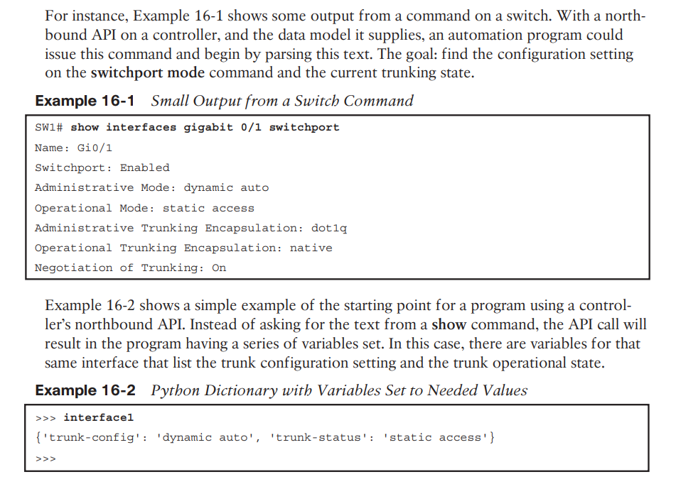

For instance, both APIC-EM and its successor DNA Center provide a path trace feature. The applications show the path of a packet from source to destination, with the forwarding logic used at each node.

Now imagine writing that application with either of these two approaches.

■ One API call that returns a list of all devices and their running configuration, with other API calls to collect each device’s MAC address tables and/or their IP routing tables. Then you have to process that data to find the end-to-end path.

■ One API call to which you pass the source and destination IP addresses and TCP/UDP ports, and the API returns variables that describe the end-to-end path, including device hostnames and interfaces. The variables spell out the path the packet takes through the network.

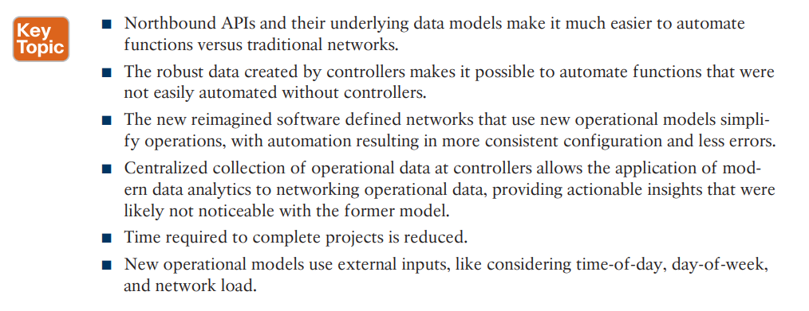

**Those models include the three most likely to be seen from Cisco in an enterprise: **

**
**
Software-Defined Access (SDA)
SoftwareDefined WAN (SD-WAN)
Application Centric Infrastructure (ACI)

This changes the operating paradigm in many cases, with the controller determining many device-specific details:

■ The network engineer does not need to think about every command on every device.

■ The controller configures the devices with consistent and streamlined settings.

■ The result: faster and more consistent changes with fewer issues.

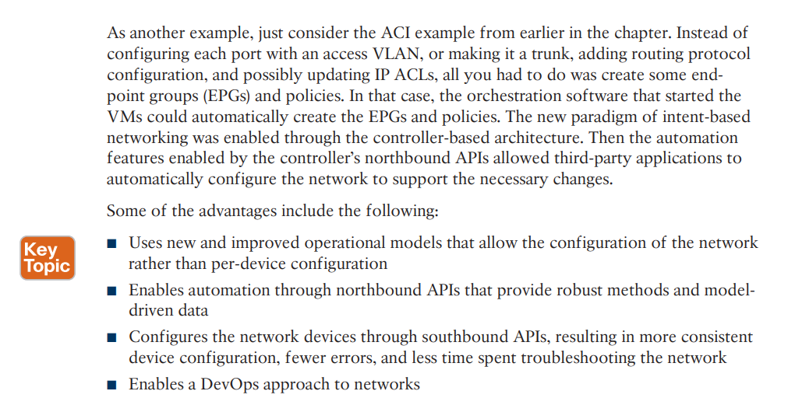

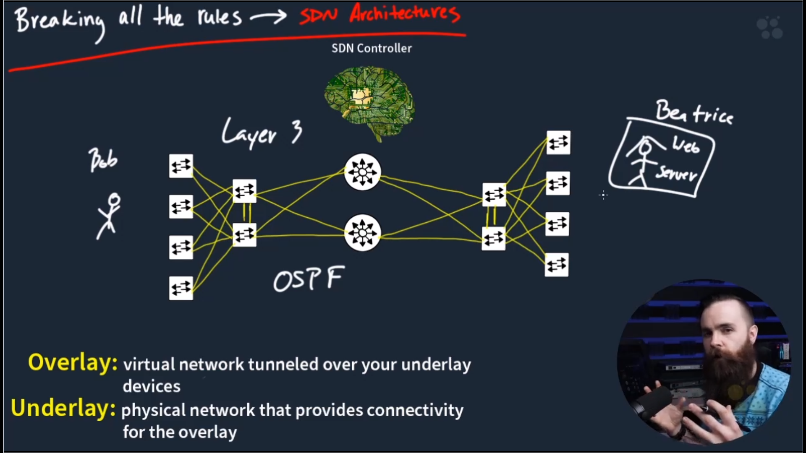

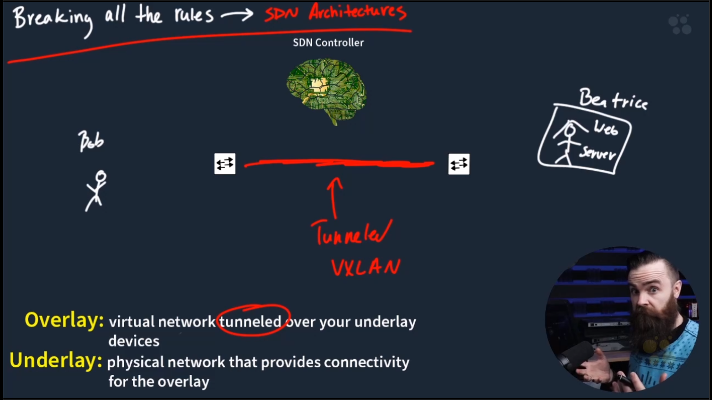

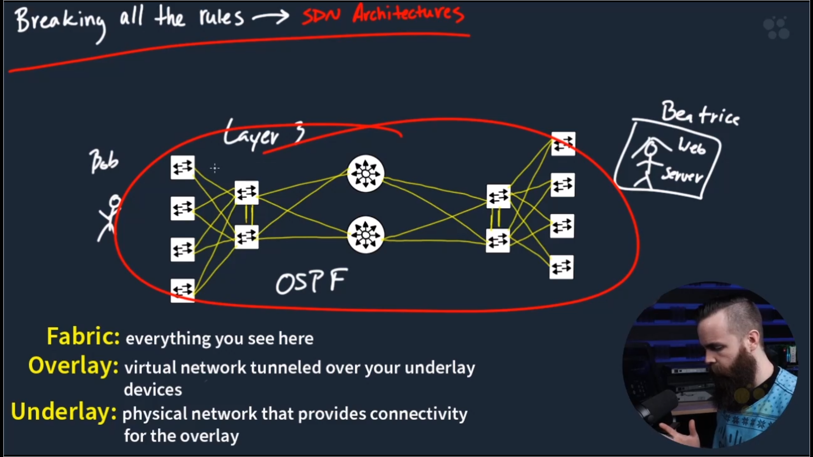