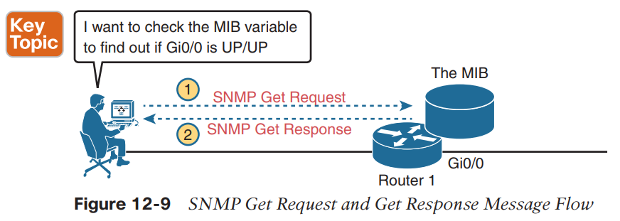
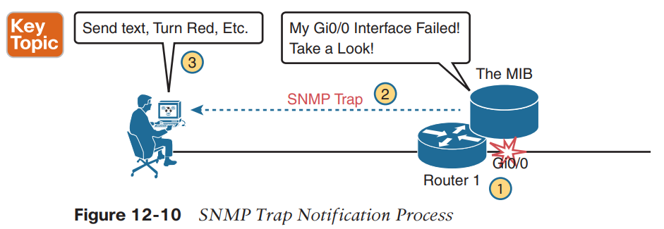
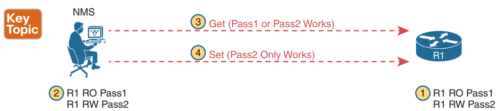

SNMP

**SNMP **is an application layer protocol that provides a message format for communication between what are termed managers and agents.

An SNMP **manager **is a network management application running on a PC or server, with that host typically being called a Network Management Station (**NMS**).

Many SNMP **agents **exist in the network, one per device that is managed.

The Management Information Base (**MIB**), has some core elements in common across most networking devices.

The **NMS **typically polls the SNMP agent on each device.

Specifically, the NMS uses the SNMP **Get**, **GetNext**, and **GetBulk **messages (together referenced simply as Get messages) to ask for information from an agent.

SNMP agents send a **Trap **or **Inform **SNMP message to the NMS to list the state of certain MIB variables when those variables reach a certain state.

Trap messages use UDP. (no reliability)
Inform use UDP but with some reliability. (application layer reliability)

Every SNMP agent has its own Management Information Base.
The MIB defines each variable as an object ID (OID)

**Securing SNMP**

First, one strong method to secure SNMP is to use ACLs to limit SNMP messages to those from known servers only.

As for the SNMP protocol messages, all versions of SNMP support a basic clear-text password mechanism, although none of those versions refer to the mechanism as using a password. SNMP Version 3 (SNMPv3) adds more modern security as well.

SNMPv1 defines both a read-only community and a read-write community. The read-only (RO) community allows Get messages, and the read-write (RW) community allows both reads and writes (Gets and Sets).

SNMPv3 does away with communities and replaces them with the following features:

■ Message integrity: This mechanism, applied to all SNMPv3 messages, confirms whether or not each message has been changed during transit.

■ Authentication: This optional feature adds authentication with both a username and password, with the password never sent as clear text. Instead, it uses a hashing method like many other modern authentication processes.

■ Encryption (privacy): This optional feature encrypts the contents of SNMPv3 messages so that attackers who intercept the messages cannot read their contents.