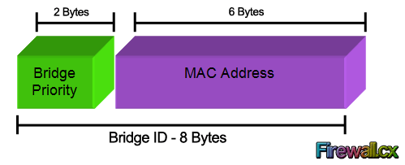
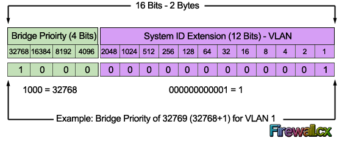
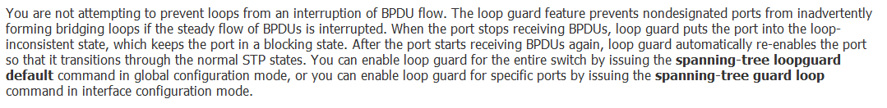

# Spanning-Tree Protocol
## Background Information
`802.1D Spanning Tree Protocol (STP)` has a drawback of slow convergence. Cisco Catalyst switches support three types of STPs, which are PVST+, rapid-PVST+ and MST.

`PVST+` is based on IEEE802.1D standard and includes Cisco proprietary extensions such as BackboneFast, UplinkFast, and PortFast.

`RSTP` (IEEE 802.1w) naively includes most of the Cisco proprietary enhancements to the 802.1D Spanning Tree, such as BackboneFast and UplinkFast.

`Rapid-PVST+` is based on IEEE 802.1w standard and has a faster convergence than 802.1D.
`Rapid-PVST+` has these unique features:

- Uses Bridge Protocol Data Unit (BPDU) version 2 which is backward compatible with the 802.1D STP, which uses BPDU version 0.
- All the switches generate BPDUs and send out on all the ports every 2 seconds, whereas in 802.1D STP only the root bridge sends the configuration BPDUs.
- Port Roles—Root port, designated port, alternate port and backup port.
- Port States—Discarding, Learning, and Forwarding.
- Port Types—Edge Port (PortFast), Point-to-Point and Shared port.

Rapid-PVST uses RSTP to provide faster convergence. When any RSTP port receives legacy 802.1D BPDU, it falls back to legacy STP and the inherent fast convergence benefits of 802.1w are lost when it interacts with legacy bridges.

## Root Switch
The root switch is the switch with the lowest numeric value for the BID. Because the two-part BID starts with the priority value, essentially the switch with the lowest priority becomes the root.

For example, if one switch has priority 4096, and another switch has priority 8192, the switch with priority 4096 wins, regardless of what MAC address was used to create the BID for each switch.

If a tie occurs based on the priority portion of the BID, the switch with the lowest MAC address portion of the BID is the root.

Every switch has an identity when they are part of a network. This identity is called the Bridge ID or BID. It is an 8 byte field which is divided into two parts. The first part is a 2-byte Bridge Priority field (which can be configured) while the second part is the 6-byte MAC address of the switch. While the Bridge Priority is configurable, the MAC address is unique among all switches and the sum of these two ensures a unique Bridge ID.

The above Bridge ID assumes there is one Spanning Tree instance for the entire network. This is also called Common Spanning-Tree (CST).

As networks begun to grow and become more complex, VLANs were introduced, allowing the creation of multiple logical and physical networks. It was then necessary to run multiple instances of STP in order to accommodate each network - VLAN. These multiple instances are called Multiple Spanning Tree (MST), Per-VLAN Spanning Tree (PVST) and Per-VLAN Spanning Tree Plus (PVST+).

In order to accommodate the additional VLAN information, the Extended System ID field was introduced, borrowing 12 bits from the original Bridge Priority:

The Bridge Priority value and the Extended System ID extension together make up a 16 bit (2-byte) value. The Bridge Priority making up the left most bits, is a value of 0 to 61440. The Extended System ID is a value of 1 to 4095 corresponding to the respective VLAN participating in STP. The Bridge Priority increments in blocks of 4096 to allow the System ID Extension to squeeze in between each increment. This is clearly shown in the below analysis:

We should note that the Bridge Priority Field can only be set in increments of 4096. This means that possible values are: 4096, 8192, 12288, 16384, 20480, 24576, 28672, 32768 etc. By default, Cisco’s Per-VLAN Spanning-Tree Plus (PVST+) adds this System ID Extension (sys-id-ext) to the Bridge Priority.

## Root Cost
The cost is the sum of the costs of all the switch ports the frame would exit if it flowed over that path. (The calculation ignores the inbound ports.)

Switches need a tiebreaker to use in case the best root cost ties for two or more paths. If a tie occurs, the switch applies these three tiebreakers to the paths that tie, in order, as follows:

- Choose based on the lowest neighbor bridge ID.
- Choose based on the lowest neighbor port priority.
- Choose based on the lowest neighbor internal port number.

## Designated Ports
The designated port (DP) on each LAN segment is the switch port that advertises the lowest-cost Hello onto a LAN segment. When a nonroot switch forwards a Hello, the nonroot switch sets the root cost field in the Hello to that switch’s cost to reach the root. In effect, the switch with the lower cost to reach the root, among all switches connected to a segment, becomes the DP on that segment.

## STP Timers
For various reasons, the STP convergence process requires the use of three timers, listed in Table 9-7. Note that all switches use the timers as dictated by the root switch, which the root lists in its periodic Hello BPDU messages.

## Ports states
STP moves an interface from blocking to listening, then to learning, and then to forwarding state. STP leaves the interface in each interim state for a time equal to the forward delay timer, which defaults to 15 seconds.

## RSTP

For instance, imagine a failure case in which a link remains up, but for some reason, a nonroot switch stops hearing the Hello BPDUs it had been hearing in the past. STP requires a switch to wait for MaxAge seconds, which STP defines based on 10 times the Hello timer, or 20 seconds, by default. RSTP shortens this timer, defining MaxAge as three times the Hello timer. Additionally, RSTP can send messages to the neighboring switch to inquire whether a problem has occurred rather than wait for timers.

RSTP differs from STP in a few other ways as well. For instance, with STP, the root switch creates a Hello with all other switches, updating and forwarding the Hello. With RSTP, each switch independently generates its own Hellos. Additionally, RSTP allows for queries between neighbors, rather than waiting on timers to expire, as a means to avoid waiting to learn information.

Both STP and RSTP use port states, but with some differences. First, RSTP keeps both the learning and forwarding states as compared with STP, for the same purposes. However, RSTP does not even define a listening state, finding it unnecessary. Finally, RSTP renames the blocking state to the discarding state and redefines its use slightly.

RSTP uses the discarding state for what STP defines as two states: disabled state and blocking state. Blocking should be somewhat obvious by now: the interface can work physically, but STP/RSTP chooses to not forward traffic to avoid loops. STP’s disabled state simply meant that the interface was administratively disabled. RSTP just combines those into a single discarding state.

RSTP, to converge more quickly, avoids relying on timers. RSTP switches tell each other (using messages) that the topology has changed.

	spanning-tree vlan x root primary (on the switch that should be primary) 
	spanning-tree vlan x root secondary (on the switch that should be secondary

## Priority and System ID Extension

When the switch builds its BID to use for RSTP in a VLAN, it must combine the configured priority with the VLAN ID of that VLAN. Interestingly, the configured priority results in a 16-bit priority that always ends with 12 binary 0s. That fact makes the process of combining values to create the BID a little simpler for the switch and possibly a little simpler for network engineers once you understand it all.

## RSTP creates one tree—the Common Spanning Tree (CST)—while RPVST+ creates one tree for each and every VLAN. 

- RSTP sends one set of RSTP messages (BPDUs) in the network, no matter the number of VLANs, while RPVST+ sends one set of messages per VLAN.
- RSTP and RPVST+ use different destination MAC addresses: RSTP with multicast address 0180.C200.0000 (an address defined in the IEEE standard), and RPVST+ with multicast address 0100.0CCC.CCCD (an address chosen by Cisco).
- When transmitting messages on VLAN trunks, RSTP sends the messages in the native VLAN with no VLAN header/tag. RPVST+ sends each VLAN’s messages inside that VLAN—for instance, BPDUs about VLAN 9 have an 802.1Q header that lists VLAN 9.
- RPVST+ adds an extra type-length value (TLV) to the BPDU that identifies the VLAN ID, while RSTP does not (because it does not need to, as RSTP ignores VLANs.)
- Both view the 16-bit priority as having a 12-bit System ID Extension, with RSTP setting the value to 0000.0000.0000, meaning “no VLAN,” while RPVST+ uses the VLAN ID. In other words, standard RSTP behaves as if VLANs do not exist, while Cisco’s RPVST+ integrates VLAN information into the entire process.

## Useful Commands

	spanning-tree guard root

	spanning-tree guard loop

	errdisable recovery interval

- Change the priority vlaue in PVST+

		conf t
		spanning-tree vlan 1 priority 28672 (4098 * 8)

- Make a bridge to be always the root

		conf t
		spanning-tree vlan 1 root primary
