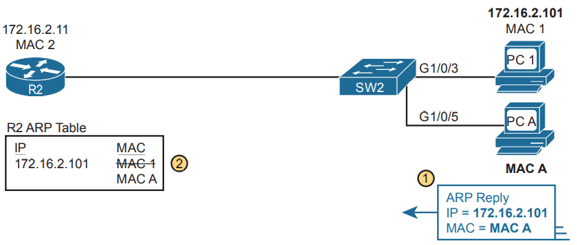
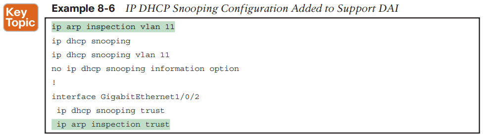
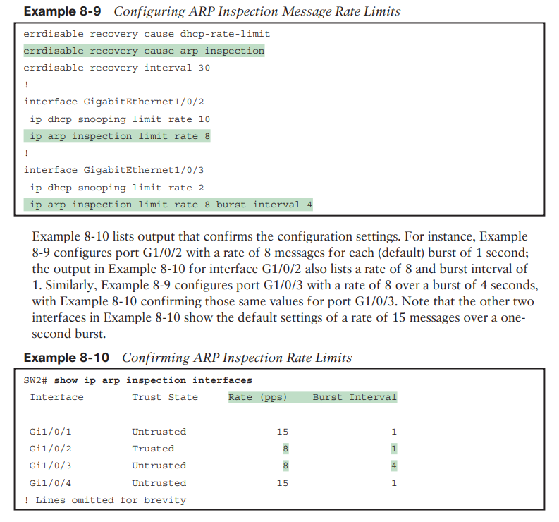

Security - DAI - Dynamic ARP Inpsection

### **DYNAMIC ARP INSPECTION (DAI)**

DAI’s core feature compares incoming ARP messages with two sources of data: the DHCP Snooping binding table and any configured ARP ACLs.

An attacker can just send an ARP reply—called a gratuitous ARP—triggering hosts to add incorrect ARP entries to their ARP tables.

##### **Gratuitous ARP as an Attack Vector**

A host might also want to inform all the hosts in the subnet about its MAC address.

ARP supports the idea of a gratuitous ARP message with these features:

- It is an ARP reply.
- It is sent without having first received an ARP request.
- It is sent to an Ethernet destination broadcast address so that all hosts in the subnet receive the message.

For instance, if a host’s MAC address is MAC A, and it changes to MAC B, to cause all the other hosts to update their ARP tables, the host could send a gratuitous ARP that lists an origin MAC of MAC B.

1. PC1 sends messages to some server on the left side of router R2.

2. The server replies to PC1’s IP address, but R2 forwards that packet to PC A’s MAC address, rather than to PC1.

3. PC A copies the packet for later processing.
4. PC A forwards the packet inside a new frame to PC1 so that PC1 still works.

**In short, DHCP snooping happens first, then ARP.**

For any DAI untrusted ports, DAI compares the ARP message’s origin IP and origin MAC address fields to the DHCP Snooping binding table.

Using ARP ACLs with DAI becomes useful for ports connected to devices that use static IP addresses rather than DHCP. Note that DAI looks for both the DCHP Snooping binding data and ARP ACLs.

Beyond that core feature, note that DAI can optionally perform other checks as well.

■ Messages with an Ethernet header source MAC address that is not equal to the ARP origin hardware (MAC) address

■ ARP reply messages with an Ethernet header destination MAC address that is not equal to the ARP target hardware (MAC) address

■ Messages with unexpected IP addresses in the two ARP IP address fields

**Configuring ARP Inspection on a Layer 2 Switch **

■ Choose whether to rely on DHCP Snooping, ARP ACLs, or both.

■ If using DHCP Snooping, configure it and make the correct ports trusted for DHCP Snooping .

■ Choose the VLAN(s) on which to enable DAI.

■ Make DAI trusted (rather than the default setting of untrusted) on select ports in those VLANs, typically for the same ports you trusted for DHCP Snooping.

*
*

**SW2# show ip arp inspection**
**SW2# show ip dhcp snooping binding**

**IP ARP Inspection Configuration Summary **

The following configuration checklist summarizes the commands included in this section about how to configure Dynamic IP ARP Inspection:

**Step 1.** Use the ip arp inspection vlan vlan-list global command to enable Dynamic ARP Inspection (DAI) on the switch for the specified VLANs.

**Step 2.** Separate from the DAI configuration, also configure DHCP Snooping and/or ARP ACLs for use by DAI.

**Step 3.** Configure the ip arp inspection trust interface subcommand to override the default setting of not trusted.

**Step 4.**  **(Optional):** Configure DAI rate limits and err-disabled recovery:

**Step A.**  **(Optional):** Configure the ip arp inspection limit rate number [burst interval seconds] interface subcommand to set a limit of ARP messages per second, or ARP messages for each configured interval.

**Step B.**  **(Optional):** Configure the ip arp inspection limit rate none interface subcommand to disable rate limits.

**Step C.**  **(Optional):** Configure the errdisable recovery cause arp-inspection global command to enable the feature of automatic recovery from err-disabled mode, assuming the switch placed the port in err-disabled state because of exceeding DAI rate limits.

**Step D.**  **(Optional):** Configure the errdisable recovery interval seconds global commands to set the time to wait before recovering from an interface err-disabled state (regardless of the cause of the err-disabled state).

**Step 5. (Optional):** Configure the ip arp inspection validate {[dst-mac] [src-mac] [ip]} global command to add DAI validation steps

**Limiting DAI Message Rates **

Like DHCP Snooping, DAI can also be the focus of a DoS attack with the attacker generating a large number of ARP messages. Like DHCP Snooping, DAI supports the configuration of rate limits to help prevent those attacks, with a reaction to place the port in an **errdisabled state**, and with the ability to configure automatic recovery from that **err-disabled state**.

■ DAI defaults to use rate limits for all interfaces (trusted and untrusted), with DHCP Snooping defaulting to not use rate limits.

■ DAI allows the configuration of a burst interval (a number of seconds), so that the rate limit can have logic like “x ARP messages over y seconds” (DHCP Snooping does not define a burst setting).

