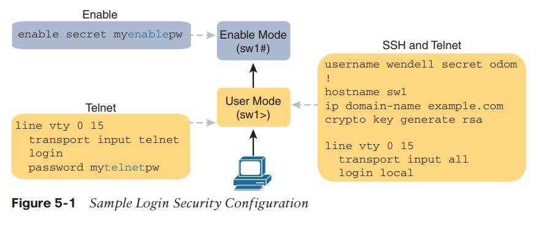
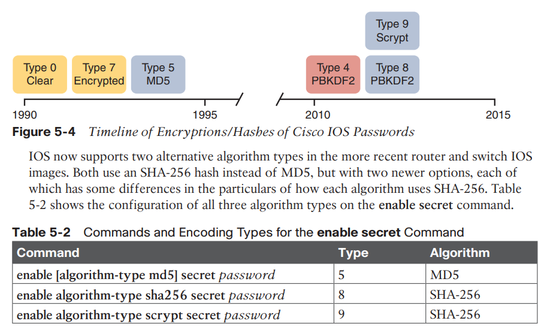
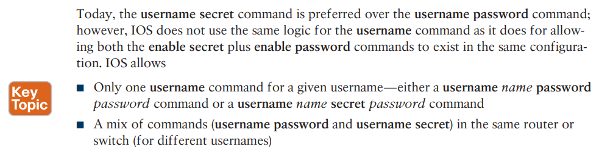
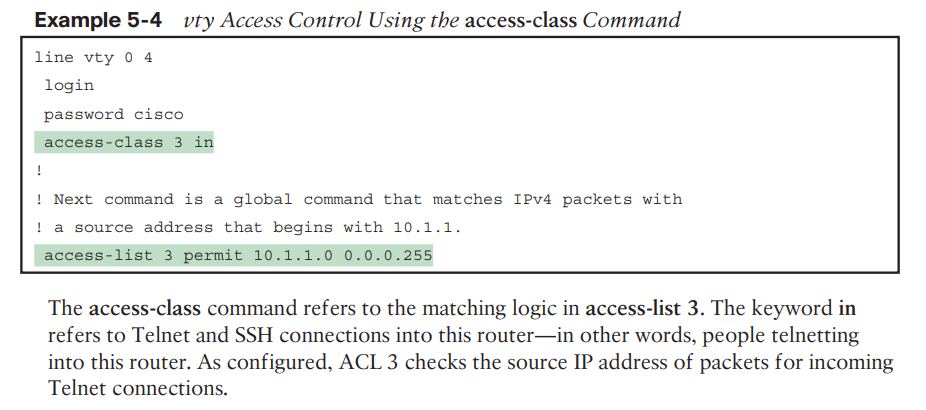

# Security - Devices
## Encrypting Older IOS Passwords with service password-encryption

	service password-encryption
	password password (console or vty mode)
	username name password password (global)
	enable password password (global)

While the service password-encryption global command encrypts passwords, the no service password-encryption global command does not immediately decrypt the passwords back to their clear-text state. Instead, the process works as shown in [Figure 5-2](https://learning.oreilly.com/library/view/ccna-200-301-official/9780135262726/ch05.xhtml#ch05fig2). Basically, after you enter the no service password-encryption command, the passwords remain encrypted until you change a password.

## Enable secret vs enable password 

Both commands configured: Users must use the password in the enable secret password command (and ignore the enable password password command).

Only one command configured: Use the password in that one command.

Neither command configured (default): Console users move directly to enable mode without a password prompt; Telnet and SSH users are rejected with no option to supply an enable password.

## Hash algorithms
https://learningnetwork.cisco.com/s/article/cisco-routers-password-types

MD5(enable secret): Think of MD5 as a rather complex mathematical formula.

- IOS computes the MD5 hash of the password in the enable secret command and stores the hash of the password in the configuration.
- When the user types the enable command to reach enable mode, a password that needs to be checked against that configuration command, IOS hashes the clear-text password as typed by the user.
- IOS compares the two hashed values: if they are the same, the user-typed password must be the same as the configured password.

IOS now supports two alternative algorithm types in the more recent router and switch IOS images. Both use an SHA-256 hash instead of MD5, but with two newer options, each of which has some differences in the particulars of how each algorithm uses SHA-256.

|                                              |     |         |
| ---                                          | --- | ---     |
| enable [algorithm-type md5] secret password  | 5   | MD5     |
| enable algorithm-type sha256 secret password | 8   | SHA-256 |
| enable algorithm-type scrypt secret password | 9   | SHA-256 |

- Only one username command for a given username—either
	- A username name password password command
	- A username name secret password command

- A mix of commands (username password and username secret) in the same router or switch (for different usernames)

You should use the username secret command instead of the username password command when possible. However, note that some IOS features require that the router knows a clear-text password via the username command (for instance, when performing some common authentication methods for serial links called PAP and CHAP). In those cases, you still need to use the username password command.

## Controlling Password Attacks with ACLs

	line vty 0 4
	login
	password cisco
	access-class 3 in
	!
	! Next command is a global command that matches IPv4 packets with
	! a source address that begins with 10.1.1.
	access-list 3 permit 10.1.1.0 0.0.0.255

The keyword in refers to Telnet and SSH connections into this router—in other words, people telnetting into this router.

IOS also supports using ACLs to filter outbound Telnet and SSH connections. To configure an outbound VTY ACL, use the access-class acl out command in VTY configuration mode.  VTY ACLs have a surprisingly odd feature in how they use the ACL. When the out keyword is used, the standard IP ACL listed in the access-class command actually looks at the destination IP address, and not the source. That is, it filters based on the device to which the telnet or ssh command is trying to connect.

## Configure telnet and SSH
For `ssh` working, some parameters are mandatory:

- hostname has to be set
- a user has to be created
- the enable secret password has to be set
- a crypto key (rsa) has to be generated
- the `login local` command has to be entered

	conf t
		username greg privilege 15 algorithm-type scrypt secret <password>
		hostname <hostname>
		ip domain-name <domain.com>
		crypto key generate rsa
		
		line vty 0 15
			transport input ssh
			login local

### Enable ssh v2
https://community.cisco.com/t5/routing/enable-ssh-v2/td-p/1810524

If ssh v2 is not enable by default, then we can try that procedure to enable it properly.

	show ip ssh
	configure terminal
	crypto key zeroize rsa

	% All RSA keys will be removed. 
	% All router certs issued using these keys will also be removed.

	Do you really want to remove these keys? [yes/no]: yes

Then try generating a new RSA keypair anew:

	configure terminal
	crypto key generate rsa label ssh modulus 1024

The name for the keys will be: `ssh`

	% The key modulus size is 1024 bits
	% Generating 1024 bit RSA keys, keys will be non-exportable...

	[OK] (elapsed time was 3 seconds)

This alone should make sure that the SSH is able to run in SSHv2. In addition, I have given the keypair a special name that can be used to select it in diverse applications. We can make sure that SSH is using this particular RSA keypair using these commmands:

	configure terminal
	ip ssh rsa keypair-name ssh

### SSH client connection problem
If we have that message when trying to connect to the router:

	Unable to negotiate with 192.168.122.25 port 22: no matching key exchange method found. Their offer: diffie-hellman-group-exchange-sha1,diffie-hellman-group14-sha1,diffie-hellman-group1-sha1	

Then, we can try to use that command for connecting to the router:

	ssh -oKexAlgorithms=+diffie-hellman-group1-sha1 user@10.10.22.5

## Traditional Firewalls
The figure shows a firewall, like the Cisco Adaptive Security Appliance (ASA) firewall, connected to a Cisco router, which in turn connects to the Internet.

For example, most firewalls can use the following kinds of logic to make the choice of whether to discard or allow a packet:

- Like router IP ACLs, match the source and destination IP addresses
- Like router IP ACLs, identify applications by matching their static well-known TCP and UDP ports
- Watch application-layer flows to know what additional TCP and UDP ports are used by a particular flow, and filter based on those ports
- Match the text in the URI of an HTTP request—that is, look at and compare the contents of what is often called the web address—and match patterns to decide whether to allow or deny the download of the web page identified by that URI
- Keep state information by storing information about each packet, and make decisions about filtering future packets based on the historical state information (called stateful inspection, or being a stateful firewall)

Firewalls use logic that considers which host initiated a TCP connection by watching these initial TCP segments.

Firewalls use the concept of security zones (also called a zone for short) when defining which hosts can initiate new connections.

Allow hosts from zone inside to initiate connections to hosts in zone outside, for a predefined set of safe well-known ports (like HTTP port 80, for instance).

Firewalls typically disallow all traffic unless a rule specifically allows the packet.

## DMZ 

## Intrusion Prevention Systems (IPS)

A traditional intrusion prevention system (IPS) can sit in the path packets take through the network, and it can filter packets, but it makes its decisions with different logic.

A traditional IPS differs from firewalls in that instead of an engineer at the company defining rules for that company based on applications (by port number) and zones, the IPS applies the logic based on signatures supplied mostly by the IPS vendor. Those signatures look for these kinds of attacks:

- DoS
- DDoS
- Worms
- Viruses

To accomplish its mission, the IPS needs to download and keep updating its signature database.

#### Cisco Next-Generation Firewalls

In short, a next-generation firewall (NGFW) and a next-generation IPS (NGIPS) are the now-current firewall and IPS products from Cisco.

ASA (Adaptive Security Appliance) - Ancient cisco security appliance
Cisco Firepower firewalls - New security appliance from cisco

Newer next-generation features, consider the challenge of matching packets with ports:

1. Each IP-based application should use a well-known port.
2. Attackers know that firewalls will filter most well-known ports from sessions initiated from the outside zone to the inside zone (see [Figure 5-8](https://learning.oreilly.com/library/view/CCNA+200-301+Official+Cert+Guide,+Volume+2/9780135262726/ch05.xhtml#ch05fig8)).
3. Attackers use port scanning to find any port that a company’s firewall will allow through right now.
4. Attackers attempt to use a protocol of their choosing (for example, HTTP) but with the nonstandard port found through port scanning as a way to attempt to connect to hosts inside the enterprise.

The solution? A next-generation firewall that looks at the application layer data to identify the application instead of relying on the TCP and UDP port numbers used. Cisco performs their deep packet inspection using a feature called Application Visibility and Control (AVC).

- Traditional firewall: An NGFW performs traditional firewall features, like stateful firewall filtering, NAT/PAT, and VPN termination.
- [Application Visibility and Control (AVC)](https://learning.oreilly.com/library/view/CCNA+200-301+Official+Cert+Guide,+Volume+2/9780135262726/glossary.xhtml#glos_34): This feature looks deep into the application layer data to identify the application. For instance, it can identify the application based on the data, rather than port number, to defend against attacks that use random port numbers.
- Advanced Malware Protection: NGFW platforms run multiple security services, not just as a platform to run a separate service, but for better integration of functions. A network-based antimalware function can run on the firewall itself, blocking file transfers that would install malware, and saving copies of files for later analysis.
- URL Filtering: This feature examines the URLs in each web request, categorizes the URLs, and either filters or rate limits the traffic based on rules. The Cisco Talos security group monitors and creates reputation scores for each domain known in the Internet, with URL filtering being able to use those scores in its decision to categorize, filter, or rate limit.
- NGIPS: The Cisco NGFW products can also run their NGIPS feature along with the firewall.

- Traditional IPS: An NGIPS performs traditional IPS features, like using exploit signatures to compare packet flows, creating a log of events, and possibly discarding and/or redirecting packets.
- Application Visibility and Control (VAC): As with NGFWs, an NGIPS has the ability to look deep into the application layer data to identify the application.
- Contextual Awareness: NGFW platforms gather data from hosts—OS, software version/level, patches applied, applications running, open ports, applications currently sending data, and so on. Those facts inform the NGIPS as to the often more limited vulnerabilities in a portion of the network so that the NGIPS can focus on actual vulnerabilities while greatly reducing the number of logged events.
- Reputation-Based Filtering: The Cisco Talos security intelligence group researches security threats daily, building the data used by the Cisco security portfolio. Part of that data identifies known bad actors, based on IP address, domain, name, or even specific URL, with a reputation score for each. A Cisco NGIPS can perform reputation-based filtering, taking the scores into account.
- Event Impact Level: Security personnel need to assess the logged events, so an NGIPS provides an assessment based on impact levels, with characterizations as to the impact if an event is indeed some kind of attack.
