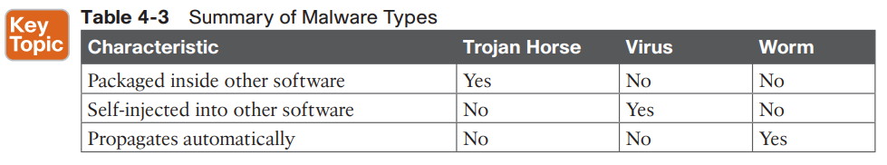
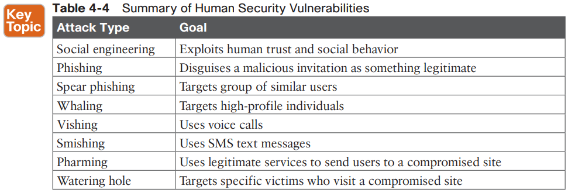

Security - Different threats

* * *

#### **Attacks That Spoof Addresses**

For example, an attacker can send packets with a spoofed source IP address instead of its own, as shown in [Figure 4-4](https://learning.oreilly.com/library/view/ccna-200-301-official/9780135262726/ch04.xhtml#ch04fig4). When the target receives the packets, it will send return traffic to the spoofed address, rather than the attacker’s actual address. If the spoofed address exists, then an unsuspecting host with that address will receive the packet. If the address does not exist, the packet will be forwarded and then dropped further out in the network.

* * *

#####

##### **Denial-of-Service Attacks**

The TCP connection begins with the malicious user sending a SYN flag to the server, but the source IP address is replaced with a fake address. The server adds the TCP connection to its table of client connections and replies to the fake address with a SYN-ACK. Because the fake address is not involved in the TCP connection, there is no ACK reply to complete the TCP three-way handshake. The incomplete connection stays in the server’s table until it eventually times out and is removed. During this time, the attacker can try to open many, many more abnormal connections at such a rate that the server’s connection table fills. At that point, the server is no longer able to maintain TCP connections with legitimate users, so their business transactions all halt. [Figure 4-5](https://learning.oreilly.com/library/view/ccna-200-301-official/9780135262726/ch04.xhtml#ch04fig5) illustrates this process.

DoS attacks can involve something as simple as ICMP echo (ping) packets, a flood of UDP packets, and TCP connections, such as the TCP SYN flood attack previously described.

**
**
**
**

* * *

#####

##### **Reflection and Amplification Attacks**

In a somewhat related attack, the attacker again sends packets with a spoofed source address toward a live host. However, the host is not the intended target; the goal is to get the host to reflect the exchange toward the spoofed address that is the target. This is known as a *[reflection attack](https://learning.oreilly.com/library/view/ccna-200-301-official/9780135262726/glossary.xhtml#glos_382)* as illustrated in [Figure 4-6](https://learning.oreilly.com/library/view/ccna-200-301-official/9780135262726/ch04.xhtml#ch04fig6), and the host reflecting the traffic toward the target is called the reflector. The attacker might also send the spoofed packets to multiple reflectors, causing the target to receive multiple copies of the unexpected traffic.

**
**

**
**
**
**

* * *

##### **

**

##### **Man-in-the-Middle Attacks**

**
**

* * *

#####

##### **Address Spoofing Attack Summary**

|     |     |     |     |     |
| --- | --- | --- | --- | --- |
| **Goal** | **DoS/DDoS** | **Reflection** | **Amplification** | **Man-in-the-Middle** |
| Exhaust a system service or resource; crash the target system | Yes | No  | No  | No  |
| Trick an unwitting accomplice host to send traffic to target | No  | Yes | Yes | No  |
| Eavesdrop on traffic | No  | No  | No  | Yes |
| Modify traffic passing through | No  | No  | No  | Yes |

* * *

####

#### **Reconnaissance Attacks**

When an attacker intends to launch an attack on a target, that attacker might want to identify some vulnerabilities so the attack can be focused and more effective. A *[reconnaissance attack](https://learning.oreilly.com/library/view/ccna-200-301-official/9780135262726/glossary.xhtml#glos_280)* can be used to discover more details about the target and its systems prior to an actual attack.

**Nslookup, whois, dig.**

Then the attacker can progress to using ping sweeps to send pings to each IP address in the target range. Hosts that answer the ping sweep then become live targets. Port scanning tools can then sweep through a range of UDP and TCP ports to see if a target host answers on any port numbers. Any replies indicate that a corresponding service is running on the target host.

* * *

####

#### **Buffer Overflow Attacks**

Some incoming data might be stored in unexpected memory locations if a buffer is allowed to fill beyond its limit. An attacker can exploit this condition by sending data that is larger than expected. If a vulnerability exists, the target system might store that data, overflowing its buffer into another area of memory, eventually crashing a service or the entire system.

* * *

####

#### **Malware (Malicious software)**

For example, a *[trojan horse](https://learning.oreilly.com/library/view/ccna-200-301-official/9780135262726/glossary.xhtml#glos_470)* is malicious software that is hidden and packaged inside other software that looks normal and legitimate.

In contrast, *[viruses](https://learning.oreilly.com/library/view/ccna-200-301-official/9780135262726/glossary.xhtml#glos_505)* are malware that can propagate between systems more readily. It rely on users to transport the infected application software.

A worm is able to propagate to and infect other systems on its own.

|     |     |     |     |
| --- | --- | --- | --- |
| **Characteristic** | **Trojan Horse** | **Virus** | **Worm** |
| Packaged inside other software | Yes | No  | No  |
| Self-injected into other software | No  | Yes | No  |
| Propagates automatically | No  | No  | Yes |

* * *

####

#### **Human Vulnerabilities**

|     |     |
| --- | --- |
| **Attack Type** | **Goal** |
| Social engineering | Exploits human trust and social behavior |
| Phishing | Disguises a malicious invitation as something legitimate |
| Spear phishing | Targets group of similar users |
| Whaling | Targets high-profile individuals |
| Vishing | Uses voice calls |
| Smishing | Uses SMS text messages |
| Pharming | Uses legitimate services to send users to a compromised site |
| Watering hole | Targets specific victims who visit a compromised site |

* * *

####

#### **Password Vulnerabilities**

- An offline attack occurs when the attacker is able to retrieve the encrypted or hashed passwords then goes offline to an external computer and uses software there to repeatedly attempt to recover the actual password.
- Attackers can also use software to perform dictionary attacks to discover a user’s password. The software will automatically attempt to log in with passwords taken from a dictionary or word list.
- In addition, the software can perform a brute-force attack by trying every possible combination of letter, number, and symbol strings.

A digital certificate can serve as one alternative factor because it serves as a trusted form of identification, adheres to a standardized format, and contains encrypted information. In order to be trusted, certificates must be granted and digitally signed by a trusted certificate authority (CA).

Digital certificates are also time sensitive, as each is approved for a specific time range.

The proof of the certificate is truly granted is built into the encrypted certificate content, as a result of combining public keys that the user’s machine and the authentication server can publicly share, along with private keys that each party keeps private and secret.

Biometric credentials carry the scheme even further by providing a factor that represents “something you are.”

For example, a user’s fingerprint can be scanned and used as an authentication factor.m Other examples include face recognition, palm prints, voice recognition, iris recognition, and retinal scans.

|     |     |     |     |     |
| --- | --- | --- | --- | --- |
| **Characteristic** | **Password Only** | **Two-Factor** | **Digital Certificates** | **Biometric** |
| Something you know | Yes | Yes |     |     |
| Something you have |     | Yes | Yes |     |
| Something you are |     |     |     | Yes |

* * *

###

### **CONTROLLING AND MONITORING USER ACCESS**

**
**

**
**
1. **Authentication:** Who is the user?
2. **Authorization:** What is the user allowed to do?
3. **Accounting:** What did the user do?

For example, a centralized authentication server can contain a database of all possible users and their passwords, as well as policies to authorize user activities.

All switches and routers would query the AAA server to get up-to-date information about a user. For greater security, AAA servers can also support multifactor user credentials and more. Cisco implements AAA services in its Identity Services Engine (ISE) platform.

AAA servers usually support the following two protocols to communicate with enterprise resources:

- **TACACS+:** A Cisco proprietary protocol that separates each of the AAA functions. Communication is secure and encrypted over TCP port 49.
- **RADIUS:** A standards-based protocol that combines authentication and authorization into a single resource. Communication uses UDP ports 1812 and 1813 (accounting) but is not completely encrypted.

Both TACACS+ and RADIUS are arranged as a client/server model. In the AAA client role, the switch is often called Network Access Device (NAD) or Network Access Server (NAS).

- **User awareness:** All users should be made aware of the need for data confidentiality to protect corporate information, as well as their own credentials and personal information. They should also be made aware of potential threats, schemes to mislead, and proper procedures to report security incidents. Users should also be instructed to follow strict guidelines regarding data loss. For example, users should not include sensitive information in emails or attachments, should not keep or transmit that information from a smartphone, or store it on cloud services or removable storage drives.
- **User training:** All users should be required to participate in periodic formal training so that they become familiar with all corporate security policies. (This also implies that the enterprise should develop and publish formal security policies for its employees, users, and business partners to follow.)
- **Physical access control:** Infrastructure locations, such as network closets and data centers, should remain securely locked. Badge access to sensitive locations is a scalable solution, offering an audit trail of identities and timestamps when access is granted. Administrators can control access on a granular basis and quickly remove access when an employee is dismissed.