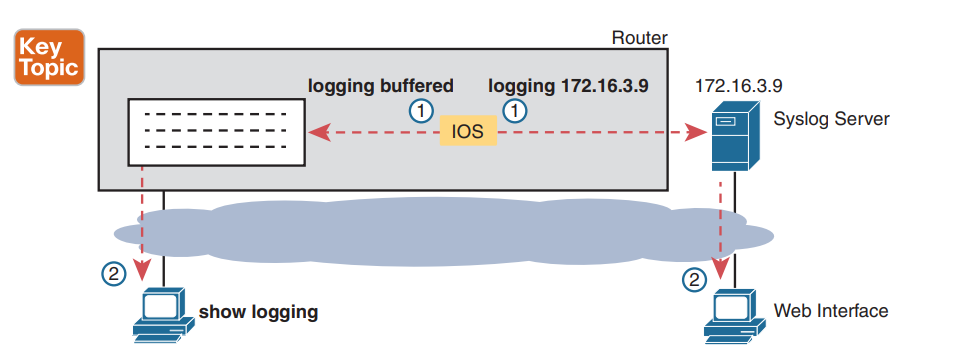
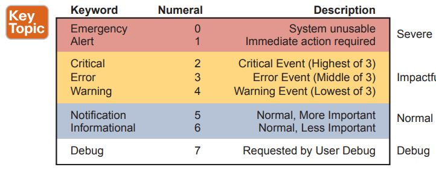
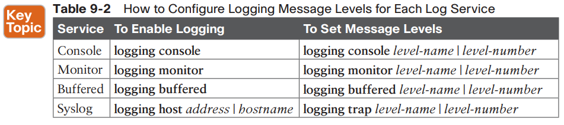
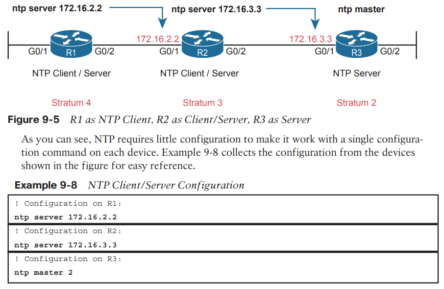

Syslog

**Sending Messages in Real Time to Current Users **

By default, IOS shows log messages to console users for all severity levels of messages. **(logging console)**

For other users (that is, Telnet and SSH users), the device requires a two-step process before the user sees the messages. **(logging monitor and terminal monitor)**

**terminal monitor    **-> to activate the logging on vty session
**logging monitor      **-> to set the logging's level for vty
**logging buffered    **-> to store message in the devices
**show logging          **-> to see the logs

As a second option—an option used frequently in production networks—all devices store their log messages centrally to a syslog server.

**Log Message Severity Levels**
**
**

***logging console 7 ***
***logging monitor debug ***
***logging buffered 4***
***logging host 172.16.3.9 ***
***logging trap warning***

**The debug Command and Log Messages **
**
**

The debug EXEC command gives the network engineer a way to ask IOS to monitor for certain internal events.

The engineer can log in, issue the debug command, and move on to other work.

The debug remains active until some user issues the no debug command with the same parameters, disabling the debug.

*R1# ****debug ip ospf hello ***
*OSPF hello debugging is on *
*R1# *

**Aug 10 13:38:19.863: OSPF-1 HELLO Gi0/1: Send hello to 224.0.0.5 area 0 from 172.16.1.1 *

**Aug 10 13:38:21.199: OSPF-1 HELLO Gi0/2: Rcv hello from 2.2.2.2 area 0 172.16.2.2*

**Aug 10 13:38:22.843: OSPF-1 HELLO Gi0/2: Send hello to 224.0.0.5 area 0 from 172.16.2.1 *

*R1#*

* * *

## **Name**

terminal history — command

## **Synopsis**

terminal history [size number]
terminal no history

## **Configures**

Terminal history for the current session

## **Default**

Enabled; 10 lines

## **Description**

This command enables history logging for the current session; it can also be used to change the size of the history buffer for that session. To enable history logging, use the terminal history command, which takes the last-used size as the buffer size. To change the size of the current history buffer, use the size keyword followed by the *number* of lines you want to save in the buffer. The buffer’s size can be from 1 to 256 lines.

Use Ctrl-P or the up arrow to go up in the history list; use Ctrl-N or the down arrow to return to more recent commands in the list. To see the entire list, use show history.

## **Example**

This example changes the history size to 100:

router# terminal history size 100

* * *

**Network Time Protocol (NTP)**

NTP gives any device a way to synchronize their time-of-day clocks. NTP provides protocol messages that devices use to learn the timestamp of other devices. Devices send timestamps to each other with NTP messages, continually exchanging messages, with one device changing its clock to match the other, eventually synchronizing the clocks. As a result, actions that benefit from synchronized timing, like the timestamps on log messages, work much better.

Cisco supplies two ntp configuration commands that dictate how NTP works on a router or switch, as follows:

■ ntp master {stratum-level}: NTP server mode—the device acts only as an NTP server, and not as an NTP client. The device gets its time information from the internal clock on the device.

■ ntp server {address | hostname}: NTP client/server mode—the device acts as both client and server. First, it acts as an NTP client, to synchronize time with a server. Once synchronized, the device can then act as an NTP server, to supply time to other NTP clients.

Devices that act solely as an NTP server get their time from either internal device hardware or from some external clock using mechanisms other than NTP.