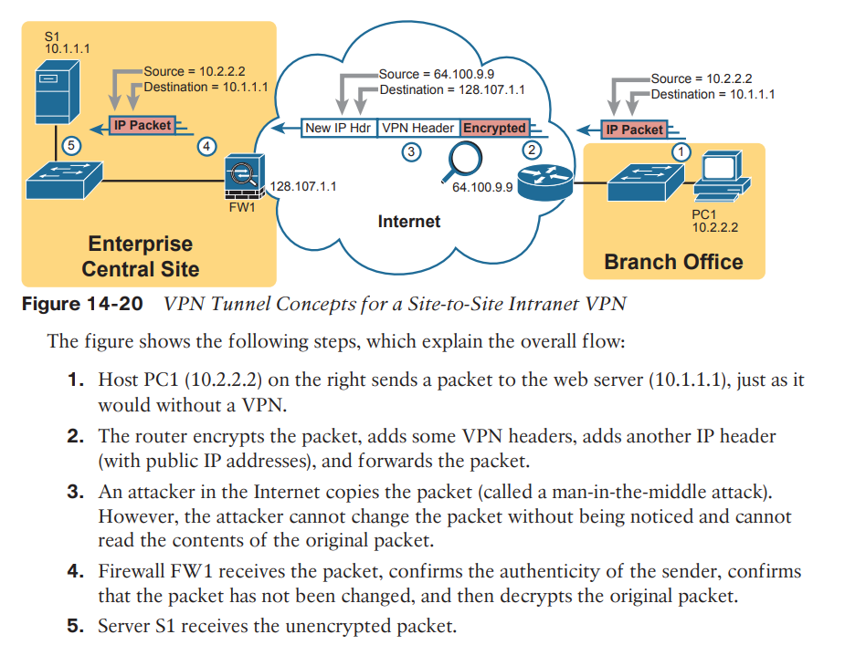
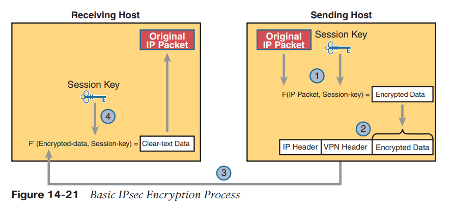
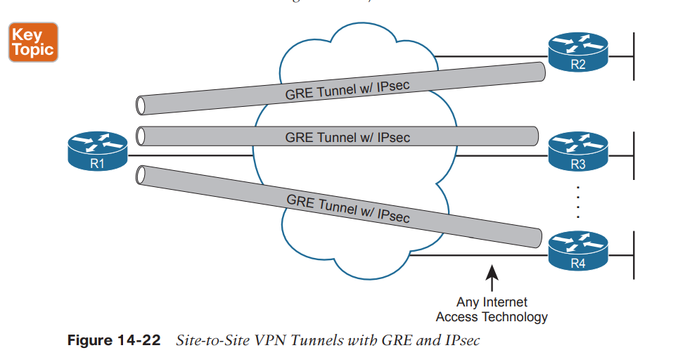
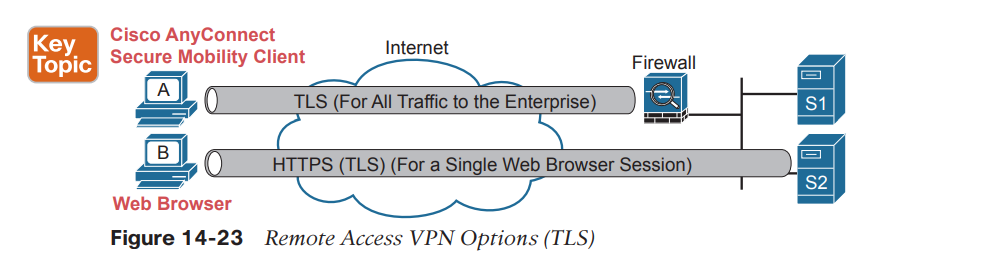
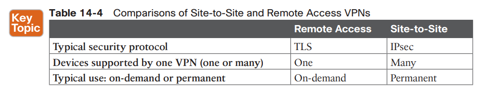

# VPN
VPNs try to provide the same secure features as a private WAN while sending data over a network that is open to other parties (such as the Internet). Compared to a private WAN, the Internet does not provide for a secure environment that protects the privacy of an enterprise’s data. Internet VPNs can provide important security features, such as the following:

■ Confidentiality (privacy): Preventing anyone in the middle of the Internet (man in the middle) from being able to read the data

■ Authentication: Verifying that the sender of the VPN packet is a legitimate device and not a device used by an attacker

■ Data integrity: Verifying that the packet was not changed as the packet transited the Internet

■ Anti-replay: Preventing a man in the middle from copying and later replaying the packets sent by a legitimate user, for the purpose of appearing to be a legitimate user

The network engineers configure devices such as routers and firewalls (as shown in Figure 14-20) to create one VPN tunnel.

All the devices at each site can communicate using the VPN, receiving all the benefits of the VPN, without requiring each device to create a VPN for themselves.

IPsec defines one popular set of rules for creating secure VPNs. IPsec is an architecture or framework for security services for IP networks.

IPsec defines how two devices, both of which connect to the Internet, can achieve the main goals of a VPN as listed at the beginning of this section: confidentiality, authentication, data integrity, and anti-replay.

First, the two math formulas are a matched set: (IPSec encryption)
■ One to hide (encrypt) the data
■ Another to re-create (decrypt) the original data based on the encrypted data

## The four steps highlighted in the figure are as follows: 

1. The sending VPN device (like the remote office router in Figure 14-21) feeds the original packet and the session key into the encryption formula, calculating the encrypted data.

2. The sending device encapsulates the encrypted data into a packet, which includes the new IP header and VPN header.

3. The sending device sends this new packet to the destination VPN device (FW1 back in Figure 14-21).

4. The receiving VPN device runs the corresponding decryption formula, using the encrypted data and session key—the same key value as was used on the sending VPN device—to decrypt the data.

## VPN using TLS

While IPsec and GRE (or other) tunnels work well for site-to-site VPNs, remote access VPNs often use the Transport Layer Security (TLS) protocol to create a secure VPN session.

TLS has many uses today, but most commonly, TLS provides the security features of HTTP Secure (HTTPS).

