# Wireless Architecture (From Book)
## Basic Service Set**
At the heart of every **BSS **is a wireless access point (AP).

The AP serves as a single point of contact for every device that wants to use the BSS. It advertises the existence of the BSS so that devices can find it and try to join. To do that, the AP uses a unique BSS identifier (**BSSID**) that is based on the AP’s own radio **MAC address**.

In addition, the AP advertises the wireless network with a Service Set Identifier (**SSID**).

Think of the **BSSID **as a machine-readable name tag that uniquely identifies the **BSS **ambassador (the **AP**), and the **SSID **as a non unique, human-readable name tag that identifies the wireless service.
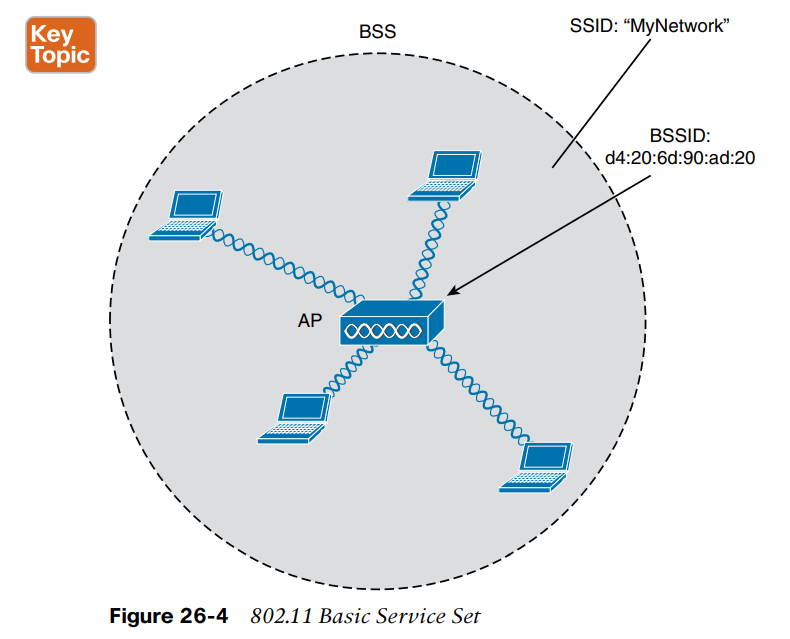

## Distribution System**

An AP can also uplink into an Ethernet network because it has both wireless and wired capabilities. The **802.11** standard refers to the upstream wired Ethernet as the **distribution system** (**DS**) for the wireless **BSS.**
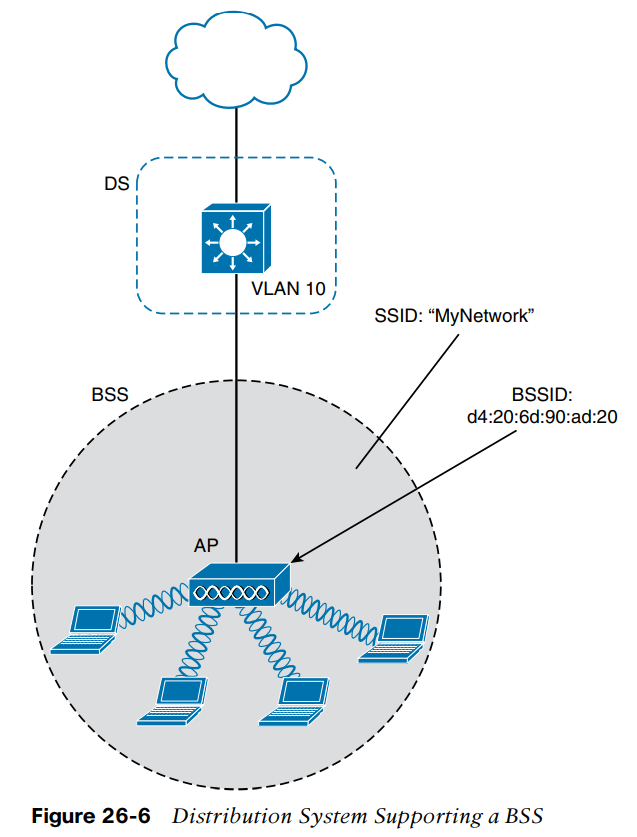
This concept can be extended so that multiple **VLANs** are mapped to multiple **SSIDs**. To do this, the **AP **must be connected to the switch by a trunk link that carries the **VLANs**.

The AP then appears as multiple logical APs—one per **BSS**—with a unique **BSSID **for each. With Cisco APs, this is usually accomplished by incrementing the last digit of the radio’s MAC address for each **SSID**.

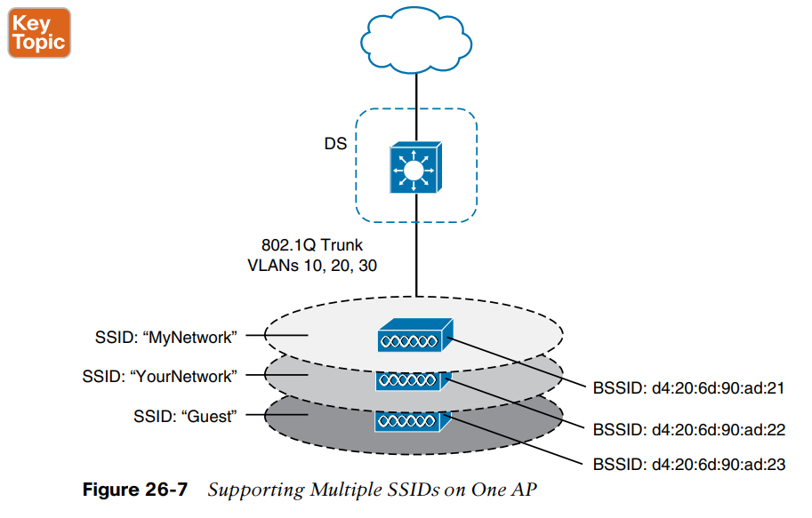

## Extended Service Set **

To cover more area than a single AP’s cell can cover, you simply need to add more APs and spread them out geographically. When **APs **are placed at different geographic locations, they can all be interconnected by a switched infrastructure. The 802.11 standard calls this an extended service set (**ESS**), as shown in Figure 26-8.

Passing from one AP to another is called roaming. Keep in mind that each AP offers its own **BSS **on its own channel, to prevent interference between the APs.

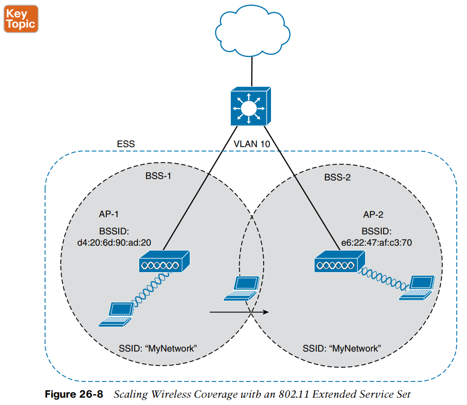

## Independent Basic Service Set**

The **802.11** standard allows two or more wireless clients to communicate directly with each other, with no other means of network connectivity. This is known as an **ad hoc **wireless network, or an independent basic service set (**IBSS**).

Any other device can then join as needed.

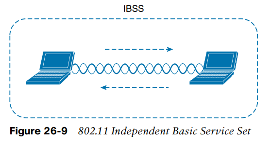

## Repeater**

A wireless repeater takes the signal it receives and repeats or re-transmits it in a new cell area around the repeater.

If the repeater has a single transmitter and receiver, it must operate on the same channel that the AP is using.

Halving the effective throughput because the channel will be kept busy twice as long as before. As a remedy, some repeaters can use two transmitters and receivers to keep the original and repeated signals isolated on different channels.

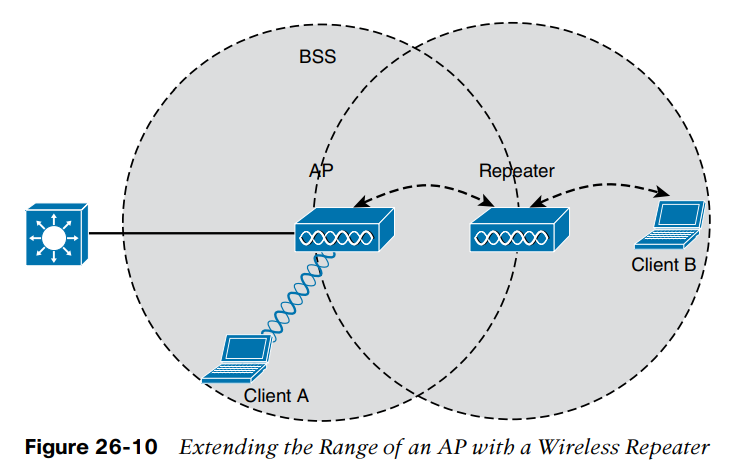

## Workgroup Bridge**

You can use a workgroup bridge (**WGB**) to connect the device’s wired network adapter to a wireless network.

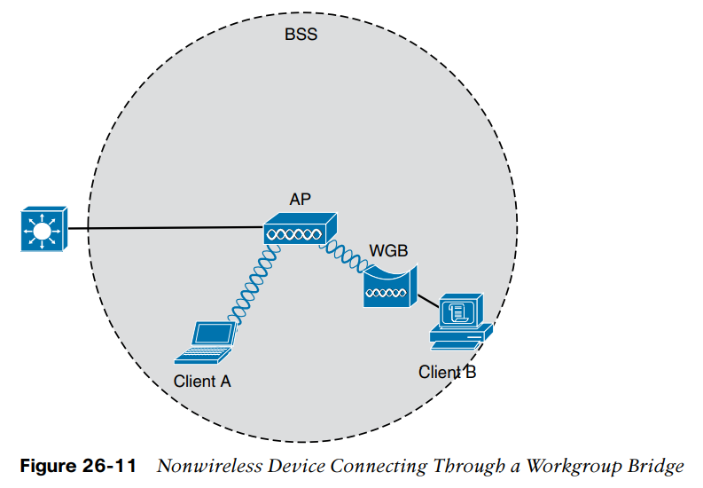

## Outdoor Bridge**

Sometimes the LANs at multiple sites need to be bridged together. A point-to-multipoint bridged link allows a central site to be bridged to several other sites.

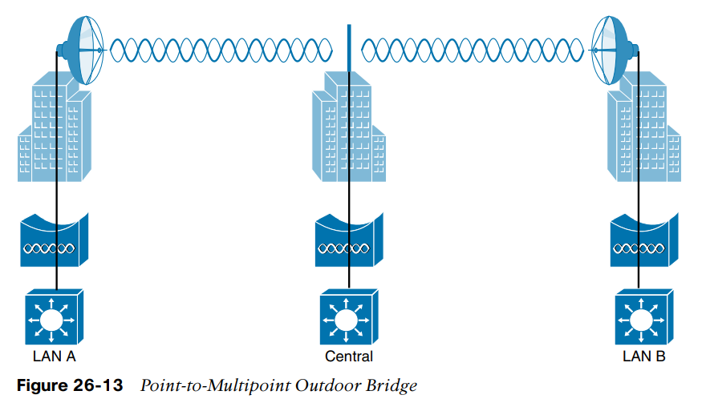

## Mesh Network**

In a mesh topology, wireless traffic is bridged from AP to AP, in a daisy-chain fashion, using another wireless channel.

Mesh APs can leverage dual radios—one using a channel in one range of frequencies and one a different range. Each mesh AP usually maintains a BSS on one channel, with which wireless clients can associate. Client traffic is then usually bridged from AP to AP over other channels as a back haul network.

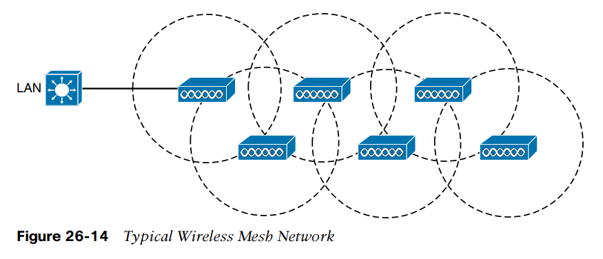

## Frequency**

Frequency can vary over a very wide range. As frequency increases by orders of magnitude, the numbers can become quite large.

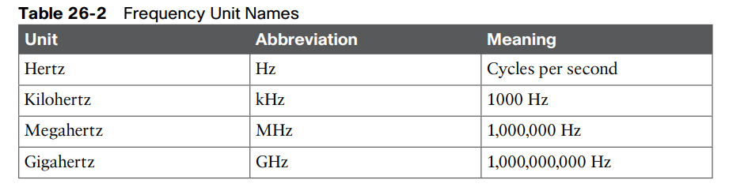

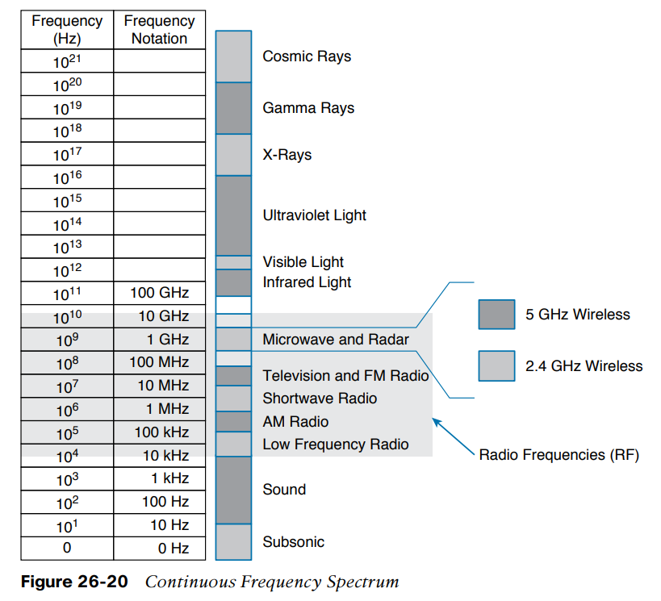

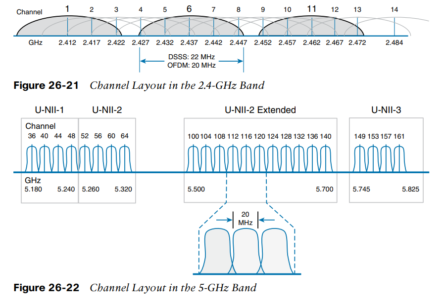

In the 5-GHz band, this is the case because each channel is allocated a frequency range that does not encroach on or overlap the frequencies allocated for any other channel.

The same is not true of the 2.4-GHz band. Each of its channels is much too wide to avoid overlapping the next lower or upper channel number.

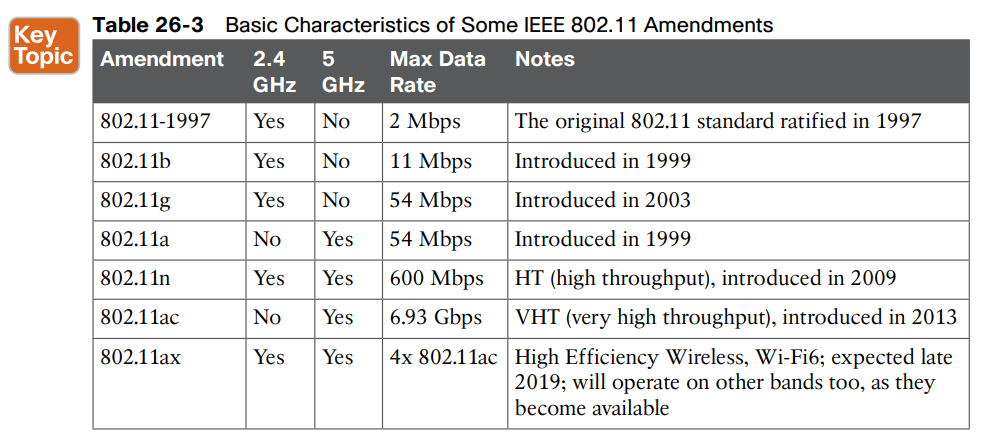

* * *

## *WLAN ARCHITECTURES***
## AUTONOMOUS ARCHITECTURE**

Autonomous APs offer one or more fully functional, standalone basic service sets (BSSs). They are also a natural extension of a switched network, connecting wireless service set identifiers (SSIDs) to wired virtual LANs (VLANs) at the access layer.

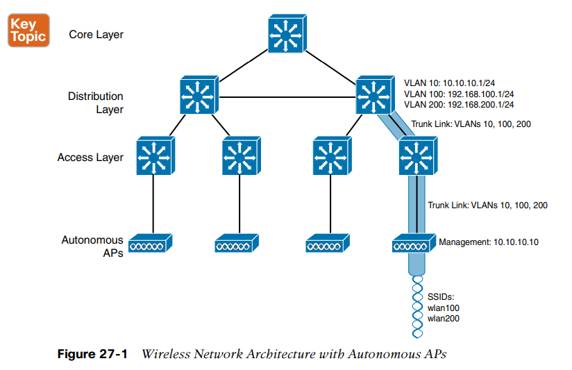

## CiscoWorks Wireless LAN Solution Engine (WLSE) **simplifies the management and deployment of wireless access point (WAPs).
## CLOUD-BASED AP ARCHITECTURE (Meraki)**

Recall that an autonomous AP needs quite a bit of configuration and management. To help manage more and more autonomous APs as the wireless network grows, you could place an AP management platform such as **Cisco Prime Infrastructure** in a central location within the enterprise.

A simpler approach is a cloud-based AP architecture, where the AP management function is pushed out of the enterprise and into the Internet cloud. **Cisco Meraki** is **cloud-based **and offers centralized management of wireless, switched, and security networks built from **Meraki **products.

Cisco Meraki APs can be deployed automatically, once you register with the Meraki cloud. Each AP will contact the cloud when it powers up and will self-configure. From that point on, you can manage the AP through the **Meraki cloud dashboard.**

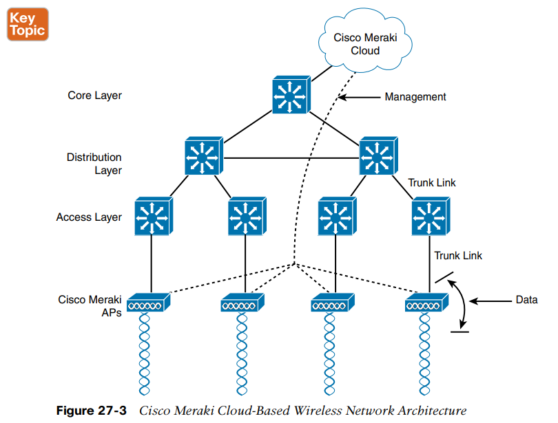

Also, notice that the network in Figure 27-3 consists of two distinct paths—one for data traffic and another for management traffic, corresponding to the following two functions:

■ **A control plane:** Traffic used to control, configure, manage, and monitor the AP itself

■ **A data plane:** End-user traffic passing through the AP

## WIRELESS LAN CONTROLLER DEPLOYMENT (Split Mac Architecture)**

One approach is to locate the WLC in a central location so that you can maximize the number of APs joined to it. This is usually called a **unified or centralized WLC deployment**, which tends to follow the concept that most of the resources users need to reach are located in a central location such as a data center or the Internet.

Typical unified WLCs can support a maximum of **6000 **APs.

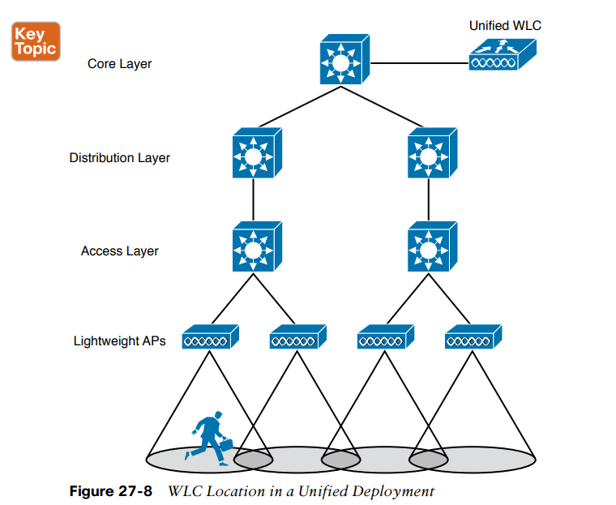

A WLC can also be located in a central position in the network, inside a **data center in a private cloud**, as shown in Figure 27-9. This is known as a **cloud-based WLC deployment**, where the WLC exists as a virtual machine rather than a physical device.

Such a controller can typically support up to **3000 **APs.

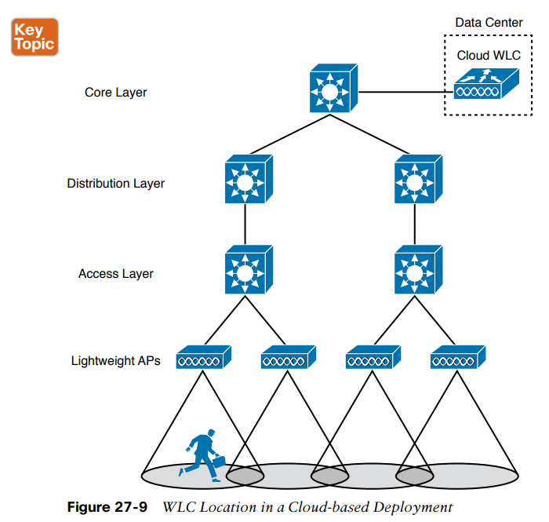

For small campuses or distributed branch locations, where the number of APs is relatively small in each, the WLC can be co-located with a stack of switches, as shown in Figure 27-10. This is known as an** embedded WLC deployment** because the controller is embedded within the switching hardware. Typical **Cisco embedded WLCs** can support up to **200 **APs.

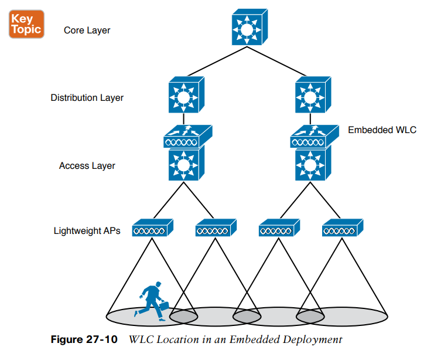

In small-scale environments, such as small, midsize, or multi site branch locations, you might not want to invest in dedicated WLCs at all. In this case, the WLC function can be co-located with an AP that is installed at the branch site. This is known as a **Cisco Mobility Express WLC deployment**.

A Mobility Express WLC can support up to **100 **APs.

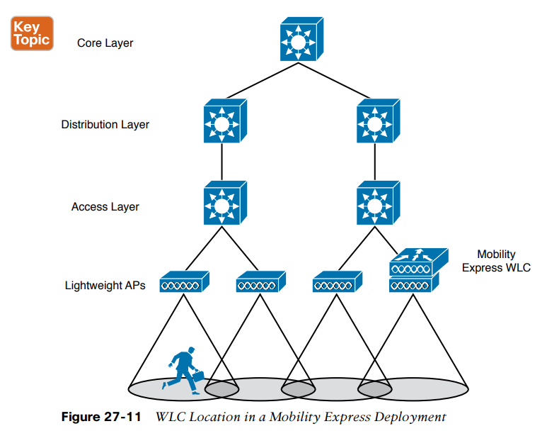

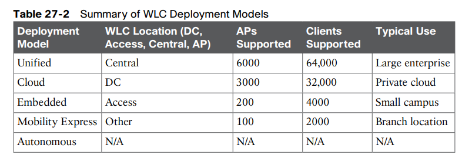

* * *

## Cisco AP Modes**
■ **Local**: The default lightweight mode that offers one or more functioning BSSs on a specific channel. During times that it is not transmitting, the AP will scan the other channels to measure the level of noise, measure interference, discover rogue devices, and match against intrusion detection system (IDS) events.

■ **Monitor**: The AP does not transmit at all, but its receiver is enabled to act as a dedicated sensor. The AP checks for IDS events, detects rogue access points, and determines the position of stations through location-based services.

■ **FlexConnect**: An AP at a remote site can locally switch traffic between an SSID and a VLAN if its CAPWAP tunnel to the WLC is down and if it is configured to do so.

■ **Sniffer**: An AP dedicates its radios to receiving 802.11 traffic from other sources, much like a sniffer or packet capture device. The captured traffic is then forwarded to a PC running network analyzer software such as Wildpackets OmniPeek or WireShark, where it can be analyzed further.

■ **Rogue detector**: An AP dedicates itself to detecting rogue devices by correlating MAC addresses heard on the wired network with those heard over the air. Rogue devices are those that appear on both networks.

■ **Bridge**: An AP becomes a dedicated bridge (point-to-point or point-to-multipoint) between two networks. Two APs in bridge mode can be used to link two locations separated by a distance. Multiple APs in bridge mode can form an indoor or outdoor mesh network.

■ **Flex+Bridge**: FlexConnect operation is enabled on a mesh AP.

■ **SE-Connect**: The AP dedicates its radios to spectrum analysis on all wireless channels. You can remotely connect a PC running software such as MetaGeek Chanalyzer or Cisco Spectrum Expert to the AP to collect and analyze the spectrum analysis data to discover sources of interference.
