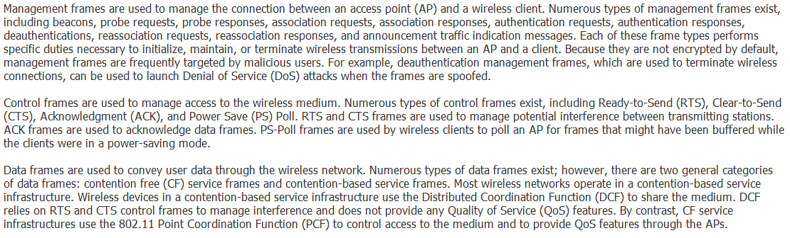
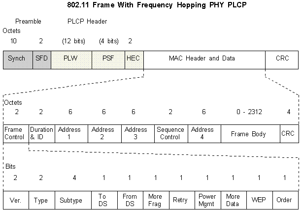
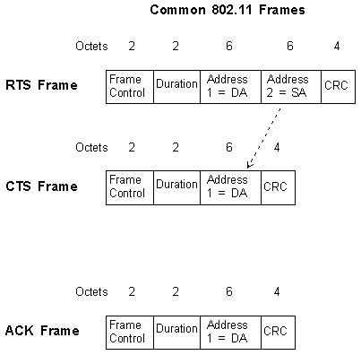

Wireless LAN frame 802.11

* * *

* * *

# 802.11 Frames

* * *

## Frame Types

There are three main types of 802.11 frames, the **Data Frame**, the **Management Frame** and the **Control Frame**. The following diagram illustrates the 802.11 frame that uses the Frequency Hopping PHY.

The fields have the following functions:

- **Synch** - this is the preamble which for thr FH PHY is 80 bits. For the DSSS PHY it is 128 bits in length. These bits are alternating '0's and '1's.
- **SRD** - the **Start Frame Delimiter** is 16 bits **0000 1100 1011 1101**
- **PLW** - the **PLCP_PDU Length Word** is a field of 12 bits that indicate the number of bytes in the packet. This is the first portion of the PLCP header. No matter what the speed of the 802.11 network, the PLCP header is transmitted only at 1Mbps!
- **PSF** - the **PLCP Signalling Field** uses 4 bits to show the rate of the MAC payload transmission. Bit 0 is reserved and is always '0'. Bits 1 to 3 are organised to indicate the data rates as follows:
    - **000** - 1.0Mbps
    - **001** - 1.5Mbps
    - **010** - 2.0Mbps
    - **011** - 2.5Mbps
    - **100** - 3.0Mbps
    - **101** - 3.5Mbps
    - **110** - 4.0Mbps
    - **111** - 4.5Mbps
- **HEC** - the **Header Error Check** is a 16 bit error check for the PLCP header.
- The MAC Data header begins with the **Frame Control** - this has a number of fields:
    - **Ver** - The Protocol Version number is always **0**
    - **Type** - This is a two bit field that indicates whether the frame is a **Management**, **Control** or **Data** frame. The **Subtype** field uses four bits to describe the detail of the frame type. The following table lists both the fields' options:

|     |     |     |     |
| --- | --- | --- | --- |
| **Type (binary)** | **Main Type** | **Subtype (binary)** | **Description** |
| 00  | Management | 0000 | Association Request |
| 00  | Management | 0001 | Association Response |
| 00  | Management | 0010 | Reassociation Request |
| 00  | Management | 0011 | Reassociation Response |
| 00  | Management | 0100 | Probe Request |
| 00  | Management | 0101 | Probe Response |
| 00  | Management | 0110-0111 | Reserved |
| 00  | Management | 1000 | Beacon |
| 00  | Management | 1001 | ATIM |
| 00  | Management | 1010 | Disassociation |
| 00  | Management | 1011 | Authentication |
| 00  | Management | 1100 | Deauthentication |
| 00  | Management | 1101-1111 | Reserved |
| 01  | Control | 0000-1001 | Reserved |
| 01  | Control | 1010 | PS-Poll |
| 01  | Control | 1011 | RTS |
| 01  | Control | 1100 | CTS |
| 01  | Control | 1101 | ACK |
| 01  | Control | 1110 | CF End |
| 01  | Control | 1111 | CF End and CF-ACK |
| 10  | Data | 0000 | Data |
| 10  | Data | 0001 | Data and CF-ACK |
| 10  | Data | 0010 | Data and CF-Poll |
| 10  | Data | 0011 | Data and CF-ACK and CF-Poll |
| 10  | Data | 0100 | Null |
| 10  | Data | 0101 | CF-ACK with no data |
| 10  | Data | 0110 | CF-Poll with no data |
| 10  | Data | 0111 | CF-ACK and CF-Poll with no data |
| 10  | Data | 1000-1111 | Reserved |
| 11  | Reserved | 0000-1111 | Reserved |

    - **To DS** - set if the frame is to be sent by the AP to the Distribution System
    - **From DS** - set if the frame is from the Distribution System
    - **More Frag** - set if this frame is a fragment of a bigger frame and there are more fragments to follow.
    - **Retry** - set if this frame is a retransmission, maybe through the loss of an ACK
    - **Power Mgmt** - indicates what power mode ('save' or 'active') the station is to be in once the frame has been sent
    - **More Data** - set by the AP to indicate that more frames are destined to a particular station that may be in power save mode. These frames will be buffered at the AP ready for the station should it decide to become 'active'.
    - **WEP** - set if WEP is being used to encrypt the body of the frame
    - **Order** - set if the frame is being sent according to the 'Strictly Ordered Class' (rarely used)
- **Duration & ID** - In Power save poll messages this is the station ID, whereas in all other frames this is the duration (normally 0) used when calculating the NAV
- **Address 1** - The recipient station address on the BSS. If **To DS** is set, this is the AP address; if **From DS** is set then this is the station address
- **Address 2** - The transmitter station address on the BSS. If **From DS** is set, this is the AP address; if **To DS** is set then this is the station address
- **Address 3** - If Address 1 contains the destination address then Address 3 will contain the source address. Similarly, if Address 2 contains the source address then Address 3 will contain the destination address.
- **Address 4** - If a **Wireless Distribution System (WDS)** is being used (with AP to AP communication), then Address 1 will contain the receiving AP address; Address 2 will contain the transmitting AP address; Address 3 will contain the destination station address and Address 4 the source station address.
- **Sequence Control** - contains the **Fragment Number** and **Sequence Number** that define the main frame and the number of fragments in the frame
- **Frame Body** - contains the actual data e.g. IP datagrams and can be up to 2312 octets in size
- **CRC** - 32-bit Cyclic Redundancy Check on the whole 802.11 frame.

### Control Frame Types

The Control frame types are illustrated below:

For the **RTS Frame** the Destination Address (DA) is that of the receipient of the next frame, and the the Source Address (SA) is that of the station transmitting the RTS frame. The Duration time is in microseconds and is how long the next frame will take to transmit plus the time for a CTS frame, an ACK frame and three SIFSs (one for each of the RTS Frame, the CTS frame and the final ACK frame).

In the **CTS Frame** the Destination Address is the address that has been copied from the Source Address field in the previous RTS Frame. The duration is reduced by the time taken for one CTS frame and its SIFS interval.

In the **ACK Frame** the address is the Destination Address that has been copied from the Source Address field in the previous frame (RTS or otherwise). The duration is reduced from the previous frame's duration by the time it takes to transmit the ACK frame and its SIFS interval. If there are more fragments to come i.e. the **More Frag** bit is set within the **Frame Control** field, then the duration is set to '0'.

### Management Frames

#### Beacon

The AP regularly sends a beacon frame to announce itself and send information, such as SSID, timestamp, and other parameters to wireless stations nearby. Wireless NICs are always scanning all 802.11 channels listening to beacons in order to choose an AP to associate with.

#### Probe Request

A probe request is sent by a station when it needs to obtain information from another station such as which APs are within range.

#### Probe Response

A station responds to a probe Request with a Probe Response, detailing capability information, supported data rates, etc.

#### Authentication

The station wireless NIC starts authentication by sending an Authentication frame to the AP containing its identity. With the default **Open Authentication**, the NIC sends only one authentication frame, and the AP responds with an authentication frame as a response indicating acceptance (or rejection). With **Shared Key Authentication**, the NIC sends an Authentication frame, and the AP responds with an Authentication frame containing challenge text. The NIC then sends a WEP encrypted version of the challenge text back to the AP. The AP checks the encrypted version by decrypting it and comparing the resultant text with the original challenge. The AP replies to the NIC with an Authentication frame signifying the result.

#### Deauthentication

A station sends a Deauthentication frame to another station if it wishes to stop encrypted communications.

#### Association Request

Association with an AP enables allocation of resources and synchronisation with a wireless NIC. The NIC begins the association process by sending an Association Request to an AP. This frame carries information about the NIC (e.g. supported data rates, the version of **Cisco Compatible Extensions (CCX)** etc.) and the SSID of the network. When the AP receives the Association Request, it considers associating with the NIC, reserves memory space and establishes an **Association ID** for the NIC.

#### Association Response

An AP sends an Association Response containing an acceptance or rejection notice to the NIC. If it is an acceptance, the frame includes information regarding the association, such as the Association ID and supported data rates. The NIC can use the AP to communicate with other NICs on the network and systems on the Distribution System.

#### Reassociation Request

If a NIC roams from the currently associated AP and finds another AP with a stronger beacon signal, the NIC will send a Reassociation to the new AP. The new AP then coordinates the forwarding of data frames that may still be in the buffer of the previous AP waiting for transmission to the NIC.

#### Reassociation Response

The AP sends a Reassociation Response containing an acceptance or rejection notice to the NIC requesting reassociation. The frame includes information regarding the association, such as Association ID and supported data rates.

#### Disassociation

A station sends a disassociation frame to another station if it wishes to terminate the association. For example, a NIC that is shut down gracefully can send a Disassociation frame to inform the AP that the NIC is powering off. The AP can then relinquish memory allocations and remove the NIC from the association table.

[Home](http://www.rhyshaden.com/index.htm)

Copyright © 1996 - 2020, Rhys Haden.
[Disclaimer](http://www.rhyshaden.com/disclaim.htm)