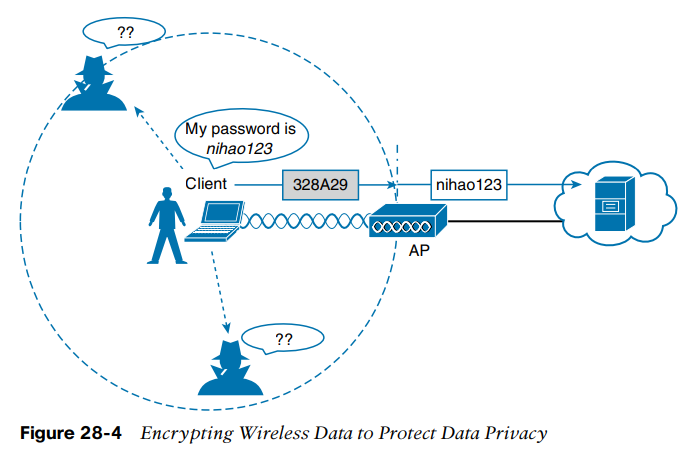

# Wireless Security
## INTRODUCTION
## Authentication 
Wireless authentication can take many forms.

Some methods require only a static text string that is common across all trusted clients and APs.

Other more stringent authentication methods require interaction with a corporate user database. In those cases, the end user must enter a valid username and password.

Normally, the only piece of information you have is the SSID being broadcast or advertised by an AP.

Some common attacks focus on a malicious user pretending to be an AP. Once a client associates with the fake AP, the attacker can easily intercept all communication to and from the client from its central position.

To prevent this type of man-in-the-middle attack, the client should authenticate the AP before the client itself is authenticated.

## Message Privacy

To protect data privacy on a wireless network, the data should be encrypted for its journey through free space. This is accomplished by encrypting the data payload in each wireless frame just prior to being transmitted, then decrypting it as it is received.

Ideally, the AP and a client are the only two devices that have the encryption keys in common so that they can understand each other’s data.

The AP can decrypt it successfully before forwarding it onto the wired network, but other wireless devices cannot.

The AP also maintains a “group key” that it uses when it needs to send encrypted data to all clients in its cell at one time. Each of the associated clients uses the same group key to decrypt the data.

## Message Integrity

A message integrity check (MIC) is a security tool that can protect against data tampering.

You can think of a MIC as a way for the sender to add a secret stamp inside the encrypted data frame. The stamp is based on the contents of the data bits to be transmitted. Once the recipient decrypts the frame, it can compare the secret stamp to its own idea of what the stamp should be, based on the data bits that were received. If the two stamps are identical, the recipient can safely assume that the data has not been tampered with.

## Authentication Methods
## Open Authentication
Open authentication is true to its name; it offers open access to a WLAN. The only requirement is that a client must use an 802.11 authentication request before it attempts to associate with an AP. No other credentials are needed.

With no challenge, any 802.11 client may authenticate to access the network. That is, in fact, the whole purpose of open authentication—to validate that a client is a valid 802.11 device by authenticating the wireless hardware and the protocol. Authenticating the user’s identity is handled as a true security process through other means.

## WEP

802.11 standard has traditionally defined Wired Equivalent Privacy (WEP) as a method to make a wireless link more like or equivalent to a wired connection.

WEP uses the RC4 cipher algorithm to make every wireless data frame private and hidden from eavesdroppers.

WEP is known as a shared-key security method. The same key must be shared between the sender and receiver ahead of time. The WEP key can also be used as an optional authentication method as well as an encryption tool.

WEP keys can be either 40 or 104 bits long, represented by a string of 10 or 26 hex digits.

Both WEP encryption and WEP shared-key authentication are widely considered to be weak methods to secure a wireless LAN.

## 802.1x/EAP

Rather than build additional authentication methods into the 802.11 standard, a more flexible and scalable authentication framework, the Extensible Authentication Protocol (EAP), was chosen.

## EAP defines a set of common functions that actual authentication methods can use to authenticate users. Each method is unique and different, but each one follows the EAP framework.

## EAP can integrate with the IEEE 802.1x port-based access control standard. When 802.1x is enabled, it limits access to a network media until a client authenticates. This means that a wireless client might be able to associate with an AP but will not be able to pass data to any other part of the network until it successfully authenticates.

The client uses open authentication to associate with the AP, and then the actual client authentication process occurs at a dedicated authentication server.

## EAP Methods

When you configure user authentication on a wireless LAN, you will not have to select a specific method. Instead, you select 802.1x on the WLC so that it is ready to handle a variety of EAP methods. It is then up to the client and the authentication server to use a compatible method.

## LEAP
As an early attempt to address the weaknesses in WEP, Cisco developed a proprietary wireless authentication method called Lightweight EAP (LEAP).

To authenticate, the client must supply username and password credentials. Both the authentication server and the client exchange challenge messages that are then encrypted and returned.

At the time, WEP-based hardware was still widely used. Therefore, LEAP attempted to overcome WEP weaknesses by using dynamic WEP keys that changed frequently has failed.

## LEAP has since been deprecated.
## EAP-FAST

Cisco developed a more secure method called EAP Flexible Authentication by Secure Tunneling (EAP-FAST).

Authentication credentials are protected by passing a protected access credential (PAC) between the AS and the supplicant. The PAC is a form of shared secret that is generated by the AS and used for mutual authentication. EAP-FAST is a sequence of three phases:

■ Phase 0: The PAC is generated or provisioned and installed on the client.

■ Phase 1: After the supplicant and AS have authenticated each other, they negotiate a Transport Layer Security (TLS) tunnel.

■ Phase 2: The end user can then be authenticated through the TLS tunnel for additional security.

Notice that two separate authentication processes occur in EAP-FAST—one between the AS and the supplicant and another with the end user.

Like other EAP-based methods, a RADIUS server is required.

## PEAP

Like EAP-FAST, the Protected EAP (PEAP) method uses an inner and outer authentication; however, the AS presents a digital certificate to authenticate itself with the supplicant in the outer authentication. If the supplicant is satisfied with the identity of the AS, the two will build a TLS tunnel to be used for the inner client authentication and encryption key exchange.

The supplicant must also possess the CA (certificate Authority) certificate just so that it can validate the one it receives from the AS.

Notice that only the AS has a certificate for PEAP. That means the supplicant can readily authenticate the AS. The client does not have or use a certificate of its own, so it must be authenticated within the TLS tunnel using one of the following two methods:

■ MSCHAPv2: Microsoft Challenge Authentication Protocol version 2

■ GTC: Generic Token Card; a hardware device that generates one-time passwords for the user or a manually generated password

## EAP-TLS (EAP Transport Layer Security)  

It goes one step further by requiring certificates on the AS and on every client device.

AS and the supplicant exchange certificates and can authenticate each other. A TLS tunnel is built afterward so that encryption key material can be securely exchanged.

EAP-TLS is considered to be the most secure wireless authentication method available; however, implementing it can sometimes be complex.

Manually installing certificates on hundreds or thousands of clients can be impractical. Instead, you would need to implement a Public Key Infrastructure (PKI) that could supply certificates securely and efficiently and revoke them when a client or user should no longer have access to the network.

  

## Wireless Privacy and Integrity Methods
### TKIP
During the time when WEP was embedded in wireless client and AP hardware, yet was known to be vulnerable, the Temporal Key Integrity Protocol (TKIP) was developed. TKIP adds the following security features using legacy hardware and the underlying WEP encryption:

■ MIC: This efficient algorithm adds a hash value to each frame as a message integrity check to prevent tampering; commonly called “Michael” as an informal reference to MIC.

■ Time stamp: A time stamp is added into the MIC to prevent replay attacks that attempt to reuse or replay frames that have already been sent.

■ Sender’s MAC address: The MIC also includes the sender’s MAC address as evidence of the frame source.

■ TKIP sequence counter: This feature provides a record of frames sent by a unique MAC address, to prevent frames from being replayed as an attack.

■ Key mixing algorithm: This algorithm computes a unique 128-bit WEP key for each frame.

■ Longer initialization vector (IV): The IV size is doubled from 24 to 48 bits, making it virtually impossible to exhaust all WEP keys by brute-force calculation.

TKIP became a reasonably secure stopgap security method, buying time until the 802.11i standard could be ratified. Some attacks have been created against TKIP, so it, too, should be avoided if a better method is available. In fact, TKIP was deprecated in the 802.11-2012 standard.

### CCMP
The Counter/CBC-MAC Protocol (CCMP) is considered to be more secure than TKIP.

CCMP consists of two algorithms:

■ AES counter mode encryption

■ Cipher Block Chaining Message Authentication Code (CBC-MAC) used as a message integrity check (MIC)

Before CCMP can be used to secure a wireless network, the client devices and APs must support the AES counter mode and CBC-MAC in hardware. CCMP cannot be used on legacy devices that support only WEP or TKIP. How can you know if a device supports CCMP? Look for the WPA2 designation.

### GCMP
The Galois/Counter Mode Protocol (GCMP) is a robust authenticated encryption suite that is more secure and more efficient than CCMP.

GCMP consists of two algorithms:

■ AES counter mode encryption

■ Galois Message Authentication Code (GMAC) used as a message integrity check (MIC) GCMP is used in WPA3.

## WPA, WPA2, WPA3

When it comes time to configure a WLAN with wireless security, should you try to select some combination of schemes based on which one is best or which one is not deprecated? Which authentication methods are compatible with which encryption algorithms?

The Wi-Fi Alliance (http://wi-fi.org), a nonprofit wireless industry association, has worked out straightforward ways to do that through its Wi-Fi Protected Access (WPA) industry certifications.

The Wi-Fi Alliance introduced its first generation WPA certification (known simply as WPA and not WPA1) while the IEEE 802.11i amendment for best practice security methods was still being developed. WPA was based on parts of 802.11i and included 802.1x authentication, TKIP, and a method for dynamic encryption key management.

## WPA2 is based around the superior AES CCMP algorithms, rather than the deprecated TKIP from WPA. It should be obvious that WPA2 was meant as a replacement for WPA.

In 2018, the Wi-Fi Alliance introduced WPA Version 3 (WPA3) as a future replacement for WPA2, adding several important and superior security mechanisms. WPA3 leverages stronger encryption by AES with the Galois/Counter Mode Protocol (GCMP). It also uses Protected Management Frames (PMF) to secure important 802.11 management frames between APs and clients, to prevent malicious activity that might spoof or tamper with a BSS’s operation.

Notice that all three WPA versions support two client authentication modes: a pre-shared key (PSK) or 802.1x, based on the scale of the deployment. These are also known as personal mode and enterprise mode, respectively.

The key string (in PSK method) is never sent over the air. Instead, clients and APs work through a four-way handshake procedure that uses the pre-shared key string to construct and exchange encryption key material that can be openly exchanged. Once that process is successful, the AP can authenticate the client and the two can secure data frames that are sent over the air. With WPA-Personal and WPA2-Personal modes, a malicious user can eavesdrop and capture the four-way handshake between a client and an AP. That user can then use a dictionary attack to automate guessing the pre-shared key. If he is successful, he can then decrypt the wireless data or even join the network posing as a legitimate user.

## WPA3-Personal avoids such an attack by strengthening the key exchange between clients and APs through a method known as Simultaneous Authentication of Equals (SAE). Rather than a client authenticating against a server or AP, the client and AP can initiate the authentication process equally and even simultaneously

