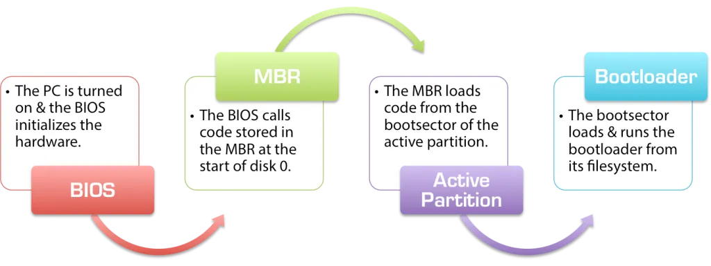

Boot

https://linoxide.com/linux-how-to/best-difference-between-linux-grub-and-grub2-bootloader/

https://linoxide.com/linux-how-to/initrd-image-linux/
https://neosmart.net/wiki/mbr-boot-process/

The boot process of a Linux system involves a number of stages. These include the BIOS initialization, reading the MBR, the bootloader, kernel initialization and the init process.

Regardless of the computer or operating system, standard (“IBM-compatible”) desktop PCs and laptops all power on and start up using one of two ways: the traditional BIOS-MBR method and the newer UEFI-GPT method, used by the latest versions of Windows, Linux, and Mac OS X on newer PCs, laptops, and tablets. This article summarizes the process by which traditional BIOS PCs load an operating system, covering the basics and details of the BIOS, MBR, and bootsector.

## **BIOS vs UEFI**

https://www.freecodecamp.org/news/uefi-vs-bios/

UEFI stands for Unified Extensible Firmware Interface. It does the same job as a BIOS, but with one basic difference: it stores all data about initialization and startup in an .efi file, instead of storing it on the firmware.

This .efi file is stored on a special partition called EFI System Partition (ESP) on the hard disk. This ESP partition also contains the bootloader.

UEFI was designed to overcome many limitations of the old BIOS, including:

1. UEFI supports drive sizes upto 9 zettabytes, whereas BIOS only supports 2.2 terabytes.

2. UEFI provides faster boot time.

3. UEFI has discrete driver support, while BIOS has drive support stored in its ROM, so updating BIOS firmware is a bit difficult.

4. UEFI offers security like "Secure Boot", which prevents the computer from booting from unauthorized/unsigned applications. This helps in preventing rootkits, but also hampers dual-booting, as it treats other OS as unsigned applications. Currently, only Windows and Ubuntu are signed OS (let me know if I am wrong).

5. UEFI runs in 32bit or 64bit mode, whereas BIOS runs in 16bit mode. So UEFI  is able to provide a GUI (navigation with mouse) as opposed to BIOS which allows navigation only using the keyboard.

## **GRUB bootloader and initrd (initial ramdisk)**

A bootloader is the first software program that runs during the startup process. It is responsible for booting the operating system. Bootloader loads the kernel into the memory and the kernel mounts the root partition so that it can start the first process, i.e. init process. Let us have a look at the commands that the bootloader executes for these tasks:

root (hd0,0)
kernel /vmlinuz-2.6.18-238.el5 ro root=/dev/VolGroup00/LogVol00
initrd /initrd-2.6.18-238.el5.img

The first command "root (hd0,0)" tells the bootloader that kernel image is present on first partition of the hard disk hd0 (i.e. hd0,0). This is the location of the kernel image.

The second command is the kernel image itself. In this case, it is "/vmlinuz-2.6.18-238.el5". The arguments passed to this command are ro and root. ro specifies the read only mode and root tells the partition on which root filesystem resides. The kernel mounts this root partition in read-only mode.

The third command is the location of initrd.

[Grub configuration files](https://www.thegeekdiary.com/centos-rhel-7-grub2-configuration-file-bootgrub2grub-cfg-explained/)

### The Chicken Egg Module Problem

We just saw that the kernel has to mount the root partition in read-only mode. But the root filesystem can be on a partition with one or more of following capabilities:

• Logical Volume Management (as in our case).
• Software RAID.
• NFS.
• Encrypted partition.
• SCSI controller support.

The kernel needs modules for these devices as they are not compiled into kernel itself. So, the kernel will load modules for these devices at runtime. These modules are present in “/lib/modules/” directory. This directory is present on the root filesystem itself and the root partition is not mounted yet (that is what this all is about). So, how can kernel access the modules for mounting the root partition residing on the root partition itself (without mounting it)?

Here initrd comes to rescue. The initrd ramdisk contains the modules required for mounting the root partition. This initrd resides on the same partition on which kernel image is present. So the kernel loads the initrd in memory, accesses the modules and mounts the root partition in read-only mode.

## Grub vs Grub2 (GRand Unified Bootloader)

The default menu for GRUB2 looks very similar to GRUB but there are some changes made in this.

- Grub has two configuration files namely **menu.lst** and **grub.conf **whereas, Grub2 has only one main configuration file namely **grub.cfg** and it looks very close to a full scripting language. And this configuration file is overwritten by certain Grub 2 package updates, whenever a kernel is added or removed, or when the user runs update-grub. For any configuration changes, we need to run update-grub to make the changes effective.
- In Grub, it is really hard for the normal user to modify the configuration. But Grub2 is more user-friendly, **Grub-mkconfig** will automatically changes the configuration.
- In Grub, partition number starts from **0**, whereas in Grub2 it starts with** 1**. The first device is still identified with hd0. These changes can be altered if needed by making some changes to device.map file of the '/etc/grub' folder.
- Grub uses physical and logical addresses to address the disk, it can't even read from new paritions whereas, Grub2 uses UUID to identify a disk thus is more reliable. It supports LVM and RAID devices.
- In today’s Linux Distros including (Ubuntu 16.04 and RHEL 7), GRUB2 will now directly show a login prompt and no menu is displayed now.
- If you want to see the menu during boot you need to hold down SHIFT key. Even sometimes by pressing ESC you can also display the menu.
- Users have also now choice of creating custom files in which they can place their own menu entries. You can make use of a file called 40_custom which is available in '/etc/grub.d' folder.
- Even users can now change the menu display settings. This is done through a file called grub located in /etc/default folder.

## Efi Files
https://www.zdnet.com/article/linux-on-your-laptop-a-closer-look-at-efi-boot-options/
https://www.lifewire.com/efi-file-2620983
https://access.redhat.com/documentation/en-us/red_hat_enterprise_linux/6/html/installation_guide/s2-grub-whatis-booting-uefi

A file with the EFI file extension is an Extensible Firmware Interface file.

They are boot loader executables, exist on UEFI (Unified Extensible Firmware Interface) based computer systems, and contain data on how the boot process should proceed.

## **PXE**

https://searchnetworking.techtarget.com/definition/Preboot-Execution-Environment

PXE stands for preboot execution environment.

The Preboot Execution Environment (PXE) is an industry standard client/server interface that allows networked computers that are not yet loaded with an operating system to be configured and booted remotely by an administrator. The PXE code is typically delivered with a new computer on a read-only memory chip or boot disk that allows the computer (a client) to communicate with the network server so that the client machine can be remotely configured and its operating system can be remotely booted.

The advantages of using PXE include:

- The client machine does not necessarily need an operating system or even a hard disk.
- The client machine can be rebooted in the event of hardware or software failure. This allows the administrator to diagnose and perhaps fix the problem.
- Since PXE is vendor-independent, new types of computers can easily be added to the network.

## **NFS**

https://www.extrahop.com/resources/protocols/nfs/
https://wiki.archlinux.org/index.php/NFS

NFS, or Network File System, was designed in 1984 by Sun Microsystems. This distributed file system protocol allows a user on a client computer to access files over a network in the same way they would access a local storage file. Because it is an open standard, anyone can implement the protocol. NFS started in-system as an experiment but the second version was publicly released after the initial success.

**How does NFS work?**

To access data stored on another machine (i.e. a server) the server would implement NFS daemon processes to make data available to clients. The server administrator determines what to make available and ensures it can recognize validated clients.

From the client's side, the machine requests access to exported data, typically by issuing a mount command. If successful, the client machine can then view and interact with the file systems within the decided parameters.

To enable access through a firewall, TCP and UDP ports **111**, **2049**, and **20048** may need to be opened when using the default configuration; use `rpcinfo -p` to examine the exact ports in use on the server:

$ rpcinfo -p | grep nfs

100003    3  tcp  2049  nfs
100003    4  tcp  2049  nfs
100227    3  tcp  2049  nfs_acl

When using NFSv4, make sure TCP port 2049 is open. No other port opening should be required:

`/etc/iptables/iptables.rules`

>-A INPUT -p tcp -m tcp --dport 2049 -j ACCEPT

When using an older NFS version, make sure other ports are open:

>\# iptables -A INPUT -p tcp -m tcp --dport 111 -j ACCEPT

>\# iptables -A INPUT -p tcp -m tcp --dport 2049 -j ACCEPT

>\# iptables -A INPUT -p tcp -m tcp --dport 20048 -j ACCEPT

>\# iptables -A INPUT -p udp -m udp --dport 111 -j ACCEPT

>\# iptables -A INPUT -p udp -m udp --dport 2049 -j ACCEPT

>\# iptables -A INPUT -p udp -m udp --dport 20048 -j ACCEPT

---	
## **Boot From ISO**

https://www.howtogeek.com/196933/how-to-boot-linux-iso-images-directly-from-your-hard-drive/

Linux’s GRUB2 boot loader can boot Linux ISO files directly from your hard drive. Boot Linux live CDs or even install Linux on another hard drive partition without burning it to disc or booting from a USB drive.

- Get a Linux ISO File
- Check the Contents of the ISO File
- Determine the Hard Drive Partition’s Path
	- `sudo fdisk -l`
- Create the GRUB2 Boot Entry
	- `sudo gedit /etc/grub.d/40_custom`

Here’s how you can boot an Ubuntu or Ubuntu-based distribution from an ISO file. We tested this with Ubuntu 14.04:

>menuentry “Ubuntu 14.04 ISO” {
set isofile=”/home/name/Downloads/ubuntu-14.04.1-desktop-amd64.iso”
loopback loop (hd0,1)$isofile
linux (loop)/casper/vmlinuz.efi boot=casper iso-scan/filename=${isofile} quiet splash
initrd (loop)/casper/initrd.lz
}

- Save the file when you’re done. Return to a Terminal window and run the following command:
	- `sudo update-grub`

---
## **Boot from http/ftp**

https://medium.com/@boozlachu/boot-ubuntu-via-http-ftp-server-with-pxe-diskless-boot-a3247e762d8b
https://documentation.suse.com/sles/15-SP2/html/SLES-all/cha-deployment-prep-uefi-httpboot.html

---

## Commands

### mkinitrd
https://www.tutorialspoint.com/unix_commands/mkinitrd.htm

mkinitrd - creates initial ramdisk images for preloading modules

### dracut
https://linux.die.net/man/8/dracut

dracut - create initial ramdisk images for preloading modules

### grub2-install / grub2-mkconfig

https://docs.fedoraproject.org/en-US/quick-docs/bootloading-with-grub2/

**Procedure**

>Create a configuration file for GRUB2.
>\# grub2-mkconfig -o /boot/grub2/grub.cfg

>List block devices available on the system.
> $ lsblk

Identify the primary hard disk. Usually, it is the sda device.

>Install GRUB2 in the MBR of the primary hard disk.
>\# grub2-install /dev/sda
Reboot your computer to boot with the newly installed bootloader.

## InitRamFs

https://ngelinux.com/difference-between-initrd-and-initramfs-all-what-you-need-to-know/
http://www.linuxfromscratch.org/blfs/view/svn/postlfs/initramfs.html

>1. Initrd and/or initramfs is used to load temporary root file system into RAM or system memory hence its named like initial RAM Disk/FS.
To start our Linux OS, we need to have either initrd or initramfs filesystem to load kernel into memory and then finally mounting the root filesystem on hard disk from memory which is done by dracut daemon.

>2. initrd and initramfs refers to two types of different methods to achieve this. Both are used to make preparations(to start kernel, and initiate hardware devices) before the real root file system can be mounted(on system hard disk or storage).

