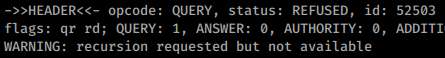
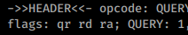

53 - Pentesting DNS - HackTricks

[    HackTricks](https://book.hacktricks.xyz/)

[HackTricks](https://book.hacktricks.xyz/)
[Pentesting Methodology](https://book.hacktricks.xyz/pentesting-methodology)
[About the author](https://book.hacktricks.xyz/about-the-author)
[Exfiltration](https://book.hacktricks.xyz/exfiltration)

[Tunneling and Port Forwarding](https://book.hacktricks.xyz/tunneling-and-port-forwarding)

[Brute Force - CheatSheet](https://book.hacktricks.xyz/brute-force)
[Search Exploits](https://book.hacktricks.xyz/search-exploits)
Shells

[Shells (Linux, Windows, MSFVenom)](https://book.hacktricks.xyz/shells/shells)

Linux/Unix

[Checklist - Linux Privilege Escalation](https://book.hacktricks.xyz/linux-unix/linux-privilege-escalation-checklist)

[Linux Privilege Escalation](https://book.hacktricks.xyz/linux-unix/privilege-escalation)

[Useful Linux Commands](https://book.hacktricks.xyz/linux-unix/useful-linux-commands)

[Linux Environment Variables](https://book.hacktricks.xyz/linux-unix/linux-environment-variables)

Windows

[Checklist - Local Windows Privilege Escalation](https://book.hacktricks.xyz/windows/checklist-windows-privilege-escalation)

[Windows Local Privilege Escalation](https://book.hacktricks.xyz/windows/windows-local-privilege-escalation)

[Active Directory Methodology](https://book.hacktricks.xyz/windows/active-directory-methodology)

[NTLM](https://book.hacktricks.xyz/windows/ntlm)

[Stealing Credentials](https://book.hacktricks.xyz/windows/stealing-credentials)

[Authentication, Credentials, Token privileges, UAC and EFS](https://book.hacktricks.xyz/windows/credentials)

[Basic CMD for Pentesters](https://book.hacktricks.xyz/windows/basic-cmd-for-pentesters)

[Basic PowerShell for Pentesters](https://book.hacktricks.xyz/windows/basic-powershell-for-pentesters)

[AV Bypass](https://book.hacktricks.xyz/windows/av-bypass)
Mobile Apps Pentesting

[Android APK Checklist](https://book.hacktricks.xyz/mobile-apps-pentesting/android-checklist)

[Android Applications Pentesting](https://book.hacktricks.xyz/mobile-apps-pentesting/android-app-pentesting)

Pentesting

[Pentesting Network](https://book.hacktricks.xyz/pentesting/pentesting-network)

[Pentesting JDWP - Java Debug Wire Protocol](https://book.hacktricks.xyz/pentesting/pentesting-jdwp-java-debug-wire-protocol)

[Pentesting Printers](https://book.hacktricks.xyz/pentesting/pentesting-printers)

[7/tcp/udp - Pentesting Echo](https://book.hacktricks.xyz/pentesting/7-tcp-udp-pentesting-echo)

[21 - Pentesting FTP](https://book.hacktricks.xyz/pentesting/pentesting-ftp)

[22 - Pentesting SSH/SFTP](https://book.hacktricks.xyz/pentesting/pentesting-ssh)

[23 - Pentesting Telnet](https://book.hacktricks.xyz/pentesting/pentesting-telnet)

[25,465,587 - Pentesting SMTP/s](https://book.hacktricks.xyz/pentesting/pentesting-smtp)

[43 - Pentesting WHOIS](https://book.hacktricks.xyz/pentesting/43-pentesting-whois)

[53 - Pentesting DNS](https://book.hacktricks.xyz/pentesting/pentesting-dns)

[69/UDP TFTP/Bittorrent-tracker](https://book.hacktricks.xyz/pentesting/69-udp-tftp)

[79 - Pentesting Finger](https://book.hacktricks.xyz/pentesting/pentesting-finger)

[80,443 - Pentesting Web Methodology](https://book.hacktricks.xyz/pentesting/pentesting-web)

[88tcp/udp - Pentesting Kerberos](https://book.hacktricks.xyz/pentesting/pentesting-kerberos-88)

[110,995 - Pentesting POP](https://book.hacktricks.xyz/pentesting/pentesting-pop)

[111/TCP/UDP - Pentesting Portmapper](https://book.hacktricks.xyz/pentesting/pentesting-rpcbind)

[113 - Pentesting Ident](https://book.hacktricks.xyz/pentesting/113-pentesting-ident)

[123/udp - Pentesting NTP](https://book.hacktricks.xyz/pentesting/pentesting-ntp)

[135, 593 - Penstesting MSRPC](https://book.hacktricks.xyz/pentesting/135-penstesting-msrpc)

[137,138,139 - Pentesting NetBios](https://book.hacktricks.xyz/pentesting/137-138-139-pentesting-netbios)

[139,445 - Pentesting SMB](https://book.hacktricks.xyz/pentesting/pentesting-smb)

[143,993 - Pentesting IMAP](https://book.hacktricks.xyz/pentesting/pentesting-imap)

[161,162,10161,10162/udp - Pentesting SNMP](https://book.hacktricks.xyz/pentesting/pentesting-snmp)

[194,6667,6660-7000 - Pentesting IRC](https://book.hacktricks.xyz/pentesting/pentesting-irc)

[264 - Pentesting Check Point FireWall-1](https://book.hacktricks.xyz/pentesting/pentesting-264-check-point-firewall-1)

[389, 636, 3268, 3269 - Pentesting LDAP](https://book.hacktricks.xyz/pentesting/pentesting-ldap)

[500/udp - Pentesting IPsec/IKE VPN](https://book.hacktricks.xyz/pentesting/ipsec-ike-vpn-pentesting)

[502 - Pentesting Modbus](https://book.hacktricks.xyz/pentesting/pentesting-modbus)

[512 - Pentesting Rexec](https://book.hacktricks.xyz/pentesting/512-pentesting-rexec)

[513 - Pentesting Rlogin](https://book.hacktricks.xyz/pentesting/pentesting-rlogin)

[514 - Pentesting Rsh](https://book.hacktricks.xyz/pentesting/pentesting-rsh)

[515 - Pentesting Line Printer Daemon (LPD)](https://book.hacktricks.xyz/pentesting/515-pentesting-line-printer-daemon-lpd)

[548 - Pentesting Apple Filing Protocol (AFP)](https://book.hacktricks.xyz/pentesting/584-pentesting-afp)

[554,8554 - Pentesting RTSP](https://book.hacktricks.xyz/pentesting/554-8554-pentesting-rtsp)

[623/UDP/TCP - IPMI](https://book.hacktricks.xyz/pentesting/623-udp-ipmi)

[631 - Internet Printing Protocol(IPP)](https://book.hacktricks.xyz/pentesting/pentesting-631-internet-printing-protocol-ipp)

[873 - Pentesting Rsync](https://book.hacktricks.xyz/pentesting/873-pentesting-rsync)

[1026 - Pentesting Rusersd](https://book.hacktricks.xyz/pentesting/1026-pentesting-rusersd)

[1098/1099 - Pentesting Java RMI](https://book.hacktricks.xyz/pentesting/1099-pentesting-java-rmi)

[1433 - Pentesting MSSQL - Microsoft SQL Server](https://book.hacktricks.xyz/pentesting/pentesting-mssql-microsoft-sql-server)

[1521,1522-1529 - Pentesting Oracle TNS Listener](https://book.hacktricks.xyz/pentesting/1521-1522-1529-pentesting-oracle-listener)

[1723 - Pentesting PPTP](https://book.hacktricks.xyz/pentesting/1723-pentesting-pptp)

[1883 - Pentesting MQTT (Mosquitto)](https://book.hacktricks.xyz/pentesting/1883-pentesting-mqtt-mosquitto)

[2049 - Pentesting NFS Service](https://book.hacktricks.xyz/pentesting/nfs-service-pentesting)

[2301,2381 - Pentesting Compaq/HP Insight Manager](https://book.hacktricks.xyz/pentesting/pentesting-compaq-hp-insight-manager)

[3260 - Pentesting ISCSI](https://book.hacktricks.xyz/pentesting/3260-pentesting-iscsi)

[3299 - Pentesting SAPRouter](https://book.hacktricks.xyz/pentesting/3299-pentesting-saprouter)

[3306 - Pentesting Mysql](https://book.hacktricks.xyz/pentesting/pentesting-mysql)

[3389 - Pentesting RDP](https://book.hacktricks.xyz/pentesting/pentesting-rdp)

[3632 - Pentesting distcc](https://book.hacktricks.xyz/pentesting/3632-pentesting-distcc)

[4369 - Pentesting Erlang Port Mapper Daemon (epmd)](https://book.hacktricks.xyz/pentesting/4369-pentesting-erlang-port-mapper-daemon-epmd)

[5353/UDP Multicast DNS (mDNS)](https://book.hacktricks.xyz/pentesting/5353-udp-multicast-dns-mdns)

[5432,5433 - Pentesting Postgresql](https://book.hacktricks.xyz/pentesting/pentesting-postgresql)

[5671,5672 - Pentesting AMQP](https://book.hacktricks.xyz/pentesting/5671-5672-pentesting-amqp)

[5800,5801,5900,5901 - Pentesting VNC](https://book.hacktricks.xyz/pentesting/pentesting-vnc)

[5984,6984 - Pentesting CouchDB](https://book.hacktricks.xyz/pentesting/5984-pentesting-couchdb)

[5985,5986 - Pentesting WinRM](https://book.hacktricks.xyz/pentesting/5985-5986-pentesting-winrm)

[6000 - Pentesting X11](https://book.hacktricks.xyz/pentesting/6000-pentesting-x11)

[6379 - Pentesting Redis](https://book.hacktricks.xyz/pentesting/6379-pentesting-redis)

[8009 - Pentesting Apache JServ Protocol (AJP)](https://book.hacktricks.xyz/pentesting/8009-pentesting-apache-jserv-protocol-ajp)

[9042/9160 - Pentesting Cassandra](https://book.hacktricks.xyz/pentesting/cassandra)

[9100 - Pentesting Raw Printing (JetDirect, AppSocket, PDL-datastream)](https://book.hacktricks.xyz/pentesting/9100-pjl)

[9200 - Pentesting Elasticsearch](https://book.hacktricks.xyz/pentesting/9200-pentesting-elasticsearch)

[10000 - Pentesting Network Data Management Protocol (ndmp)](https://book.hacktricks.xyz/pentesting/10000-network-data-management-protocol-ndmp)

[11211 - Pentesting Memcache](https://book.hacktricks.xyz/pentesting/11211-memcache)

[15672 - Pentesting RabbitMQ Management](https://book.hacktricks.xyz/pentesting/15672-pentesting-rabbitmq-management)

[27017,27018 - Pentesting MongoDB](https://book.hacktricks.xyz/pentesting/27017-27018-mongodb)

[44818/UDP/TCP - Pentesting EthernetIP](https://book.hacktricks.xyz/pentesting/44818-ethernetip)

[47808/udp - Pentesting BACNet](https://book.hacktricks.xyz/pentesting/47808-udp-bacnet)

[50030,50060,50070,50075,50090 - Pentesting Hadoop](https://book.hacktricks.xyz/pentesting/50030-50060-50070-50075-50090-pentesting-hadoop)

Pentesting Web
[2FA Bypass](https://book.hacktricks.xyz/pentesting-web/2fa-bypass)

[Abusing hop-by-hop headers](https://book.hacktricks.xyz/pentesting-web/abusing-hop-by-hop-headers)

[Captcha Bypass](https://book.hacktricks.xyz/pentesting-web/captcha-bypass)

[Cache Poisoning and Cache Deception](https://book.hacktricks.xyz/pentesting-web/cache-deception)

[Clickjacking](https://book.hacktricks.xyz/pentesting-web/clickjacking)

[Client Side Template Injection (CSTI)](https://book.hacktricks.xyz/pentesting-web/client-side-template-injection-csti)

[Command Injection](https://book.hacktricks.xyz/pentesting-web/command-injection)

[Content Security Policy (CSP) Bypass](https://book.hacktricks.xyz/pentesting-web/content-security-policy-csp-bypass)

[Cookies Hacking](https://book.hacktricks.xyz/pentesting-web/hacking-with-cookies)

[CORS - Misconfigurations & Bypass](https://book.hacktricks.xyz/pentesting-web/cors-bypass)

[CRLF (%0D%0A) Injection](https://book.hacktricks.xyz/pentesting-web/crlf-0d-0a)

[Cross-site WebSocket hijacking (CSWSH)](https://book.hacktricks.xyz/pentesting-web/cross-site-websocket-hijacking-cswsh)

[CSRF (Cross Site Request Forgery)](https://book.hacktricks.xyz/pentesting-web/csrf-cross-site-request-forgery)

[Dangling Markup - HTML scriptless injection](https://book.hacktricks.xyz/pentesting-web/dangling-markup-html-scriptless-injection)

[Deserialization](https://book.hacktricks.xyz/pentesting-web/deserialization)

[Email Header Injection](https://book.hacktricks.xyz/pentesting-web/email-header-injection)

[File Inclusion/Path traversal](https://book.hacktricks.xyz/pentesting-web/file-inclusion)

[File Upload](https://book.hacktricks.xyz/pentesting-web/file-upload)

[HTTP Request Smuggling / HTTP Desync Attack](https://book.hacktricks.xyz/pentesting-web/http-request-smuggling)

[IDOR](https://book.hacktricks.xyz/pentesting-web/idor)

[JWT Vulnerabilities (Json Web Tokens)](https://book.hacktricks.xyz/pentesting-web/hacking-jwt-json-web-tokens)

[NoSQL injection](https://book.hacktricks.xyz/pentesting-web/nosql-injection)
[LDAP Injection](https://book.hacktricks.xyz/pentesting-web/ldap-injection)

[OAuth to Account takeover](https://book.hacktricks.xyz/pentesting-web/oauth-to-account-takeover)

[Open Redirect](https://book.hacktricks.xyz/pentesting-web/open-redirect)
[Race Condition](https://book.hacktricks.xyz/pentesting-web/race-condition)

[Rate Limit Bypass](https://book.hacktricks.xyz/pentesting-web/rate-limit-bypass)

[SQL Injection](https://book.hacktricks.xyz/pentesting-web/sql-injection)

[SSRF (Server Side Request Forgery)](https://book.hacktricks.xyz/pentesting-web/ssrf-server-side-request-forgery)

[SSTI (Server Side Template Injection)](https://book.hacktricks.xyz/pentesting-web/ssti-server-side-template-injection)

[Domain/Subdomain takeover](https://book.hacktricks.xyz/pentesting-web/domain-subdomain-takeover)

[Unicode Normalization vulnerability](https://book.hacktricks.xyz/pentesting-web/unicode-normalization-vulnerability)

[Web Tool - WFuzz](https://book.hacktricks.xyz/pentesting-web/web-tool-wfuzz)
[XPATH injection](https://book.hacktricks.xyz/pentesting-web/xpath-injection)

[XSLT Server Side Injection (Extensible Stylesheet Languaje Transformations)](https://book.hacktricks.xyz/pentesting-web/xslt-server-side-injection-extensible-stylesheet-languaje-transformations)

[XXE - XEE - XML External Entity](https://book.hacktricks.xyz/pentesting-web/xxe-xee-xml-external-entity)

[XSS (Cross Site Scripting)](https://book.hacktricks.xyz/pentesting-web/xss-cross-site-scripting)

[XSSI (Cross-Site Script Inclusion)](https://book.hacktricks.xyz/pentesting-web/xssi-cross-site-script-inclusion)

[XS-Search](https://book.hacktricks.xyz/pentesting-web/xs-search)
Physical attacks

[Physical Attacks](https://book.hacktricks.xyz/physical-attacks/physical-attacks)

[Escaping from KIOSKs](https://book.hacktricks.xyz/physical-attacks/escaping-from-gui-applications)

Exploiting

[Linux Exploiting (Basic) (SPA)](https://book.hacktricks.xyz/exploiting/linux-exploiting-basic-esp)

[Exploiting Tools](https://book.hacktricks.xyz/exploiting/tools)

[Windows Exploiting (Basic Guide - OSCP lvl)](https://book.hacktricks.xyz/exploiting/windows-exploiting-basic-guide-oscp-lvl)

[Reversing](https://book.hacktricks.xyz/exploiting/reversing)
Forensics
[Malware Analysis](https://book.hacktricks.xyz/forensics/malware-analysis)

[Memory dump analysis](https://book.hacktricks.xyz/forensics/memory-dump-analysis)

[Pcaps analysis](https://book.hacktricks.xyz/forensics/pcaps-analysis)

[Volatility - Examples](https://book.hacktricks.xyz/forensics/volatility-examples)

[Basic Forensics (ESP)](https://book.hacktricks.xyz/forensics/basic-forensics-esp)

Crypto

[Electronic Code Book (ECB)](https://book.hacktricks.xyz/crypto/electronic-code-book-ecb)

[Cipher Block Chaining CBC-MAC](https://book.hacktricks.xyz/crypto/cipher-block-chaining-cbc-mac-priv)

[Padding Oracle](https://book.hacktricks.xyz/crypto/padding-oracle-priv)

[RC4 - Encrypt&Decrypt](https://book.hacktricks.xyz/crypto/rc4-encrypt-and-decrypt)

[Crypto CTFs Tricks](https://book.hacktricks.xyz/crypto/crypto-ctfs-tricks)
BACKDOORS
[Merlin](https://book.hacktricks.xyz/backdoors/merlin)
[Empire](https://book.hacktricks.xyz/backdoors/empire)
[Salseo](https://book.hacktricks.xyz/backdoors/salseo)
[ICMPsh](https://book.hacktricks.xyz/backdoors/icmpsh)
Stego
[Stego Tricks](https://book.hacktricks.xyz/stego/stego-tricks)
[Esoteric languages](https://book.hacktricks.xyz/stego/esoteric-languages)
MISC

[Basic Python](https://book.hacktricks.xyz/misc/basic-python)

[Other Big References](https://book.hacktricks.xyz/misc/references)
TODO
[More Tools](https://book.hacktricks.xyz/todo/more-tools)
[MISC](https://book.hacktricks.xyz/todo/misc)
[Pentesting DNS](https://book.hacktricks.xyz/todo/pentesting-dns)
[Burp Suite](https://book.hacktricks.xyz/burp-suite)
[Other Web Tricks](https://book.hacktricks.xyz/other-web-tricks)
[Interesting HTTP](https://book.hacktricks.xyz/interesting-http)
[Emails Vulnerabilities](https://book.hacktricks.xyz/emails-vulns)

[Bug Bounties Methodology](https://book.hacktricks.xyz/bug-bounties-methodology)

[Cloud security review](https://book.hacktricks.xyz/cloud-security-review)
[Android Forensics](https://book.hacktricks.xyz/android-forensics)
[TR-069](https://book.hacktricks.xyz/tr-069)

[6881/udp - Pentesting BitTorrent](https://book.hacktricks.xyz/6881-udp-pentesting-bittorrent)

[CTF Write-ups](https://book.hacktricks.xyz/ctf-write-ups)

[1911 - Pentesting fox](https://book.hacktricks.xyz/1911-pentesting-fox)

[Online Platforms with API](https://book.hacktricks.xyz/online-platforms-with-api)

[Phising Documents](https://book.hacktricks.xyz/phising-documents)

[![](data:image/svg+xml,%3csvg preserveAspectRatio='xMidYMid meet' height='1em' width='1em' fill='currentColor' viewBox='0 0 1067 769' xmlns='http://www.w3.org/2000/svg' stroke='none' class='icon-7f6730be--text-3f89f380 js-evernote-checked' data-evernote-id='1488'%3e%3cg data-evernote-id='1489' class='js-evernote-checked'%3e%3cpath d='M480.026 640.677c17.205 0 31.2 13.997 31.2 31.194s-13.995 31.193-31.2 31.193c-17.197 0-31.193-13.996-31.193-31.193 0-17.197 13.996-31.194 31.193-31.194m489.93-193.226c-17.203 0-31.2-13.998-31.2-31.195 0-17.204 13.997-31.2 31.2-31.2 17.198 0 31.194 13.996 31.194 31.2 0 17.197-13.996 31.195-31.193 31.195m0-127.804c-53.269 0-96.609 43.34-96.609 96.609 0 10.373 1.723 20.702 5.123 30.741L559.328 616.879c-18.132-26.128-47.521-41.617-79.302-41.617-36.821 0-70.391 21.065-86.63 54.003L106.68 478.109c-30.288-15.927-52.965-65.817-50.56-111.223 1.248-23.687 9.438-42.071 21.897-49.17 7.916-4.493 17.436-4.099 27.526 1.188l1.916 1.01c75.96 40.022 324.6 170.981 335.063 175.844 16.157 7.47 25.14 10.5 52.659-2.547l513.958-267.3c7.53-2.844 16.315-10.062 16.315-21.023 0-15.205-15.72-21.199-15.765-21.199-29.218-14.018-74.163-35.054-117.987-55.57C798.033 84.26 691.861 34.547 645.23 10.132c-40.253-21.072-72.655-3.311-78.432.282l-11.227 5.555C345.727 119.743 64.898 258.826 48.911 268.553 20.278 285.973 2.547 320.679.252 363.768c-3.586 68.304 31.261 139.506 81.069 165.634l303.172 156.354c6.83 47.306 47.55 82.725 95.532 82.725 52.78 0 95.808-42.546 96.603-95.14L910.541 492.38c16.93 13.233 37.92 20.486 59.416 20.486 53.268 0 96.61-43.341 96.61-96.61s-43.342-96.61-96.61-96.61' fill-rule='evenodd' data-evernote-id='1490' class='js-evernote-checked'%3e%3c/path%3e%3c/g%3e%3c/svg%3e) Powered by**GitBook**](https://www.gitbook.com/?utm_source=content&utm_medium=trademark&utm_campaign=hacktricks)

# 53 - Pentesting DNS

#

**Basic Information**

The Domain Name Systems (DNS) is the phonebook of the Internet. Humans access information online through domain names, like nytimes.com or espn.com. Web browsers interact through Internet Protocol (IP) addresses. DN S translates domain names to [IP addresses](https://www.cloudflare.com/learning/dns/glossary/what-is-my-ip-address/) so browsers can load Internet resources. From [here](https://www.cloudflare.com/learning/dns/what-is-dns/).

**Default port:** 53

Copy

1PORT STATE SERVICE REASON

253/tcp open domain Microsoft DNS 6.1.7601 (1DB15D39) (Windows Server 2008 R2 SP1)

35353/udp open zeroconf udp-response

453/udp open domain Microsoft DNS 6.1.7601 (1DB15D39) (Windows Server 2008 R2 SP1)

#

Enumeration

##

**Banner Grabbing**

DNS does not have a "banner" to grab. The closest equivalent is a magic query for `version.bind. CHAOS TXT ` which will work on most BIND nameservers. You can perform this query using `dig `:

Copy

dig version.bind CHAOS TXT @DNS

If that does not work you can use fingerprinting techniques to determine the remote server's version -- the [`fpdns `](https://github.com/kirei/fpdns) tool is one option for that, but there are others.

You can grab the banner also with a **nmap **script:

Copy

--script dns-nsid

##

**Zone Transfer**

Copy

7dig axfr @<DNS_IP>  #Try zone transfer without domain
8dig axfr @<DNS_IP>  <DOMAIN>  #Try zone transfer guessing the domain

9fierce -dns <DOMAIN>  #Will try toperform a zone transfer against every authoritative name server and if this doesn'twork, will launch a dictionary attack

##

More info

Copy

10dig ANY @<DNS_IP>  <DOMAIN>  #Any information
11dig A @<DNS_IP>  <DOMAIN>  #Regular DNS request
12dig AAAA @<DNS_IP>  <DOMAIN>  #IPv6 DNS request
13dig TXT @<DNS_IP>  <DOMAIN>  #Information
14dig MX @<DNS_IP>  <DOMAIN>  #Emails related
15dig NS @<DNS_IP>  <DOMAIN>  #DNS that resolves that name
16dig -x 192.168.0.2 @<DNS_IP>  #Reverse lookup
17dig -x 2a00:1450:400c:c06::93 @<DNS_IP>  #reverse IPv6 lookup
18​
19#Use [-p PORT] or -6 (to use ivp6 address of dns)

###

Using nslookup

Copy

20nslookup
21> SERVER <IP_DNS>  #Select dns server
22> 127.0.0.1 #Reverse lookup of 127.0.0.1, maybe...
23>  <IP_MACHINE>  #Reverse lookup of a machine, maybe...

##

Useful metasploit modules

Copy

auxiliary/gather/enum_dns #Perform enumeration actions

##

Useful nmap scripts

Copy

25#Perform enumeration actions

26nmap -n --script "(default and *dns*) or fcrdns or dns-srv-enum or dns-random-txid or dns-random-srcport"  <IP>

##

DNS - Reverse BF

Copy

27dnsrecon -r 127.0.0.0/24 -n <IP_DNS>  #DNS reverse of all of the addresses
28dnsrecon -r 127.0.1.0/24 -n <IP_DNS>  #DNS reverse of all of the addresses
29dnsrecon -r <IP_DNS>/24 -n <IP_DNS>  #DNS reverse of all of the addresses
30dnsrecon -d active.htb -a -n <IP_DNS>  #Zone transfer
Another tool to do so: https://github.com/amine7536/reverse-scan​

You can query reverse IP ranges to https://bgp.he.net/net/205.166.76.0/24#_dns (this tool is also helpful with BGP).

##

DNS - Subdomains BF

Copy

31dnsrecon -D subdomains-1000.txt -d <DOMAIN> -n <IP_DNS>

32dnscan -d <domain> -r -w subdomains-1000.txt #Bruteforce subdomains in recursive way, https://github.com/rbsec/dnscan

##

Active Directory servers

Copy

33dig -t _gc._tcp.lab.domain.com
34dig -t _ldap._tcp.lab.domain.com
35dig -t _kerberos._tcp.lab.domain.com
36dig -t _kpasswd._tcp.lab.domain.com
37nmap --script dns-srv-enum --script-args "dns-srv-enum.domain='domain.com'"

##

DNSSec

Copy

38  #Query paypal subdomains to ns3.isc-sns.info

39 nmap -sSU -p53 --script dns-nsec-enum --script-args dns-nsec-enum.domains=paypal.com ns3.isc-sns.info

##

IPv6

Brute force using "AAAA" requests to gather IPv6 of the subdomains.

Copy

dnsdict6 -s -t <domain>
Bruteforce reverse DNS in using IPv6 addresses

Copy

dnsrevenum6 pri.authdns.ripe.net 2001:67c:2e8::/48 #Will use the dns pri.authdns.ripe.net

##

DNS Recursion DDoS

If **DNS recursion is enabled**, an attacker could **spoof **the **origin **on the UDP packet in order to make the **DNS send the response to the victim server**. An attacker could abuse **ANY **or **DNSSEC **record types as they use to have the bigger responses. The way to **check **if a DNS supports **recursion **is to query a domain name and **check **if the **flag "ra"** (*recursion available*) is in the response:

Copy

dig google.com A @<IP>
**Non available**:

**Available**:

##

Mail to nonexistent account

From book: Network Security Assessment (3rd edition)

Simply sending an email message to a nonexistent address at a target domain often reveals useful internal network information through a *nondelivery notification* (NDN).

Copy

43Generating server: noa.nintendo.com
44​
45blah@nintendo.com
46#550 5.1.1 RESOLVER.ADR.RecipNotFound; not found ##
47​
48Original message headers:
49​
50Received: from ONERDEDGE02.one.nintendo.com (10.13.20.35) by
51 onerdexch08.one.nintendo.com (10.13.30.39) with Microsoft SMTP Server (TLS)
52 id 14.3.174.1; Sat, 26 Apr 2014 16:52:22 -0700
53Received: from barracuda.noa.nintendo.com (205.166.76.35) by
54 ONERDEDGE02.one.nintendo.com (10.13.20.35) with Microsoft SMTP Server (TLS)
55 id 14.3.174.1; Sat, 26 Apr 2014 16:51:22 -0700
56X-ASG-Debug-ID: 1398556333-0614671716199b0d0001-zOQ9WJ

57Received: from gateway05.websitewelcome.com (gateway05.websitewelcome.com [69.93.154.37]) by

58barracuda.noa.nintendo.com with ESMTP id xVNPkwaqGgdyH5Ag for <blah@nintendo.com>; Sat,

5926 Apr 2014 16:52:13 -0700 (PDT)
60X-Barracuda-Envelope-From: chris@example.org
61X-Barracuda-Apparent-Source-IP: 69.93.154.37
The following data in this transcript is useful:

- Internal hostnames, IP addresses, and subdomain layout
- The mail server is running Microsoft Exchange Server 2010 SP3
- A Barracuda Networks device is used to perform content filtering

#

Config files

Copy

62host.conf
63resolv.conf
64named.conf

[ Pentesting - Previous 43 - Pentesting WHOIS](https://book.hacktricks.xyz/pentesting/43-pentesting-whois)[ Next - Pentesting  69/UDP TFTP/Bittorrent-tracker   ](https://book.hacktricks.xyz/pentesting/69-udp-tftp)

CPol
Last updated 2 months ago

 [![](data:image/svg+xml,%3csvg preserveAspectRatio='xMidYMid meet' height='1em' width='1em' fill='currentColor' xmlns='http://www.w3.org/2000/svg' viewBox='0 0 438.549 438.549' stroke='none' class='icon-7f6730be--text-3f89f380 js-evernote-checked' data-evernote-id='2526'%3e%3cg data-evernote-id='2527' class='js-evernote-checked'%3e%3cpath d='M409.132 114.573c-19.608-33.596-46.205-60.194-79.798-79.8-33.598-19.607-70.277-29.408-110.063-29.408-39.781 0-76.472 9.804-110.063 29.408-33.596 19.605-60.192 46.204-79.8 79.8C9.803 148.168 0 184.854 0 224.63c0 47.78 13.94 90.745 41.827 128.906 27.884 38.164 63.906 64.572 108.063 79.227 5.14.954 8.945.283 11.419-1.996 2.475-2.282 3.711-5.14 3.711-8.562 0-.571-.049-5.708-.144-15.417a2549.81 2549.81 0 0 1-.144-25.406l-6.567 1.136c-4.187.767-9.469 1.092-15.846 1-6.374-.089-12.991-.757-19.842-1.999-6.854-1.231-13.229-4.086-19.13-8.559-5.898-4.473-10.085-10.328-12.56-17.556l-2.855-6.57c-1.903-4.374-4.899-9.233-8.992-14.559-4.093-5.331-8.232-8.945-12.419-10.848l-1.999-1.431c-1.332-.951-2.568-2.098-3.711-3.429-1.142-1.331-1.997-2.663-2.568-3.997-.572-1.335-.098-2.43 1.427-3.289 1.525-.859 4.281-1.276 8.28-1.276l5.708.853c3.807.763 8.516 3.042 14.133 6.851 5.614 3.806 10.229 8.754 13.846 14.842 4.38 7.806 9.657 13.754 15.846 17.847 6.184 4.093 12.419 6.136 18.699 6.136 6.28 0 11.704-.476 16.274-1.423 4.565-.952 8.848-2.383 12.847-4.285 1.713-12.758 6.377-22.559 13.988-29.41-10.848-1.14-20.601-2.857-29.264-5.14-8.658-2.286-17.605-5.996-26.835-11.14-9.235-5.137-16.896-11.516-22.985-19.126-6.09-7.614-11.088-17.61-14.987-29.979-3.901-12.374-5.852-26.648-5.852-42.826 0-23.035 7.52-42.637 22.557-58.817-7.044-17.318-6.379-36.732 1.997-58.24 5.52-1.715 13.706-.428 24.554 3.853 10.85 4.283 18.794 7.952 23.84 10.994 5.046 3.041 9.089 5.618 12.135 7.708 17.705-4.947 35.976-7.421 54.818-7.421s37.117 2.474 54.823 7.421l10.849-6.849c7.419-4.57 16.18-8.758 26.262-12.565 10.088-3.805 17.802-4.853 23.134-3.138 8.562 21.509 9.325 40.922 2.279 58.24 15.036 16.18 22.559 35.787 22.559 58.817 0 16.178-1.958 30.497-5.853 42.966-3.9 12.471-8.941 22.457-15.125 29.979-6.191 7.521-13.901 13.85-23.131 18.986-9.232 5.14-18.182 8.85-26.84 11.136-8.662 2.286-18.415 4.004-29.263 5.146 9.894 8.562 14.842 22.077 14.842 40.539v60.237c0 3.422 1.19 6.279 3.572 8.562 2.379 2.279 6.136 2.95 11.276 1.995 44.163-14.653 80.185-41.062 108.068-79.226 27.88-38.161 41.825-81.126 41.825-128.906-.01-39.771-9.818-76.454-29.414-110.049z' data-evernote-id='2528' class='js-evernote-checked'%3e%3c/path%3e%3c/g%3e%3c/svg%3e) Edit on GitHub](https://github.com/carlospolop/hacktricks/blob/master/pentesting/pentesting-dns.md)

Contents

[Basic Information](https://book.hacktricks.xyz/pentesting/pentesting-dns#basic-information)[Enumeration](https://book.hacktricks.xyz/pentesting/pentesting-dns#enumeration)[Banner Grabbing](https://book.hacktricks.xyz/pentesting/pentesting-dns#banner-grabbing)[Zone Transfer](https://book.hacktricks.xyz/pentesting/pentesting-dns#zone-transfer)[More info](https://book.hacktricks.xyz/pentesting/pentesting-dns#more-info)[Useful metasploit modules](https://book.hacktricks.xyz/pentesting/pentesting-dns#useful-metasploit-modules)[Useful nmap scripts](https://book.hacktricks.xyz/pentesting/pentesting-dns#useful-nmap-scripts)[DNS - Reverse BF](https://book.hacktricks.xyz/pentesting/pentesting-dns#dns-reverse-bf)[DNS - Subdomains BF](https://book.hacktricks.xyz/pentesting/pentesting-dns#dns-subdomains-bf)[Active Directory servers](https://book.hacktricks.xyz/pentesting/pentesting-dns#active-directory-servers)[DNSSec](https://book.hacktricks.xyz/pentesting/pentesting-dns#dnssec)[IPv6](https://book.hacktricks.xyz/pentesting/pentesting-dns#ipv6)[DNS Recursion DDoS](https://book.hacktricks.xyz/pentesting/pentesting-dns#dns-recursion-ddos)[Mail to nonexistent account](https://book.hacktricks.xyz/pentesting/pentesting-dns#mail-to-nonexistent-account)[Config files](https://book.hacktricks.xyz/pentesting/pentesting-dns#config-files)