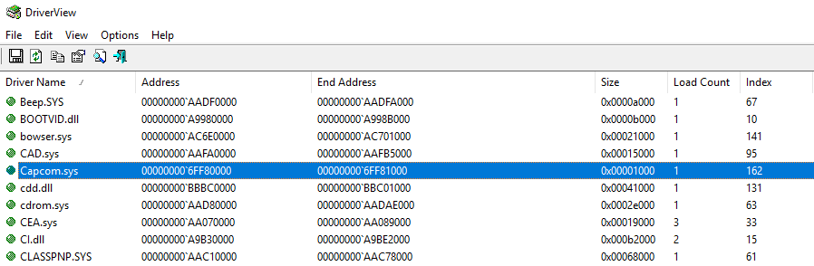

Abusing SeLoadDriverPrivilege for privilege escalation - Tarlogic Security - Cyber Security and Ethical hacking

 [<Return to blog](https://www.tarlogic.com/en/cybersecurity-blog/)

# Abusing SeLoadDriverPrivilege for privilege escalation

   14 - Jun - 2018 - Oscar Mallo

### 0x01 – Preamble

In Windows operating systems, it is well known that assigning certain privileges to user accounts without administration permissions can result in local privilege escalation attacks. Although Microsoft’s documentation is quite clear [about it](https://technet.microsoft.com/es-es/library/mt629227(v=vs.85).aspx#Consideraciones_sobre_seguridad), throughout several [pentests](https://www.tarlogic.com/en/cybersecurity-services/security-auditing-it-security-and-ethical-hacking/) we have found privilege assignment policies assigned to ordinary users, that we have been able to exploit to take full control over a system.

Today, we will analyze the impact associated to the assignment of the “**Load and unload device drivers**” policy, which specifies the users who are allowed to dynamically load device drivers. The activation of this policy in the context of non-privileged users implies a significant risk due to the possibility of executing code in kernel space.

Although this is a [well known](https://github.com/hatRiot/token-priv/blob/master/abusing_token_eop_1.0.txt) technique, it can not be found in post-exploitation and privilege escalation tools, and there are no tools which carry out automatic exploitation neither.

### 0x02 – SeLoadDriverPrivilege and Access Tokens

“**Load and unload device drivers**” policy is accessible from the local group policy editor (gpedit.msc) under the following path: “Computer configuration-> Windows settings-> Security Settings -> User Rights Assignment”

Given its implications, the default values of this policy include only the group of “**administrators**” and “**print operators**“. The following table shows the default values, according to the documentation:

Effective default policy values

*> [**> NOTE**](https://adsecurity.org/?p=3700)> : The print operators group may seem quite innocuous to the naked eye, however it has the ability to load device drivers in domain controllers as well as manage printer-type objects in the active directory. Additionally, this group has the capabilities to authenticate itself in a domain controller, so it is of special interest to verify the membership of users in this group.*

The assignment of this policy allows the activation of “SeLoadDriverPrivilege” in the user access tokens, and consequently allowing the loading of device controllers.

An** access token** is a type of object that describes the security context of a process or thread, and is assigned to all processes created in the system. Among other things, it specifies the SID (Security identifier) that identifies the user account, the SIDs linked to the different groups of which it is a member, as well as the list of privileges assigned to the user or to the groups to which he belongs to. This information is essential in the access control model of the operating system and this information is verified every time that you try to access any [securizable object](https://msdn.microsoft.com/es-es/library/windows/desktop/aa379557(v=vs.85).aspx) in the system.

To understand the exploitation procedure (which will be explained later), it is necessary to take into account that starting from Windows Vista, the operating system implements a privilege separation technique called “User Account Control”, better known as **UAC**. As a summary, this security measure is based on the “minimum privilege principle” limiting the privileges of certain processes of the user through the use of ‘[restricted access tokens](https://blog.didierstevens.com/2008/05/26/quickpost-restricted-tokens-and-uac/)‘, which omit certain privileges assigned to the user.

Taking into account this information, we will analyze the exploitation process of this privilege to load a driver from a user account without administration permissions

### 0x03 – Exploitation procedure

**Obtaining a shell with an unrestricted access token**
In order to obtain an unrestricted access token we have the following options:

- Make use of the “Run as administrator” functionality to elevate any process initiated by the user. The use of these mechanisms in the context of users who are not administrators will allow obtaining a token without restrictions.
- Make use of the [elevate](https://code.kliu.org/misc/elevate/) tool. This tool allows to start an elevated process.

> elevate.exe -c cmd.exe

- Compile an application including a manifest to indicate the use of an unrestricted token, which will trigger the UAC prompt when started.
- Use some technique to bypass UAC.

**SeLoadDriverPrivilege privilege activation**

Once we have an unrestricted token we can notice that, by default the SeLoadDriverPrivilege is available in the user’s privilege list on the access token but disabled by default. To make use of the privilege it is necessary to **activate** it explicitly. In order to accomplish this we have to perform the following steps. First we’ll need to acquire a reference of the privilege by using **LookupPrivilegeValue()** API. After that, the function **AdjustTokenPriviliges()** can be used to activate the privilege.

1. TOKEN_PRIVILEGES tp;
2. LUID luid;
3.
4. if  (!LookupPrivilegeValue(
5.  NULL, * // lookup privilege on local system*
6.  lpszPrivilege, * // privilege to lookup *
7.  &luid))  * // receives LUID of privilege*
8. {
9.   printf("LookupPrivilegeValue error: %un", GetLastError());
10.   return FALSE;
11. }
12.
13. tp.PrivilegeCount = 1;
14. tp.Privileges[0].Luid = luid;
15. if  (bEnablePrivilege)
16.  tp.Privileges[0].Attributes = SE_PRIVILEGE_ENABLED;
17. else
18.  tp.Privileges[0].Attributes = 0;
19. **
20. *// Enable the privilege or disable all privileges.*
21.
22. if  (!AdjustTokenPrivileges(
23.  hToken,
24.  FALSE,
25.  &tp,
26.   sizeof(TOKEN_PRIVILEGES),
27.   (PTOKEN_PRIVILEGES)NULL,
28.   (PDWORD)NULL))
29. {
30.   printf("AdjustTokenPrivileges error: %un", GetLastError());
31.   return FALSE;
32. }
**Driver Load**

Loading drivers from user space can be done using the Windows NTLoadDriver API, its format is detailed below:

1. NTSTATUS NTLoadDriver(
2.  _In_ PUNICODE_STRING DriverServiceName
3. );

This function takes as the only input parameter **DriverServiceName**, a pointer to a string in UNICODE format which specifies the registry key that defines the driver configuration:

> \Registry\Machine\System\CurrentControlSet\Services\*> DriverName*

Under the **DriverName** key there are different configuration parameters that can be defined. The most relevant are:

- **ImagePath: **REG_EXPAND_SZ type value which specifies the driver path. In this context, the path should be a directory with modification permissions by the non-privileged user.
- **Type**: Value of type REG_WORD in which the type of the service is indicated. For our purpose, the value should be defined as SERVICE_KERNEL_DRIVER (0x00000001).

One thing to keep in mind is that the registry key passed to NTLoadDriver is by default located under the HKLM key (HKEY_LOCAL_MACHINE), which defines modification permissions only to the Administrators group. Although the documentation indicates the use of the key ” Registry Machine System CurrentControlSet Services “, the NTLoadDriver API does not restrict paths under the HKCU (HKEY_CURRENT_USER) key, which can be modified by non-privileged users.

Taking into account this situation, when invoking the **NTLoadDriver** API, it will be possible to use a registry key under HKCU (HKEY_CURRENT_USER), specifying a path following this format:

> RegistryUser{NON_PRIVILEGED_USER_SID}

The account’s SID value can be obtained programmatically by using the **GetTokenInformation** API, which allows the user to obtain his access token information. Alternatively, the SID can be consulted using the “**whoami /all**” command, or through the following PowerShell instructions:

1. (New-Object System.Security.Principal.NTAccount("NOMBRE_CUENTA_USUARIO")).Translate([System.Security.Principal.SecurityIdentifier]).value

2.
3. *# En el contexto de un usuario del dominio.*
4. Get-ADUser -Identity ' NOMBRE_CUENTA_USUARIO ' | select SID

### 0x04 – Proof of concept

To abuse the driver loading privilege, a PoC application has been created in order to automate the procedure described above.

A starting point is a non-privileged user (**test**) to which the privilege “**Load and unload device drivers**” has been assigned.

Load and unload driver policy assigned to a non privileged user

As discussed earlier, initially the user will be assigned a restricted token, which does not include the **SeLoadDriverPrivilege** privilege.

Initial verification of privileges assigned to the user test (restricted token)

If you have an interactive session, you can perform the elevation token elevation by accepting the UAC prompt, otherwise you should use some [UAC bypassing technique](https://attack.mitre.org/wiki/Technique/T1088).

In this specific case we assume that there is an interactive session in the system. By using the tool *elevate*, a new terminal with an associated unrestricted token can be spawned, after accepting the UAC prompt.

As you can see the privilege “**SeLoadDriverPrivilege**” is present in the user’s access token, however it is disabled.

Obtaining an unrestricted token in a non privileged account

At this point we can use the PoC tool EOPLOADDRIVER (https://github.com/TarlogicSecurity/EoPLoadDriver/), which will allow us to:

- Enable the **SeLoadDriverPrivilege** privilege
- Create the registry key under HKEY_CURRENT_USER (HKCU) and set driver configuration settings
- Execute the **NTLoadDriver** function, specifying the registry key previously created

The tool can be invoked as shown below:
> EOPLOADDRIVER.exe RegistryKey DriverImagePath

The RegistryKey parameter specifies the registry key created under HKCU (“Registry User{NON_PRIVILEGED_USER_SID}”, while the DriverImagePath specifies the location of the driver in the file system.

EOPLOADDRIVER tool execution

It is possible to verify the driver was loaded successfully using the DriverView tool.

Driver load verification with DriverView

### 0x05 – Exploitation

Once we have been able to load a driver from an unprivileged user account, the next step is to identify a signed driver that has a vulnerability that allows to elevate privileges.

For this example, we have selected the driver Capcom.sys (SHA1: c1d5cf8c43e7679b782630e93f5e6420ca1749a7) which has a ‘functionality’ that allows to execute code in kernel space from a function defined in user space.

This driver has different public exploits:

- **ExploitCapcom from Tandasat** – https://github.com/tandasat/ExploitCapcom – This exploit allows you to obtain a Shell as SYSTEM
- **PuppetStrings by zerosum0x0** – https://github.com/zerosum0x0/puppetstrings – Allows hiding running processes

Following the procedure described above, we need to spawn an elevated terminal in order to obtain an unrestricted token. After this, we can execute the PoC tool (EOPLOADDRIVER) to enable the SeLoadDriverPrivilege and load the selected driver as shown below:

Elevation of command prompt and execution of EOPLOADDRIVER

Once the driver is loaded it is possible to run any desired exploit. The following image shows the use of Tandasat’s exploit “ExploitCapcom” to obtain a terminal as SYSTEM.

Tandasat’s ExploitCapcom execution for privilege escalation as SYSTEM

### 0x06 – Conclusions

We have been able to verify how the assignment of the “**Load and unload device drivers**” privilege enables the dynamic loading of drivers in the kernel. Although by default Windows forbids unsigned drivers, multiple weaknesses have been identified in signed drivers that could be exploited to completely compromise a system.

*> All tests have been performed in a Windows 10 Version 1708 environment.*

*> As of Windows 10 Version 1803, NTLoadDriver seems to forbid references to registry keys under HKEY_CURRENT_USER.*

Share this article

 [Facebook](https://www.facebook.com/sharer.php?u=https://www.tarlogic.com/en/blog/abusing-seloaddriverprivilege-for-privilege-escalation/) - [Twitter](https://twitter.com/share?text=Abusing%20SeLoadDriverPrivilege%20for%20privilege%20escalation&url=https://www.tarlogic.com/en/blog/abusing-seloaddriverprivilege-for-privilege-escalation/) - [Linkedin](https://www.linkedin.com/shareArticle?mini=true&url=https://www.tarlogic.com/en/blog/abusing-seloaddriverprivilege-for-privilege-escalation/&title=Abusing%20SeLoadDriverPrivilege%20for%20privilege%20escalation&summary=Today,%20we%20will%20analyze%20the%20impact%20associated%20to%20the%20assignment%20of%20the)