Attack Methods for Gaining Domain Admin Rights in Active Directory – Active Directory Security

Jan  01  2016

# Attack Methods for Gaining Domain Admin Rights in Active Directory

- By [Sean Metcalf](https://adsecurity.org/?author=2) in [ActiveDirectorySecurity](https://adsecurity.org/?cat=565), [Microsoft Security](https://adsecurity.org/?cat=11), [Technical Reference](https://adsecurity.org/?cat=2)

There are many ways an attacker can gain Domain Admin rights in Active Directory. This post is meant to describe some of the more popular ones in current use. The techniques described here “assume breach” where an attacker already has a foothold on an internal system and has gained domain user credentials (aka post-exploitation).

The unfortunate reality for most enterprises, is that it often does not take long from an attacker to go from domain user to domain admin. The question on defenders’ minds is “how does this happen?”.

The attack frequently starts with a spear-phishing email to one or more users enabling the attacker to get their code running on a computer inside the target network. Once the attacker has their code running inside the enterprise, the first step is performing reconnaissance to discover useful resources to escalate permissions, persist, and of course, plunder information (often the “crown jewels” of an organization).

While the overall process detail varies, the overall theme remains:

- Malware Injection (Spear-Phish, Web Exploits, etc)
- Reconnaissance (Internal)
- Credential Theft
- Exploitation & Privilege Escalation
- Data Access & Exfiltration
- Persistence (retaining access)

We start with the attacker having a foothold inside the enterprise, since this is often not difficult in modern networks. Furthermore, it is also typically not difficult for the attacker to escalate from having user rights on the workstation to having local administrator rights. This escalation can occur by either exploiting an unpatched privilege escalation vulnerability on the system or more frequently, finding local admin passwords in SYSVOL, such as Group Policy Preferences.

I spoke about most of these techniques when [at several security conferences in 2015 (BSides, Shakacon, Black Hat, DEF CON, & DerbyCon)](https://adsecurity.org/?page_id=1352).

I also covered some of these issues in the post “[The Most Common Active Directory Security Issues and What You Can Do to Fix Them](https://adsecurity.org/?p=1684)“.

#### Attack Techniques to go from Domain User to Domain Admin:

**1. Passwords in SYSVOL & Group Policy Preferences**

This method is the simplest since no special “hacking” tool is required. All the attacker has to do is open up Windows explorer and search the domain SYSVOL DFS share for XML files. Most of the time, the following XML files will contain credentials: groups.xml, scheduledtasks.xml, & Services.xml.

SYSVOL is the domain-wide share in Active Directory to which all authenticated users have read access. SYSVOL contains logon scripts, group policy data, and other domain-wide data which needs to be available anywhere there is a Domain Controller (since SYSVOL is automatically synchronized and shared among all Domain Controllers). All domain Group Policies are stored here: \\<DOMAIN>\SYSVOL\<DOMAIN>\Policies\

When a new GPP is created, there’s an associated XML file created in SYSVOL with the relevant configuration data and if there is a password provided, it is AES-256 bit encrypted which should be good enough…

Except at some point prior to 2012, [Microsoft published the AES encryption key (shared secret) on MSDN](https://msdn.microsoft.com/en-us/library/2c15cbf0-f086-4c74-8b70-1f2fa45dd4be.aspx) which can be used to decrypt the password. Since authenticated users (any domain user or users in a trusted domain) have read access to SYSVOL, anyone in the domain can search the SYSVOL share for XML files containing “cpassword” which is the value that contains the AES encrypted password.

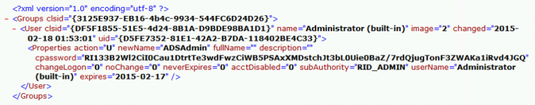

With access to this XML file, the attacker can use the AES private key to decrypt the GPP password. The PowerSploit function [Get-GPPPassword](https://github.com/PowerShellMafia/PowerSploit/blob/master/Exfiltration/Get-GPPPassword.ps1) is most useful for Group Policy Preference exploitation. The screenshot here shows a similar PowerShell function encrypting the GPP password from an XML file found in SYSVOL.

[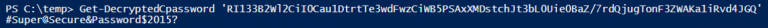](https://adsecurity.org/wp-content/uploads/2015/12/GroupPolicyPreferences-Decrypted-Password.png)

Other file types may also have embedded passwords (often in clear-text) such as vbs and bat.

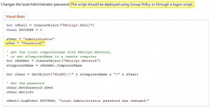

You would think that with a released patch preventing admins from placing credentials in Group Policy Preferences, this would no longer be an issue, though I still find credentials in SYSVOL when performing customer security assessments.

Mitigation:

- Install KB2962486 on every computer used to manage GPOs which prevents new credentials from being placed in Group Policy Preferences.
- Delete existing GPP xml files in SYSVOL containing passwords.
- Don’t put passwords in files that are accessible by all authenticated users.

More information on this attack method is described in the post: [Finding Passwords in SYSVOL & Exploiting Group Policy Preferences.](https://adsecurity.org/?p=2288)

**2. Exploit the MS14-068 Kerberos Vulnerability on a Domain Controller Missing the Patch

**

It has been over a year since [MS14-068 was patched with KB3011780](https://adsecurity.org/?p=525) (and the first public POC, [PyKEK](https://adsecurity.org/?p=676), was released). There are [detection methods available](https://adsecurity.org/?p=763)to ensure that attempts to exploit MS14-068 are identified and flagged. However, [that doesn’t mean that Domain Controllers are always patched or detection is configured](https://adsecurity.org/?p=2085). Most organizations patched their Domain Controllers with [KB3011780](https://adsecurity.org/?p=541)within a month of the patch’s release; however, not all ensure that every new Domain Controller has the patch installed before promoting to be a DC.

Thanks to Gavin Millard ([@gmillard](https://twitter.com/gmillard) on Twitter), we have a graphic that covers the issue quite nicely (wish I had of thought of it!)

Put simply, exploiting MS14-068 takes less than 5 minutes and enables an attacker to effectively re-write a valid Kerberos TGT authentication ticket to make them a Domain Admin (and Enterprise Admin). As shown in the above graphic, this is like taking a valid boarding password and before boarding, writing “pilot” on it. Then while boarding the plane, you are escorted to the cockpit and asked if you would like coffee before taking off.

The first published exploit of MS14-068 was 2 weeks after the patch, written by Sylvain Monné (@BiDOrD) called PyKEK. PyKEK is a Python script that runs on any python-capable system (Raspberry Pi?) anywhere on the network as long as it can communicate with an unpatched DC. End up with a ccache file. Take the PyKEK generated ccache file & inject the TGT into memory with Mimikatz for use as a Domain Admin! Using this ticket, access to the admin$ share on the DC is granted!

[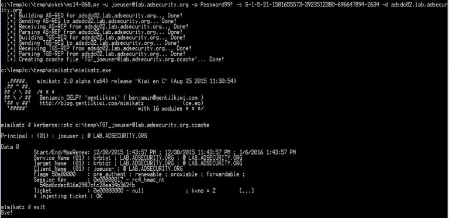](https://adsecurity.org/wp-content/uploads/2015/09/Mimikatz-PTC-PyKEK-ccacheFile.jpg)

Mitigating factor: Limited success with patched or Win2012/2012R2 DC in site
The MS14-068 exploit process:

- Request a Kerberos TGT authentication ticket without a PAC as a standard user, the DC replies with the TGT (with no PAC which usually contains group membership, this is unusual).
- Generate a forged PAC, without a key, so the generated PAC is “signed” with MD5 algorithm instead of HMAC_MD5 using the domain user’s password data.
- Send the PAC-less TGT to the DC with the forged PAC as Authorization-Data as part of a TGS service ticket request.
- The DC seems to be confused by this, so it discards the PAC-less TGT sent by the user, creates a new TGT and inserts the forged PAC in its own Authorization-Data, and sends this TGT to the user.
- This TGT with the forged PAC enables the user to be a Domain Admin on vulnerable DCs.

Benjamin Delpy (author of Mimikatz) wrote a MS14-068 exploit called [Kekeo](https://github.com/gentilkiwi/kekeo)that improves on PyKEK. It finds & targets a vulnerable DC and works regardless if there are patched or 2012/2012R2 DCs in the site. Same exploit path as PyKEK, but adds another step at the end resulting in having a valid TGT which can be presented to any DC in the domain for access. It does this by using the exploit-generated TGT to get an impersonation TGT which works everywhere.

[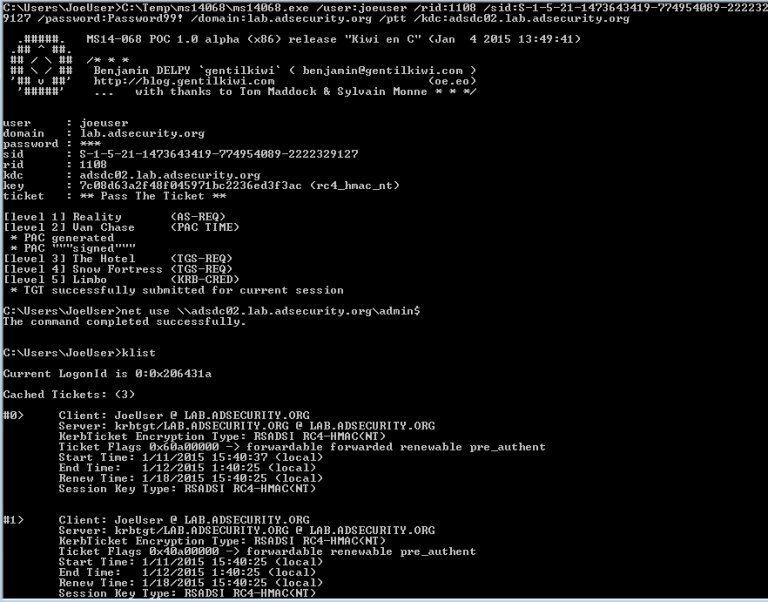](https://adsecurity.org/wp-content/uploads/2015/12/MS14068-01.png)

Mitigation:

- Ensure the DCPromo process includes a patch QA step before running DCPromo that checks for installation of KB3011780. The quick and easy way to perform this check is with PowerShell: *get-hotfix 3011780*
- Also, implement an automated process that ensures approved critical patches are automatically applied if the system falls out of compliance.

**3. Kerberos TGS Service Ticket Offline Cracking (Kerberoast)**

Kerberoast can be an effective method for extracting service account credentials from Active Directory as a regular user without sending any packets to the target system. This attack is effective since people tend to create poor passwords. The reason why this attack is successful is that most service account passwords are the same length as the domain password minimum (often 10 or 12 characters long) meaning that even brute force cracking doesn’t likely take longer than the password maximum password age (expiration). Most service accounts don’t have passwords set to expire, so it’s likely the same password will be in effect for months if not years. Furthermore, most service accounts are over-permissioned and are often members of Domain Admins providing full admin rights to Active Directory (even when the service account only needs to modify an attribute on certain object types or admin rights on specific servers).

Note: This attack will not be successful when targeting services hosted by the Windows system since these services are mapped to the computer account in Active Directory which has an associated 128 character password which won’t be cracked anytime soon.

This attack involves requesting a Kerberos service ticket(s) (TGS) for the Service Principal Name (SPN) of the target service account. This request uses a valid domain user’s authentication ticket (TGT) to request one or several service tickets for a target service running on a server. The Domain Controller doesn’t track if the user ever actually connects to these resources (or even if the user has access). The Domain Controller looks up the SPN in Active Directory and encrypts the ticket using the service account associated with the SPN in order for the service to validate user access. The encryption type of the requested Kerberos service ticket is RC4_HMAC_MD5 which means the service account’s NTLM password hash is used to encrypt the service ticket. This means that Kerberoast can attempt to open the Kerberos ticket by trying different NTLM hashes and when the ticket is successfully opened, the correct service account password is discovered.

***Note: No elevated rights are required to get the service tickets and no traffic is sent to the target.***

[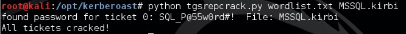](https://adsecurity.org/wp-content/uploads/2015/12/Kerberoast-03.jpg)

Tim Medin presented on this at DerbyCon 2014 in his “Attacking Microsoft Kerberos Kicking the Guard Dog of Hades” presentation ([slides](https://files.sans.org/summit/hackfest2014/PDFs/Kicking%20the%20Guard%20Dog%20of%20Hades%20-%20Attacking%20Microsoft%20Kerberos%20%20-%20Tim%20Medin%281%29.pdf) & [video](https://www.youtube.com/watch?v=PUyhlN-E5MU&feature=youtu.be)) where he released the [Kerberoast Python TGS cracker](https://github.com/nidem/kerberoast).

Mitigation:

The most effective mitigation of this attack is ensuring service account passwords are longer than 25 characters.

[Managed Service Accounts](https://technet.microsoft.com/en-us/library/dd560633%28v=ws.10%29.aspx) and [Group Managed Service Accounts](http://blogs.technet.com/b/askpfeplat/archive/2012/12/17/windows-server-2012-group-managed-service-accounts.aspx) are a good method to ensure that service account passwords are long, complex, and change regularly. A third party product that provides password vaulting is also a solid solution for managing service account passwords.

More information on this attack method is described in the post: [Cracking Kerberos TGS Tickets Using Kerberoast – Exploiting Kerberos to Compromise the Active Directory Domain](https://adsecurity.org/?p=2293).

Information on detecting potential Kerberoasting activity is described in the post “[Detecting Kerberoasting Activity](https://adsecurity.org/?p=3458)” and “[Detecting Kerberoasting Activity Part 2 – Creating a Kerberoast Service Account Honeypot](https://adsecurity.org/?p=3513)”

**4. The Credential Theft Shuffle
**

I’m calling this section “The Credential Theft Shuffle” (or “Credential Shuffle”) since it is difficult to encapsulate this activity simply. Think of it as a dance. Compromise a single workstation, escalate privileges, and [dump credentials](https://adsecurity.org/?page_id=1821). Laterally move to other workstations using dumped credentials, escalate privileges, and dump more credentials.

This usually quickly results in Domain Admin credentials since most Active Directory admins logon to their workstation with a user account and then use RunAs (which places their admin credentials on the local workstation) or RDP to connect to a server (credentials can be grabbed using a [keylogger](https://github.com/PowerShellMafia/PowerSploit/blob/master/Exfiltration/Get-Keystrokes.ps1)).

Step 1: Compromise a single workstation and exploit a privilege escalation vulnerability on the system to gain administrative rights. Run [Mimikatz](https://adsecurity.org/?page_id=1821)or similar to [dump local credentials](https://adsecurity.org/?page_id=1821#LSADUMPSAM) and [recently logged on credentials](https://adsecurity.org/?page_id=1821#SEKURLSALogonPasswords).

Step 2: Using the local Administrator credentials gathered from Step 1 attempt to authenticate to other workstations with admin rights. This is usually successful since [managing local Administrator account passwords have been difficult to do correctly](https://adsecurity.org/?p=384) (now you should probably just use [Microsoft LAPS](https://adsecurity.org/?p=1790)). If you have the same administrator account name and password on many, or all, workstations, gaining knowledge of the account name and password on one, means admin rights on all. Connect to other workstations and dump credentials on those until a Domain Admin account’s credentials are harvested. Using local accounts is ideal since use isn’t logged on Domain Controllers and few organizations send workstation security logs to a central logging system (SIEM).

Step 3: Leverage stolen credentials to connect to servers to gather more credentials. Servers running applications such as Microsoft Exchange Client Access Servers (CAS), Microsoft Exchange OWA, Microsoft SQL, and Terminal Services (RDP) tend to have lots of credentials in memory from recently authenticated users (or services that likely have Domain Admin rights).

Step 4: (Plunder and) Profit!

With the stolen Domain Admnin credentials, nothing can stop the attacker from [dumping all domain credentials](https://adsecurity.org/?p=1729) and [persisting](https://adsecurity.org/?p=1929).

NOTE:

- Logging onto a computer with a Domain Admin account places the credentials in LSASS (protected memory space). Someone with admin rights (or local System) to this computer can dump the credentials from LSASS and can reuse these credentials.
- Logging onto a computer with a user account and then entering Domain Admin credentials with RunAs places the credentials in LSASS (protected memory space). Someone with admin rights (or local System) to this computer can dump the credentials from LSASS and can reuse these credentials.
- Logging onto a computer with a user account and opening an RDP session to a server by typing Domain Admin credentials into the RDP credential window exposes the Domain Admin credential to anyone running a keylogger on the system (which could be an attacker that previously compromised the user account and/or computer)
- If there are services deployed to all workstation or all servers (or both) that run under the context of a service account with Domain Admin rights, only a single system needs to be compromised to compromise the entire Active Directory domain. When a service starts with explicit credentials, the credentials are loaded into LSASS for the service to run under the context of those credentials. Someone with admin rights (or local System) to this computer can dump the credentials from LSASS and can reuse these credentials.

Normally, PowerShell is a great administrative method since connecting to a remote system via PowerShell remoting (either through Enter-PSSession or Invoke-Command) is a network logon – no credentials are stored in memory on the remote system. This is ideal and is what Microsoft is shifting RDP towards with Admin mode. There is a way to connect to a remote system via PowerShell remoting and be able to use the credential by way of CredSSP. The problem is CredSSP is NOT SECURE.

[Joe Bialek wrote about this at PowerShellMagazine.com](http://www.powershellmagazine.com/2014/03/06/accidental-sabotage-beware-of-credssp/):

> One common issue that an administrator faces when using PowerShell remoting is the “double hop” problem. An administrator uses PowerShell remoting to connect to Server A and then attempts to connect from Server A to Server B. Unfortunately, the second connection fails.

> The reason is that, by default, PowerShell remoting authenticates using a “Network Logon”.  Network Logons work by proving to the remote server that you have possession of the users credential without sending the credential to that server (see > [> Kerberos](http://msdn.microsoft.com/en-us/library/windows/desktop/aa378747%28v=vs.85%29.aspx)>  and > [> NTLM](http://msdn.microsoft.com/en-us/library/windows/desktop/aa378749%28v=vs.85%29.aspx)>  authentication). Because the remote server doesn’t have possession of your credential, when you try to make the second hop (from Server A to Server B) it fails because Server A doesn’t have a credential to authenticate to Server B with.

> To get around this issue, PowerShell provides the CredSSP (> [> Credential Security Support Provider](http://support.microsoft.com/kb/951608)> ) option. When using CredSSP, PowerShell will perform a “Network Clear-text Logon” instead of a “Network Logon”. Network Clear-text Logon works by sending the user’s clear-text password to the remote server. When using CredSSP, Server A will be sent the user’s clear-text password, and will therefore be able to authenticate to Server B. Double hop works!

**> Update:**>  This testing was done using Windows Server 2012. Microsoft has made changes to Windows Server 2012R2 and Windows 8.1 to eliminate clear-text credentials from being stored in memory. This means that an attacker who runs Mimikatz will no longer see your clear-text credentials. An attacker will still see your NT password hash and your Kerberos TGT, both of which are password equivalent and can be used to authenticate as you over the network.

> Additionally, even though your clear-text credential is not saved in memory, it is still sent to the remote server. An attacker can inject malicious code in the Local Security Authority Subsystem Service (LSASS.exe) and intercept your password in transit. So while you may not see your password with Mimikatz anymore, your password can still be recovered by an attacker.

***So, please don’t use CredSSP.***

A similar issue is a [configuration setting in WinRM (which PowerShell Remoting uses) called “AllowUnencrypted.”](http://blogs.msdn.com/b/powershell/archive/2015/10/27/compromising-yourself-with-winrm-s-allowunencrypted-true.aspx) Setting this value to “True” removes encryption from any WinRM connection involving this system, including PowerShell remoting.

**
Pass the hash evolves into Pass-the-Credential**

Most people have heard of **Pass-the-Hash (PtH)** which involves discovering the password hash (usually the NTLM password hash) associated with an account. What’s interesting about PtH is that cracking the hash to discover the associated password is not necessary since in Windows networking, the hash is what’s used to prove identity (knowledge of the account name and password hash is all that’s needed to authenticate). Microsoft products and tools obviously don’t support passing a hash, so third party tools are required, such as [Mimikatz](https://adsecurity.org/?page_id=1821#SEKURLSAPth).

Pass-the-Hash opens up a lot of doors for an attacker once a password hash is discovered, but there are other options.

**Pass-the-Ticket (PtT)** involves grabbing an existing Kerberos ticket and using it to impersonate a user. [Mimikatz](https://adsecurity.org/?p=2207)supports gathering either the [current user’s Kerberos tickets](https://adsecurity.org/?page_id=1821#KERBEROSList), or [all Kerberos tickets for every user authenticated to the system](https://adsecurity.org/?page_id=1821#SEKURLSATickets) (if [Kerberos unconstrained delegation is configured, this could be a big deal](https://adsecurity.org/?p=1667)). Once the Kerberos ticket(s) are acquired, [they can be passed using Mimikatz](https://adsecurity.org/?page_id=1821#KERBEROSPTT) and used to access resources (within the Kerberos ticket lifetime).

**OverPass-the-Hash (aka Pass-the-Key)** involves using an acquired password hash to get a Kerberos ticket. This technique clears all existing Kerberos keys (hashes) for the current user and injects the acquired hash into memory for the Kerberos ticket request. The next time a Kerberos ticket is required for resource access, the injected hash (which is now a Kerberos key in memory) is used to request the Kerberos ticket. [Mimikatz provides the capability to perform OverPass-the-Hash](https://adsecurity.org/?page_id=1821#SEKURLSAPth). This is a stealthier method than PtH since there are ways to detect PtH.

Note: If the acquired hash is NTLM, the Kerberos ticket is RC4. If the hash is AES, then the Kerberos ticket uses AES.

There are other types of credential theft, but these are the most popular:

- Pass-the-Hash: grab the hash and use to access a resource. Hash is valid until the user changes the account password.
- Pass-the-Ticket: grab the Kerberos ticket(s) and use to access a resource. Ticket is valid until the ticket lifetime expires (typically 7 days).
- OverPass-the-Hash: use the password hash to get a Kerberos ticket. Hash is valid until the user changes the account password.

Mitigation:

- [Administrators should have separate admin workstations for administration activities](https://technet.microsoft.com/en-us/library/mt634654.aspx). Admin accounts should never be logged onto regular workstations where user activities such as email and web browsing are performed. This limits credential theft opportunities. Note that smartcards don’t prevent credential theft since accounts requiring smartcard authentication have an associated password hash that’s used behind the scenes for resource access. The smartcard only ensures that the user authenticating to the system has the smartcard in their possession. Once used to authenticate to a system, the smartcard two factor authentication (2fA) becomes one factor, using the account’s password hash (which is placed in memory). Furthermore, once an account is configured for smartcard authentication, a new password is generated by the system for the account (and never changed).
- Review all accounts  in Domain Admins, domain Administrators, Enterprise Admins, Schema Admins, and other custom AD admin groups. Re-qualify every account that has Active Directory admin rights to validate that full AD admin rights are truly required (or simply just desired). Start with accounts tied to humans, then focus on service accounts.
- All local Administrator account passwords on workstations and servers should be long, complex, and random using a product like [Microsoft LAPS.](https://adsecurity.org/?p=1790)
- Configure Group Policy to prevent local Administrator accounts from authenticating over the network. The following sample GPO prevents local accounts from logging on over the network (including RDP) and also blocks Domain Admins & Enterprise Admins from logging on at all. The GPO includes the following settings:
    - Deny access to this computer from the network: local account, Enterprise Admins, Domain Admins
    - Deny log on through Remote Desktop Services: local account, Enterprise Admins, Domain Admins
    - Deny log on locally: Enterprise Admins, Domain Admins

[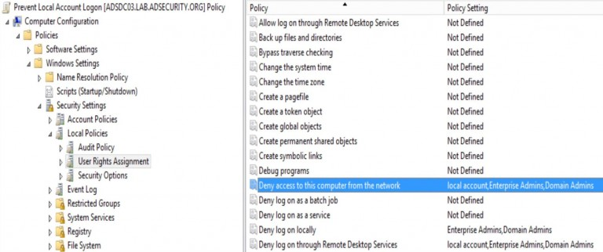](https://adsecurity.org/wp-content/uploads/2015/12/GroupPolicy-Prevent-LocalAccount-LogonOverNetwork.jpg)

Note: Test this first with server configurations since it will break certain “special” scenarios (like Clustering).

**3. Gain Access to the Active Directory Database File (ntds.dit)
**

The Active Directory database (ntds.dit) contains all information about all objects in the Active Directory domain. Data in this database is replicated to all Domain Controllers in the domain. This file also contains password hashes for all domain user and computer accounts. The ntds.dit file on the Domain Controllers (DCs) is only accessible by those who can log on to the DCs.

Obviously, protecting this file is critical since access to the ntds.dit file can result in full domain and forest compromise.

Here is a (non-comprehensive) list of methods for getting the NTDS.dit data without being a Domain Admin:

**Backup locations (backup server storage, media, and/or network shares)**

Get access to DC backups & backdoor the domain with the ntds.dit file off the backup share. Make sure any network accessible location that stores DC backups is properly secured. Only Domain Admins should have access to them. Someone else does? They are effectively Domain Admins!

**Find the NTDS.dit file staged on member servers prior to promoting to Domain Controllers.**

IFM is used with DCPromo to “Install From Media” so the server being promoted doesn’t need to copy domain data over the network from another DC. The IFM set is a copy of the NTDS.dit file and may be staged on a share for promoting new DCs or it may be found on a new server that has not been promoted yet. This server may not be properly secured.

**With admin rights to virtualization host, a virtual DC can be cloned and the associated data copied offline.**

Get access to virtual DC storage data and have access to the domain credentials. Do you run VMWare? VCenter Admins are full admins (DA equivalent to VMWare). With VCenter Admin rights: Clone DC and copy down data to local hard drive.

It’s also possible to extract LSASS data from VM memory when the VM is suspended. Don’t underestimate the power your virtual admins have over virtual Domain Controllers.

Your VCenter Admin group is in AD?  You probably want to change that…

Delegate the proper rights to the appropriate groups, don’t provide an attacker the ability to backdoor AD through a Server admin account.

***Your Virtual Admins need to be considered Domain Admins (when you have virtual DCs).

***

**Compromise an account with rights to logon to a Domain Controller.**

There are several groups in Active Directory most would not expect to have default logon rights to Domain Controllers.

[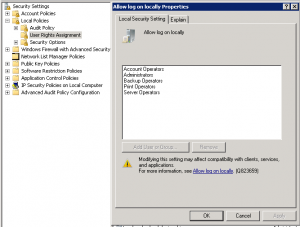](https://adsecurity.org/wp-content/uploads/2014/02/Default-DC-LogOnLocallyGroups.png)

These groups with the ability to logon to Domain Controllers by default:

- Enterprise Admins (member of the domain Administrators group in every domain in the forest)
- Domain Admins (member of the domain Administrators group)
- Administrators
- Backup Operators
- **Account Operators**
- **Print Operators**

This means that if an attacker can compromise an account in Account Operators or Print Operators, the Active Directory domain may be compromised since these groups have logon rights to Domain Controllers.

Mitigation:

- Limit the groups/accounts that have rights to logon to Domain Controllers.
- Limit groups/accounts with full Active Directory rights, especially service accounts.
- Protect every copy of the Active Directory database (ntds.dit) and don’t place on systems at a lower trust level than Domain Controllers.

So, what happens when an account is delegated logon rights to a Domain Controller?

[If the account has admin rights on the Domain Controller, it’s trivial to dump credentials on the DC](https://adsecurity.org/?p=2398).

**Dump all domain credentials with [Mimikatz](https://adsecurity.org/?page_id=1821)

**

Mimikatz can be used to [dump all domain credentials](https://adsecurity.org/?page_id=1821#LSADUMPLSA) from a Domain Controller.

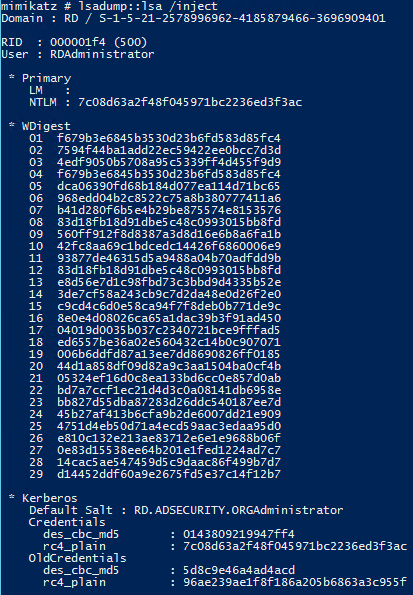

**Dump LSASS memory with [Mimikatz](https://adsecurity.org/?page_id=1821)(get Domain Admin credentials)**

Mimikatz can be used to [dump LSASS](https://adsecurity.org/?page_id=1821#SEKURLSA) and then extract logged on credentials from the LSASS.dmp file on a different system. On a Domain Controller, this almost always results in Domain Admin credentials.

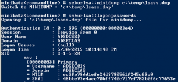

**Dump LSASS memory with Task Manager (get Domain Admin credentials)
**

Once LSASS is dumped, Mimikatz can be used to [extract logged on credentials from the LSASS.dmp file](https://adsecurity.org/?page_id=1821#SEKURLSALogonPasswords) on a different system. On a Domain Controller, this almost always results in Domain Admin credentials.

[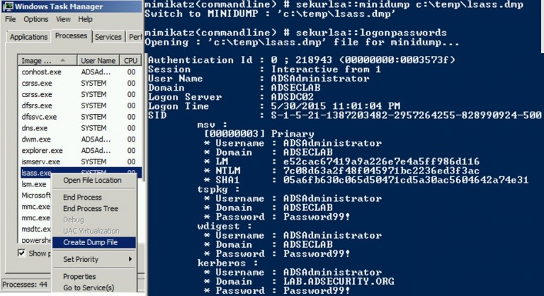](https://adsecurity.org/wp-content/uploads/2015/12/TaskManager-DumpLSASS.jpg)

**Create Install From Media (IFM) set using NTDSUtil (Grab NTDS.dit file)
**

NTDSUtil is the command utility for natively working with the AD DB (ntds.dit) & enables IFM set creation for DCPromo. IFM is used with DCPromo to “Install From Media” so the server being promoted doesn’t need to copy domain data over the network from another DC. The IFM set is a copy of the NTDS.dit file created in this instance in c:\temp

This file may be staged on a share for promoting new DCs or it may be found on a new server that has not been promoted yet. This server may not be properly secured.

[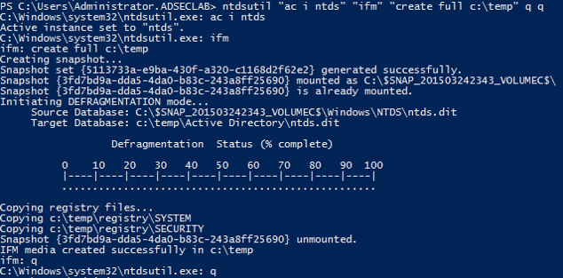](https://adsecurity.org/wp-content/uploads/2015/12/NTDSUtil-CreateIFM.png)

**

Dump Active Directory domain credentials from a NTDS.dit file (and registry system hive).

**

Once the attacker has a copy of the NTDS.dit file (and certain registry keys to decrypt security elements in the database file), the credential data in the Active Directory database file can be extracted.

Once an attacker has the system hive from the registry & the NTDS.dit fie, they have ALL AD credentials! This screenshot is from a Kali box with the Impacket python tools installed. The DIT is dumped using the secretsdump.py python script in Impacket.

[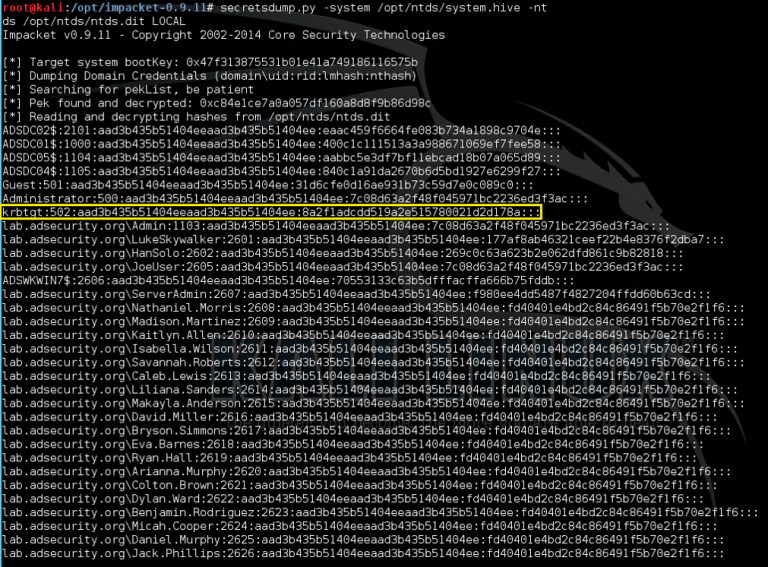](https://adsecurity.org/wp-content/uploads/2015/12/IMPacket-Dump-Credentials-NTDSdit.png)

As of October 2015, there’s also a [Windows method leveraging PowerShell method for dumping credentials from the NTDS.dit file (and registry System hive) called Get-ADDBAccount](https://www.dsinternals.com/en/dumping-ntds-dit-files-using-powershell/)from DSInternals.com (though it only works on Windows 8 & Windows Server 2012 and newer due to a bug in earlier Windows versions).

Once the attacker has dumped the domain database, there are a [lot of options to persist and retain high-level rights](https://adsecurity.org/?p=1929), including [creating and using Golden Tickets which can be used to exploit the entire forest based on the compromise of a single domain](https://adsecurity.org/?p=1640).

**References:**

- [Sean Metcalf’s Presentations on Active Directory Security](https://adsecurity.org/?page_id=1352)
- [Mimikatz Guide and Command Reference](https://adsecurity.org/?page_id=1821)
- [The Most Common Active Directory Security Issues and What You Can Do to Fix Them](https://adsecurity.org/?p=1684)
- [Finding Passwords in SYSVOL & Exploiting Group Policy Preferences](https://adsecurity.org/?p=2288)
- [MS14-068 Vulnerability, Exploitation, and Exploit Detection](https://adsecurity.org/?tag=ms14068)
- [Cracking Kerberos TGS Tickets Using Kerberoast – Exploiting Kerberos to Compromise the Active Directory Domain](https://adsecurity.org/?p=2293).
- [How Attackers Dump Active Directory Database Credentials](https://adsecurity.org/?p=2398)
- [Using Group Policy Preferences for Password Management = Bad Idea](https://adsecurity.org/?p=384)
- [Sneaky Active Directory Persistence Tricks](https://adsecurity.org/?p=1929)
- [Golden Tickets which can be used to exploit the entire forest based on the compromise of a single domain](https://adsecurity.org/?p=1640)
- The PowerSploit function [Get-GPPPassword](https://github.com/PowerShellMafia/PowerSploit/blob/master/Exfiltration/Get-GPPPassword.ps1)
- [Group Policy Preferences Password Vulnerability Now Patched](https://adsecurity.org/?p=63)
- [Microsoft Local Administrator Password Solution (LAPS)](https://adsecurity.org/?p=1790)
- Tim Medin’s DerbyCon “Attacking Microsoft Kerberos Kicking the Guard Dog of Hades” presentation in 2014 ([slides](https://files.sans.org/summit/hackfest2014/PDFs/Kicking%20the%20Guard%20Dog%20of%20Hades%20-%20Attacking%20Microsoft%20Kerberos%20%20-%20Tim%20Medin%281%29.pdf) & [video](https://www.youtube.com/watch?v=PUyhlN-E5MU&feature=youtu.be)) where he released the [Kerberoast Python TGS cracker](https://github.com/nidem/kerberoast).

(Visited 269,921 times, 13 visits today)

- **  [ActiveDirectory](https://adsecurity.org/?tag=activedirectory), [administratorpassword](https://adsecurity.org/?tag=administratorpassword), [AESprivatekey](https://adsecurity.org/?tag=aesprivatekey), [AESsharedsecret](https://adsecurity.org/?tag=aessharedsecret), [cpassword](https://adsecurity.org/?tag=cpassword), [CredentialTheft](https://adsecurity.org/?tag=credentialtheft), [CredentialTheftShuffle](https://adsecurity.org/?tag=credentialtheftshuffle), [DomainAdmins](https://adsecurity.org/?tag=domainadmins), [DomainController](https://adsecurity.org/?tag=domaincontroller), [DumpCredentiasls](https://adsecurity.org/?tag=dumpcredentiasls), [DumpLSASS](https://adsecurity.org/?tag=dumplsass), [EnterpriseAdmins](https://adsecurity.org/?tag=enterpriseadmins), [Get-GPPPassword](https://adsecurity.org/?tag=get-gpppassword), [GoldenTickets](https://adsecurity.org/?tag=goldentickets), [GPP](https://adsecurity.org/?tag=gpp), [GroupPolicyPreferences](https://adsecurity.org/?tag=grouppolicypreferences), [groups.xml](https://adsecurity.org/?tag=groups-xml), [IFM](https://adsecurity.org/?tag=ifm), [InstallFromMedia](https://adsecurity.org/?tag=installfrommedia), [KB2962486](https://adsecurity.org/?tag=kb2962486), [KB3011780](https://adsecurity.org/?tag=kb3011780), [Kekeo](https://adsecurity.org/?tag=kekeo), [Kerberoast](https://adsecurity.org/?tag=kerberoast), [Kerberos](https://adsecurity.org/?tag=kerberos), [KerberosHacking](https://adsecurity.org/?tag=kerberoshacking), [LAPS](https://adsecurity.org/?tag=laps), [lateralmovement](https://adsecurity.org/?tag=lateralmovement), [localadministratoraccountpassword](https://adsecurity.org/?tag=localadministratoraccountpassword), [LSASS](https://adsecurity.org/?tag=lsass), [LSASSDumpFile](https://adsecurity.org/?tag=lsassdumpfile), [MicrosoftLAPS](https://adsecurity.org/?tag=microsoftlaps), [mimikatz](https://adsecurity.org/?tag=mimikatz), [MS14068](https://adsecurity.org/?tag=ms14068), [ms14068.exe](https://adsecurity.org/?tag=ms14068-exe), [MS14068Exploit](https://adsecurity.org/?tag=ms14068exploit), [MSDN](https://adsecurity.org/?tag=msdn), [ntds.dit](https://adsecurity.org/?tag=ntds-dit), [PAWS](https://adsecurity.org/?tag=paws), [Persistence](https://adsecurity.org/?tag=persistence), [PowerSploit](https://adsecurity.org/?tag=powersploit), [PyKEK](https://adsecurity.org/?tag=pykek), [RC4_HMAC_MD5](https://adsecurity.org/?tag=rc4_hmac_md5), [RDP](https://adsecurity.org/?tag=rdp), [RunAs](https://adsecurity.org/?tag=runas), [scheduledtasks.xml](https://adsecurity.org/?tag=scheduledtasks-xml), [separateAdminWorkstation](https://adsecurity.org/?tag=separateadminworkstation), [ServicePrincipalName](https://adsecurity.org/?tag=serviceprincipalname), [Services.xml](https://adsecurity.org/?tag=services-xml), [SPN](https://adsecurity.org/?tag=spn), [systemcompromise](https://adsecurity.org/?tag=systemcompromise), [SYSVOL](https://adsecurity.org/?tag=sysvol), [TGS](https://adsecurity.org/?tag=tgs), [TGSCracking](https://adsecurity.org/?tag=tgscracking), [TGT](https://adsecurity.org/?tag=tgt), [xml](https://adsecurity.org/?tag=xml)

-
