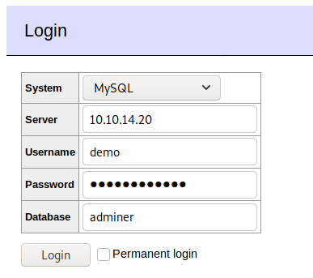
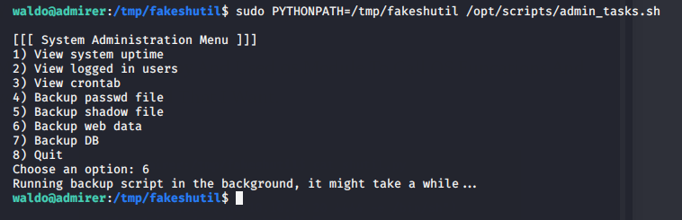

BOX - Hackthebox - Admirer

# Admirer Walkthrough | HackTheBox

[David Kingsly](https://medium.com/@xy83rx?source=post_page-----3b4dc128f62c----------------------)

[Jun 12](https://medium.com/@xy83rx/admirer-walkthrough-3b4dc128f62c?source=post_page-----3b4dc128f62c----------------------) · 7 min read

This Is David Kingsly And This Is My Walkthrough For The Admirer Machine From HackTheBox. It’s A Linux Machine With Easy Difficulty Level.

Like All The Machines, I Used **nmap** To Scan For Open Ports And Services.
**nmap -sC -sV 10.10.10.187**

I Found **FTP Server** Running On Port **21**, **SSH** Running On Port **22** And **Apache HTTP Server** Running On Port **80**.

I Checked The Web On Port 80. The Index Page Of The Site Looks Like A Gallery.

I Also Checked The Source Of The Index Page For Hints. I Found That It Was A Static HTML Template From HTML5 UP.

The namp Scan Showed There’s A **robots.txt** File On The Web Server, This File Is Usually For The Crawler Bots. I Checked The **robots.txt** File And Found A Directory Called **admin-dir** And It’s Not Allowed To Read By Anyone Even The Crawler Bots.

After That I Went To The **admin-dir** Directory, It Returned A Error 403 Forbidden That I Don’t Have Enough Permission To Access That Directory.

Then I Used **gobuster** To Brute-Force The Directories In That Server.

**gobuster dir -w /usr/share/seclists/Discovery/Web-Content/big.txt -u http://10.10.10.187/admin-dir/**

It Doesn’t Find Any Directories. So, I Used **wfuzz** To Scan For** .txt** Files Inside The **admin-dir **Directory.

**> wfuzz -u http://10.10.10.187/admin-dir/FUZZ.txt -w /usr/share/seclists/Discovery/Web-Content/big.txt --sc 200**

There I Found Two Files, **contacts.txt** And **credentials.txt**. The **contacts.txt** File Contains Only The Email Addresses Of The Members And The **credentials.txt **File Contains The Webmail, FTP And WordPress Credentials.

With The Help Of The Credentials I Logged Into FTP Server As **ftpuser**.

In The FTP Server I Found Two Files, **dump.sql** And **html.tar.gz**. Then I’ve Downloaded The Both Files To My Machine.

The SQL Doesn’t Have Anything Interesting, It Only Has The Information About The MariaDB And The Pictures On The Homepage. After That, I Have Extracted The **html.tar.gz** Archive.

It Contains Files Same As The In The Web Server And Additionally It Contains **utility-scripts** And **w4ld0s_s3cr3t_d1r** Directories. The **w4ld0s_s3cr3t_d1r **Directory Contains The Files Which Were Found In The **admin-dir** Directory.

In The utility-scripts Directory I Found 4 PHP Files. **admin_tasks.php**, **db_admin.php**, **info.php **And **phptest.php**.

The** info.php **And **phptest.php** Files Were Just There For Testing The PHP Server. The **admin_tasks.php** Contains The Source For Administrative Tasks Page And **db_admin.php** Contains The Credentials For The SQL Database.

The **utility-scripts** Directory Is Available On The Web Server. I Tried To Access It And I Got Error 403 Forbidden. Then I Tried To Access The File **admin_tasks.php**, It Was Successful.

It Doesn’t Have Anything To Do With, Then I Tried To Access **db_admin.php** But The File Is Not Available On That Sever. Maybe The Admin Have Used Any Alternative. So, I Have Used **wfuzz **To Scan For **PHP** Files Inside utility-scripts Directory.

**wfuzz -u http://10.10.10.187/utility-scripts/FUZZ.php -w /usr/share/seclists/Discovery/Web-Content/big.txt --sc 200**

There I Found **adminer.php** And I Went To **adminer.php** And It Asked For Credentials. None Of The Credentials Were Worked.

Then I Searched For **Adminer Version 4.6.2** Vulnerabilities. Then I Found One, What I Have To Do Is To Setup A SQL Server On My Machine And Create A Database, Create A Table With A Single Column And Login To My Database On Adminer And From There I Could Dump Any Local File On That Server.

[ ## Serious Vulnerability Discovered In Adminer Database Administration Tool   #### www.foregenix.com](https://www.foregenix.com/blog/serious-vulnerability-discovered-in-adminer-tool)

So I Have Started The SQL Sever And Created A Database **admirer** And Table **test** With Single Column.

**CREATE DATABASE admirer;
CREATE USER ‘demo’@’%’ IDENTIFIED BY ‘demo_admirer’;
GRANT ALL PRIVILEGES ON * . * TO ‘demo’@’%’;
FLUSH PRIVILEGES;
USE admirer;
create table test(data VARCHAR(255));**

After That I Have Finished My SQL Server Setup And Tried To Login Database Via Adminer.

And It Was Successful.

Then I Went To SQL Command Section. As The **admin_tasks.php** Is Running As **www-data** And It’s An Apache Server. So, I Decided To Dump The **index.php** File.

**load data local infile ‘../index.php’
into table test
fields terminated by “/n”**

After That I Went To See The Dumped **index.php** File. There I Got A Username And Password.

Then I Tried To Login Via SSH With The User **waldo **And Password **&<h5b~yK3F#{PaPB&dA}{H>**

**ssh waldo@10.10.10.187**

Now I Logged In As User **waldo**. Then I Went To **/home/waldo **Directory And Grabbed The **user.txt **(User Flag). Now I Got The User Flag.

**User: 4b61bb97a2c89fc75be6ae9cf1ed411f**

As I Got User, Next I Have To Obtain Root Access To Read The Root Flag. I Used **sudo -l **Command To See Which Commands Can User **waldo **Can Run Without Root Access.

Looks Like The User **waldo **Can Run Only The **admin_tasks.sh **Script As Root. While Looking At The **admin_tasks.sh **File I Saw A Function Namely **backup_web()**, It Calls A Python Script In The Same Directory.

The **backup.py **Python Script Makes A Backup Of The **html **Directory And Converts Them Into An Archive. So, We Got Nothing To Do With That Python Script. Since, **admin_tasks.sh **Can Be Executed As Root The Called Python Script Also Be Executed As Root.

If We Modify The Bash Or Python Script We Can Achieve Root Access. But Both Files Are Not Writable By The User **waldo**.

After Searching Some Time On The Inter I Found This, Privilege Escalation Via Python Library Hijacking.

[ ## Privilege Escalation Via Python Library Hijacking   #### rastating.github.io](https://rastating.github.io/privilege-escalation-via-python-library-hijacking/)

If I Change The Python’s Import Directory, And Created My Own **shutil **Python Script I Can Manage To Obtain Root Access. Because It’s My Own Python Script And I Make The Script To Execute Anything I Want.

[ ## Command Line And Environment - Python 3.8.3 Documentation   #### docs.python.org](https://docs.python.org/3/using/cmdline.html#environment-variables)

While Searching For Modules To Import ( Such As Shitil Above), Python Utilizes The Idea Of PATH Environment Variables, Similar To How Unix Searchs For Binaries. One Of These Variables Is Called **PYTHONPATH **And **PYTHONPATH** Directories Will Always Be Searched First.

I Made My Own **shutil.py **And Used **os **Module To Call OS Funcations And Execute Any Command That I Want.

Now I Ran The Bash Script With The Help Of **PYTHONPATH **Variable.
**sudo PYTHONPATH=/tmp/parsnips /opt/scripts/admin_tasks.sh**

Then I Came Back To My **Netcat **Listener, I Got Shell As Root. As I Got Root Shell, I Went To The **root **Directory And Grabbed The **root.txt **(Root Flag). Now I Got The Root Flag.

**Root: 6df1bcbd7d0eb6b94ed8759cf4b621d7**
That’s All, Thanks For Reading.