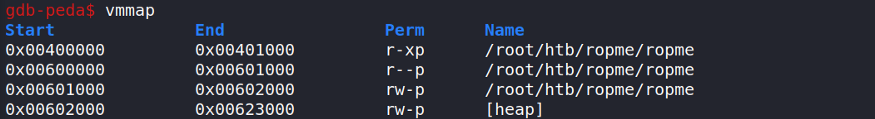

Buffer Overflow

## **MEMORY**

**
**

### TEXT

The text section is the code of the program in machin language. The text block is read only and cannot be modified. This way we can have multiple instances of the same program.

### BSS/DATA

BSS and DATA store global and static variable.

Initialized static and global variables are stored in the data block and non initialized variable are stored in the BSS part of the memory. Each block has a fixed size and because variables have their own space in the memory, they can be accessible from anywhere in the program (useful for global variable etc...).

### HEAP

The heap section has a variable and dynamic size. The developper has full control on it and can reserve some portion of the heap. The heap growth from up to bottom. To the higher memory addresses.

### STACK

The stack has a varialbe size. It can store local variables for functions. That is portion of the memory it's being examined by the bt command from GDB. When a function is called, all the data are stored in the stack, parameters, variables, return points etc... All these informations are stored in the activation block in the stack.

The stack has FILO behavior, which means that the first in is the last out of the stack. (Exactly like a neckless made of perls)

Unlike the heap, the stack growth from bottom to the upper side. To the lower memory addresses.

**POP**: Remove an element from the stack
**PUSH**: Add an element to the stack

### EIP/ESP/EBP

https://topic.alibabacloud.com/a/eip-ebp-and-esp_1_30_32908983.html

EIP, EBP, and ESP are system registers, and some addresses are stored in them.

The reason is that the three pointers are inseparable from the stack implementation in our system.

We talked about the stack data structure on DC, which has the following features:

Then go to the beginning.

In fact, it has the following two functions:

**1. Stack is used to store temporary variables and intermediate results transmitted by functions.**

**2. Operating System maintenance is transparent to programmers.**

We may only emphasize the features of the stack, such as its implementation principles? The following is a small example of how Stack works.

First write a small program:

Void fun (void)

{

    Printf ("hello world ");

}

Void main (void)

{

    Fun ()

    Printf ("function call ends ");

}

This is an example of a simple function call.

When a program calls a function, we often say that the function is first pushed to the stack. When the function call is completed, the stack is released. All these tasks are automatically completed by the system.

However, in the process of completion, the system will use the following three registers:

**1. EIP**

**2. ESP**

**3. EBP**

The functions of the three functions when the fun function is called.

1. The EIP register stores the address of the instruction that the CPU will execute next time.

That is, after calling the fun function, let the CPU know that the printf ("function call ends") Statement in the main function should be executed.

2. The EBP register stores the stack bottom pointer, usually called the stack base address, which is passed to EBP by ESP before the fun () function is called. (You can understand this before calling a function: ESP stores the stack top address and the stack bottom address .)

3. The ESP register stores the top stack of the stack after calling the function fun. And always points to the top of the stack.

After the fun function is called, the functions of the three functions are as follows:

1. According to the address stored in the EIP register, the CPU will be able to know what to do after the function is called, that is, to execute printf ("function call ends") in the main function ").

2. The EBP register stores the stack base address, which is passed to EBP by ESP before function call. After the call is complete, EBP returns its address to ESP again. So ESP points again to the address at the top of the stack after the function call is completed.

In fact, we only need to know what the three pointers are. It may be helpful for us to learn about Stack Overflow and read books on stack. When someone tells you about EIP, ESP, and EBP, you can't get confused, so your level will look too low.

* * *

## **ENUMERATION**

### CHECKSEC

checksec little_tommy

**Analyse the output**
**
**
**RELRO**

Let’s break the above output down. The architecture that this binary was compiled to run on is 32bit little-endian systems. The RELRO stands for ‘relocation read-only’ and this protection ensures that the global offset table (GOT) cannot be overwritten. But in this case, it’s partial RELRO so the only pragmatic difference is that the BSS section comes before the GOT. This prevents buffer overflows in global variables overwriting the GOT.

**Stack Canaries**

The stack options refer to stack canaries. This is a value called the stack canary that is placed on the stack. If the stack canary is overridden during a buffer overflow execution of the binary will terminate with a stack smashing error. In this case, the stack canary is not enabled making exploitation much easier.

**NX**

Next, the NX flag, if enabled at compile-time, indicates that a given memory region can be either readable or executable but never both. Again this is a protection that makes it harder to execute arbitrary shellcode.

NX stands from Non-Executable and it means that when the application is running and is loaded in memory, the segments are not allowed to be both writable and executable. We can check this by looking at the virtual memory mapping when the application is running in GDB. Therefore, we can’t inject shellcode and execute it directly.

**PIE**

The PIE option stands for position independent executable. A binary without this protection uses virtual addresses that are static. On the other hand, if PIE is enabled it means that Adress Layout Randomization (ASLR) can be used to randomize where the binary is stored in memory if this feature is enabled in the kernel. This makes reliably finding return address much harder.

**ASLR**

It randomly positions the base address of the executable and the position of libraries, heap and stack in a process’ address space. This prevents us from knowing at what position in memory the functions or gadgets are located.