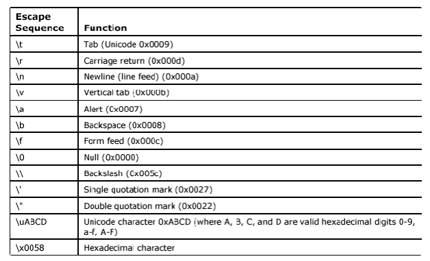

C

* * *

##

##

## **Memory**

**
**
A variable is a container for value.
A pointer is a container for a memory address.

For this code:

age = 42;

The memory will look like this:

|     |     |     |     |     |     |
| --- | --- | --- | --- | --- | --- |
| 0   | 1   | 2   | 3   | 4   | 5   |
| NULL |     | 42  |     |     |     |

The value of age is 42 and if we want to have his memory address, we need to use the symbol '&'.

printf("ageMemoryAddress = %p", (void *)&age);

Output -> 2
**** The (void *)  command is for temporary casting a variable. ***

To create a pointer, we use the symbol "*"

int *p_age = &age;

In this case, p_age's value is 2.

If we want to have the value of the address block referenced by the pointer, we need to use the symbol "*" again.

printf(PointerReferencedAddressValue = %d, *p_age);

Output -> 42

We can change the value of a variable via the pointer

int age = 42;
int *p_age = &age;

*p_age = 44;

printf("age: %d", age)

Output -> 44