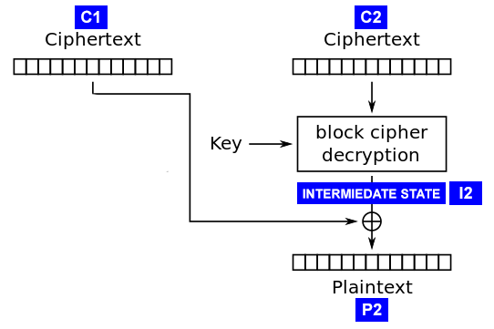
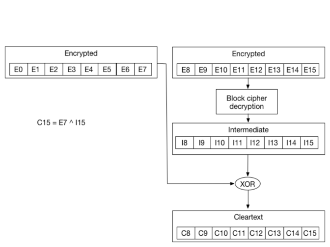

CBC - Padding Oracle

# CBC - Padding Oracle

https://pentesterlab.com/exercises/padding_oracle/course
https://robertheaton.com/2013/07/29/padding-oracle-attack/

In ECB mode, the message is divided into blocks, and each block is encrypted separately. Though ECB has advantages in simplicity and parallelism, it lacks diffusion of message patterns. When two identical plaintext blocks are encrypted, they will have the same ciphertext outputs. A striking example that mostly referenced is the ECB encryption of a bitmap image, where the color of each pixel is encrypted, but the ciphered image is still recognizable.

## Cipher Block Chaining (CBC)
To hide the deterministic relationship between plaintext and the correpsonding ciphertext, in CBC, each block of plaintext is XORed with the previous ciphertext block before being encrypted. An initialization vector is used for the first block. (Figures from Wikipedia)
 

## Padding
Block cipher encrypts data message in "blocks" of a fixed size. For instance, AES treats 16-byte data as one block, and DES uses a block size of 8 bytes. If a message is shorter than a block, the algorithm needs to fill it up with extra characters, which is called as padding. If a message is longer than a block, it's divided into multiple blocks and is encrypted separately. PKCS#7 is a typical padding method, which the last byte in the block indicates the number of padding elements.

## The intermediate state
To repeat - in CBC encryption, each block of plaintext is XORed with the previous ciphertext block before being passed into the cipher. So in CBC decryption, each ciphertext is passed through the cipher, then XORed with the previous ciphertext block to give the plaintext.

The attack works by calculating the “intermediate state” of the decryption (see diagram) for each ciphertext. This is the state of a ciphertext block after being decrypted by the block cipher but before being XORed with the previous ciphertext block. We do this by working up from the plaintext rather than down through the block cipher, and don’t have to worry about the key or even the type of algorithm used in the block cipher.

Why is the intermediate state so important? Notice that:

>I2 = C1 ^ P2
and
P2 = C1 ^ I2

We know C1 already, as it is just part of our ciphertext, so if we find I2 then we can trivially find P2 and decrypt the ciphertext.

## CBC zoom in
If we zoom in, we can see that the cleartext byte C15 is just a XOR between the encrypted byte E7 from the previous block, and byte I15 which came out of the block decryption step:

This is also valid for all other bytes:

C14 = I14 ^ E6
C13 = I13 ^ E5
C12 = I12 ^ E4
...
Now if we modify E7 and keep changing its value, we will keep getting an invalid padding. Since we need C15 to be \x01. However, there is one value of E7 that will give us a valid padding. Let's call it E'7. With E'7, we get a valid padding. And since we know we get a valid padding we know that C'15 (as in C15 for E'7) is \x01.

\x01 = I15 ^ E'7

The gives us:

I15 = \x01 ^ E'7

So we are able to compute I15.

Since we know I15, we can now compute C15

C15 = E7 ^ I15 = E7 ^ \x01 ^ E'7

Now that we have C15, we can move to brute-forcing C14. First we need to compute another E7 (let's call it E''7) that gives us C15 = \x02. We need to do that since we want the padding to be \x02\x02 now. It's really simple to compute using the property above and by replacing the value of C15 we want (\x02) and I15 we now know:

E''7 = \x02 ^ I15

After brute force E6, to find the value that gives us a valid padding E''6, we can re-use the formula:

C14 = I14 ^ E6

to get

I14 = \x02 ^ E''6

Once we get I14, we can compute C14:

C14 = E6 ^ I14 = E6 ^ \x02 ^ E''6

Using this method, we can keep going until we get all the ciphertext decrypted.

## Exploit with PadBuster

https://secureops.io/2020/03/encrypted-pastebin/