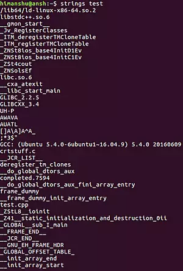
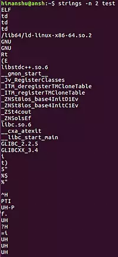
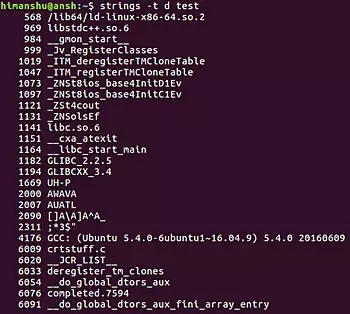

Command - STRING

[AdScan your Web-Server for Malware with ISPProtect now. Get Free Trial.](https://ispprotect.com/?pk_campaign=htftxt)

# Linux strings Command Tutorial for Beginners (5 Examples)

### On this page

1. [Linux Strings command](https://www.howtoforge.com/linux-strings-command/#linux-strings-command)

2. [Q1. How to use strings command?](https://www.howtoforge.com/linux-strings-command/#q-how-to-use-strings-command)

3. [Q2. How to force a custom character limit?](https://www.howtoforge.com/linux-strings-command/#q-how-to-force-a-custom-character-limit)

4. [Q3. How to make strings print offset of character sequences?](https://www.howtoforge.com/linux-strings-command/#q-how-to-make-strings-print-offset-of-character-sequences)

5. [Q4. How to make Strings scan whole file?](https://www.howtoforge.com/linux-strings-command/#q-how-to-make-strings-scan-whole-file)

6. [Q5. How to change the separator?](https://www.howtoforge.com/linux-strings-command/#q-how-to-change-the-separator)

7. [Conclusion](https://www.howtoforge.com/linux-strings-command/#conclusion)

Looking inside a binary/executable file to grab human-readable strings isn't the kind of work that everybody does, but what if you are asked to do this? Opening the file in an editor, and manually looking for stuff isn't an elegant solution. So, what to do? Yes, you guessed it right - there exists a command line utility that does this for you.

The tool in question is dubbed **Strings**, and in this tutorial, we will discuss the basics of this command using some easy to understand examples. But before we do that, it's worth mentioning that all examples in this article have been tested on Ubuntu 16.04 LTS machine.

## Linux Strings command

The Strings command basically prints the strings of printable characters in files. Following is its syntax:

`strings [OPTIONS] FILENAME`
And here's how the tool's man page describes it:

`       For each file given, GNU strings prints the printable character[[NEWLINE]]       sequences that are at least 4 characters long (or the number given with[[NEWLINE]]       the options below) and are followed by an unprintable character.[[NEWLINE]][[NEWLINE]]       Depending upon how the strings program was configured it will default[[NEWLINE]]       to either displaying all the printable sequences that it can find in[[NEWLINE]]       each file, or only those sequences that are in loadable, initialized[[NEWLINE]]       data sections.  If the file type in unrecognizable, or if strings is[[NEWLINE]]       reading from stdin then it will always display all of the printable[[NEWLINE]]       sequences that it can find.[[NEWLINE]][[NEWLINE]]       For backwards compatibility any file that occurs after a command line[[NEWLINE]]       option of just - will also be scanned in full, regardless of the[[NEWLINE]]       presence of any -d option.[[NEWLINE]][[NEWLINE]]       strings is mainly useful for determining the contents of non-text[[NEWLINE]]       files.`

Following are some Q&A-styled examples that should give you a good idea on how the Strings command works.

## Q1. How to use strings command?

Basic usage is fairly easy - just pass the file name as input and execute the command.

*Please note that since Strings is mainly used to extract info from binary/executable files, we'll use one such file in all our examples.*

For example:
`strings test`
Here's the output this command produced on my system:

## Q2. How to force a custom character limit?

As explained in the beginning, the default behavior of the Strings tool is to only print character sequences that are at least 4 characters long. However, if you want, you can change this limit using the -n command line option (which requires you to pass a number that signifies the new limit).

For example, If you want to set the limit to 2, following is how you can do this:

`strings -n 2 test`

So now you can see two and three character strings in the output as well.

## Q3. How to make strings print offset of character sequences?

If you want Strings to also display the offsets of character sequences it displays in output, then this can be done using the -t command line option, which requires you to provide a single character input that specifies the radix of the offset - 'o' for octal,  'x' for hexadecimal, or 'd' for decimal.

For example:
`strings -t d test`
And here's the output it produced on my system:

So you can see the strings in output are now preceded by their respective offsets.

## Q4. How to make Strings scan whole file?

Depending upon how Strings was configured, it may or may not scan the whole input file. However, if you want to be absolutely sure that the tool reads the complete file (and not just loadable, initialized data sections), use the -a command line option.

For example:
`strings -a test`

Conversely, if you want Strings to only display strings from initialized, loaded data sections in the file, use the -d command line option.

`strings -d test`

## Q5. How to change the separator?

As you'd have observed, by default, the separator used by Strings is a newline. However, if you want, you can have a custom separator using the -s command line option.

For example:
`strings -s [[[]]] test`

## Conclusion

The Strings command is an extremely useful tool if you are into digging binaries/executables for useful information. We have discussed some important command line options here. So practice them, and once you're done, head to the tool's [man page](https://linux.die.net/man/1/strings) for more info.

**About Himanshu Arora**

Himanshu Arora has been working on Linux since 2007. He carries professional experience in system level programming, networking protocols, and command line. In addition to HowtoForge, Himanshu's work has also been featured in some of world's other leading publications including Computerworld, IBM DeveloperWorks, and Linux Journal.

  [view as pdf](#) |   [print](#)

**Share this page:**

