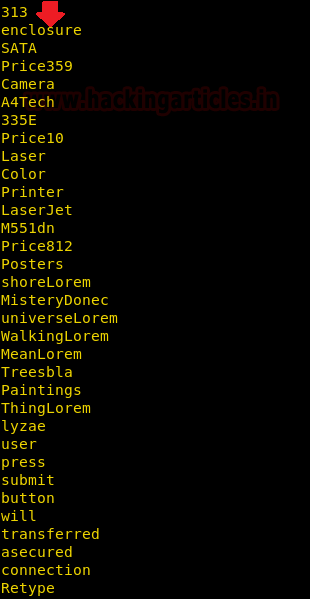

Comprehensive Guide on Cewl Tool

# Comprehensive Guide on Cewl Tool

posted in[Hacking Tools](https://www.hackingarticles.in/category/collection-of-hacking-tools/), [Penetration Testing](https://www.hackingarticles.in/category/penetration-testing/)on [November 17, 2018](https://www.hackingarticles.in/comprehensive-guide-on-cewl-tool/) by[Raj Chandel](https://www.hackingarticles.in/author/raaj/)

[SHARE]()

Hello Friends!! In this article, we are focusing on Generating Wordlist using Kali Linux tool Cewl and learn more about its available options.

### **Table of Content**

- Introduction to Cewl
- Default Method
- Save Wordlist in a file
- Generating Wordlist of Specific Length
- Retrieving Emails from a Website
- Count the number of Word Repeated in a website
- Increase the Depth to Spider
- Extra Debug Information
- Verbose Mode
- Generating Alpha-Numeric
- Cewl with Digest/Basic Authentication
- Proxy URL

### **Introduction to Cewl**

CeWL is a ruby app which spiders a given URL to a specified depth, optionally following external links, and returns a list of words which can then be used for password crackers such as John the Ripper. CeWL also has an associated command line app, FAB (Files Already Bagged) which uses the same metadata extraction techniques to create author/creator lists from already downloaded.

**Source:**  https://tools.kali.org/password-attacks/cewl

Type “**cewl -h**” in the terminal, it will dump all the available options it accepts along with their respective description.

**SYNTAX: cewl <url> [options]**
**General**** Options **
                -h, –help:                            Show help.
                -k, –keep:                           Keep the downloaded file.
                -d <x>,–depth <x>:        Depth to spider to, default 2.
                -m, –min_word_length: Minimum word length, default 3.

                -o, –offsite:                       Let the spider visit other sites.

                -w, –write:                         Write the output to the file.

                -u, –ua <agent>:              User agent to send.

                -n, –no-words:                                 Don’t output the wordlist.

                –with-numbers:              Accept words with numbers in as well as just letters

                -a, –meta:                          include meta data.

                –meta_file file:                                Output file for Meta data.

                -e, –email:                          Include email addresses.
                –email_file <file>:           Output file for email addresses.

                –meta-temp-dir <dir>: The temporary directory used by exiftool when parsing files, default /tmp.

                -c, –count:                          Show the count for each word found.

                -v, –verbose:                    Verbose.
                –debug:                              Extra debug information
                **Authentication**
                –auth_type:                      Digest or basic.
                –auth_user:                      Authentication username.
                –auth_pass:                      Authentication password.
               **Proxy Support**
                –proxy_host:                    Proxy host.
                –proxy_port:                    Proxy port, default 8080.
                –proxy_username:        Username for proxy, if required.
                –proxy_password:         Password for proxy, if required.

### **Default Method**

Enter the following command which spiders the given URL to a specified depth and prints a list of words which can then be used as a dictionary for cracking the password.

|     |     |
| --- | --- |
| 1   | cewl http://www.ignitetechnologies.in/ |

### **Save Wordlist in a file**

For the purpose of the record maintenance, better readability, and future references, we save the print list of the word onto a file. To this we will use the **parameter -w** to save the output in a text file.

|     |     |
| --- | --- |
| 1   | cewl http://www.ignitetechnologies.in/ -w dict.txt |

Now that we have successfully executed the command, now let’s traverse to the location to ensure whether the output has been saved on the file on not. In this case, our location for output is /root /dict.txt.

|     |     |
| --- | --- |
| 1   | cat dict.txt |

### **Generating Wordlist of Specific Length  **

If you want to generate a wordlist of a specific word length then use **-m option** as it enables minimum words to limit parameter.

|     |     |
| --- | --- |
| 1   | cewl http://www.ignitetechnologies.in/ -m 9 |

The above command will generate a list of minimum 9 words, as you can observe in the following image, it has crawled to the given website and prints the list of the word with a minimum 9 characters.

### **Retrieving Emails from a Website  **

You can use **-e option** that enables email parameter along with **-n option** that hides the list of the word generated while crawling the given website.

|     |     |
| --- | --- |
| 1   | cewl http://www.ignitetechnologies.in/ -n -e |

As shown in the below image, it has successfully found 1 email-id from inside the website.

### **Count the number of Word Repeated in a website  **

If you want to count the number of words repeated several times in a website, then use **-c options** that enable count parameter.

|     |     |
| --- | --- |
| 1   | cewl http://www.ignitetechnologies.in/ -c |

As you can observe from the given below image that it has printed the count for each word which is repeated in the given website.

### **Increase the Depth to Spider  **

If you want to increase the level of spider for generating a larger list of the word by enumerating more new words from the website then use **-d option** along with depth level number that enables depth parameter for making more intense creeping. By Default it the depth level set is 2.

|     |     |
| --- | --- |
| 1   | cewl http://www.ignitetechnologies.in/ -d 3 |

### **Extra Debug Information**

You can use **–debug option** that enables debug mode and shows error and raw detail of website while crawling.

|     |     |
| --- | --- |
| 1   | cewl http://www.ignitetechnologies.in/ --debug |

### **Verbose Mode  **

To expand the website crawling result and for retrieving completed detail of a website, you can use **-v option** for verbose mode. Rather than generating wordlist, it will dump the information available on the website.

|     |     |
| --- | --- |
| 1   | cewl http://www.ignitetechnologies.in/ -v |

### **Generating Alpha-Numeric**

If you want to generate an alpha-numeric wordlist then you can use **–with-numbers** option along with the command.

|     |     |
| --- | --- |
| 1   | cewl http://testphp.vulnweb.com/ --with-numbers |

From the given below image you can observe, this time it has generated an alpha-numeric wordlist.

### **Cewl with Digest/Basic Authentication**

If there is page authentication for login into the website then above default will not work properly, in order to generate a wordlist you need to bypass the authentication page by using the following parameter:

–auth_type:                      Digest or basic.
–auth_user:                      Authentication username.
–auth_pass:                      Authentication password.

|     |     |
| --- | --- |
| 1   | cewl http://192.168.1.105/dvwa/login.php --auth_type Digest --auth_user admin --auth_pass password -v |

or

|     |     |
| --- | --- |
| 1   | cewl http://192.168.1.105/dvwa/login.php --auth_type basic --auth_user admin --auth_pass password -v |

From the given below image you can observe, it has got HTTP-response 200 and hence generated the wordlist.

### **Proxy URL**

When any website is running behind any proxy server then cewl will not able to generate wordlist with the help of default command as shown in the given below image.

|     |     |
| --- | --- |
| 1   | cewl  -w  dict.txt http://192.168.1.103/wordpress/ |

You can use **–proxy option** to enable Proxy URL parameter to generate a wordlist with the help of the following command:

|     |     |
| --- | --- |
| 1   | cewl  --proxy_host  192.168.1.103  --proxy_port  3128  -w  dict.txt http://192.168.1.103/wordpress/ |

As you can observe in the given below image after executing the 2nd command, it has successfully printed the list of the word as an output result.

**Author**: Shubham Sharma is a Cybersecurity enthusiast and Researcher in the field of WebApp Penetration testing. Contact [**here**](https://www.linkedin.com/in/shubham-sharma-626964153/)

### Share this:

- [Click to share on Twitter (Opens in new window)](https://www.hackingarticles.in/comprehensive-guide-on-cewl-tool/?share=twitter&nb=1)
- [Click to share on Facebook (Opens in new window)](https://www.hackingarticles.in/comprehensive-guide-on-cewl-tool/?share=facebook&nb=1)

-

### Like this:

[Like](https://widgets.wp.com/likes/#)
Be the first to like this.